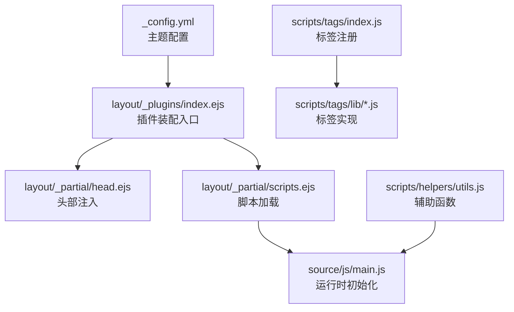
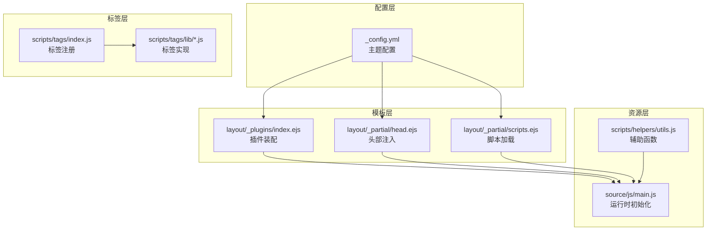
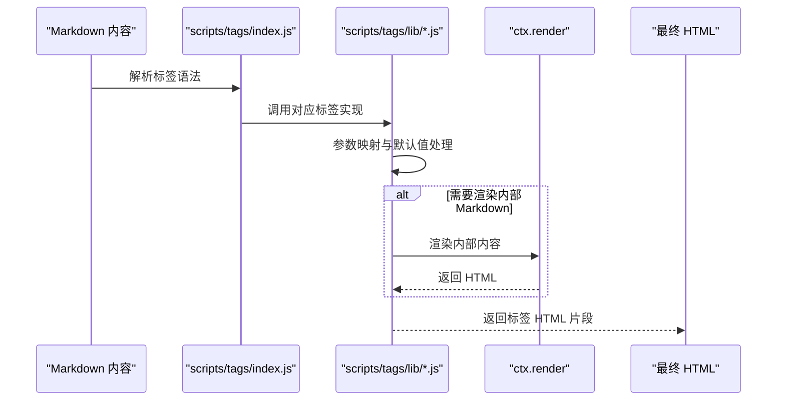
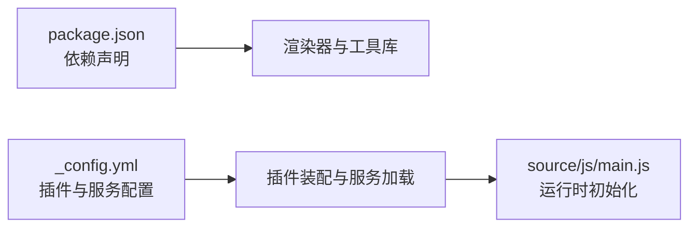

# 功能扩展

<cite>
**本文引用的文件**
- [themes/stellar/_config.yml](file://themes/stellar/_config.yml)
- [themes/stellar/package.json](file://themes/stellar/package.json)
- [themes/stellar/scripts/tags/index.js](file://themes/stellar/scripts/tags/index.js)
- [themes/stellar/scripts/tags/lib/button.js](file://themes/stellar/scripts/tags/lib/button.js)
- [themes/stellar/scripts/tags/lib/note.js](file://themes/stellar/scripts/tags/lib/note.js)
- [themes/stellar/scripts/tags/lib/timeline.js](file://themes/stellar/scripts/tags/lib/timeline.js)
- [themes/stellar/layout/_plugins/index.ejs](file://themes/stellar/layout/_plugins/index.ejs)
- [themes/stellar/layout/_partial/head.ejs](file://themes/stellar/layout/_partial/head.ejs)
- [themes/stellar/layout/_partial/scripts.ejs](file://themes/stellar/layout/_partial/scripts.ejs)
- [themes/stellar/source/js/main.js](file://themes/stellar/source/js/main.js)
- [themes/stellar/scripts/helpers/utils.js](file://themes/stellar/scripts/helpers/utils.js)
</cite>

## 目录
1. [简介](#简介)
2. [项目结构](#项目结构)
3. [核心组件](#核心组件)
4. [架构总览](#架构总览)
5. [详细组件分析](#详细组件分析)
6. [依赖关系分析](#依赖关系分析)
7. [性能考量](#性能考量)
8. [故障排查指南](#故障排查指南)
9. [结论](#结论)
10. [附录](#附录)

## 简介
本指南面向希望对 H1S97X 博客（基于 Hexo + Stellar 主题）进行功能扩展的开发者，系统讲解主题的扩展机制，包括：
- 标签插件体系：语法解析、渲染逻辑与样式定制
- 辅助函数与页面组件：侧边栏、页眉页脚、特殊页面
- 第三方服务集成：评论系统、统计工具、搜索功能
- 最佳实践：代码组织、性能优化与兼容性
- 实战案例与开发示例（以文件路径指引替代代码片段）

## 项目结构
Stellar 主题采用“配置驱动 + EJS 模板 + JS/CSS 资源 + 标签插件”的分层组织方式。关键扩展点集中在：
- 配置层：主题配置文件集中定义 UI、交互、服务与插件开关
- 模板层：EJS 片段负责页面结构、头部注入、脚本加载与插件装配
- 标签层：scripts/tags 下的标签注册与实现，提供 Markdown 内嵌组件
- 资源层：source/js 与 source/css 提供运行时行为与样式

**图表来源**
- [themes/stellar/_config.yml](file://themes/stellar/_config.yml#L1-L725)
- [themes/stellar/layout/_plugins/index.ejs](file://themes/stellar/layout/_plugins/index.ejs#L1-L25)
- [themes/stellar/layout/_partial/head.ejs](file://themes/stellar/layout/_partial/head.ejs#L1-L156)
- [themes/stellar/layout/_partial/scripts.ejs](file://themes/stellar/layout/_partial/scripts.ejs#L1-L37)
- [themes/stellar/source/js/main.js](file://themes/stellar/source/js/main.js#L1-L295)
- [themes/stellar/scripts/tags/index.js](file://themes/stellar/scripts/tags/index.js#L1-L56)
- [themes/stellar/scripts/helpers/utils.js](file://themes/stellar/scripts/helpers/utils.js#L1-L21)

**章节来源**
- [themes/stellar/_config.yml](file://themes/stellar/_config.yml#L1-L725)
- [themes/stellar/package.json](file://themes/stellar/package.json#L1-L33)

## 核心组件
- 主题配置中心：集中管理 SEO、侧边栏、文章布局、搜索、评论、插件、样式与数据服务
- 标签插件系统：通过 scripts/tags/index.js 注册，各标签在 lib 下实现，支持参数映射与 Markdown 内容渲染
- 插件装配系统：layout/_plugins/index.ejs 根据配置动态加载插件与服务
- 页面头部与脚本：head.ejs 与 scripts.ejs 负责 meta 注入、样式与脚本加载
- 运行时初始化：source/js/main.js 负责目录联动、滚动定位、相对时间、标签页切换、站点校验等

**章节来源**
- [themes/stellar/scripts/tags/index.js](file://themes/stellar/scripts/tags/index.js#L1-L56)
- [themes/stellar/layout/_plugins/index.ejs](file://themes/stellar/layout/_plugins/index.ejs#L1-L25)
- [themes/stellar/layout/_partial/head.ejs](file://themes/stellar/layout/_partial/head.ejs#L1-L156)
- [themes/stellar/layout/_partial/scripts.ejs](file://themes/stellar/layout/_partial/scripts.ejs#L1-L37)
- [themes/stellar/source/js/main.js](file://themes/stellar/source/js/main.js#L1-L295)

## 架构总览
Stellar 的扩展架构围绕“配置 → 模板 → 标签 → 资源”展开，形成松耦合、可插拔的生态。

**图表来源**
- [themes/stellar/_config.yml](file://themes/stellar/_config.yml#L1-L725)
- [themes/stellar/layout/_partial/head.ejs](file://themes/stellar/layout/_partial/head.ejs#L1-L156)
- [themes/stellar/layout/_partial/scripts.ejs](file://themes/stellar/layout/_partial/scripts.ejs#L1-L37)
- [themes/stellar/layout/_plugins/index.ejs](file://themes/stellar/layout/_plugins/index.ejs#L1-L25)
- [themes/stellar/scripts/tags/index.js](file://themes/stellar/scripts/tags/index.js#L1-L56)
- [themes/stellar/scripts/tags/lib/button.js](file://themes/stellar/scripts/tags/lib/button.js#L1-L40)
- [themes/stellar/scripts/tags/lib/note.js](file://themes/stellar/scripts/tags/lib/note.js#L1-L36)
- [themes/stellar/scripts/tags/lib/timeline.js](file://themes/stellar/scripts/tags/lib/timeline.js#L1-L80)
- [themes/stellar/source/js/main.js](file://themes/stellar/source/js/main.js#L1-L295)
- [themes/stellar/scripts/helpers/utils.js](file://themes/stellar/scripts/helpers/utils.js#L1-L21)

## 详细组件分析

### 标签插件体系
- 注册入口：scripts/tags/index.js 统一注册容器、数据、表达、阅读及其他标签
- 参数映射：各标签实现通过 ctx.args.map 映射参数，支持默认值与容错
- 内容渲染：部分标签对内部 Markdown 内容进行二次渲染
- DOM 输出：标签返回字符串形式的 HTML，遵循主题的色彩与尺寸约定

**图表来源**
- [themes/stellar/scripts/tags/index.js](file://themes/stellar/scripts/tags/index.js#L1-L56)
- [themes/stellar/scripts/tags/lib/button.js](file://themes/stellar/scripts/tags/lib/button.js#L1-L40)
- [themes/stellar/scripts/tags/lib/note.js](file://themes/stellar/scripts/tags/lib/note.js#L1-L36)
- [themes/stellar/scripts/tags/lib/timeline.js](file://themes/stellar/scripts/tags/lib/timeline.js#L1-L80)

**章节来源**
- [themes/stellar/scripts/tags/index.js](file://themes/stellar/scripts/tags/index.js#L1-L56)
- [themes/stellar/scripts/tags/lib/button.js](file://themes/stellar/scripts/tags/lib/button.js#L1-L40)
- [themes/stellar/scripts/tags/lib/note.js](file://themes/stellar/scripts/tags/lib/note.js#L1-L36)
- [themes/stellar/scripts/tags/lib/timeline.js](file://themes/stellar/scripts/tags/lib/timeline.js#L1-L80)

### 标签插件实现要点
- 按钮标签（button）
  - 语法：支持 color、icon、size 等参数；自动回退默认色
  - 输出：带链接与可选图标的彩色按钮
  - 参考路径：[themes/stellar/scripts/tags/lib/button.js](file://themes/stellar/scripts/tags/lib/button.js#L1-L40)

- 便笺标签（note）
  - 语法：支持 color、title、content；content 可缺省
  - 渲染：内部 Markdown 二次渲染
  - 输出：带标题与内容的彩色便笺容器
  - 参考路径：[themes/stellar/scripts/tags/lib/note.js](file://themes/stellar/scripts/tags/lib/note.js#L1-L36)

- 时间线标签（timeline）
  - 语法：支持 api、user、type、limit、hide、avatar 等属性
  - 结构：节点以注释分隔，每个节点含 header 与 body
  - 输出：带数据服务属性或纯 HTML 的时间线容器
  - 参考路径：[themes/stellar/scripts/tags/lib/timeline.js](file://themes/stellar/scripts/tags/lib/timeline.js#L1-L80)

**章节来源**
- [themes/stellar/scripts/tags/lib/button.js](file://themes/stellar/scripts/tags/lib/button.js#L1-L40)
- [themes/stellar/scripts/tags/lib/note.js](file://themes/stellar/scripts/tags/lib/note.js#L1-L36)
- [themes/stellar/scripts/tags/lib/timeline.js](file://themes/stellar/scripts/tags/lib/timeline.js#L1-L80)

### 页面组件与头部/脚本注入
- 头部注入（head.ejs）
  - 标题生成：根据 wiki、page.title、category、tag 生成
  - 描述与关键词：支持 open_graph、page.description/excerpt/content
  - SEO：robots 控制、canonical 校验、预连接与 JSON-LD
  - 参考路径：[themes/stellar/layout/_partial/head.ejs](file://themes/stellar/layout/_partial/head.ejs#L1-L156)

- 脚本加载（scripts.ejs）
  - 必需：main.js（带版本戳）
  - 可选：评论脚本、数据服务脚本、插件装配
  - 注入：config.inject.script 与 theme.inject.script/page.inject.script
  - 参考路径：[themes/stellar/layout/_partial/scripts.ejs](file://themes/stellar/layout/_partial/scripts.ejs#L1-L37)

- 插件装配（layout/_plugins/index.ejs）
  - 搜索服务：根据 theme.search.service 选择 partial
  - 插件：遍历 theme.plugins，合并 page.xxx 与 conf.enable/inject
  - 参考路径：[themes/stellar/layout/_plugins/index.ejs](file://themes/stellar/layout/_plugins/index.ejs#L1-L25)

**章节来源**
- [themes/stellar/layout/_partial/head.ejs](file://themes/stellar/layout/_partial/head.ejs#L1-L156)
- [themes/stellar/layout/_partial/scripts.ejs](file://themes/stellar/layout/_partial/scripts.ejs#L1-L37)
- [themes/stellar/layout/_plugins/index.ejs](file://themes/stellar/layout/_plugins/index.ejs#L1-L25)

### 运行时初始化与交互
- 目录联动（TOC）：监听滚动，高亮当前标题并平滑定位
- 标签页切换：无依赖的 nav-tabs 与 tab-content 切换
- 相对时间：计算日期差并展示
- 站点校验：根据 canonical 配置提示主站/非法克隆
- 参考路径：[themes/stellar/source/js/main.js](file://themes/stellar/source/js/main.js#L1-L295)

**章节来源**
- [themes/stellar/source/js/main.js](file://themes/stellar/source/js/main.js#L1-L295)

### 辅助函数与页面组件
- 辅助函数（helpers/utils.js）
  - get_page：在 pages/posts 中按 _id 查找页面或文章
  - 参考路径：[themes/stellar/scripts/helpers/utils.js](file://themes/stellar/scripts/helpers/utils.js#L1-L21)

**章节来源**
- [themes/stellar/scripts/helpers/utils.js](file://themes/stellar/scripts/helpers/utils.js#L1-L21)

## 依赖关系分析
- 主题依赖
  - 渲染器：hexo-renderer-ejs、hexo-renderer-stylus
  - 工具库：cheerio、probe-image-size
  - 参考路径：[themes/stellar/package.json](file://themes/stellar/package.json#L1-L33)

- 配置驱动的插件与服务
  - 插件：preload、fancybox、swiper、scrollreveal、katex、mathjax、mermaid、copycode、heti、tianli_gpt
  - 服务：mdrender、siteinfo、ghinfo、rating、vote、sites、friends、timeline、fcircle、weibo、memos、twikoo、waline、artalk、giscus、contributors
  - 参考路径：[themes/stellar/_config.yml](file://themes/stellar/_config.yml#L454-L521)

**图表来源**
- [themes/stellar/package.json](file://themes/stellar/package.json#L1-L33)
- [themes/stellar/_config.yml](file://themes/stellar/_config.yml#L454-L521)
- [themes/stellar/layout/_plugins/index.ejs](file://themes/stellar/layout/_plugins/index.ejs#L1-L25)
- [themes/stellar/source/js/main.js](file://themes/stellar/source/js/main.js#L1-L295)

**章节来源**
- [themes/stellar/package.json](file://themes/stellar/package.json#L1-L33)
- [themes/stellar/_config.yml](file://themes/stellar/_config.yml#L454-L521)

## 性能考量
- 按需加载
  - 插件与服务通过配置开关与按需 partial 加载，避免不必要的资源请求
  - 参考路径：[themes/stellar/layout/_plugins/index.ejs](file://themes/stellar/layout/_plugins/index.ejs#L1-L25)
- 资源懒加载
  - main.js 提供 viewportLazyload，结合浏览器 IntersectionObserver
  - 参考路径：[themes/stellar/source/js/main.js](file://themes/stellar/source/js/main.js#L62-L74)
- 样式与脚本缓存
  - main.css/main.js 带版本戳，降低缓存穿透风险
  - 参考路径：[themes/stellar/layout/_partial/scripts.ejs](file://themes/stellar/layout/_partial/scripts.ejs#L24-L25)
- 渲染优化
  - 标签内部 Markdown 渲染仅在必要时触发，减少重复计算
  - 参考路径：[themes/stellar/scripts/tags/lib/note.js](file://themes/stellar/scripts/tags/lib/note.js#L31-L31)

[本节为通用指导，不涉及具体文件分析]

## 故障排查指南
- canonical 校验提示
  - 现象：出现“官方备用站/非法克隆”提示
  - 排查：确认 _config.yml 中 canonical.originalHost、officialHosts 配置与当前域名一致
  - 参考路径：[themes/stellar/source/js/main.js](file://themes/stellar/source/js/main.js#L203-L285)
- 插件未生效
  - 现象：Mermaid/KaTeX/ScrollReveal 等未加载
  - 排查：检查 theme.plugins.*.enable 与 partial 名称是否正确
  - 参考路径：[themes/stellar/layout/_plugins/index.ejs](file://themes/stellar/layout/_plugins/index.ejs#L11-L20)
- 标签渲染异常
  - 现象： 内容未渲染或参数无效
  - 排查：核对参数映射与默认值；确认内部 Markdown 渲染链路
  - 参考路径：[themes/stellar/scripts/tags/lib/note.js](file://themes/stellar/scripts/tags/lib/note.js#L10-L35)
- 头部 meta 未生成
  - 现象：Open Graph/Description/Keywords 缺失
  - 排查：检查 head.ejs 中 generate_* 函数与 page 上下文
  - 参考路径：[themes/stellar/layout/_partial/head.ejs](file://themes/stellar/layout/_partial/head.ejs#L22-L47)

**章节来源**
- [themes/stellar/source/js/main.js](file://themes/stellar/source/js/main.js#L203-L285)
- [themes/stellar/layout/_plugins/index.ejs](file://themes/stellar/layout/_plugins/index.ejs#L11-L20)
- [themes/stellar/scripts/tags/lib/note.js](file://themes/stellar/scripts/tags/lib/note.js#L10-L35)
- [themes/stellar/layout/_partial/head.ejs](file://themes/stellar/layout/_partial/head.ejs#L22-L47)

## 结论
Stellar 主题通过“配置驱动 + EJS 模板 + 标签插件 + 运行时初始化”的架构，提供了清晰、可扩展的功能边界。开发者可在不破坏主题结构的前提下，通过：
- 扩展标签插件完善内容组件
- 配置插件与服务满足第三方集成
- 优化头部与脚本注入提升 SEO 与性能
- 借助辅助函数与运行时初始化增强交互体验

实现稳定、可维护的功能扩展。

[本节为总结，不涉及具体文件分析]

## 附录

### 开发最佳实践
- 代码组织
  - 标签插件：在 scripts/tags/lib 下新增实现，于 scripts/tags/index.js 注册
  - 插件装配：在 layout/_plugins 下新增 partial，并在 _config.yml 的 theme.plugins 中启用
  - 参考路径：
    - [themes/stellar/scripts/tags/index.js](file://themes/stellar/scripts/tags/index.js#L1-L56)
    - [themes/stellar/layout/_plugins/index.ejs](file://themes/stellar/layout/_plugins/index.ejs#L1-L25)
- 性能优化
  - 优先使用按需加载与懒执行策略
  - 合理设置缓存与版本戳
  - 参考路径：
    - [themes/stellar/layout/_partial/scripts.ejs](file://themes/stellar/layout/_partial/scripts.ejs#L24-L25)
    - [themes/stellar/source/js/main.js](file://themes/stellar/source/js/main.js#L62-L74)
- 兼容性
  - 保持对不同浏览器的兼容，避免依赖过新特性
  - 使用配置项控制可选功能，确保关闭时不影响主流程
  - 参考路径：
    - [themes/stellar/_config.yml](file://themes/stellar/_config.yml#L557-L563)
    - [themes/stellar/layout/_partial/scripts.ejs](file://themes/stellar/layout/_partial/scripts.ejs#L24-L36)

### 实战案例与示例（以路径指引）
- 创建自定义标签插件
  - 参考现有实现：[themes/stellar/scripts/tags/lib/button.js](file://themes/stellar/scripts/tags/lib/button.js#L1-L40)、[themes/stellar/scripts/tags/lib/note.js](file://themes/stellar/scripts/tags/lib/note.js#L1-L36)
  - 在注册入口添加：[themes/stellar/scripts/tags/index.js](file://themes/stellar/scripts/tags/index.js#L1-L56)
- 集成第三方评论系统
  - 在 _config.yml 中配置 comments.service 与具体服务商参数：[themes/stellar/_config.yml](file://themes/stellar/_config.yml#L220-L329)
  - 确认 head.ejs 与 scripts.ejs 中的评论脚本注入：[themes/stellar/layout/_partial/head.ejs](file://themes/stellar/layout/_partial/head.ejs#L1-L156)、[themes/stellar/layout/_partial/scripts.ejs](file://themes/stellar/layout/_partial/scripts.ejs#L30-L30)
- 配置搜索服务
  - 在 _config.yml 中设置 theme.search.service 与具体参数：[themes/stellar/_config.yml](file://themes/stellar/_config.yml#L206-L218)
  - 确认插件装配与 partial：[themes/stellar/layout/_plugins/index.ejs](file://themes/stellar/layout/_plugins/index.ejs#L5-L8)
- 自定义页面组件
  - 在 layout/_plugins 下新增 partial 并在 _config.yml 的 theme.plugins 中启用：[themes/stellar/layout/_plugins/index.ejs](file://themes/stellar/layout/_plugins/index.ejs#L11-L20)
  - 在 head.ejs/scripts.ejs 中注入所需资源：[themes/stellar/layout/_partial/head.ejs](file://themes/stellar/layout/_partial/head.ejs#L142-L155)、[themes/stellar/layout/_partial/scripts.ejs](file://themes/stellar/layout/_partial/scripts.ejs#L18-L36)
- 运行时交互增强
  - 在 source/js/main.js 中扩展 init.* 或新增事件监听：[themes/stellar/source/js/main.js](file://themes/stellar/source/js/main.js#L97-L295)
- 辅助函数扩展
  - 在 scripts/helpers 下新增 helper 并在模板中使用：[themes/stellar/scripts/helpers/utils.js](file://themes/stellar/scripts/helpers/utils.js#L7-L20)