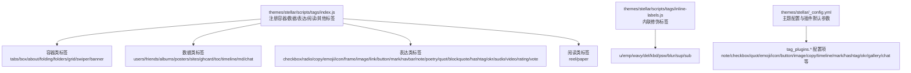
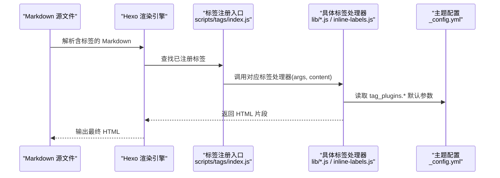
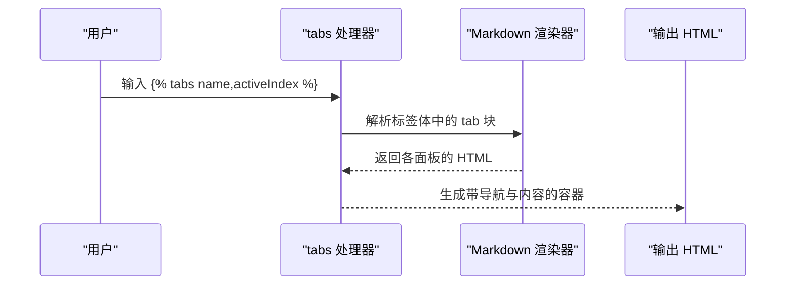
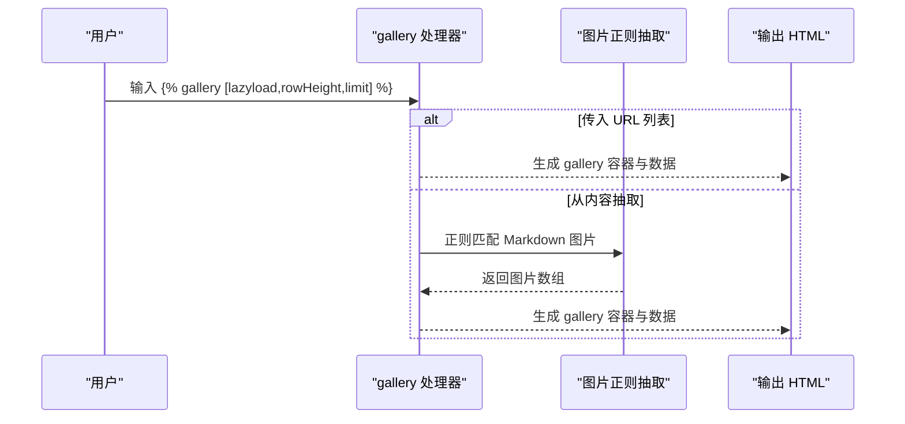
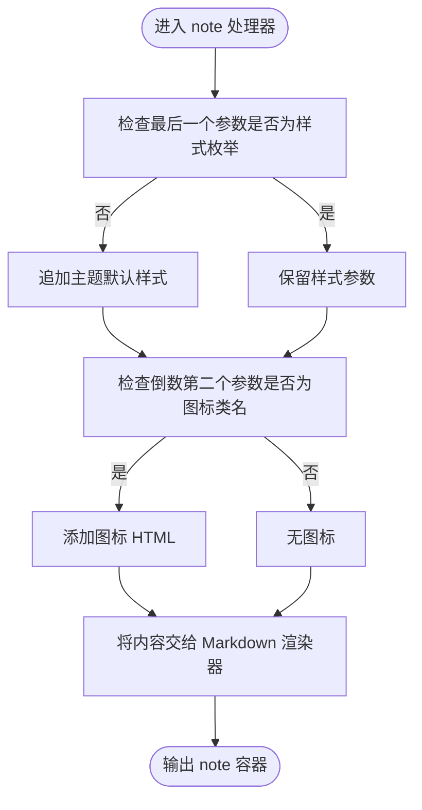
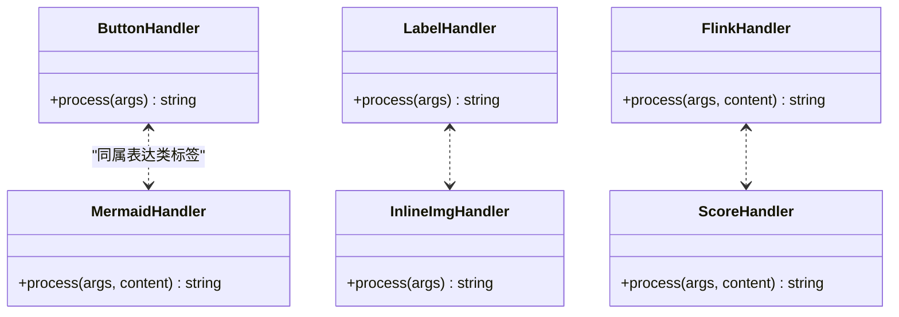
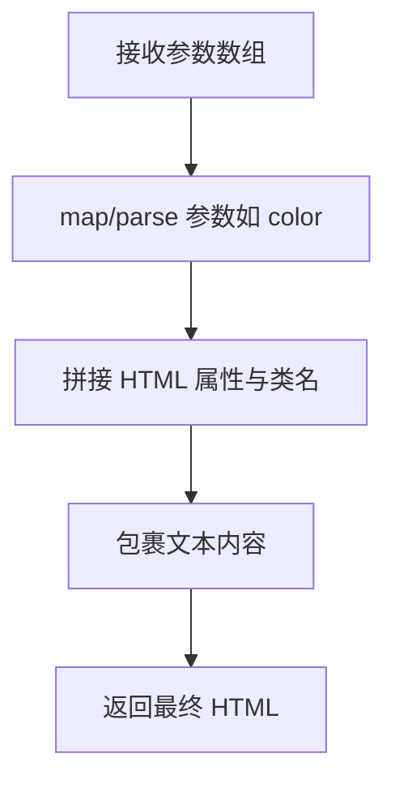
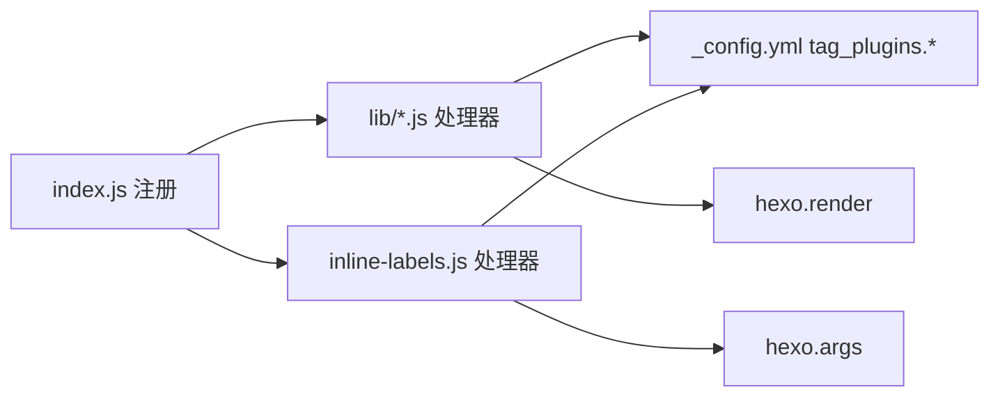

# 标签插件开发

<cite>
**本文引用的文件**
- [themes/stellar/scripts/tags/index.js](file://themes/stellar/scripts/tags/index.js)
- [themes/stellar/scripts/tags/inline-labels.js](file://themes/stellar/scripts/tags/inline-labels.js)
- [themes/stellar/_config.yml](file://themes/stellar/_config.yml)
- [themes/stellar/package.json](file://themes/stellar/package.json)
- [themes/butterfly/scripts/tag/button.js](file://themes/butterfly/scripts/tag/button.js)
- [themes/butterfly/scripts/tag/note.js](file://themes/butterfly/scripts/tag/note.js)
- [themes/butterfly/scripts/tag/tabs.js](file://themes/butterfly/scripts/tag/tabs.js)
- [themes/butterfly/scripts/tag/gallery.js](file://themes/butterfly/scripts/tag/gallery.js)
- [themes/butterfly/scripts/tag/label.js](file://themes/butterfly/scripts/tag/label.js)
- [themes/butterfly/scripts/tag/mermaid.js](file://themes/butterfly/scripts/tag/mermaid.js)
- [themes/butterfly/scripts/tag/inlineImg.js](file://themes/butterfly/scripts/tag/inlineImg.js)
- [themes/butterfly/scripts/tag/flink.js](file://themes/butterfly/scripts/tag/flink.js)
- [themes/butterfly/scripts/tag/score.js](file://themes/butterfly/scripts/tag/score.js)
</cite>

## 目录
1. [简介](#简介)
2. [项目结构](#项目结构)
3. [核心组件](#核心组件)
4. [架构总览](#架构总览)
5. [组件详解](#组件详解)
6. [依赖关系分析](#依赖关系分析)
7. [性能考量](#性能考量)
8. [故障排查指南](#故障排查指南)
9. [结论](#结论)
10. [附录](#附录)

## 简介
本指南面向希望基于 Stellar 主题开发“标签插件”的开发者，系统讲解插件注册机制、语法解析规则与渲染逻辑；并结合内置标签插件（如 button、note、tabs、gallery 等）的实现与配置，给出自定义标签插件的完整开发步骤、参数处理、样式定制与响应式设计建议，辅以可视化流程图与最佳实践，帮助你快速创建符合主题风格的自定义标签。

## 项目结构
Stellar 主题的标签插件集中于 scripts/tags 目录，入口文件负责批量注册各类标签；同时主题配置文件提供了丰富的插件行为开关与默认参数，便于统一风格与扩展。

**图表来源**
- [themes/stellar/scripts/tags/index.js](file://themes/stellar/scripts/tags/index.js#L6-L56)
- [themes/stellar/scripts/tags/inline-labels.js](file://themes/stellar/scripts/tags/inline-labels.js#L11-L47)
- [themes/stellar/_config.yml](file://themes/stellar/_config.yml#L377-L452)

**章节来源**
- [themes/stellar/scripts/tags/index.js](file://themes/stellar/scripts/tags/index.js#L1-L56)
- [themes/stellar/scripts/tags/inline-labels.js](file://themes/stellar/scripts/tags/inline-labels.js#L1-L48)
- [themes/stellar/_config.yml](file://themes/stellar/_config.yml#L377-L452)

## 核心组件
- 标签注册入口：通过 hexo.extend.tag.register 注册标签，支持同步渲染与结束标签块（{ends: true}）。
- 参数解析：使用 hexo.args 提供的映射与拼接能力，将字符串参数转换为键值对与文本片段。
- 内容渲染：可将标签体内容交给 Markdown 渲染引擎处理，再注入到最终 HTML 结构中。
- 主题配置联动：通过 _config.yml 的 tag_plugins.* 项为标签提供默认样式、颜色、尺寸等参数。

**章节来源**
- [themes/stellar/scripts/tags/index.js](file://themes/stellar/scripts/tags/index.js#L6-L56)
- [themes/stellar/scripts/tags/inline-labels.js](file://themes/stellar/scripts/tags/inline-labels.js#L33-L46)
- [themes/stellar/_config.yml](file://themes/stellar/_config.yml#L377-L452)

## 架构总览
下图展示了标签插件在 Hexo 渲染链中的位置与交互：

**图表来源**
- [themes/stellar/scripts/tags/index.js](file://themes/stellar/scripts/tags/index.js#L6-L56)
- [themes/stellar/_config.yml](file://themes/stellar/_config.yml#L377-L452)

## 组件详解

### 容器类标签：tabs 与 gallery（示例）
- tabs：支持多面板切换，解析标签体中的子块，生成导航与内容区，支持图标、激活索引等参数。
- gallery：支持两种模式：传入 URL 列表或从 Markdown 中抽取图片，支持懒加载、行列高度、数量限制等参数。

**图表来源**
- [themes/butterfly/scripts/tag/tabs.js](file://themes/butterfly/scripts/tag/tabs.js#L9-L58)

**图表来源**
- [themes/butterfly/scripts/tag/gallery.js](file://themes/butterfly/scripts/tag/gallery.js#L13-L48)

**章节来源**
- [themes/butterfly/scripts/tag/tabs.js](file://themes/butterfly/scripts/tag/tabs.js#L1-L63)
- [themes/butterfly/scripts/tag/gallery.js](file://themes/butterfly/scripts/tag/gallery.js#L1-L70)

### 数据类标签：note 与 quote（示例）
- note：根据主题配置与参数选择样式风格（flat/modern/simple/disabled），支持图标与内容渲染。
- quot：提供多种预设的前后缀图标，支持 hashtag/question 等场景。

**图表来源**
- [themes/butterfly/scripts/tag/note.js](file://themes/butterfly/scripts/tag/note.js#L9-L24)

**章节来源**
- [themes/butterfly/scripts/tag/note.js](file://themes/butterfly/scripts/tag/note.js#L1-L28)

### 表达类标签：button、label、mermaid、inlineImg、flink、score
- button：解析 url/text/icon/option，拼装按钮类名与链接，支持多种颜色与外观选项。
- label：内联标记，支持文本与颜色类名。
- mermaid：包裹 Mermaid 代码，便于前端渲染。
- inlineImg：内联图片，支持高度样式。
- flink：解析 YAML 内容，渲染友链列表。
- score：转义音乐谱内容，输出容器。

**图表来源**
- [themes/butterfly/scripts/tag/button.js](file://themes/butterfly/scripts/tag/button.js#L12-L26)
- [themes/butterfly/scripts/tag/label.js](file://themes/butterfly/scripts/tag/label.js#L9-L14)
- [themes/butterfly/scripts/tag/mermaid.js](file://themes/butterfly/scripts/tag/mermaid.js#L11-L15)
- [themes/butterfly/scripts/tag/inlineImg.js](file://themes/butterfly/scripts/tag/inlineImg.js#L10-L15)
- [themes/butterfly/scripts/tag/flink.js](file://themes/butterfly/scripts/tag/flink.js#L9-L37)
- [themes/butterfly/scripts/tag/score.js](file://themes/butterfly/scripts/tag/score.js#L8-L20)

**章节来源**
- [themes/butterfly/scripts/tag/button.js](file://themes/butterfly/scripts/tag/button.js#L1-L29)
- [themes/butterfly/scripts/tag/label.js](file://themes/butterfly/scripts/tag/label.js#L1-L17)
- [themes/butterfly/scripts/tag/mermaid.js](file://themes/butterfly/scripts/tag/mermaid.js#L1-L18)
- [themes/butterfly/scripts/tag/inlineImg.js](file://themes/butterfly/scripts/tag/inlineImg.js#L1-L18)
- [themes/butterfly/scripts/tag/flink.js](file://themes/butterfly/scripts/tag/flink.js#L1-L40)
- [themes/butterfly/scripts/tag/score.js](file://themes/butterfly/scripts/tag/score.js#L1-L23)

### 内联修饰标签：u/emp/wavy/del/kbd/psw/blur/sup/sub
这些标签通常用于对文本进行简单装饰或语义标注，参数解析与 HTML 输出较为直接。

**图表来源**
- [themes/stellar/scripts/tags/inline-labels.js](file://themes/stellar/scripts/tags/inline-labels.js#L33-L46)

**章节来源**
- [themes/stellar/scripts/tags/inline-labels.js](file://themes/stellar/scripts/tags/inline-labels.js#L1-L48)

## 依赖关系分析
- 标签注册入口集中于 scripts/tags/index.js，按功能域分组注册，便于维护与扩展。
- 参数解析依赖 hexo.args（如 map/joinTags），内容渲染依赖 hexo.render（如 renderSync）。
- 样式与行为受主题配置影响，tag_plugins.* 下的键值为标签提供默认参数，可在标签内部读取并合并用户传参。

**图表来源**
- [themes/stellar/scripts/tags/index.js](file://themes/stellar/scripts/tags/index.js#L6-L56)
- [themes/stellar/scripts/tags/inline-labels.js](file://themes/stellar/scripts/tags/inline-labels.js#L33-L46)
- [themes/stellar/_config.yml](file://themes/stellar/_config.yml#L377-L452)

**章节来源**
- [themes/stellar/scripts/tags/index.js](file://themes/stellar/scripts/tags/index.js#L1-L56)
- [themes/stellar/_config.yml](file://themes/stellar/_config.yml#L377-L452)

## 性能考量
- 懒加载与资源优化：图片与媒体类标签可结合主题配置的懒加载策略，减少首屏压力。
- 内容渲染：对大段内容的标签（如 gallery、timeline）建议在前端按需渲染，避免一次性生成过多 DOM。
- 样式与脚本：优先使用主题提供的 CSS/JS，减少重复加载；必要时通过主题配置的 plugins.* 注入外部资源。

[本节为通用指导，无需列出具体文件来源]

## 故障排查指南
- 标签未生效
  - 检查是否在入口文件中正确注册，确认标签名与调用一致。
  - 确认是否遗漏 {ends: true}（对于需要闭合的标签块）。
- 参数解析异常
  - 使用 hexo.args 的 map/joinTags 辅助函数，确保键值对与文本分离正确。
- 内容渲染错误
  - 对于需要 Markdown 渲染的标签，确保传入正确的 engine 与 text。
- 样式不符合预期
  - 检查主题配置 tag_plugins.* 中的默认参数是否覆盖了你的期望值。

**章节来源**
- [themes/stellar/scripts/tags/index.js](file://themes/stellar/scripts/tags/index.js#L6-L56)
- [themes/stellar/scripts/tags/inline-labels.js](file://themes/stellar/scripts/tags/inline-labels.js#L33-L46)
- [themes/butterfly/scripts/tag/tabs.js](file://themes/butterfly/scripts/tag/tabs.js#L9-L58)
- [themes/butterfly/scripts/tag/gallery.js](file://themes/butterfly/scripts/tag/gallery.js#L13-L48)

## 结论
通过统一的注册入口、规范的参数解析与内容渲染流程，以及与主题配置的深度耦合，Stellar 主题实现了丰富而一致的标签插件体系。开发者可据此快速扩展自定义标签，保持与主题风格的一致性与良好的用户体验。

[本节为总结性内容，无需列出具体文件来源]

## 附录

### 自定义标签插件开发步骤（最佳实践）
- 插件结构
  - 在 scripts/tags 下新增处理器文件（如 lib/mytag.js），导出处理函数。
  - 在入口 scripts/tags/index.js 中注册标签，声明 {ends: true}（如需闭合块）。
- 参数处理
  - 使用 hexo.args.map 与 joinTags 将字符串参数映射为键值对与文本片段。
  - 对可选参数提供默认值，优先使用主题配置 tag_plugins.mytag.* 的默认值。
- 渲染逻辑
  - 对需要 Markdown 的标签，先用 hexo.render.renderSync(content, engine: 'markdown') 渲染，再拼装 HTML。
  - 对静态标签，直接拼接 HTML 并返回。
- 样式与响应式
  - 优先复用主题 CSS 类名，避免硬编码样式。
  - 针对移动端与暗色模式，提供最小化样式覆盖。
- 集成与测试
  - 在 _config.yml 中为新标签补充默认参数项，便于全局配置。
  - 编写示例 Markdown，验证参数、渲染与样式表现。

**章节来源**
- [themes/stellar/scripts/tags/index.js](file://themes/stellar/scripts/tags/index.js#L6-L56)
- [themes/stellar/_config.yml](file://themes/stellar/_config.yml#L377-L452)
- [themes/stellar/package.json](file://themes/stellar/package.json#L23-L28)