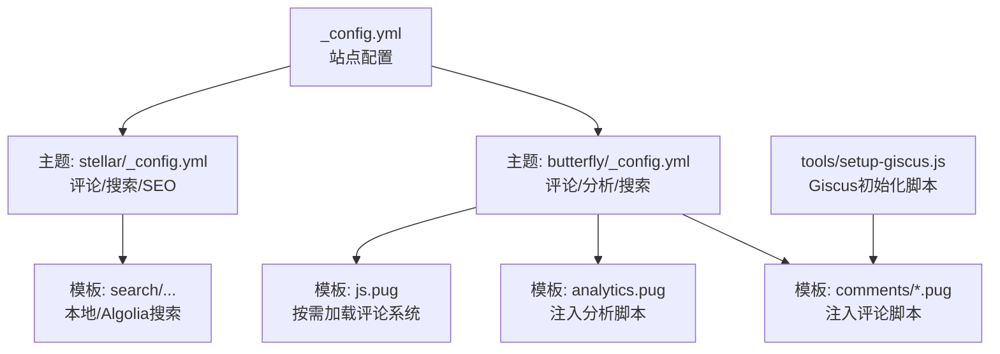
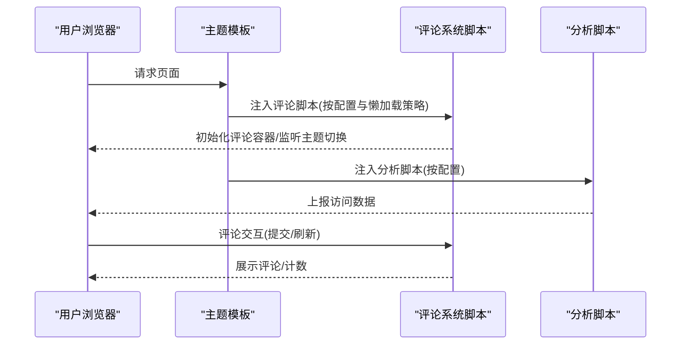
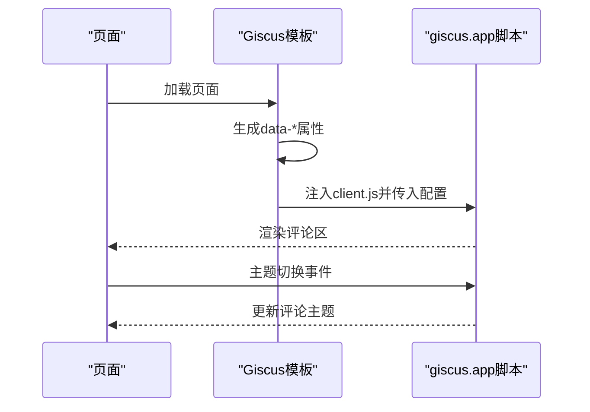
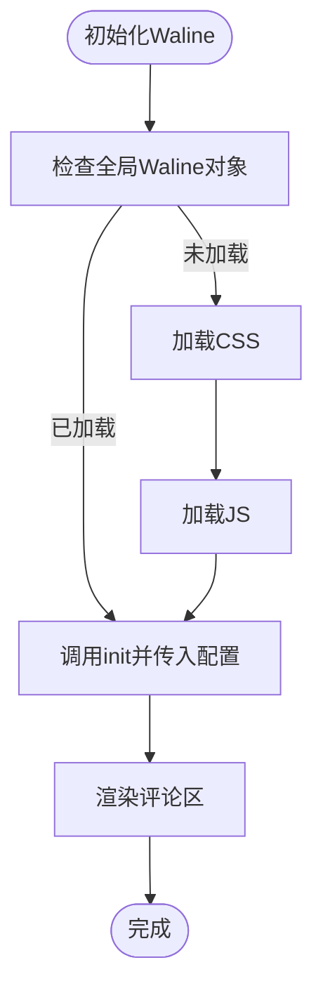
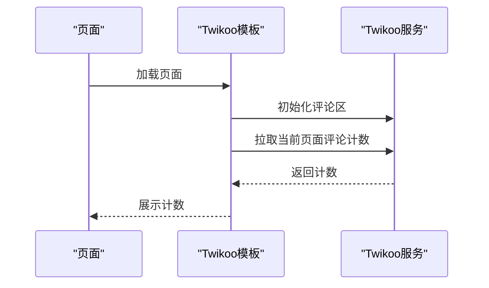
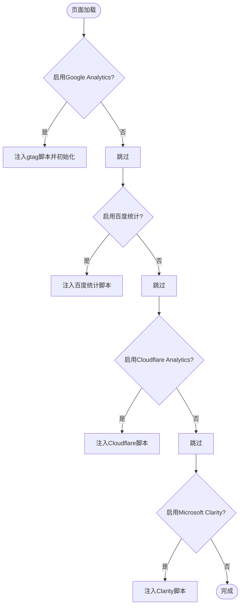
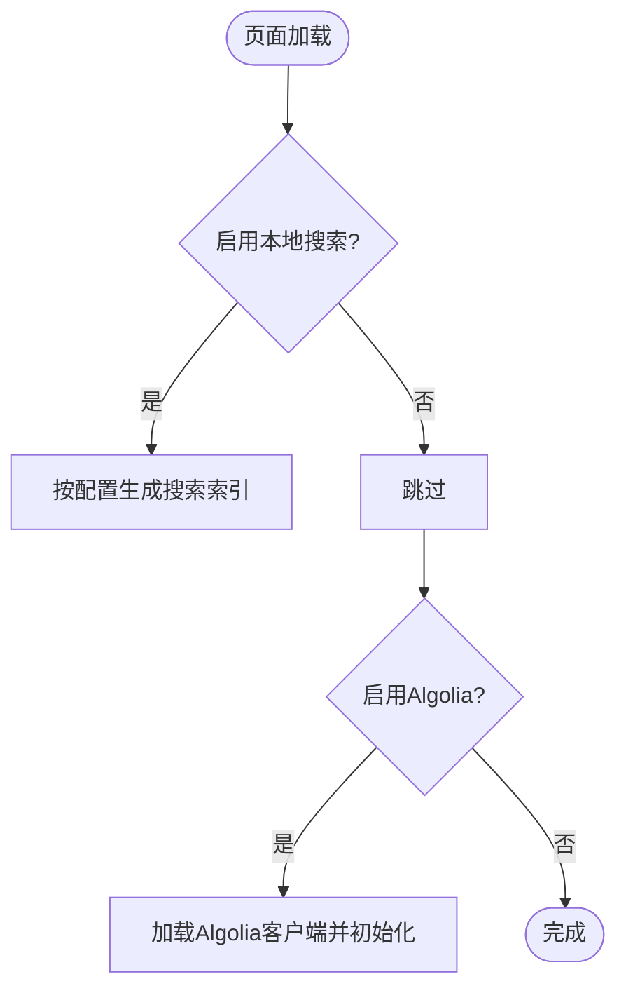
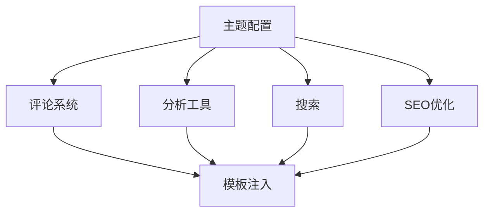

# 第三方服务集成

<cite>
**本文引用的文件**
- [_config.yml](file://_config.yml)
- [_config_stellar.yml](file://_config_stellar.yml)
- [themes/butterfly/_config.yml](file://themes/butterfly/_config.yml)
- [themes/butterfly/layout/includes/head/analytics.pug](file://themes/butterfly/layout/includes/head/analytics.pug)
- [themes/butterfly/layout/includes/third-party/comments/js.pug](file://themes/butterfly/layout/includes/third-party/comments/js.pug)
- [themes/butterfly/layout/includes/third-party/comments/giscus.pug](file://themes/butterfly/layout/includes/third-party/comments/giscus.pug)
- [themes/butterfly/layout/includes/third-party/comments/waline.pug](file://themes/butterfly/layout/includes/third-party/comments/waline.pug)
- [themes/butterfly/layout/includes/third-party/comments/twikoo.pug](file://themes/butterfly/layout/includes/third-party/comments/twikoo.pug)
- [themes/butterfly/layout/includes/third-party/comments/valine.pug](file://themes/butterfly/layout/includes/third-party/comments/valine.pug)
- [themes/butterfly/layout/includes/third-party/comments/utterances.pug](file://themes/butterfly/layout/includes/third-party/comments/utterances.pug)
- [themes/butterfly/layout/includes/third-party/comments/artalk.pug](file://themes/butterfly/layout/includes/third-party/comments/artalk.pug)
- [themes/butterfly/layout/includes/third-party/card-post-count/twikoo.pug](file://themes/butterfly/layout/includes/third-party/card-post-count/twikoo.pug)
- [themes/stellar/_config.yml](file://themes/stellar/_config.yml)
- [tools/setup-giscus.js](file://tools/setup-giscus.js)
</cite>

## 目录
1. [简介](#简介)
2. [项目结构](#项目结构)
3. [核心组件](#核心组件)
4. [架构总览](#架构总览)
5. [详细组件分析](#详细组件分析)
6. [依赖关系分析](#依赖关系分析)
7. [性能考量](#性能考量)
8. [故障排除指南](#故障排除指南)
9. [结论](#结论)
10. [附录](#附录)

## 简介
本指南聚焦于本项目的第三方服务集成，涵盖评论系统（Giscus、Waline、Twikoo、Valine、Utterances、Artalk）、统计分析工具（Google Analytics、百度统计、Cloudflare Analytics、Microsoft Clarity）、搜索功能（本地搜索、Algolia Docsearch）、社交媒体分享、广告投放、SEO优化等。文档基于实际配置文件与模板实现，提供最佳实践与故障排除建议，帮助读者快速完成配置并稳定运行。

## 项目结构
本项目采用 Hexo + 多主题（butterfly、stellar）的结构，第三方服务主要通过主题配置与模板注入实现：
- 站点级配置位于根目录配置文件，定义主题、RSS、搜索等基础能力
- 主题配置位于 themes/<theme>/_config.yml，集中声明评论、分析、搜索、分享等第三方服务参数
- 模板文件通过 Pug/EJS 注入脚本与初始化逻辑，按需加载与懒加载
- 工具脚本提供自动化配置（如 Giscus 初始化）

**图表来源**
- [_config.yml](file://_config.yml#L104-L136)
- [themes/butterfly/_config.yml](file://themes/butterfly/_config.yml#L402-L516)
- [themes/butterfly/layout/includes/third-party/comments/js.pug](file://themes/butterfly/layout/includes/third-party/comments/js.pug#L1-L26)
- [themes/butterfly/layout/includes/head/analytics.pug](file://themes/butterfly/layout/includes/head/analytics.pug#L1-L28)
- [themes/stellar/_config.yml](file://themes/stellar/_config.yml#L206-L218)
- [tools/setup-giscus.js](file://tools/setup-giscus.js#L93-L125)

**章节来源**
- [themes/butterfly/_config.yml](file://themes/butterfly/_config.yml#L402-L516)
- [themes/stellar/_config.yml](file://themes/stellar/_config.yml#L206-L218)
- [_config.yml](file://_config.yml#L104-L136)

## 核心组件
- 评论系统：支持 Giscus、Waline、Twikoo、Valine、Utterances、Artalk，通过主题配置启用并按需加载
- 统计分析：支持 Google Analytics、百度统计、Cloudflare Analytics、Microsoft Clarity，按配置注入脚本
- 搜索功能：本地搜索与 Algolia Docsearch，支持全文检索与结果展示
- 社交分享：主题内置分享按钮配置，可扩展第三方分享服务
- 广告投放：主题提供广告位配置入口，支持手动插入广告
- SEO优化：Open Graph、结构化数据、Canonical、预连接等

**章节来源**
- [themes/butterfly/_config.yml](file://themes/butterfly/_config.yml#L402-L516)
- [themes/butterfly/_config.yml](file://themes/butterfly/_config.yml#L558-L576)
- [themes/stellar/_config.yml](file://themes/stellar/_config.yml#L206-L218)
- [themes/stellar/_config.yml](file://themes/stellar/_config.yml#L11-L24)

## 架构总览
下图展示了评论系统与分析工具在页面中的加载与交互流程：

**图表来源**
- [themes/butterfly/layout/includes/third-party/comments/js.pug](file://themes/butterfly/layout/includes/third-party/comments/js.pug#L1-L26)
- [themes/butterfly/layout/includes/third-party/comments/giscus.pug](file://themes/butterfly/layout/includes/third-party/comments/giscus.pug#L10-L28)
- [themes/butterfly/layout/includes/head/analytics.pug](file://themes/butterfly/layout/includes/head/analytics.pug#L1-L28)

## 详细组件分析

### 评论系统集成
本项目支持多种评论系统，均通过主题配置启用并在模板中注入初始化脚本。以下为各系统的配置要点与实现机制。

#### Giscus
- 配置项：仓库、分类、主题(light/dark)、映射规则、严格模式、语言等
- 实现机制：模板动态生成脚本属性；支持主题切换时通过 postMessage 切换主题
- 初始化脚本：工具脚本提供初始化流程，确保容器存在后注入客户端脚本

**图表来源**
- [themes/butterfly/layout/includes/third-party/comments/giscus.pug](file://themes/butterfly/layout/includes/third-party/comments/giscus.pug#L10-L28)
- [tools/setup-giscus.js](file://tools/setup-giscus.js#L93-L125)

**章节来源**
- [themes/butterfly/_config.yml](file://themes/butterfly/_config.yml#L491-L501)
- [themes/butterfly/layout/includes/third-party/comments/giscus.pug](file://themes/butterfly/layout/includes/third-party/comments/giscus.pug#L1-L54)
- [tools/setup-giscus.js](file://tools/setup-giscus.js#L93-L125)

#### Waline
- 配置项：服务端地址、页面浏览量、评论计数、深色模式适配
- 实现机制：按需加载 CSS/JS，初始化时传入当前路径与主题模式

**图表来源**
- [themes/butterfly/layout/includes/third-party/comments/waline.pug](file://themes/butterfly/layout/includes/third-party/comments/waline.pug#L4-L23)

**章节来源**
- [themes/butterfly/_config.yml](file://themes/butterfly/_config.yml#L456-L463)
- [themes/butterfly/layout/includes/third-party/comments/waline.pug](file://themes/butterfly/layout/includes/third-party/comments/waline.pug#L1-L35)

#### Twikoo
- 配置项：环境ID、区域、评论计数
- 实现机制：初始化评论区；支持首页“最新评论”卡片的计数拉取

**图表来源**
- [themes/butterfly/layout/includes/third-party/comments/twikoo.pug](file://themes/butterfly/layout/includes/third-party/comments/twikoo.pug#L6-L35)
- [themes/butterfly/layout/includes/third-party/card-post-count/twikoo.pug](file://themes/butterfly/layout/includes/third-party/card-post-count/twikoo.pug#L1-L37)

**章节来源**
- [themes/butterfly/_config.yml](file://themes/butterfly/_config.yml#L483-L490)
- [themes/butterfly/layout/includes/third-party/comments/twikoo.pug](file://themes/butterfly/layout/includes/third-party/comments/twikoo.pug#L1-L53)
- [themes/butterfly/layout/includes/third-party/card-post-count/twikoo.pug](file://themes/butterfly/layout/includes/third-party/card-post-count/twikoo.pug#L1-L37)

#### Valine
- 配置项：应用ID/Key、头像策略、服务端地址、访客统计等
- 实现机制：按需加载脚本并初始化

**章节来源**
- [themes/butterfly/_config.yml](file://themes/butterfly/_config.yml#L445-L455)
- [themes/butterfly/layout/includes/third-party/comments/valine.pug](file://themes/butterfly/layout/includes/third-party/comments/valine.pug#L1-L34)

#### Utterances
- 配置项：仓库、Issue映射、主题(light/dark)、跨域
- 实现机制：动态注入脚本并根据主题切换发送主题消息

**章节来源**
- [themes/butterfly/_config.yml](file://themes/butterfly/_config.yml#L464-L473)
- [themes/butterfly/layout/includes/third-party/comments/utterances.pug](file://themes/butterfly/layout/includes/third-party/comments/utterances.pug#L1-L37)

#### Artalk
- 配置项：服务端、站点名、深色模式、图片灯箱
- 实现机制：按需加载 CSS/JS，初始化后绑定图片灯箱

**章节来源**
- [themes/butterfly/_config.yml](file://themes/butterfly/_config.yml#L509-L516)
- [themes/butterfly/layout/includes/third-party/comments/artalk.pug](file://themes/butterfly/layout/includes/third-party/comments/artalk.pug#L1-L50)

#### 评论系统选择与懒加载
- 模板根据配置动态选择第一个评论系统作为默认显示
- 支持懒加载：评论容器进入视口后再加载脚本，降低首屏负担

**章节来源**
- [themes/butterfly/layout/includes/third-party/comments/js.pug](file://themes/butterfly/layout/includes/third-party/comments/js.pug#L1-L26)
- [themes/butterfly/_config.yml](file://themes/butterfly/_config.yml#L405-L415)

### 统计分析工具集成
- Google Analytics：注入 gtag 脚本并按配置初始化
- 百度统计：注入 hm.js 脚本
- Cloudflare Analytics：注入 beacon 脚本
- Microsoft Clarity：注入 clarity 脚本

**图表来源**
- [themes/butterfly/layout/includes/head/analytics.pug](file://themes/butterfly/layout/includes/head/analytics.pug#L1-L28)
- [themes/butterfly/_config.yml](file://themes/butterfly/_config.yml#L561-L576)

**章节来源**
- [themes/butterfly/_config.yml](file://themes/butterfly/_config.yml#L558-L576)
- [themes/butterfly/layout/includes/head/analytics.pug](file://themes/butterfly/layout/includes/head/analytics.pug#L1-L28)

### 搜索功能实现
- 本地搜索：在主题配置中设置字段与路径，生成搜索索引文件
- Algolia Docsearch：配置 appId、apiKey、indexName，按需加载客户端脚本

**图表来源**
- [themes/stellar/_config.yml](file://themes/stellar/_config.yml#L206-L218)
- [themes/butterfly/_config.yml](file://themes/butterfly/_config.yml#L356-L380)

**章节来源**
- [themes/stellar/_config.yml](file://themes/stellar/_config.yml#L206-L218)
- [themes/butterfly/_config.yml](file://themes/butterfly/_config.yml#L356-L380)

### 社交分享、广告投放与SEO优化
- 社交分享：主题提供分享按钮配置，可扩展第三方分享服务
- 广告投放：提供广告位配置入口，支持手动插入广告
- SEO优化：Open Graph、结构化数据、Canonical、预连接等

**章节来源**
- [themes/butterfly/_config.yml](file://themes/butterfly/_config.yml#L381-L401)
- [themes/butterfly/_config.yml](file://themes/butterfly/_config.yml#L577-L602)
- [themes/stellar/_config.yml](file://themes/stellar/_config.yml#L11-L31)

## 依赖关系分析
- 评论系统依赖：各评论系统脚本按需加载，模板负责注入与初始化
- 分析工具依赖：按配置注入脚本，无侵入式加载
- 搜索依赖：本地搜索依赖主题配置与生成索引；Algolia依赖外部服务
- SEO依赖：主题配置与模板注入共同完成

**图表来源**
- [themes/butterfly/_config.yml](file://themes/butterfly/_config.yml#L402-L516)
- [themes/stellar/_config.yml](file://themes/stellar/_config.yml#L206-L218)

**章节来源**
- [themes/butterfly/_config.yml](file://themes/butterfly/_config.yml#L402-L516)
- [themes/stellar/_config.yml](file://themes/stellar/_config.yml#L206-L218)

## 性能考量
- 懒加载：评论系统支持懒加载，减少首屏资源压力
- 按需加载：分析与搜索脚本仅在启用时注入
- CDN与预连接：主题提供预连接配置，加速第三方资源加载
- 图片与媒体：评论区图片支持灯箱，提升阅读体验

**章节来源**
- [themes/butterfly/_config.yml](file://themes/butterfly/_config.yml#L405-L415)
- [themes/stellar/_config.yml](file://themes/stellar/_config.yml#L11-L15)

## 故障排除指南
- 评论系统未显示
  - 检查主题配置中的评论系统启用项与参数
  - 确认容器ID与懒加载策略一致
  - 查看浏览器控制台是否存在脚本加载错误
- 主题切换后评论主题未更新
  - 确认模板中主题切换回调已注册
  - 检查评论系统是否支持主题切换（如 Giscus、Utterances）
- Twikoo 评论计数异常
  - 确认环境ID与区域配置正确
  - 检查首页“最新评论”卡片的计数脚本是否执行
- 分析脚本未生效
  - 确认对应分析工具的配置项已启用
  - 检查脚本注入顺序与页面加载时机
- 搜索无结果
  - 确认本地搜索索引已生成
  - 检查 Algolia 配置与客户端脚本加载

**章节来源**
- [themes/butterfly/layout/includes/third-party/comments/giscus.pug](file://themes/butterfly/layout/includes/third-party/comments/giscus.pug#L30-L42)
- [themes/butterfly/layout/includes/third-party/comments/twikoo.pug](file://themes/butterfly/layout/includes/third-party/comments/twikoo.pug#L17-L35)
- [themes/butterfly/layout/includes/head/analytics.pug](file://themes/butterfly/layout/includes/head/analytics.pug#L1-L28)
- [themes/stellar/_config.yml](file://themes/stellar/_config.yml#L206-L218)

## 结论
本项目通过主题配置与模板注入的方式，实现了对主流第三方服务的灵活集成。评论系统、分析工具、搜索与 SEO 等模块均可按需启用与优化。遵循懒加载与按需加载策略，可在保证功能完整性的同时提升页面性能。遇到问题时，可依据配置项与模板实现逐项排查，快速定位并解决问题。

## 附录
- 配置最佳实践
  - 明确启用的服务范围，避免不必要的脚本加载
  - 使用 Canonical 与预连接提升 SEO 与性能
  - 为评论系统配置合适的主题与映射规则
  - 为分析工具配置正确的 ID 与脚本地址
- 常见问题速查
  - 评论系统：确认容器ID、懒加载策略、主题切换回调
  - 分析工具：确认启用开关与脚本注入
  - 搜索：确认索引生成与客户端脚本加载