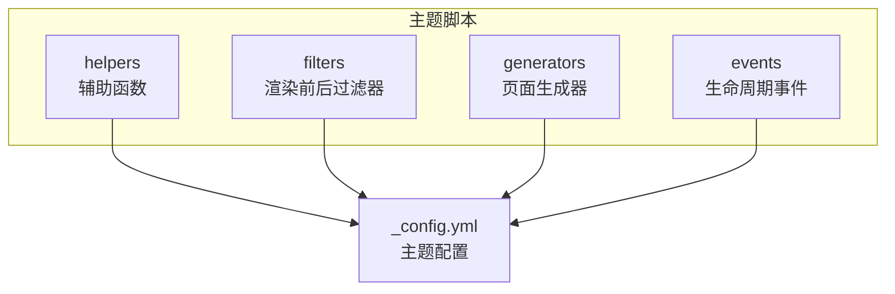
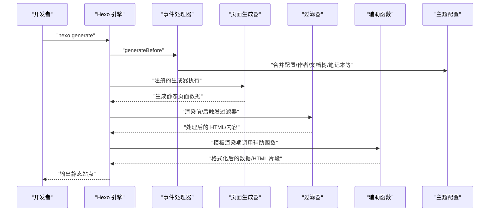
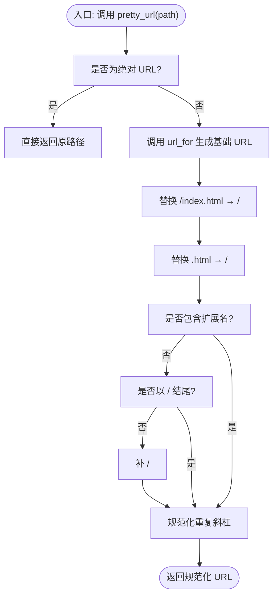
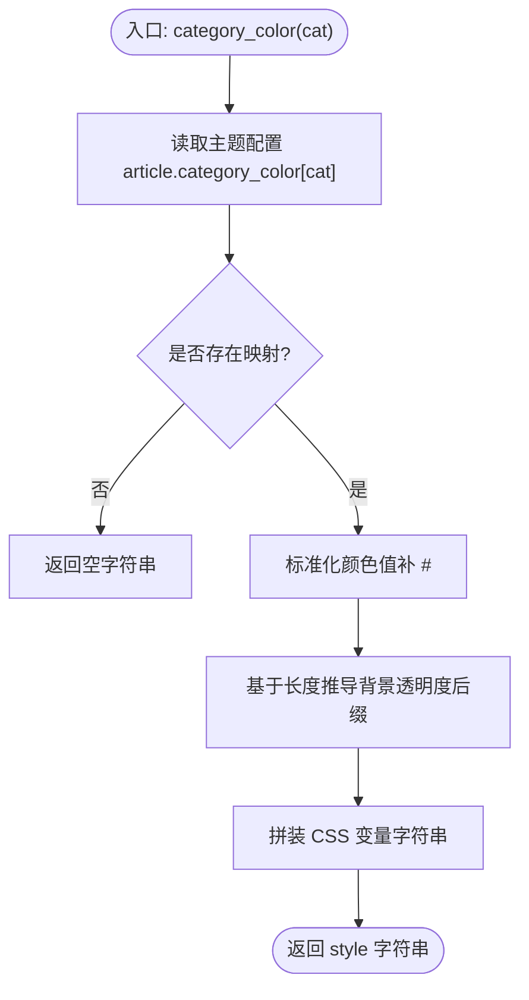
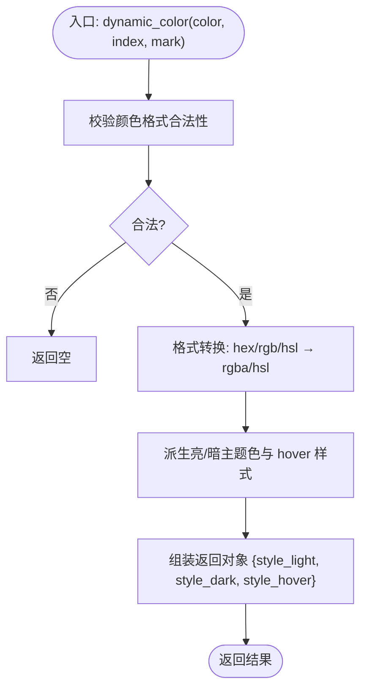
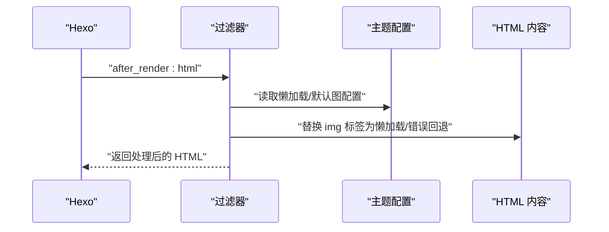
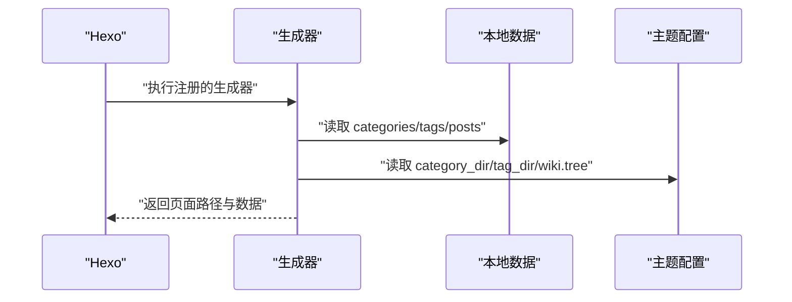
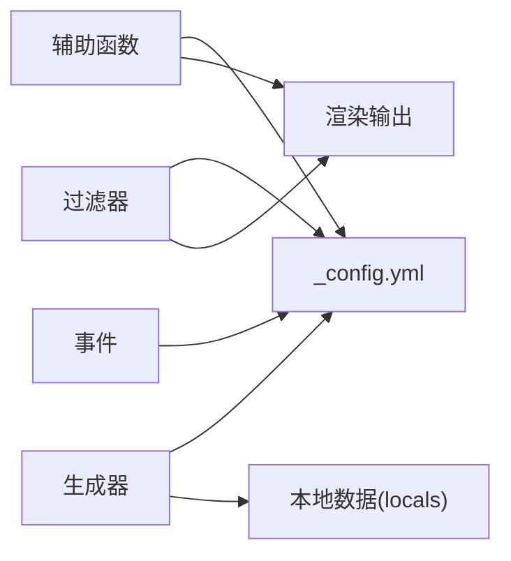

# 辅助函数扩展

<cite>
**本文引用的文件**
- [themes/stellar/scripts/helpers/pretty_url.js](file://themes/stellar/scripts/helpers/pretty_url.js)
- [themes/stellar/scripts/helpers/category_color.js](file://themes/stellar/scripts/helpers/category_color.js)
- [themes/stellar/scripts/helpers/dynamic_color.js](file://themes/stellar/scripts/helpers/dynamic_color.js)
- [themes/stellar/scripts/helpers/utils.js](file://themes/stellar/scripts/helpers/utils.js)
- [themes/stellar/scripts/helpers/related_posts.js](file://themes/stellar/scripts/helpers/related_posts.js)
- [themes/stellar/scripts/filters/index.js](file://themes/stellar/scripts/filters/index.js)
- [themes/stellar/scripts/filters/lib/img_lazyload.js](file://themes/stellar/scripts/filters/lib/img_lazyload.js)
- [themes/stellar/scripts/filters/lib/img_onerror.js](file://themes/stellar/scripts/filters/lib/img_onerror.js)
- [themes/stellar/scripts/filters/pretty_urls.js](file://themes/stellar/scripts/filters/pretty_urls.js)
- [themes/stellar/scripts/generators/categories.js](file://themes/stellar/scripts/generators/categories.js)
- [themes/stellar/scripts/generators/tags.js](file://themes/stellar/scripts/generators/tags.js)
- [themes/stellar/scripts/generators/wiki.js](file://themes/stellar/scripts/generators/wiki.js)
- [themes/stellar/scripts/events/index.js](file://themes/stellar/scripts/events/index.js)
- [themes/stellar/_config.yml](file://themes/stellar/_config.yml)
</cite>

## 目录
1. [简介](#简介)
2. [项目结构](#项目结构)
3. [核心组件](#核心组件)
4. [架构总览](#架构总览)
5. [组件详解](#组件详解)
6. [依赖关系分析](#依赖关系分析)
7. [性能考量](#性能考量)
8. [故障排查指南](#故障排查指南)
9. [结论](#结论)
10. [附录](#附录)

## 简介
本指南面向希望在 Hexo 主题（Stellar）中扩展“辅助函数”的开发者，系统讲解辅助函数在主题中的作用与实现原理，涵盖数据处理、格式转换与内容生成；并结合内置辅助函数（如 pretty_url、category_color、dynamic_color 等）与过滤器、生成器的实际实现，给出自定义扩展的开发步骤与性能优化建议。

## 项目结构
围绕“辅助函数扩展”，本主题的关键目录与职责如下：
- scripts/helpers：注册主题辅助函数（helpers），用于模板渲染期的数据格式化与内容生成
- scripts/filters：注册渲染前后过滤器（filters），对 HTML 或 Markdown 内容进行处理
- scripts/generators：注册页面生成器（generators），在构建阶段生成列表页、专题页等
- scripts/events：注册生命周期事件（generateBefore/generateAfter/ready/before_generate），在构建前后执行配置合并、资源修复、版本检查等
- _config.yml：主题配置入口，提供颜色、懒加载、插件开关、默认资源等参数，供辅助函数与过滤器读取

**图示来源**
- [themes/stellar/scripts/helpers/pretty_url.js](file://themes/stellar/scripts/helpers/pretty_url.js#L1-L28)
- [themes/stellar/scripts/filters/index.js](file://themes/stellar/scripts/filters/index.js#L1-L31)
- [themes/stellar/scripts/generators/categories.js](file://themes/stellar/scripts/generators/categories.js#L1-L16)
- [themes/stellar/scripts/events/index.js](file://themes/stellar/scripts/events/index.js#L1-L69)
- [themes/stellar/_config.yml](file://themes/stellar/_config.yml#L1-L725)

**章节来源**
- [themes/stellar/scripts/helpers/pretty_url.js](file://themes/stellar/scripts/helpers/pretty_url.js#L1-L28)
- [themes/stellar/scripts/filters/index.js](file://themes/stellar/scripts/filters/index.js#L1-L31)
- [themes/stellar/scripts/generators/categories.js](file://themes/stellar/scripts/generators/categories.js#L1-L16)
- [themes/stellar/scripts/events/index.js](file://themes/stellar/scripts/events/index.js#L1-L69)
- [themes/stellar/_config.yml](file://themes/stellar/_config.yml#L1-L725)

## 核心组件
- 辅助函数（Helpers）
  - 作用：在模板渲染期间提供便捷的数据处理与内容生成能力，如 URL 规范化、颜色注入、相关文章包装等
  - 示例：pretty_url、category_color、dynamic_color、utils、related_posts
- 过滤器（Filters）
  - 作用：在渲染前后对 HTML 或 Markdown 内容进行处理，如图片懒加载、错误回退、Markdown 图片标记转换
  - 示例：before_post_render、after_render:html
- 生成器（Generators）
  - 作用：在构建阶段生成列表页、专题页等静态页面，如分类页、标签页、Wiki 主页与筛选页
- 事件（Events）
  - 作用：在构建前后执行配置合并、资源修复、版本检查等任务，确保运行时一致性

**章节来源**
- [themes/stellar/scripts/helpers/pretty_url.js](file://themes/stellar/scripts/helpers/pretty_url.js#L1-L28)
- [themes/stellar/scripts/helpers/category_color.js](file://themes/stellar/scripts/helpers/category_color.js#L1-L23)
- [themes/stellar/scripts/helpers/dynamic_color.js](file://themes/stellar/scripts/helpers/dynamic_color.js#L1-L138)
- [themes/stellar/scripts/helpers/utils.js](file://themes/stellar/scripts/helpers/utils.js#L1-L21)
- [themes/stellar/scripts/helpers/related_posts.js](file://themes/stellar/scripts/helpers/related_posts.js#L1-L55)
- [themes/stellar/scripts/filters/index.js](file://themes/stellar/scripts/filters/index.js#L1-L31)
- [themes/stellar/scripts/filters/lib/img_lazyload.js](file://themes/stellar/scripts/filters/lib/img_lazyload.js#L1-L53)
- [themes/stellar/scripts/filters/lib/img_onerror.js](file://themes/stellar/scripts/filters/lib/img_onerror.js#L1-L25)
- [themes/stellar/scripts/generators/categories.js](file://themes/stellar/scripts/generators/categories.js#L1-L16)
- [themes/stellar/scripts/generators/tags.js](file://themes/stellar/scripts/generators/tags.js#L1-L16)
- [themes/stellar/scripts/generators/wiki.js](file://themes/stellar/scripts/generators/wiki.js#L1-L39)
- [themes/stellar/scripts/events/index.js](file://themes/stellar/scripts/events/index.js#L1-L69)

## 架构总览
下图展示“辅助函数扩展”在构建与渲染流程中的位置与交互：

**图示来源**
- [themes/stellar/scripts/events/index.js](file://themes/stellar/scripts/events/index.js#L5-L18)
- [themes/stellar/scripts/generators/categories.js](file://themes/stellar/scripts/generators/categories.js#L5-L15)
- [themes/stellar/scripts/generators/tags.js](file://themes/stellar/scripts/generators/tags.js#L5-L15)
- [themes/stellar/scripts/generators/wiki.js](file://themes/stellar/scripts/generators/wiki.js#L5-L38)
- [themes/stellar/scripts/filters/index.js](file://themes/stellar/scripts/filters/index.js#L3-L29)
- [themes/stellar/scripts/helpers/pretty_url.js](file://themes/stellar/scripts/helpers/pretty_url.js#L3-L27)
- [themes/stellar/_config.yml](file://themes/stellar/_config.yml#L722-L725)

## 组件详解

### 辅助函数：URL 规范化（pretty_url）
- 作用：将相对路径转换为“人性化”的 URL，去除 index.html、补齐末尾斜杠、规范化协议与斜杠
- 关键逻辑要点
  - 绝对 URL 直接返回
  - 使用主题的 url_for 生成基础 URL
  - 替换 /index.html → /，.html → /
  - 无扩展名且不以 / 结尾时补 /
  - 规避重复斜杠（保留协议部分）
- 使用场景：导航、面包屑、RSS、Open Graph 等需要规范链接的场景

**图示来源**
- [themes/stellar/scripts/helpers/pretty_url.js](file://themes/stellar/scripts/helpers/pretty_url.js#L3-L27)

**章节来源**
- [themes/stellar/scripts/helpers/pretty_url.js](file://themes/stellar/scripts/helpers/pretty_url.js#L1-L28)

### 辅助函数：分类颜色注入（category_color）
- 作用：根据分类名从主题配置读取颜色，生成 CSS 变量字符串，用于注入到元素 style 属性
- 关键逻辑要点
  - 从主题配置 article.category_color 读取颜色映射
  - 若为简写色值，自动加前缀 #
  - 依据长度推导半透明/全透明背景色后缀
  - 返回形如 style="--text-p2:...;--theme-block:..." 的字符串
- 使用场景：分类标签、侧边栏分类列表的视觉统一

**图示来源**
- [themes/stellar/scripts/helpers/category_color.js](file://themes/stellar/scripts/helpers/category_color.js#L3-L22)

**章节来源**
- [themes/stellar/scripts/helpers/category_color.js](file://themes/stellar/scripts/helpers/category_color.js#L1-L23)

### 辅助函数：动态色彩生成（dynamic_color）
- 作用：接收任意合法颜色格式（rgb/rgba/hex/hsl/hsla），将其转换为 HSL 色彩空间，派生亮/暗两套主题色与悬停样式，返回可用于注入的 CSS 变量与类样式
- 关键逻辑要点
  - 颜色合法性校验（正则）
  - 颜色格式转换：hex→rgba、rgb→hsl、hsl→hsl（含 a）
  - 生成亮色系、暗色系与 hover 样式
  - 返回包含 style_light/style_dark/style_hover 的对象
- 使用场景：标签/徽标/卡片等组件的动态主题色注入

**图示来源**
- [themes/stellar/scripts/helpers/dynamic_color.js](file://themes/stellar/scripts/helpers/dynamic_color.js#L4-L136)

**章节来源**
- [themes/stellar/scripts/helpers/dynamic_color.js](file://themes/stellar/scripts/helpers/dynamic_color.js#L1-L138)

### 辅助函数：页面/文章查询（utils.get_page）
- 作用：根据 _id 在 pages 与 posts 中查找对应对象
- 关键逻辑要点
  - 优先在 pages 中查找
  - 若未找到再在 posts 中查找
  - 未命中返回 null
- 使用场景：侧边栏、最近内容、面包屑等需要跨集合定位内容的场景

**章节来源**
- [themes/stellar/scripts/helpers/utils.js](file://themes/stellar/scripts/helpers/utils.js#L7-L20)

### 辅助函数：相关文章包装（related_posts.popular_posts_wrapper）
- 作用：将外部提供的 JSON 列表包装为统一的 HTML 结构，支持标题、摘要截断、链接生成
- 关键逻辑要点
  - 读取主题配置 article.related_posts.enable
  - 遍历 JSON 列表，逐项生成 a.item
  - 使用 util.truncate 与 stripHTML 截断摘要
  - 通过 this.site 与 this.config.root 匹配文章对象
- 使用场景：第三方相关文章服务或算法的结果展示

**章节来源**
- [themes/stellar/scripts/helpers/related_posts.js](file://themes/stellar/scripts/helpers/related_posts.js#L9-L54)

### 过滤器：图片懒加载与错误回退（filters）
- 图片懒加载（img_lazyload）
  - 作用：为 img 标签添加懒加载 class 与 data-src，插入占位图
  - 关键逻辑：检测是否已存在 data-srcset、是否为 base64、是否带 no-lazy，若满足条件则跳过
- 图片错误回退（img_onerror）
  - 作用：为缺失或损坏的图片添加 onerror 回退逻辑，替换为默认占位图
  - 关键逻辑：避免与懒加载冲突，仅对特定 img 标签生效
- Markdown 图片标记转换（before_post_render）
  - 作用：将 Markdown 图片语法转换为主题的 tag 插件语法，便于后续统一处理
  - 关键逻辑：按区块拆分，排除代码块与特定插件块，对剩余内容进行正则替换

**图示来源**
- [themes/stellar/scripts/filters/lib/img_lazyload.js](file://themes/stellar/scripts/filters/lib/img_lazyload.js#L10-L48)
- [themes/stellar/scripts/filters/lib/img_onerror.js](file://themes/stellar/scripts/filters/lib/img_onerror.js#L10-L24)
- [themes/stellar/scripts/filters/index.js](file://themes/stellar/scripts/filters/index.js#L6-L29)

**章节来源**
- [themes/stellar/scripts/filters/lib/img_lazyload.js](file://themes/stellar/scripts/filters/lib/img_lazyload.js#L1-L53)
- [themes/stellar/scripts/filters/lib/img_onerror.js](file://themes/stellar/scripts/filters/lib/img_onerror.js#L1-L25)
- [themes/stellar/scripts/filters/index.js](file://themes/stellar/scripts/filters/index.js#L1-L31)

### 生成器：分类/标签/专题页（generators）
- 分类页生成器（categories）
  - 作用：当存在分类时，生成分类列表页
- 标签页生成器（tags）
  - 作用：当存在标签时，生成标签列表页
- Wiki 生成器（wiki）
  - 作用：生成 Wiki 主页与按标签筛选的子页，从主题配置 wiki.tree 与 wiki.all_tags 读取菜单与标签集合
- 伪静态 URL 修正（filters.pretty_urls）
  - 作用：将 .html 且非 /index.html 的页面路径替换为 /index.html，保证统一输出

**图示来源**
- [themes/stellar/scripts/generators/categories.js](file://themes/stellar/scripts/generators/categories.js#L5-L15)
- [themes/stellar/scripts/generators/tags.js](file://themes/stellar/scripts/generators/tags.js#L5-L15)
- [themes/stellar/scripts/generators/wiki.js](file://themes/stellar/scripts/generators/wiki.js#L5-L38)
- [themes/stellar/scripts/filters/pretty_urls.js](file://themes/stellar/scripts/filters/pretty_urls.js#L3-L25)

**章节来源**
- [themes/stellar/scripts/generators/categories.js](file://themes/stellar/scripts/generators/categories.js#L1-L16)
- [themes/stellar/scripts/generators/tags.js](file://themes/stellar/scripts/generators/tags.js#L1-L16)
- [themes/stellar/scripts/generators/wiki.js](file://themes/stellar/scripts/generators/wiki.js#L1-L39)
- [themes/stellar/scripts/filters/pretty_urls.js](file://themes/stellar/scripts/filters/pretty_urls.js#L1-L26)

### 事件：构建前后与就绪（events）
- generateBefore：合并主题配置、链接、作者、文档树、专题树、工具集、笔记本等
- generateAfter：合并文章（用于去重/聚合）
- ready：首次构建完成后的欢迎信息与版本检查
- before_generate（开发模式）：在开发模式下生成图片比例缓存并修复 Markdown 图片标签（与懒加载配置联动）

**章节来源**
- [themes/stellar/scripts/events/index.js](file://themes/stellar/scripts/events/index.js#L5-L66)

## 依赖关系分析
- 辅助函数依赖主题配置（_config.yml）中的颜色、懒加载、插件开关、默认资源等字段
- 过滤器依赖主题配置中的插件开关与默认资源路径
- 生成器依赖主题配置中的目录名与树形结构（如 wiki.tree、wiki.all_tags）
- 事件在构建前后对配置与资源进行预处理，确保渲染期的一致性

**图示来源**
- [themes/stellar/_config.yml](file://themes/stellar/_config.yml#L194-L205)
- [themes/stellar/_config.yml](file://themes/stellar/_config.yml#L458-L462)
- [themes/stellar/_config.yml](file://themes/stellar/_config.yml#L92-L96)
- [themes/stellar/_config.yml](file://themes/stellar/_config.yml#L722-L725)

**章节来源**
- [themes/stellar/_config.yml](file://themes/stellar/_config.yml#L194-L205)
- [themes/stellar/_config.yml](file://themes/stellar/_config.yml#L458-L462)
- [themes/stellar/_config.yml](file://themes/stellar/_config.yml#L92-L96)
- [themes/stellar/_config.yml](file://themes/stellar/_config.yml#L722-L725)

## 性能考量
- 避免在辅助函数中进行昂贵的 IO 或网络请求，尽量使用本地数据（locals）与配置
- 过滤器中对 HTML 的正则替换应尽量精确，避免重复处理（如已存在 data-srcset 或 base64 图片时跳过）
- 生成器只在必要时生成页面（如存在分类/标签/Wiki 标签时），减少无效输出
- 在开发模式下启用图片比例修复与懒加载配置联动，降低生产环境负担
- 合理使用 CSS 变量（如 dynamic_color）减少重复样式的计算与下发

[本节为通用指导，不直接分析具体文件]

## 故障排查指南
- 图片懒加载未生效
  - 检查主题配置 plugins.lazyload.enable 与 dependencies.lazyload.fix_ratio
  - 确认 img 标签未包含 no-lazy 或已是 data-srcset
  - 参考：[懒加载实现](file://themes/stellar/scripts/filters/lib/img_lazyload.js#L10-L48)
- 图片错误回退未触发
  - 检查是否与懒加载冲突（含 no-lazy）
  - 确认默认图片路径配置正确
  - 参考：[错误回退实现](file://themes/stellar/scripts/filters/lib/img_onerror.js#L10-L24)
- URL 输出不符合预期
  - 检查主题配置 override_pretty_urls 与 pretty_url 的替换规则
  - 参考：[URL 规范化](file://themes/stellar/scripts/helpers/pretty_url.js#L3-L27)、[伪静态修正](file://themes/stellar/scripts/filters/pretty_urls.js#L3-L25)
- 分类/标签/专题页未生成
  - 检查主题配置 category_dir/tag_dir/wiki.tree 与 wiki.all_tags
  - 确认存在对应数据（locals.categories/tags/posts）
  - 参考：[分类生成器](file://themes/stellar/scripts/generators/categories.js#L5-L15)、[标签生成器](file://themes/stellar/scripts/generators/tags.js#L5-L15)、[Wiki 生成器](file://themes/stellar/scripts/generators/wiki.js#L5-L38)
- 相关文章未显示
  - 检查主题配置 article.related_posts.enable
  - 确认传入 JSON 列表非空
  - 参考：[相关文章包装](file://themes/stellar/scripts/helpers/related_posts.js#L9-L54)

**章节来源**
- [themes/stellar/scripts/filters/lib/img_lazyload.js](file://themes/stellar/scripts/filters/lib/img_lazyload.js#L10-L48)
- [themes/stellar/scripts/filters/lib/img_onerror.js](file://themes/stellar/scripts/filters/lib/img_onerror.js#L10-L24)
- [themes/stellar/scripts/helpers/pretty_url.js](file://themes/stellar/scripts/helpers/pretty_url.js#L3-L27)
- [themes/stellar/scripts/filters/pretty_urls.js](file://themes/stellar/scripts/filters/pretty_urls.js#L3-L25)
- [themes/stellar/scripts/generators/categories.js](file://themes/stellar/scripts/generators/categories.js#L5-L15)
- [themes/stellar/scripts/generators/tags.js](file://themes/stellar/scripts/generators/tags.js#L5-L15)
- [themes/stellar/scripts/generators/wiki.js](file://themes/stellar/scripts/generators/wiki.js#L5-L38)
- [themes/stellar/scripts/helpers/related_posts.js](file://themes/stellar/scripts/helpers/related_posts.js#L9-L54)

## 结论
通过合理组织辅助函数、过滤器、生成器与事件，主题可在构建与渲染阶段高效完成数据处理、格式转换与内容生成。遵循本文的实现原理与优化建议，可快速扩展自定义辅助函数并保持良好的性能与可维护性。

[本节为总结，不直接分析具体文件]

## 附录

### 自定义辅助函数开发步骤
- 明确用途与输入输出
  - 例如：URL 规范化、颜色注入、内容截断、HTML 包装
- 在 scripts/helpers 下新增文件并注册
  - 使用 hexo.extend.helper.register('your_helper', fn)
  - 读取主题配置与本地数据（hexo.theme.config、hexo.locals.get）
- 在模板中调用
  - 通过 {{ your_helper(...) }} 使用
- 调试与测试
  - 在开发模式下观察输出，逐步完善边界条件与错误处理

**章节来源**
- [themes/stellar/scripts/helpers/pretty_url.js](file://themes/stellar/scripts/helpers/pretty_url.js#L3-L27)
- [themes/stellar/scripts/helpers/category_color.js](file://themes/stellar/scripts/helpers/category_color.js#L3-L22)
- [themes/stellar/scripts/helpers/dynamic_color.js](file://themes/stellar/scripts/helpers/dynamic_color.js#L109-L136)
- [themes/stellar/scripts/helpers/utils.js](file://themes/stellar/scripts/helpers/utils.js#L7-L20)
- [themes/stellar/scripts/helpers/related_posts.js](file://themes/stellar/scripts/helpers/related_posts.js#L9-L54)

### 过滤器开发方法
- 选择合适的钩子
  - before_post_render：对 Markdown 内容进行预处理（如图片语法转换）
  - after_render:html：对最终 HTML 进行后处理（如懒加载、错误回退）
- 读取主题配置
  - 通过 this.theme.config 获取开关与默认资源路径
- 注意兼容性
  - 避免与其它过滤器冲突（如懒加载与错误回退的 img 标签判定）

**章节来源**
- [themes/stellar/scripts/filters/index.js](file://themes/stellar/scripts/filters/index.js#L3-L29)
- [themes/stellar/scripts/filters/lib/img_lazyload.js](file://themes/stellar/scripts/filters/lib/img_lazyload.js#L10-L48)
- [themes/stellar/scripts/filters/lib/img_onerror.js](file://themes/stellar/scripts/filters/lib/img_onerror.js#L10-L24)

### 生成器实现要点
- 仅在存在数据时生成页面，减少无效输出
- 从主题配置读取目录名与菜单 ID，保证路径与导航一致
- 将数据传递给模板（layout），并在模板中渲染

**章节来源**
- [themes/stellar/scripts/generators/categories.js](file://themes/stellar/scripts/generators/categories.js#L5-L15)
- [themes/stellar/scripts/generators/tags.js](file://themes/stellar/scripts/generators/tags.js#L5-L15)
- [themes/stellar/scripts/generators/wiki.js](file://themes/stellar/scripts/generators/wiki.js#L5-L38)
- [themes/stellar/_config.yml](file://themes/stellar/_config.yml#L92-L96)

### 性能优化建议
- 将复杂计算移至事件或生成器阶段，渲染期尽量轻量
- 使用 CSS 变量与主题配置集中管理样式，减少重复计算
- 对 HTML 正则替换进行幂等处理，避免重复替换

**章节来源**
- [themes/stellar/scripts/events/index.js](file://themes/stellar/scripts/events/index.js#L46-L66)
- [themes/stellar/scripts/helpers/dynamic_color.js](file://themes/stellar/scripts/helpers/dynamic_color.js#L109-L136)
- [themes/stellar/_config.yml](file://themes/stellar/_config.yml#L658-L662)