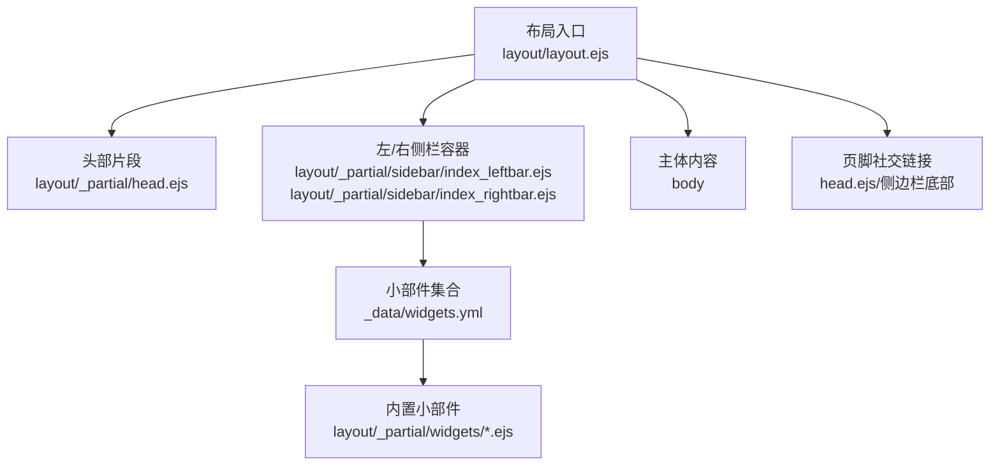
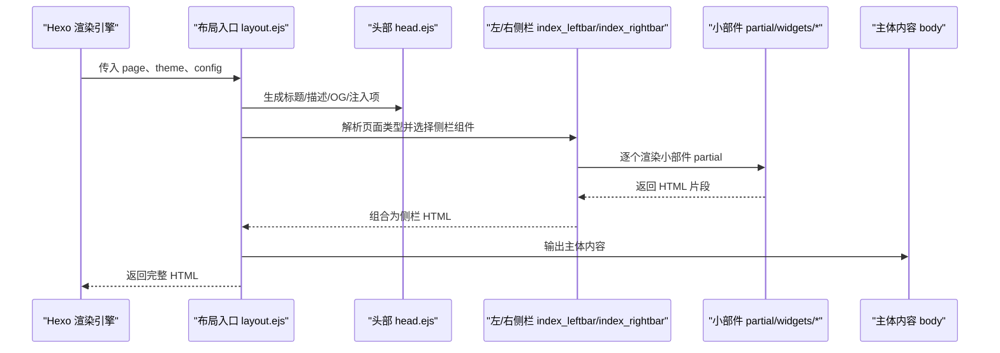
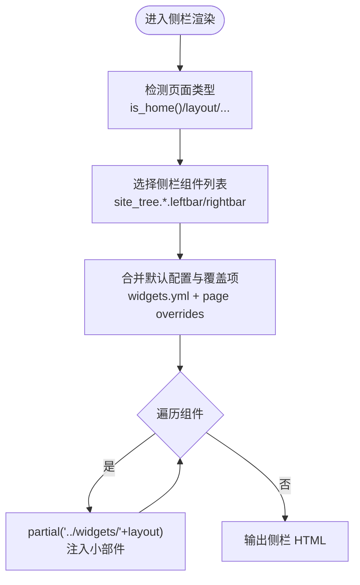
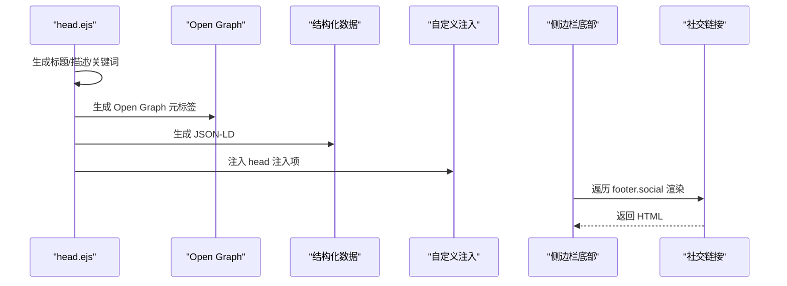
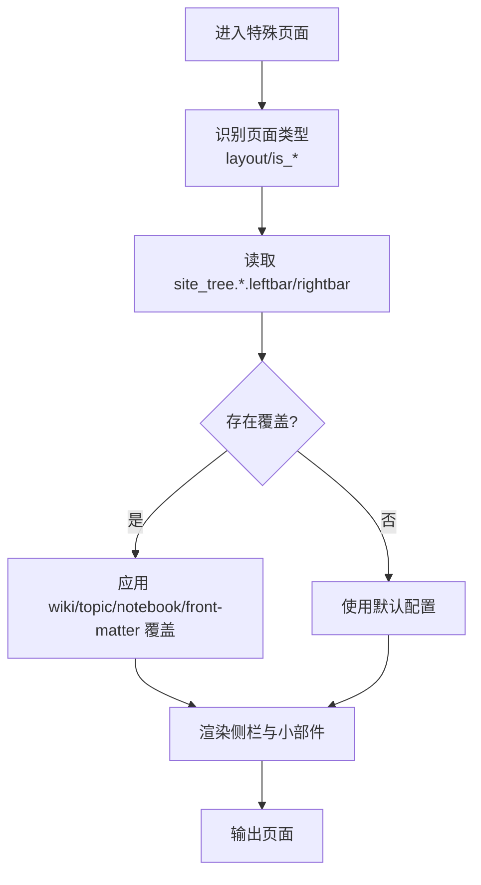
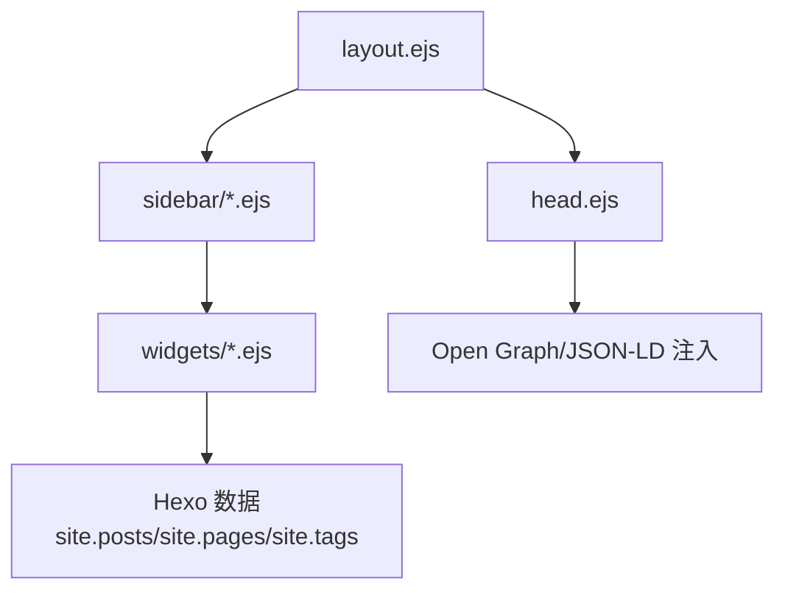

# 页面组件开发

<cite>
**本文引用的文件**
- [themes/stellar/_config.yml](file://themes/stellar/_config.yml)
- [themes/stellar/layout/layout.ejs](file://themes/stellar/layout/layout.ejs)
- [themes/stellar/layout/_partial/head.ejs](file://themes/stellar/layout/_partial/head.ejs)
- [themes/stellar/layout/_partial/sidebar/index_leftbar.ejs](file://themes/stellar/layout/_partial/sidebar/index_leftbar.ejs)
- [themes/stellar/layout/_partial/sidebar/index_rightbar.ejs](file://themes/stellar/layout/_partial/sidebar/index_rightbar.ejs)
- [themes/stellar/_data/widgets.yml](file://themes/stellar/_data/widgets.yml)
- [themes/stellar/layout/_partial/widgets/recent.ejs](file://themes/stellar/layout/_partial/widgets/recent.ejs)
- [themes/stellar/layout/_partial/widgets/tagcloud.ejs](file://themes/stellar/layout/_partial/widgets/tagcloud.ejs)
- [themes/stellar/layout/_partial/widgets/author.ejs](file://themes/stellar/layout/_partial/widgets/author.ejs)
- [themes/stellar/layout/_partial/widgets/toc.ejs](file://themes/stellar/layout/_partial/widgets/toc.ejs)
- [themes/stellar/layout/_partial/widgets/tree.ejs](file://themes/stellar/layout/_partial/widgets/tree.ejs)
</cite>

## 目录
1. [引言](#引言)
2. [项目结构](#项目结构)
3. [核心组件](#核心组件)
4. [架构总览](#架构总览)
5. [详细组件分析](#详细组件分析)
6. [依赖关系分析](#依赖关系分析)
7. [性能考量](#性能考量)
8. [故障排查指南](#故障排查指南)
9. [结论](#结论)
10. [附录](#附录)

## 引言
本指南面向使用 Hexo + Stellar 主题进行页面组件开发的工程师与内容创作者，聚焦“侧边栏组件、小部件（widget）、页眉页脚组件与特殊页面”的开发方法。文档深入解释组件生命周期、数据传递与模板渲染机制，提供创建自定义侧边栏组件（如作者信息、社交链接、标签云等）的方法，以及页面组件的开发模式（布局组件、面包屑导航、分页组件）。最后总结组件复用、样式定制与交互增强的最佳实践。

## 项目结构
Stellar 主题采用 EJS 模板与 YAML 配置驱动的页面渲染体系。整体结构要点如下：
- 布局层：顶层布局负责页面类型判断、文章类型与缩进策略、站点背景容器与主体结构拼装。
- 侧边栏层：左右侧栏根据页面类型与配置动态选择组件集合，组件通过 partial 注入。
- 小部件层：内置多种小部件（如最近更新、标签云、目录、文档树、作者卡片等），通过 widgets.yml 配置启用与覆盖。
- 头部与页脚：head.ejs 负责 SEO、Open Graph、结构化数据与注入项；页脚社交链接在侧边栏底部渲染。
- 特殊页面：首页、列表页、内容页、错误页、笔记本/笔记页、作者页等均有独立的侧栏组件配置与渲染逻辑。

**图表来源**
- [themes/stellar/layout/layout.ejs](file://themes/stellar/layout/layout.ejs#L1-L76)
- [themes/stellar/layout/_partial/head.ejs](file://themes/stellar/layout/_partial/head.ejs#L1-L156)
- [themes/stellar/layout/_partial/sidebar/index_leftbar.ejs](file://themes/stellar/layout/_partial/sidebar/index_leftbar.ejs#L1-L167)
- [themes/stellar/layout/_partial/sidebar/index_rightbar.ejs](file://themes/stellar/layout/_partial/sidebar/index_rightbar.ejs#L1-L94)
- [themes/stellar/_data/widgets.yml](file://themes/stellar/_data/widgets.yml#L1-L85)

**章节来源**
- [themes/stellar/layout/layout.ejs](file://themes/stellar/layout/layout.ejs#L1-L76)
- [themes/stellar/layout/_partial/head.ejs](file://themes/stellar/layout/_partial/head.ejs#L1-L156)
- [themes/stellar/layout/_partial/sidebar/index_leftbar.ejs](file://themes/stellar/layout/_partial/sidebar/index_leftbar.ejs#L1-L167)
- [themes/stellar/layout/_partial/sidebar/index_rightbar.ejs](file://themes/stellar/layout/_partial/sidebar/index_rightbar.ejs#L1-L94)
- [themes/stellar/_data/widgets.yml](file://themes/stellar/_data/widgets.yml#L1-L85)

## 核心组件
- 布局与页面类型判定
  - 布局入口根据页面布局类型与导航标签决定“索引页”或“内容页”，并据此设置文章类型与缩进策略。
  - 站点背景支持通过配置注入模糊背景容器，提升视觉层次。
- 侧边栏与小部件
  - 左右两侧栏根据页面类型与主题配置动态选择组件列表，组件通过 partial 注入，支持 override 与 layout 覆盖。
  - 小部件通过 widgets.yml 配置启用，支持 RSS、限制数量、排序、颜色、折叠等参数。
- 头部与页脚
  - head.ejs 负责标题、描述、关键词、Open Graph、结构化数据、预连接、注入项与样式加载。
  - 页脚社交链接在侧边栏底部渲染，支持图标、标题、外链或自定义事件。

**章节来源**
- [themes/stellar/layout/layout.ejs](file://themes/stellar/layout/layout.ejs#L1-L76)
- [themes/stellar/layout/_partial/sidebar/index_leftbar.ejs](file://themes/stellar/layout/_partial/sidebar/index_leftbar.ejs#L1-L167)
- [themes/stellar/layout/_partial/sidebar/index_rightbar.ejs](file://themes/stellar/layout/_partial/sidebar/index_rightbar.ejs#L1-L94)
- [themes/stellar/_data/widgets.yml](file://themes/stellar/_data/widgets.yml#L1-L85)
- [themes/stellar/layout/_partial/head.ejs](file://themes/stellar/layout/_partial/head.ejs#L1-L156)

## 架构总览
下图展示页面渲染的关键流程：布局入口根据页面类型与主题配置选择侧栏组件，组件通过 partial 渲染，最终输出 HTML。

**图表来源**
- [themes/stellar/layout/layout.ejs](file://themes/stellar/layout/layout.ejs#L1-L76)
- [themes/stellar/layout/_partial/head.ejs](file://themes/stellar/layout/_partial/head.ejs#L1-L156)
- [themes/stellar/layout/_partial/sidebar/index_leftbar.ejs](file://themes/stellar/layout/_partial/sidebar/index_leftbar.ejs#L1-L167)
- [themes/stellar/layout/_partial/sidebar/index_rightbar.ejs](file://themes/stellar/layout/_partial/sidebar/index_rightbar.ejs#L1-L94)

## 详细组件分析

### 侧边栏组件与小部件开发
- 组件生命周期与数据传递
  - 页面类型解析：布局入口根据 page.layout、page.nav_tabs、page.type 等决定页面类型与文章类型。
  - 侧栏选择：index_leftbar/index_rightbar 根据 is_home、page.layout、wiki/topic/notebook 等分支选择对应 site_tree.*.leftbar/rightbar。
  - 小部件渲染：遍历组件列表，合并 widgets.yml 中的默认配置与页面覆盖项，通过 partial('../widgets/' + layout) 注入。
- 常用小部件与参数
  - 最近更新（recent）：支持 wiki/notebooks/notebook/默认场景的筛选与排序，RSS 订阅链接，limit 控制数量。
  - 标签云（tagcloud）：支持最小/最大字号、标签数量、排序、颜色区间、是否显示计数。
  - 目录（toc）：基于页面内容生成目录，支持最小/最大层级、编号、折叠、滚动到顶部与评论锚点。
  - 文档树（tree）：针对 wiki 项目按 sections 输出页面列表，支持激活态标记。
  - 作者卡片（author）：读取 theme.authors 或默认作者，支持头像、名称、简介与主页链接。
- 自定义侧边栏组件
  - 在 widgets.yml 中新增条目，指定 layout 与标题等参数。
  - 在 layout/_partial/widgets 下创建对应 EJS 文件，遵循现有结构（header/body/footer），使用 item 与国际化函数。
  - 在侧栏模板中通过 page.leftbar/page.rightbar 或 site_tree.*.leftbar/rightbar 引入组件。

**图表来源**
- [themes/stellar/layout/_partial/sidebar/index_leftbar.ejs](file://themes/stellar/layout/_partial/sidebar/index_leftbar.ejs#L1-L167)
- [themes/stellar/layout/_partial/sidebar/index_rightbar.ejs](file://themes/stellar/layout/_partial/sidebar/index_rightbar.ejs#L1-L94)
- [themes/stellar/_data/widgets.yml](file://themes/stellar/_data/widgets.yml#L1-L85)

**章节来源**
- [themes/stellar/layout/_partial/sidebar/index_leftbar.ejs](file://themes/stellar/layout/_partial/sidebar/index_leftbar.ejs#L1-L167)
- [themes/stellar/layout/_partial/sidebar/index_rightbar.ejs](file://themes/stellar/layout/_partial/sidebar/index_rightbar.ejs#L1-L94)
- [themes/stellar/_data/widgets.yml](file://themes/stellar/_data/widgets.yml#L1-L85)
- [themes/stellar/layout/_partial/widgets/recent.ejs](file://themes/stellar/layout/_partial/widgets/recent.ejs#L1-L62)
- [themes/stellar/layout/_partial/widgets/tagcloud.ejs](file://themes/stellar/layout/_partial/widgets/tagcloud.ejs#L1-L25)
- [themes/stellar/layout/_partial/widgets/toc.ejs](file://themes/stellar/layout/_partial/widgets/toc.ejs#L1-L72)
- [themes/stellar/layout/_partial/widgets/tree.ejs](file://themes/stellar/layout/_partial/widgets/tree.ejs#L1-L72)
- [themes/stellar/layout/_partial/widgets/author.ejs](file://themes/stellar/layout/_partial/widgets/author.ejs#L1-L38)

### 页眉与页脚组件
- 页眉（head）
  - 标题生成：优先 wiki 项目名+页面标题，其次按类别/标签/默认顺序生成。
  - 描述与关键词：根据 wiki 描述、页面 excerpt/content、tags 等生成，支持 Open Graph。
  - 结构化数据与注入：json_ld、自定义 head 注入项。
  - 样式与预连接：加载主样式与 highlight 主题，按配置输出 preconnect。
- 页脚（侧边栏底部）
  - 社交链接：从 theme.footer.social 读取，支持图标、标题、外链或自定义事件。
  - 渲染规则：若 item.url 含协议则外链并添加安全 rel；否则内部链接。

**图表来源**
- [themes/stellar/layout/_partial/head.ejs](file://themes/stellar/layout/_partial/head.ejs#L1-L156)
- [themes/stellar/layout/_partial/sidebar/index_leftbar.ejs](file://themes/stellar/layout/_partial/sidebar/index_leftbar.ejs#L113-L146)

**章节来源**
- [themes/stellar/layout/_partial/head.ejs](file://themes/stellar/layout/_partial/head.ejs#L1-L156)
- [themes/stellar/layout/_partial/sidebar/index_leftbar.ejs](file://themes/stellar/layout/_partial/sidebar/index_leftbar.ejs#L113-L146)

### 特殊页面开发模式
- 页面类型与侧栏映射
  - 首页、博客列表、Wiki 列表、内容页、错误页、笔记本/笔记页、作者页等均有独立的 site_tree.*.leftbar/rightbar 配置。
  - 支持在 wiki/topic/notebook 的 YAML 中覆盖 leftbar/rightbar，或在页面 front-matter 中覆盖。
- 布局组件与导航
  - 布局入口根据页面类型设置 data-theme、文章类型与缩进，输出主体结构与遮罩层。
  - 侧栏容器支持模糊背景与遮罩点击收起，配合 JS 事件实现交互。
- 分页组件
  - 分页逻辑由主题与 Hexo 插件共同实现，Stellar 提供分页模板与样式，组件层面通过 partial 渲染。
  - 可在分页模板中读取 pagination 变量并渲染上一页/下一页与页码。

**图表来源**
- [themes/stellar/layout/layout.ejs](file://themes/stellar/layout/layout.ejs#L1-L76)
- [themes/stellar/layout/_partial/sidebar/index_leftbar.ejs](file://themes/stellar/layout/_partial/sidebar/index_leftbar.ejs#L7-L53)
- [themes/stellar/layout/_partial/sidebar/index_rightbar.ejs](file://themes/stellar/layout/_partial/sidebar/index_rightbar.ejs#L7-L53)

**章节来源**
- [themes/stellar/_config.yml](file://themes/stellar/_config.yml#L72-L152)
- [themes/stellar/layout/layout.ejs](file://themes/stellar/layout/layout.ejs#L1-L76)
- [themes/stellar/layout/_partial/sidebar/index_leftbar.ejs](file://themes/stellar/layout/_partial/sidebar/index_leftbar.ejs#L7-L53)
- [themes/stellar/layout/_partial/sidebar/index_rightbar.ejs](file://themes/stellar/layout/_partial/sidebar/index_rightbar.ejs#L7-L53)

## 依赖关系分析
- 组件耦合与职责
  - 布局层对页面类型与主题配置高度依赖，负责装配主体结构与侧栏容器。
  - 侧栏层对 widgets.yml 与 site_tree.* 配置强依赖，负责组件选择与渲染。
  - 小部件层对 Hexo 数据（site.posts/site.pages/site.tags 等）与国际化函数依赖较强。
- 外部依赖与集成
  - head.ejs 依赖 Open Graph、结构化数据与注入项，样式依赖 highlight 主题。
  - 评论与服务类插件通过主题配置注入，按需加载。

**图表来源**
- [themes/stellar/layout/layout.ejs](file://themes/stellar/layout/layout.ejs#L1-L76)
- [themes/stellar/layout/_partial/head.ejs](file://themes/stellar/layout/_partial/head.ejs#L1-L156)
- [themes/stellar/layout/_partial/sidebar/index_leftbar.ejs](file://themes/stellar/layout/_partial/sidebar/index_leftbar.ejs#L1-L167)
- [themes/stellar/layout/_partial/sidebar/index_rightbar.ejs](file://themes/stellar/layout/_partial/sidebar/index_rightbar.ejs#L1-L94)
- [themes/stellar/layout/_partial/widgets/*.ejs](file://themes/stellar/layout/_partial/widgets/recent.ejs#L1-L62)

**章节来源**
- [themes/stellar/layout/layout.ejs](file://themes/stellar/layout/layout.ejs#L1-L76)
- [themes/stellar/layout/_partial/head.ejs](file://themes/stellar/layout/_partial/head.ejs#L1-L156)
- [themes/stellar/layout/_partial/sidebar/index_leftbar.ejs](file://themes/stellar/layout/_partial/sidebar/index_leftbar.ejs#L1-L167)
- [themes/stellar/layout/_partial/sidebar/index_rightbar.ejs](file://themes/stellar/layout/_partial/sidebar/index_rightbar.ejs#L1-L94)

## 性能考量
- 按需加载与懒执行
  - 小部件与服务类插件通过 partial 注入，未使用时不加载，降低首屏负担。
  - 侧栏容器支持模糊背景与遮罩，避免频繁重排。
- 渲染优化
  - 小部件内部使用排序与截断（如 recent 的 limit），减少 DOM 节点数量。
  - toc 与 tree 仅在内容存在时渲染，避免空占位。
- 样式与资源
  - highlight 主题按需加载，避免不必要的样式体积。
  - preconnect 与注入项减少第三方资源阻塞。

[本节为通用指导，无需列出具体文件来源]

## 故障排查指南
- 侧栏组件未显示
  - 检查 widgets.yml 中组件是否启用，确认 layout 名称与 partial 文件一致。
  - 确认 page.leftbar/page.rightbar 或 site_tree.*.leftbar/rightbar 是否被覆盖为 null 或空数组。
- 标签云无数据
  - 确认站点存在标签（site.tags），检查 amount、orderby、order 等参数是否合理。
- 目录不显示
  - 确认页面内容包含标题（h2-h6），检查 min_depth/max_depth 与 list_number 设置。
- 头部 SEO 与结构化数据异常
  - 检查 head.ejs 中 generate_title/generate_description/generate_keywords 的逻辑与配置。
  - 确认 Open Graph 与 JSON-LD 注入项是否正确。
- 页脚社交链接无效
  - 检查 theme.footer.social 的图标、url 或 onclick 配置，确保协议与 rel 属性正确。

**章节来源**
- [themes/stellar/layout/_partial/sidebar/index_leftbar.ejs](file://themes/stellar/layout/_partial/sidebar/index_leftbar.ejs#L78-L112)
- [themes/stellar/layout/_partial/widgets/recent.ejs](file://themes/stellar/layout/_partial/widgets/recent.ejs#L14-L35)
- [themes/stellar/layout/_partial/widgets/tagcloud.ejs](file://themes/stellar/layout/_partial/widgets/tagcloud.ejs#L17-L18)
- [themes/stellar/layout/_partial/widgets/toc.ejs](file://themes/stellar/layout/_partial/widgets/toc.ejs#L3-L12)
- [themes/stellar/layout/_partial/head.ejs](file://themes/stellar/layout/_partial/head.ejs#L22-L47)
- [themes/stellar/layout/_partial/sidebar/index_leftbar.ejs](file://themes/stellar/layout/_partial/sidebar/index_leftbar.ejs#L113-L146)

## 结论
Stellar 主题通过 EJS 模板与 YAML 配置实现了高度可配置的页面渲染体系。侧边栏与小部件通过统一的 partial 注入机制实现复用与扩展，head.ejs 与页脚组件提供了完善的 SEO 与社交链接能力。遵循本文的开发模式与最佳实践，可在不破坏主题结构的前提下快速构建自定义组件与特殊页面。

[本节为总结性内容，无需列出具体文件来源]

## 附录
- 常用配置键位参考
  - 侧边栏与菜单：logo、menubar、site_tree.*
  - 小部件：widgets.yml 中各组件的 layout、limit、rss、min_font/max_font 等
  - 头部与 SEO：open_graph、structured_data、inject.head
  - 样式与主题：style.*、codeblock.highlightjs_theme
- 开发清单
  - 在 widgets.yml 中声明组件
  - 在 layout/_partial/widgets 创建 EJS 文件
  - 在 index_leftbar/index_rightbar 中引用组件
  - 在 head.ejs 中补充 SEO/注入项
  - 在 _config.yml 中完善 site_tree.* 与样式配置

**章节来源**
- [themes/stellar/_config.yml](file://themes/stellar/_config.yml#L33-L152)
- [themes/stellar/_data/widgets.yml](file://themes/stellar/_data/widgets.yml#L1-L85)