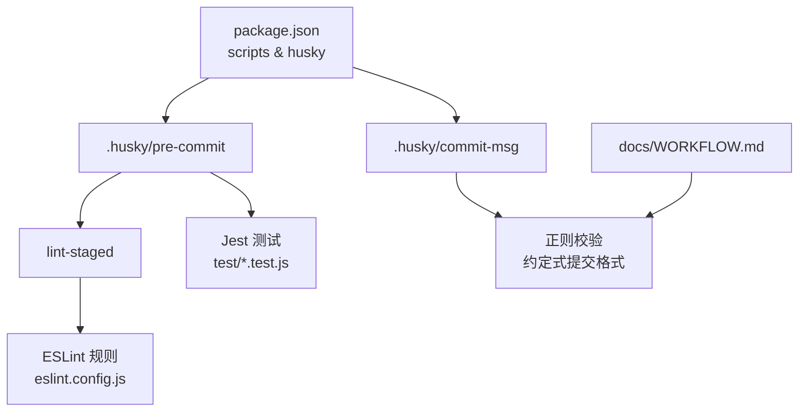
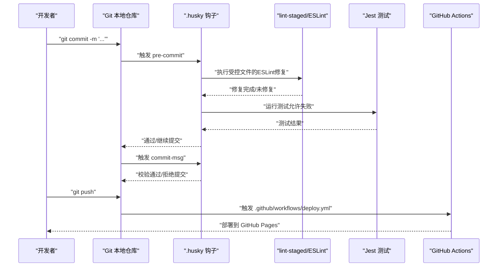
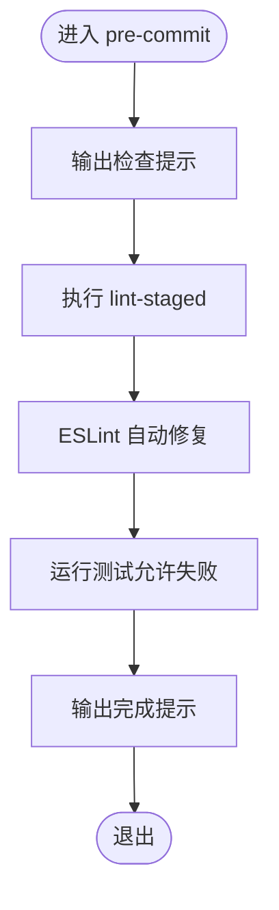
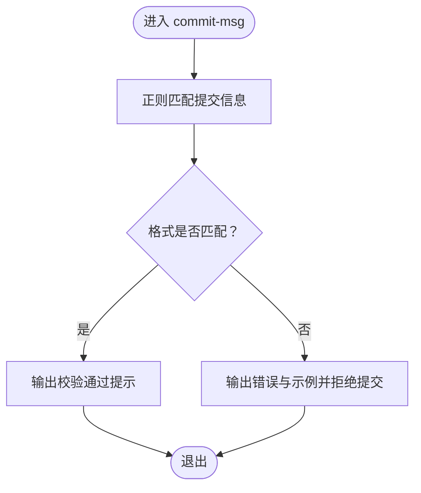
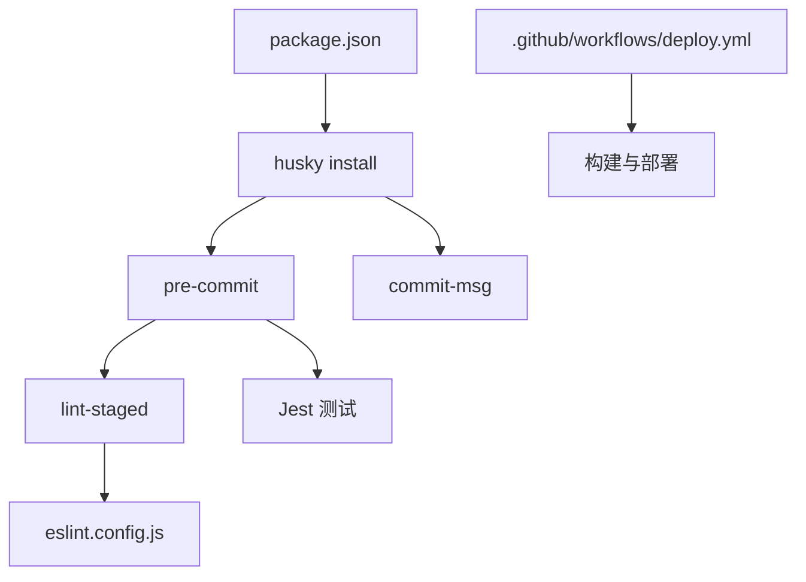

# Git钩子系统

<cite>
**本文引用的文件**   
- [.husky/pre-commit](file://.husky/pre-commit)
- [.husky/commit-msg](file://.husky/commit-msg)
- [package.json](file://package.json)
- [eslint.config.js](file://eslint.config.js)
- [test/content.test.js](file://test/content.test.js)
- [test/build.test.js](file://test/build.test.js)
- [.gitignore](file://.gitignore)
- [docs/WORKFLOW.md](file://docs/WORKFLOW.md)
- [docs/BRANCH_SEPARATION_GUIDE.md](file://docs/BRANCH_SEPARATION_GUIDE.md)
- [.github/workflows/deploy.yml](file://.github/workflows/deploy.yml)
- [tools/prepare-source-branch.js](file://tools/prepare-source-branch.js)
- [tools/safe-branch-setup.js](file://tools/safe-branch-setup.js)
- [tools/safe-deploy.js](file://tools/safe-deploy.js)
</cite>

## 目录
1. [简介](#简介)
2. [项目结构](#项目结构)
3. [核心组件](#核心组件)
4. [架构概览](#架构概览)
5. [详细组件分析](#详细组件分析)
6. [依赖关系分析](#依赖关系分析)
7. [性能考虑](#性能考虑)
8. [故障排查指南](#故障排查指南)
9. [结论](#结论)
10. [附录](#附录)

## 简介
本文件系统性阐述本仓库的Git钩子体系，重点覆盖.husky/目录下的pre-commit与commit-msg钩子，说明其在代码检查、自动格式化与提交信息规范化方面的职责；同时结合package.json中的脚本与lint-staged配置，解释husky的安装与钩子脚本的定制方式。文档还提供基于仓库现有工作流的Git最佳实践、常见问题的解决方案以及性能优化建议。

## 项目结构
.husky/目录包含两个关键钩子：
- pre-commit：在提交前执行代码检查与测试，并尝试对受控文件进行自动格式化。
- commit-msg：在提交信息提交时进行格式校验，确保遵循约定式提交规范。

此外，package.json中定义了husky安装脚本与lint-staged规则，配合ESLint配置实现增量检查与自动修复。

**图表来源**
- [.husky/pre-commit](file://.husky/pre-commit#L1-L10)
- [.husky/commit-msg](file://.husky/commit-msg#L1-L15)
- [package.json](file://package.json#L32-L40)
- [eslint.config.js](file://eslint.config.js#L1-L64)
- [test/content.test.js](file://test/content.test.js#L1-L109)
- [test/build.test.js](file://test/build.test.js#L1-L71)
- [docs/WORKFLOW.md](file://docs/WORKFLOW.md#L107-L127)

**章节来源**
- [.husky/pre-commit](file://.husky/pre-commit#L1-L10)
- [.husky/commit-msg](file://.husky/commit-msg#L1-L15)
- [package.json](file://package.json#L32-L40)
- [eslint.config.js](file://eslint.config.js#L1-L64)
- [docs/WORKFLOW.md](file://docs/WORKFLOW.md#L107-L127)

## 核心组件
- pre-commit钩子
  - 作用：在本地提交前运行lint-staged，对受控文件执行ESLint自动修复；随后运行测试（当前脚本允许失败但继续提交）。
  - 关键点：ESLint规则由eslint.config.js集中定义；lint-staged在package.json中声明对特定文件类型执行修复。
- commit-msg钩子
  - 作用：对提交信息进行正则校验，要求遵循“类型(scope): 描述”的格式，类型限定为feat、fix、docs、style、refactor、test、chore之一，且描述长度不超过50字符。
- husky安装与配置
  - 通过package.json中的prepare脚本初始化.husky/目录，确保钩子被激活。
  - lint-staged与ESLint联动，实现按需检查与修复，减少提交阻塞。

**章节来源**
- [.husky/pre-commit](file://.husky/pre-commit#L1-L10)
- [.husky/commit-msg](file://.husky/commit-msg#L1-L15)
- [package.json](file://package.json#L32-L40)
- [eslint.config.js](file://eslint.config.js#L1-L64)

## 架构概览
下图展示从开发者本地提交到CI/CD流水线的整体流程，突出pre-commit与commit-msg在本地质量门禁的作用，以及后续GitHub Actions的部署流程。

**图表来源**
- [.husky/pre-commit](file://.husky/pre-commit#L1-L10)
- [.husky/commit-msg](file://.husky/commit-msg#L1-L15)
- [.github/workflows/deploy.yml](file://.github/workflows/deploy.yml#L1-L87)

**章节来源**
- [.husky/pre-commit](file://.husky/pre-commit#L1-L10)
- [.husky/commit-msg](file://.husky/commit-msg#L1-L15)
- [.github/workflows/deploy.yml](file://.github/workflows/deploy.yml#L1-L87)

## 详细组件分析

### pre-commit 钩子分析
- 执行逻辑
  - 输出提示信息，表明正在运行本地检查。
  - 调用lint-staged，对受控文件执行ESLint修复。
  - 运行测试（当前脚本允许失败但继续提交）。
  - 输出完成提示。
- 与ESLint/lint-staged的协作
  - package.json中的lint-staged配置指向eslint --fix，针对特定文件类型执行修复。
  - eslint.config.js集中定义规则，包括缩进、引号、分号等基础规范，并为测试文件设置专用全局变量。
- 与测试的关系
  - 测试脚本由package.json中的test字段定义，覆盖工具脚本与内容校验。
  - pre-commit阶段的测试失败不会阻止提交，但建议在本地修复以保持提交质量。

**图表来源**
- [.husky/pre-commit](file://.husky/pre-commit#L1-L10)
- [package.json](file://package.json#L88-L92)
- [eslint.config.js](file://eslint.config.js#L25-L31)
- [test/content.test.js](file://test/content.test.js#L1-L109)
- [test/build.test.js](file://test/build.test.js#L1-L71)

**章节来源**
- [.husky/pre-commit](file://.husky/pre-commit#L1-L10)
- [package.json](file://package.json#L88-L92)
- [eslint.config.js](file://eslint.config.js#L25-L31)
- [test/content.test.js](file://test/content.test.js#L1-L109)
- [test/build.test.js](file://test/build.test.js#L1-L71)

### commit-msg 钩子分析
- 校验目标
  - 确保提交信息符合“类型(scope): 描述”的格式。
  - 类型限定为feat、fix、docs、style、refactor、test、chore。
  - 描述长度不超过50字符。
- 正则匹配
  - 使用正则表达式对提交信息进行严格匹配，若不满足则拒绝提交并输出格式示例。
- 与工作流文档的协同
  - docs/WORKFLOW.md提供了约定式提交的详细示例与格式说明，保证团队一致的提交规范。

**图表来源**
- [.husky/commit-msg](file://.husky/commit-msg#L1-L15)
- [docs/WORKFLOW.md](file://docs/WORKFLOW.md#L107-L127)

**章节来源**
- [.husky/commit-msg](file://.husky/commit-msg#L1-L15)
- [docs/WORKFLOW.md](file://docs/WORKFLOW.md#L107-L127)

### husky 安装与钩子脚本定制
- 安装方式
  - 通过package.json中的prepare脚本执行husky install，确保.husky/目录被初始化并激活钩子。
- 钩子脚本定制
  - pre-commit与commit-msg分别放置于.husky/目录下，可按需扩展检查项（如新增lint规则、测试用例或额外的提交前校验）。
  - 通过lint-staged与ESLint规则的组合，实现按文件类型与变更范围的精准检查。

**章节来源**
- [package.json](file://package.json#L39-L40)
- [.husky/pre-commit](file://.husky/pre-commit#L1-L10)
- [.husky/commit-msg](file://.husky/commit-msg#L1-L15)

### Git 工作流最佳实践
- 分支策略
  - master/develop主干分支用于生产与开发集成；feature/*、fix/*、docs/*、style/*、refactor/*、test/*、chore/*等用于功能开发与维护。
- 提交规范
  - 采用约定式提交，类型与示例详见docs/WORKFLOW.md。
- 测试与验证
  - 本地pre-commit阶段运行ESLint修复与测试；CI阶段进一步验证构建与部署。
- 部署流程
  - 推送至master/develop触发GitHub Actions工作流，自动构建并部署到gh-pages分支（生产环境）或进行阶段性验证。

**章节来源**
- [docs/WORKFLOW.md](file://docs/WORKFLOW.md#L1-L163)
- [.github/workflows/deploy.yml](file://.github/workflows/deploy.yml#L1-L87)

## 依赖关系分析
- 钩子与工具链
  - pre-commit依赖lint-staged与ESLint规则；测试依赖Jest与测试用例。
  - commit-msg依赖正则表达式与约定式提交规范。
- 配置耦合
  - package.json中的lint-staged与prepare脚本与.husky钩子紧密耦合。
  - eslint.config.js集中定义规则，影响pre-commit阶段的修复行为。
- CI/CD集成
  - .github/workflows/deploy.yml在推送时触发，与本地钩子形成互补的质量门禁。

**图表来源**
- [package.json](file://package.json#L32-L40)
- [.husky/pre-commit](file://.husky/pre-commit#L1-L10)
- [.husky/commit-msg](file://.husky/commit-msg#L1-L15)
- [eslint.config.js](file://eslint.config.js#L1-L64)
- [.github/workflows/deploy.yml](file://.github/workflows/deploy.yml#L1-L87)

**章节来源**
- [package.json](file://package.json#L32-L40)
- [.husky/pre-commit](file://.husky/pre-commit#L1-L10)
- [.husky/commit-msg](file://.husky/commit-msg#L1-L15)
- [eslint.config.js](file://eslint.config.js#L1-L64)
- [.github/workflows/deploy.yml](file://.github/workflows/deploy.yml#L1-L87)

## 性能考虑
- 本地检查粒度
  - 通过lint-staged仅对受控文件执行ESLint修复，避免全量扫描带来的性能开销。
- 测试策略
  - pre-commit阶段允许测试失败继续提交，降低本地提交阻塞；CI阶段再进行严格验证，平衡效率与质量。
- 规则复杂度
  - eslint.config.js的规则应保持简洁高效，避免过于复杂的规则导致修复耗时增加。
- CI并发
  - GitHub Actions工作流在ubuntu-latest环境中运行，建议合理拆分任务，避免单步过长。

[本节为通用性能建议，不直接分析具体文件]

## 故障排查指南
- 提交被拒绝（commit-msg）
  - 现象：提交信息不符合“类型(scope): 描述”格式或描述超过50字符。
  - 处理：根据错误提示修正提交信息，参考docs/WORKFLOW.md中的示例。
- 本地测试失败但继续提交
  - 现象：pre-commit阶段测试失败，但脚本允许继续提交。
  - 处理：建议在本地修复测试问题，确保提交质量。
- husky未生效
  - 现象：钩子未触发。
  - 处理：确认package.json中的prepare脚本已执行；检查.husky/目录是否存在且权限正确。
- CI部署异常
  - 现象：GitHub Actions构建失败或部署未触发。
  - 处理：检查工作流触发分支、Node版本与依赖安装；查看日志定位具体失败步骤。

**章节来源**
- [.husky/commit-msg](file://.husky/commit-msg#L1-L15)
- [.husky/pre-commit](file://.husky/pre-commit#L1-L10)
- [package.json](file://package.json#L39-L40)
- [.github/workflows/deploy.yml](file://.github/workflows/deploy.yml#L1-L87)

## 结论
本仓库通过.husky/目录下的pre-commit与commit-msg钩子，结合lint-staged与ESLint规则，在本地实现了高效的代码检查与格式化；配合Jest测试与GitHub Actions工作流，形成了从本地到云端的完整质量门禁。遵循约定式提交与既定分支策略，有助于提升团队协作效率与发布稳定性。

[本节为总结性内容，不直接分析具体文件]

## 附录
- 常用命令
  - 安装husky：npm run prepare
  - 运行ESLint：npm run lint
  - 运行测试：npm test
  - 预览模式（分支设置/部署）：npm run setup:preview 或 npm run deploy:preview
- 相关文档
  - Git工作流与提交规范：docs/WORKFLOW.md
  - 源码与部署分支分离指南：docs/BRANCH_SEPARATION_GUIDE.md
  - GitHub Actions部署工作流：.github/workflows/deploy.yml

**章节来源**
- [docs/WORKFLOW.md](file://docs/WORKFLOW.md#L1-L163)
- [docs/BRANCH_SEPARATION_GUIDE.md](file://docs/BRANCH_SEPARATION_GUIDE.md#L1-L283)
- [.github/workflows/deploy.yml](file://.github/workflows/deploy.yml#L1-L87)