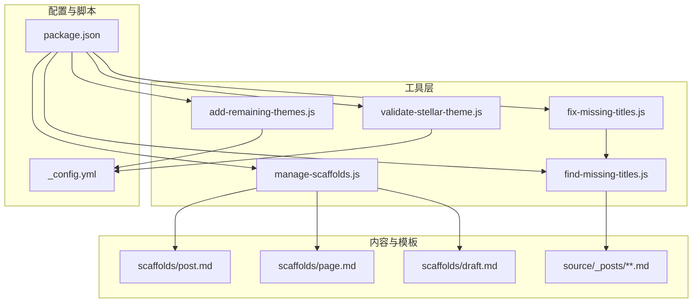
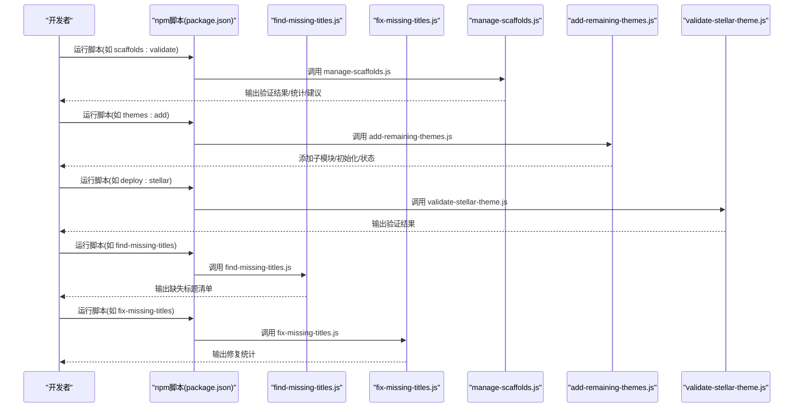
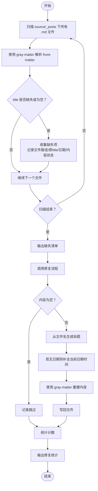
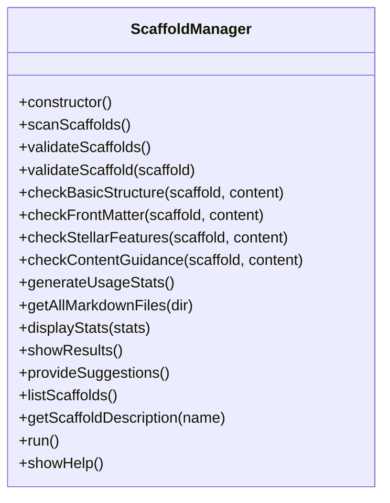
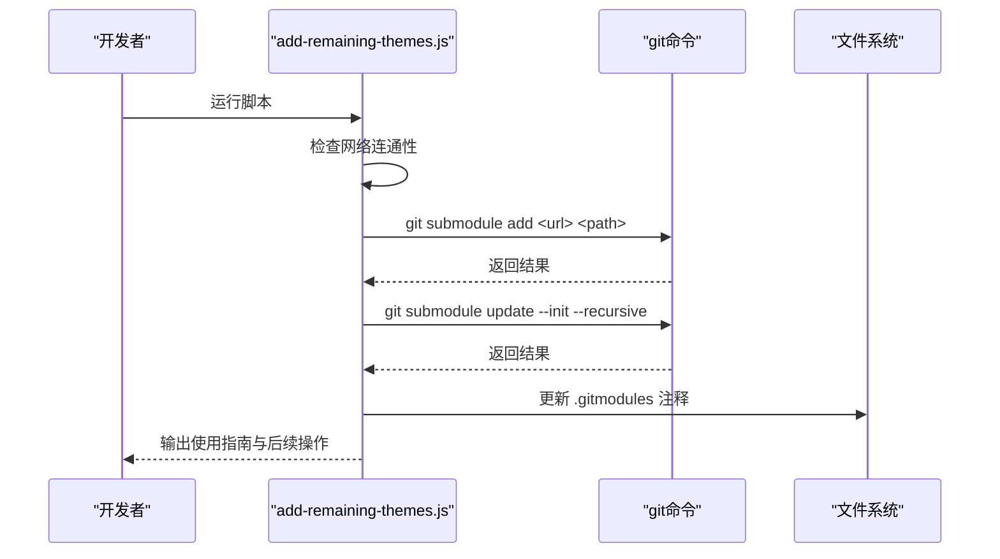
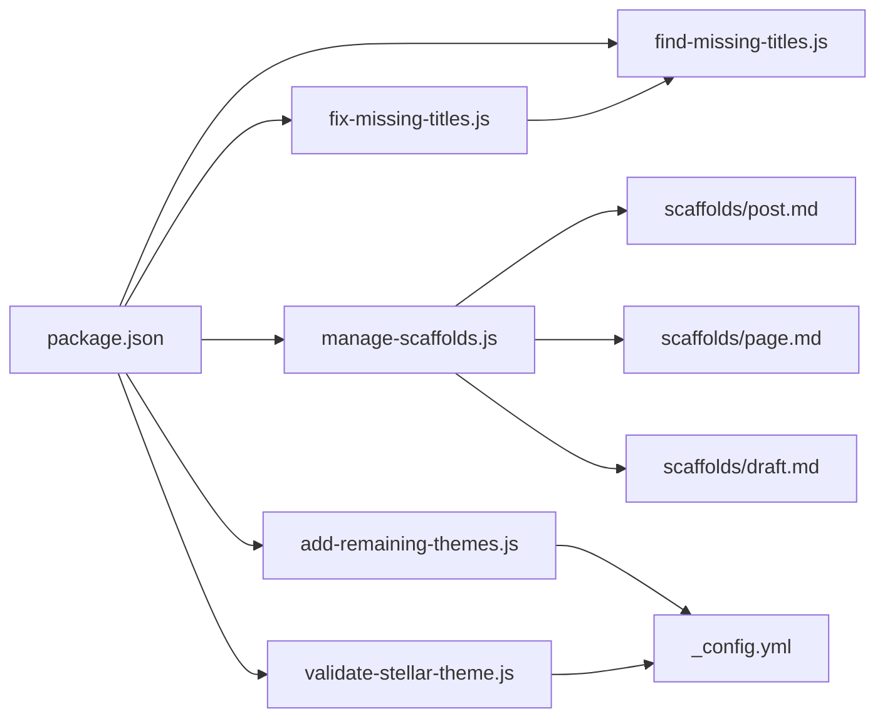

# 内容管理工具

<cite>
**本文引用的文件**
- [find-missing-titles.js](file://tools/find-missing-titles.js)
- [fix-missing-titles.js](file://tools/fix-missing-titles.js)
- [manage-scaffolds.js](file://tools/manage-scaffolds.js)
- [add-remaining-themes.js](file://tools/add-remaining-themes.js)
- [validate-stellar-theme.js](file://tools/validate-stellar-theme.js)
- [package.json](file://package.json)
- [post.md](file://scaffolds/post.md)
- [page.md](file://scaffolds/page.md)
- [draft.md](file://scaffolds/draft.md)
- [_config.yml](file://_config.yml)
- [WORKFLOW.md](file://docs/WORKFLOW.md)
- [SCAFFOLDS_UPDATE_SUMMARY.md](file://SCAFFOLDS_UPDATE_SUMMARY.md)
</cite>

## 目录
1. [简介](#简介)
2. [项目结构](#项目结构)
3. [核心组件](#核心组件)
4. [架构总览](#架构总览)
5. [组件详解](#组件详解)
6. [依赖关系分析](#依赖关系分析)
7. [性能考量](#性能考量)
8. [故障排查指南](#故障排查指南)
9. [结论](#结论)
10. [附录](#附录)

## 简介
本文件面向内容创作者与维护者，系统化介绍本仓库中的内容管理工具链，重点覆盖：
- 标题缺失检测与批量修复：find-missing-titles.js 与 fix-missing-titles.js 的标题自动检测与智能修复机制
- 模板管理：manage-scaffolds.js 的模板验证、统计与优化建议
- 主题添加：add-remaining-themes.js 的主题子模块添加、网络检查与自动配置
- 最佳实践：命名规范、模板使用指南、批量处理技巧
- 实战示例与常见问题解决方案

## 项目结构
本项目采用“Hexo + 多主题 + 工具脚本”的组织方式：
- tools 目录存放各类内容管理与主题管理脚本
- scaffolds 目录存放 Hexo scaffold 模板
- themes 目录存放主题源码（部分为主题子模块）
- package.json 定义 npm 脚本与依赖
- docs 提供工作流与部署指南
- _config.yml 与 _config_stellar.yml 等配置文件支撑主题与站点行为

图表来源
- [find-missing-titles.js](file://tools/find-missing-titles.js#L1-L81)
- [fix-missing-titles.js](file://tools/fix-missing-titles.js#L1-L92)
- [manage-scaffolds.js](file://tools/manage-scaffolds.js#L1-L517)
- [add-remaining-themes.js](file://tools/add-remaining-themes.js#L1-L306)
- [validate-stellar-theme.js](file://tools/validate-stellar-theme.js#L1-L313)
- [package.json](file://package.json#L1-L94)
- [post.md](file://scaffolds/post.md#L1-L77)
- [page.md](file://scaffolds/page.md#L1-L57)
- [draft.md](file://scaffolds/draft.md#L1-L48)
- [_config.yml](file://_config.yml#L1-L136)

章节来源
- [package.json](file://package.json#L1-L94)

## 核心组件
- 标题缺失检测与修复：基于 gray-matter 解析 Markdown front-matter，遍历 source/_posts 下所有 .md 文件，识别缺少 title 或空 title 的条目；随后智能生成标题并补全日期，批量写回。
- 模板管理：扫描 scaffolds 目录，验证模板结构、front-matter 字段、Stellar 主题特性与内容指导；生成内容使用统计；提供优化建议与使用说明。
- 主题添加：检查网络连通性，添加 AnZhiYu 与 Stellar 主题子模块，初始化子模块，更新 .gitmodules 注释，提供主题切换与配置指引。
- 主题配置验证：验证主配置与 Stellar 配置文件，检查主题文件存在性与依赖包，输出汇总结果。

章节来源
- [find-missing-titles.js](file://tools/find-missing-titles.js#L1-L81)
- [fix-missing-titles.js](file://tools/fix-missing-titles.js#L1-L92)
- [manage-scaffolds.js](file://tools/manage-scaffolds.js#L1-L517)
- [add-remaining-themes.js](file://tools/add-remaining-themes.js#L1-L306)
- [validate-stellar-theme.js](file://tools/validate-stellar-theme.js#L1-L313)

## 架构总览
工具链围绕“内容 -> 模板 -> 配置 -> 构建/部署”的闭环工作流展开。开发者通过 npm 脚本调用各工具，实现标题治理、模板治理与主题治理的自动化。

图表来源
- [package.json](file://package.json#L5-L39)
- [find-missing-titles.js](file://tools/find-missing-titles.js#L77-L81)
- [fix-missing-titles.js](file://tools/fix-missing-titles.js#L88-L92)
- [manage-scaffolds.js](file://tools/manage-scaffolds.js#L436-L498)
- [add-remaining-themes.js](file://tools/add-remaining-themes.js#L240-L279)
- [validate-stellar-theme.js](file://tools/validate-stellar-theme.js#L22-L45)

## 组件详解

### 标题缺失检测与修复（find-missing-titles.js 与 fix-missing-titles.js）
- 功能目标
  - 自动扫描 source/_posts 下所有 Markdown 文件
  - 识别缺少 title 或 title 为空的条目
  - 输出清单，包含文件路径、原始 title、日期与内容是否为空
  - 为后续批量修复提供数据源
- 智能修复
  - 从文件名生成标题（移除连字符与下划线，首字母大写）
  - 若无日期则自动补全当前日期时间
  - 使用 gray-matter 重建 front-matter 与正文，写回文件
  - 跳过空内容文件，避免误伤
- 批量修复流程
  - 通过 require('./find-missing-titles') 复用检测结果
  - 逐条修复并统计成功/跳过/失败数量

图表来源
- [find-missing-titles.js](file://tools/find-missing-titles.js#L31-L75)
- [fix-missing-titles.js](file://tools/fix-missing-titles.js#L29-L86)

章节来源
- [find-missing-titles.js](file://tools/find-missing-titles.js#L1-L81)
- [fix-missing-titles.js](file://tools/fix-missing-titles.js#L1-L92)

### 模板管理（manage-scaffolds.js）
- 扫描与验证
  - 扫描 scaffolds 目录，列出所有 .md 模板
  - 验证基本结构（front-matter 标记）、front-matter 字段（按模板类型定义的必需字段）、Stellar 主题特性（layout/menu_id/leftbar/rightbar 等）与内容指导（注释与关键词）
- 统计与建议
  - 统计 _posts 下文章数量、按 layout 与 categories 分布、Stellar 特性使用比例
  - 提供优化建议与使用说明
- 命令行接口
  - validate/list/stats/all/help 等命令，支持 npm 脚本集成

图表来源
- [manage-scaffolds.js](file://tools/manage-scaffolds.js#L12-L498)

章节来源
- [manage-scaffolds.js](file://tools/manage-scaffolds.js#L1-L517)
- [post.md](file://scaffolds/post.md#L1-L77)
- [page.md](file://scaffolds/page.md#L1-L57)
- [draft.md](file://scaffolds/draft.md#L1-L48)

### 主题添加（add-remaining-themes.js）
- 网络检查
  - 逐一尝试连接 AnZhiYu 与 Stellar 主题仓库，确保网络稳定
- 子模块管理
  - 检查目标路径是否存在，避免重复添加
  - 使用 git submodule add 添加子模块
  - 初始化子模块：git submodule update --init --recursive
- 配置与注释
  - 更新 .gitmodules 文件注释，提供使用说明与主题列表
- 使用指南
  - 提供子模块管理命令、主题切换方法与配置文件位置

图表来源
- [add-remaining-themes.js](file://tools/add-remaining-themes.js#L50-L151)
- [add-remaining-themes.js](file://tools/add-remaining-themes.js#L166-L235)

章节来源
- [add-remaining-themes.js](file://tools/add-remaining-themes.js#L1-L306)

### 主题配置验证（validate-stellar-theme.js）
- 主配置验证：检查主题设置、必要字段、搜索配置等
- Stellar 配置验证：检查导航菜单、站点结构、搜索与评论服务、插件启用状态
- 主题文件与依赖：检查主题关键文件存在性与版本，检查 Hexo 与推荐依赖
- 结果汇总：输出错误、警告与信息，并给出结论

章节来源
- [validate-stellar-theme.js](file://tools/validate-stellar-theme.js#L1-L313)
- [_config.yml](file://_config.yml#L1-L136)

## 依赖关系分析
- npm 脚本作为统一入口，封装各工具的调用与参数传递
- 工具之间存在组合关系：fix-missing-titles.js 依赖 find-missing-titles.js 的检测结果
- 模板验证依赖 scaffolds 目录下的模板文件
- 主题添加依赖 Git 子模块机制与网络连通性
- 主题验证依赖配置文件与依赖包

图表来源
- [package.json](file://package.json#L5-L39)
- [find-missing-titles.js](file://tools/find-missing-titles.js#L30-L31)
- [fix-missing-titles.js](file://tools/fix-missing-titles.js#L30-L31)
- [manage-scaffolds.js](file://tools/manage-scaffolds.js#L15-L16)
- [add-remaining-themes.js](file://tools/add-remaining-themes.js#L14-L28)
- [validate-stellar-theme.js](file://tools/validate-stellar-theme.js#L50-L56)

章节来源
- [package.json](file://package.json#L1-L94)

## 性能考量
- 文件扫描复杂度
  - find-missing-titles.js 与 manage-scaffolds.js 均采用递归遍历目录，时间复杂度近似 O(N)，其中 N 为 .md 文件总数
  - 对于大型仓库，建议在 CI 中限制扫描范围或分批执行
- I/O 与内存
  - 逐文件读取与解析 front-matter，注意磁盘 I/O 与内存占用
  - 建议在本地开发时仅对变更文件执行修复，或在 CI 中并行化处理
- 网络检查
  - add-remaining-themes.js 的网络检查为串行，可考虑并发优化，但需注意网络限速与稳定性

[本节为通用性能建议，不直接分析具体文件]

## 故障排查指南
- 标题缺失检测无结果
  - 确认 source/_posts 目录存在且包含 .md 文件
  - 检查文件编码是否为 UTF-8
- 修复失败
  - 检查文件是否被锁定或权限不足
  - 确认 gray-matter 正常安装
- 模板验证失败
  - 检查 scaffolds 目录结构与 front-matter 格式
  - 确认 js-yaml 依赖可用
- 主题添加失败
  - 检查网络连通性与 Git 凭据
  - 确认目标路径未被占用
- 主题配置验证错误
  - 检查 _config.yml 与 _config_stellar.yml 的 YAML 语法
  - 确认主题目录存在且关键文件齐全

章节来源
- [find-missing-titles.js](file://tools/find-missing-titles.js#L53-L55)
- [fix-missing-titles.js](file://tools/fix-missing-titles.js#L77-L79)
- [manage-scaffolds.js](file://tools/manage-scaffolds.js#L86-L88)
- [add-remaining-themes.js](file://tools/add-remaining-themes.js#L43-L47)
- [validate-stellar-theme.js](file://tools/validate-stellar-theme.js#L86-L88)

## 结论
本工具链为 Hexo + Stellar 主题提供了从内容治理到模板治理再到主题治理的完整自动化方案。通过标题缺失检测与修复、模板验证与统计、主题子模块添加与配置验证，显著提升了内容创作与维护效率。建议在团队内推广使用 npm 脚本与 CI 流程，持续保持模板与配置的健康状态。

[本节为总结性内容，不直接分析具体文件]

## 附录

### 实际使用示例
- 标题缺失检测
  - 运行：node tools/find-missing-titles.js
  - 输出：缺失标题清单与统计
- 标题修复
  - 运行：node tools/fix-missing-titles.js
  - 输出：修复统计（成功/跳过/失败）
- 模板验证
  - 运行：npm run scaffolds:validate
  - 输出：验证结果与优化建议
- 模板统计
  - 运行：npm run scaffolds:stats
  - 输出：内容使用统计
- 添加主题子模块
  - 运行：npm run themes:add
  - 输出：添加结果与后续操作提示
- 主题配置验证
  - 运行：npm run stellar:validate
  - 输出：验证汇总与建议

章节来源
- [package.json](file://package.json#L26-L29)
- [package.json](file://package.json#L17-L21)
- [package.json](file://package.json#L22-L23)
- [SCAFFOLDS_UPDATE_SUMMARY.md](file://SCAFFOLDS_UPDATE_SUMMARY.md#L65-L95)

### 最佳实践
- 文章命名规范
  - 建议使用语义化文件名，便于自动生成标题与 SEO
  - 避免使用特殊字符，保留英文、数字与连字符/下划线
- 模板使用指南
  - 使用 hexo new <type> "标题" 创建文章，确保 front-matter 字段完整
  - 定期运行 npm run scaffolds:validate 与 npm run scaffolds:stats
- 批量处理技巧
  - 在 CI 中先执行 find-missing-titles，再执行 fix-missing-titles
  - 对大型仓库分批扫描，避免一次性处理过多文件
- 主题切换与配置
  - 在 _config.yml 中修改 theme 字段
  - 使用 npm run themes:init 初始化子模块
  - 运行 npm run stellar:validate 确认配置正确

章节来源
- [WORKFLOW.md](file://docs/WORKFLOW.md#L107-L127)
- [SCAFFOLDS_UPDATE_SUMMARY.md](file://SCAFFOLDS_UPDATE_SUMMARY.md#L65-L95)
- [_config.yml](file://_config.yml#L104-L104)