# 开发工具

<cite>
**本文引用的文件**
- [tools/check-links.js](file://tools/check-links.js)
- [tools/check-workflows.js](file://tools/check-workflows.js)
- [tools/deploy.js](file://tools/deploy.js)
- [tools/find-missing-titles.js](file://tools/find-missing-titles.js)
- [tools/fix-missing-titles.js](file://tools/fix-missing-titles.js)
- [tools/safe-deploy.js](file://tools/safe-deploy.js)
- [tools/validate-stellar-theme.js](file://tools/validate-stellar-theme.js)
- [eslint.config.js](file://eslint.config.js)
- [package.json](file://package.json)
- [test/build.test.js](file://test/build.test.js)
- [test/content.test.js](file://test/content.test.js)
- [.husky/commit-msg](file://.husky/commit-msg)
- [.husky/pre-commit](file://.husky/pre-commit)
- [.github/dependabot.yml](file://.github/dependabot.yml)
</cite>

## 目录
1. [简介](#简介)
2. [项目结构](#项目结构)
3. [核心组件](#核心组件)
4. [架构概览](#架构概览)
5. [详细组件分析](#详细组件分析)
6. [依赖关系分析](#依赖关系分析)
7. [性能考虑](#性能考虑)
8. [故障排除指南](#故障排除指南)
9. [结论](#结论)
10. [附录](#附录)

## 简介
本文件系统性梳理 H1S97X 博客开发工具链，覆盖验证工具、测试工具、质量检查工具与 Git 钩子系统。内容包括：
- 工具脚本的执行流程与配置选项（命令行参数、环境变量、输出格式）
- 代码质量保证机制（ESLint 配置、Jest 测试框架、链接检查工具）
- Git 钩子设置与使用（pre-commit 与 commit-msg 钩子）
- 开发工作流最佳实践（代码规范、提交规范、版本控制策略）
- 实际使用示例与故障排除指南

## 项目结构
该仓库采用“主题驱动 + 工具脚本 + 测试 + Git 钩子”的组织方式：
- tools：核心开发工具集合，涵盖主题验证、部署、链接检查、工作流检查等
- test：Jest 测试套件，覆盖构建产物与内容校验
- .husky：Git 钩子（pre-commit、commit-msg）
- eslint.config.js：ESLint 配置
- package.json：脚本与依赖声明，集成 Husky、Jest、ESLint、lint-staged
- .github：CI/CD 相关配置（如 Dependabot）

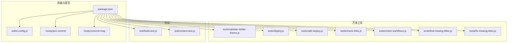

**图表来源**
- [tools/validate-stellar-theme.js](file://tools/validate-stellar-theme.js#L1-L313)
- [tools/deploy.js](file://tools/deploy.js#L1-L472)
- [tools/safe-deploy.js](file://tools/safe-deploy.js#L1-L352)
- [tools/check-links.js](file://tools/check-links.js#L1-L133)
- [tools/check-workflows.js](file://tools/check-workflows.js#L1-L315)
- [tools/find-missing-titles.js](file://tools/find-missing-titles.js#L1-L81)
- [tools/fix-missing-titles.js](file://tools/fix-missing-titles.js#L1-L92)
- [test/build.test.js](file://test/build.test.js#L1-L71)
- [test/content.test.js](file://test/content.test.js#L1-L109)
- [eslint.config.js](file://eslint.config.js#L1-L64)
- [package.json](file://package.json#L1-L94)
- [.husky/pre-commit](file://.husky/pre-commit)
- [.husky/commit-msg](file://.husky/commit-msg)

**章节来源**
- [package.json](file://package.json#L1-L94)

## 核心组件
- 主题验证工具：验证主配置与 Stellar 主题配置、主题文件存在性、依赖包状态
- 部署工具：自动构建、校验、切换分支、推送至 gh-pages 的完整流程
- 安全部署工具：强调“保护源码、保留历史、支持回滚”的安全部署流程
- 链接检查工具：扫描 Markdown 外部链接与内部相对链接，输出问题清单
- 工作流检查工具：验证 GitHub Actions 工作流对 Stellar 主题的支持
- 标题修复工具：批量修复缺失标题与日期的 Markdown 文件
- 质量检查工具：ESLint 规则与忽略规则；Jest 测试用例与覆盖率收集
- Git 钩子：pre-commit 自动执行验证与 Lint；commit-msg 校验提交信息格式

**章节来源**
- [tools/validate-stellar-theme.js](file://tools/validate-stellar-theme.js#L1-L313)
- [tools/deploy.js](file://tools/deploy.js#L1-L472)
- [tools/safe-deploy.js](file://tools/safe-deploy.js#L1-L352)
- [tools/check-links.js](file://tools/check-links.js#L1-L133)
- [tools/check-workflows.js](file://tools/check-workflows.js#L1-L315)
- [tools/find-missing-titles.js](file://tools/find-missing-titles.js#L1-L81)
- [tools/fix-missing-titles.js](file://tools/fix-missing-titles.js#L1-L92)
- [eslint.config.js](file://eslint.config.js#L1-L64)
- [package.json](file://package.json#L1-L94)

## 架构概览
开发工具链围绕 npm 脚本与 Node 工具脚本协同工作，形成“验证—构建—部署—检查”的闭环。

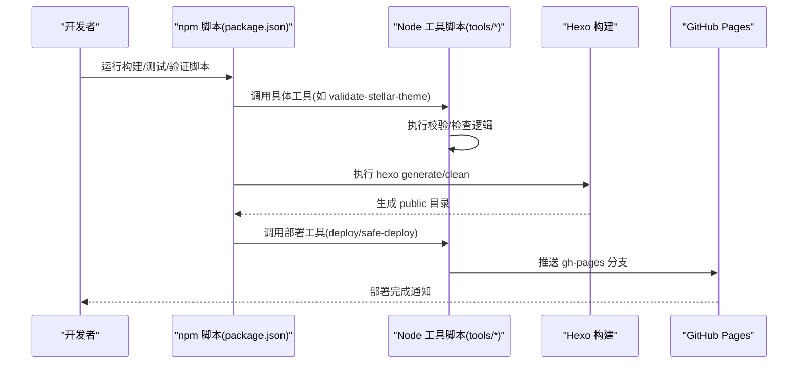

**图表来源**
- [package.json](file://package.json#L5-L41)
- [tools/deploy.js](file://tools/deploy.js#L383-L418)
- [tools/safe-deploy.js](file://tools/safe-deploy.js#L291-L340)

## 详细组件分析

### 主题验证工具
- 功能：校验主配置与 Stellar 配置、主题文件存在性、依赖包状态
- 关键流程：
  - 读取并解析主配置与 Stellar 配置
  - 校验主题设置、导航菜单、站点结构、搜索与评论配置
  - 校验主题关键文件与版本
  - 校验 Hexo 与推荐依赖
- 输出：错误、警告、信息汇总，错误时终止流程

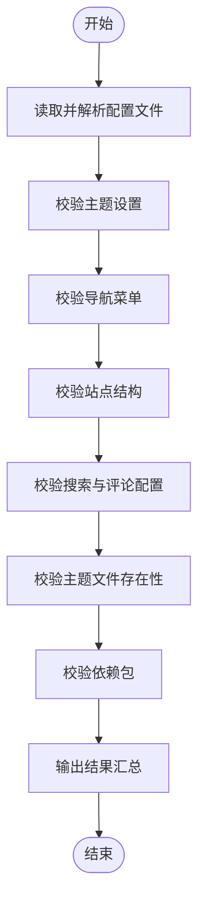

**图表来源**
- [tools/validate-stellar-theme.js](file://tools/validate-stellar-theme.js#L22-L296)

**章节来源**
- [tools/validate-stellar-theme.js](file://tools/validate-stellar-theme.js#L1-L313)

### 部署工具
- 功能：自动构建、校验、创建/更新 gh-pages 分支、推送并返回部署信息
- 关键流程：
  - 检查 Git 状态与远程仓库
  - 执行主题验证与子模块初始化
  - 清理并构建静态资源，验证关键文件
  - 创建或确认 gh-pages 分支，复制 public 内容
  - 提交并推送，切回原分支，输出部署信息

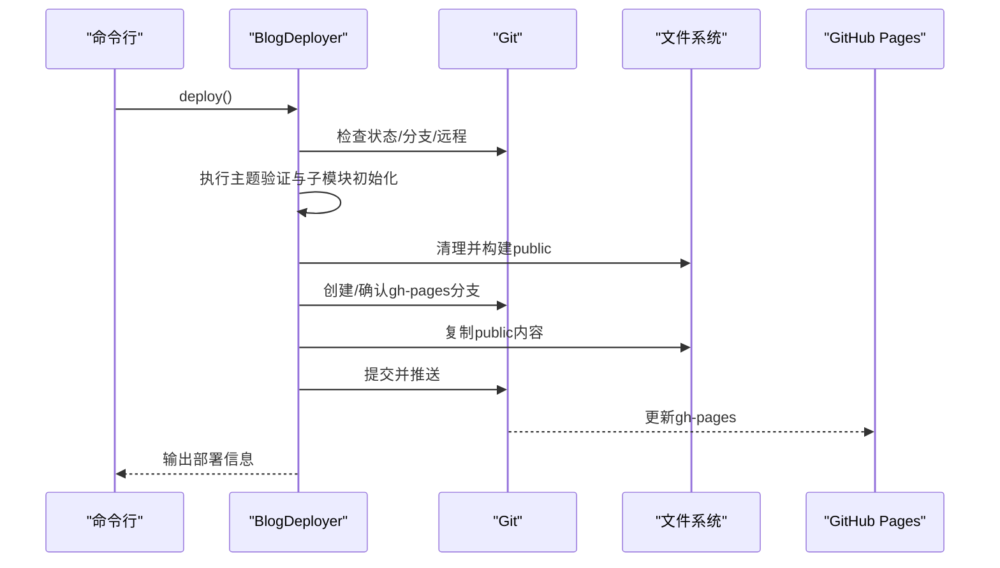

**图表来源**
- [tools/deploy.js](file://tools/deploy.js#L383-L418)

**章节来源**
- [tools/deploy.js](file://tools/deploy.js#L1-L472)

### 安全部署工具
- 安全原则：保护源码、只操作 public 目录、保留部署历史、支持回滚
- 关键流程：
  - 检查前置条件（分支、工作目录、public 目录、gh-pages 分支）
  - 构建网站并验证
  - 切换到 gh-pages，写入部署信息文件
  - 复制构建文件，提交并推送
  - 切回源码分支，生成部署报告

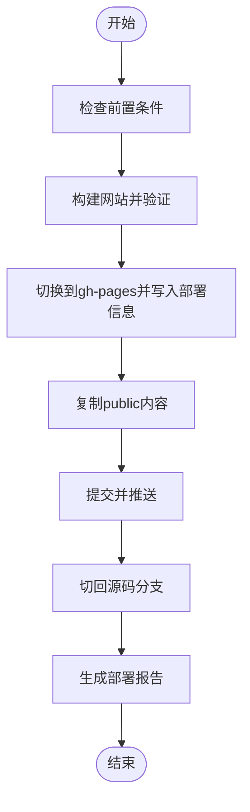

**图表来源**
- [tools/safe-deploy.js](file://tools/safe-deploy.js#L291-L340)

**章节来源**
- [tools/safe-deploy.js](file://tools/safe-deploy.js#L1-L352)

### 链接检查工具
- 功能：扫描 Markdown 外部链接与内部相对链接，输出问题清单
- 关键流程：
  - 遍历 source/_posts 下所有 Markdown 文件
  - 正则匹配 Markdown 链接
  - 跳过锚点与相对路径，仅检查外部链接
  - 并发/串行请求外部链接，记录失败链接
  - 输出问题列表（CI 模式不阻断构建）

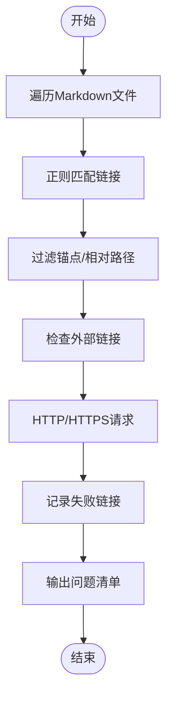

**图表来源**
- [tools/check-links.js](file://tools/check-links.js#L48-L125)

**章节来源**
- [tools/check-links.js](file://tools/check-links.js#L1-L133)

### 工作流检查工具
- 功能：检查 GitHub Actions 工作流对 Stellar 主题的支持，生成报告
- 关键流程：
  - 扫描 .github/workflows 下的 YAML 文件
  - 校验基础结构（name/on/jobs）、子模块支持、主题初始化、Stellar 验证
  - 检查 GitHub Pages 部署与构建步骤
  - 输出通过/警告/错误项与优化建议，可生成 JSON 报告

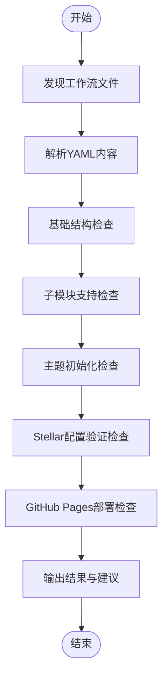

**图表来源**
- [tools/check-workflows.js](file://tools/check-workflows.js#L23-L190)

**章节来源**
- [tools/check-workflows.js](file://tools/check-workflows.js#L1-L315)

### 标题修复工具
- 功能：检测并修复缺失标题/日期的 Markdown 文件
- 关键流程：
  - 遍历 source/_posts 下 Markdown 文件
  - 使用 gray-matter 解析 front matter
  - 生成标题（基于文件名），必要时补全日期
  - 写回文件并输出修复统计

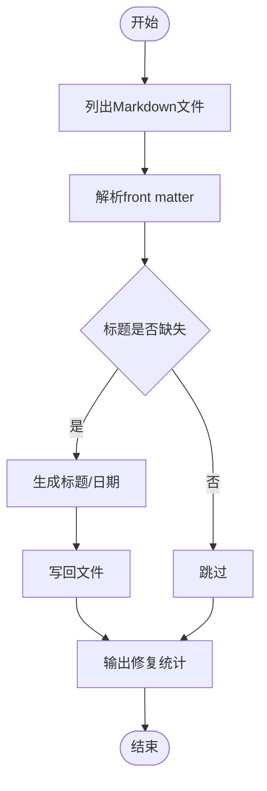

**图表来源**
- [tools/find-missing-titles.js](file://tools/find-missing-titles.js#L31-L75)
- [tools/fix-missing-titles.js](file://tools/fix-missing-titles.js#L29-L86)

**章节来源**
- [tools/find-missing-titles.js](file://tools/find-missing-titles.js#L1-L81)
- [tools/fix-missing-titles.js](file://tools/fix-missing-titles.js#L1-L92)

### 质量检查工具
- ESLint 配置：推荐规则、全局变量、缩进/引号/分号规范、测试文件专用全局
- Jest 测试：构建产物与内容校验，覆盖率收集范围限定
- lint-staged：暂存区 JS/JSON 自动修复

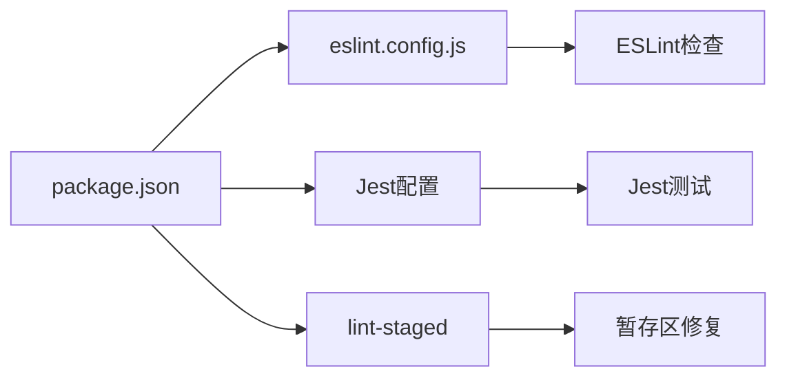

**图表来源**
- [eslint.config.js](file://eslint.config.js#L1-L64)
- [package.json](file://package.json#L78-L92)

**章节来源**
- [eslint.config.js](file://eslint.config.js#L1-L64)
- [package.json](file://package.json#L78-L92)
- [test/build.test.js](file://test/build.test.js#L1-L71)
- [test/content.test.js](file://test/content.test.js#L1-L109)

### Git 钩子系统
- pre-commit：安装 Husky 后自动执行，调用 npm run validate（即测试 + 链接检查）
- commit-msg：校验提交信息格式（需在 .husky/commit-msg 中实现）

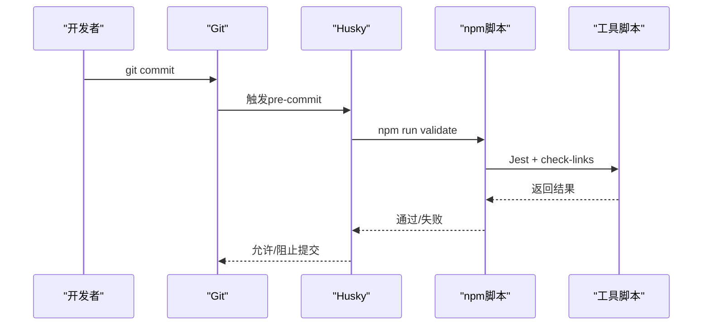

**图表来源**
- [package.json](file://package.json#L39-L40)
- [.husky/pre-commit](file://.husky/pre-commit)

**章节来源**
- [package.json](file://package.json#L39-L40)
- [.husky/pre-commit](file://.husky/pre-commit)
- [.husky/commit-msg](file://.husky/commit-msg)

## 依赖关系分析
- npm 脚本作为统一入口，串联各工具脚本与第三方工具（Hexo、Jest、ESLint、Husky）
- 工具脚本之间存在协作关系：标题修复依赖标题检测；部署工具依赖主题验证与构建
- 依赖注入：通过 package.json 的 scripts 字段集中管理命令行参数与执行顺序

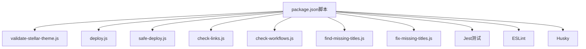

**图表来源**
- [package.json](file://package.json#L5-L41)
- [tools/validate-stellar-theme.js](file://tools/validate-stellar-theme.js#L1-L313)
- [tools/deploy.js](file://tools/deploy.js#L1-L472)
- [tools/safe-deploy.js](file://tools/safe-deploy.js#L1-L352)
- [tools/check-links.js](file://tools/check-links.js#L1-L133)
- [tools/check-workflows.js](file://tools/check-workflows.js#L1-L315)
- [tools/find-missing-titles.js](file://tools/find-missing-titles.js#L1-L81)
- [tools/fix-missing-titles.js](file://tools/fix-missing-titles.js#L1-L92)

**章节来源**
- [package.json](file://package.json#L1-L94)

## 性能考虑
- 链接检查：对每个外部链接发起独立请求，建议在 CI 中限制并发或缓存结果
- 部署流程：构建与复制为 CPU/IO 密集型，建议在 CI 中开启缓存与并行任务
- 测试：Jest 测试按需运行，建议使用 watch 模式提升迭代效率
- Lint：lint-staged 仅对暂存区文件处理，降低开销

## 故障排除指南
- 部署失败
  - 检查 gh-pages 分支是否存在与可推送
  - 确认 public 目录存在且包含关键文件（index.html、css、js、sitemap.xml、search.json）
  - 查看部署日志文件与部署报告
- 链接检查失败
  - 外链超时/不可达：调整超时或跳过特定域名
  - 内部相对链接：确认目标文件存在
- 工作流检查失败
  - 缺少触发条件、作业定义或子模块支持：根据建议修复
- ESLint/Jest 报错
  - 检查规则配置与忽略列表，确保测试文件命名与路径正确
- Git 钩子无效
  - 确认 Husky 已安装（npm run prepare），pre-commit 是否存在

**章节来源**
- [tools/deploy.js](file://tools/deploy.js#L133-L138)
- [tools/check-links.js](file://tools/check-links.js#L112-L124)
- [tools/check-workflows.js](file://tools/check-workflows.js#L217-L228)
- [package.json](file://package.json#L78-L92)
- [.husky/pre-commit](file://.husky/pre-commit)

## 结论
本工具链通过 npm 脚本统一调度，结合 Husky 钩子、ESLint 与 Jest，形成从开发到部署的自动化闭环。建议在团队内推广以下实践：
- 使用 npm run validate 作为提交前检查
- 使用 npm run stellar:test 进行主题与构建联调
- 使用 npm run deploy:preview 进行预演部署
- 定期运行工作流检查与链接检查，保持 CI 稳定

## 附录

### 常用命令与参数
- 验证与测试
  - npm run stellar:validate：主题配置验证
  - npm run test / test:watch / test:coverage：Jest 测试
  - npm run lint / lint:fix：ESLint 检查与修复
  - npm run validate：组合测试与链接检查
- 构建与部署
  - npm run build / build:test / build:staging：构建命令
  - npm run deploy / deploy:preview / deploy:manual：部署命令
  - npm run deploy:stellar：主题验证 + 清理 + 构建 + 部署
- 工具脚本
  - node tools/check-workflows.js [--report]：工作流检查与报告
  - node tools/check-links.js：链接检查
  - node tools/find-missing-titles.js：检测缺失标题
  - node tools/fix-missing-titles.js：修复缺失标题
  - node tools/validate-stellar-theme.js：主题验证
  - node tools/deploy.js [--dry-run]：部署
  - node tools/safe-deploy.js [--dry-run | --force]：安全部署

**章节来源**
- [package.json](file://package.json#L5-L41)
- [tools/check-workflows.js](file://tools/check-workflows.js#L283-L308)
- [tools/deploy.js](file://tools/deploy.js#L453-L462)
- [tools/safe-deploy.js](file://tools/safe-deploy.js#L291-L340)