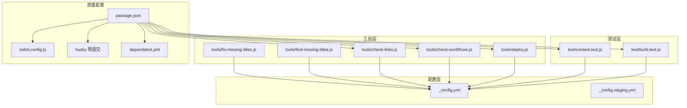
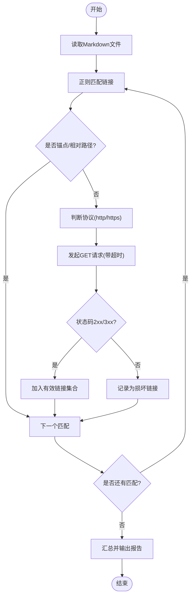
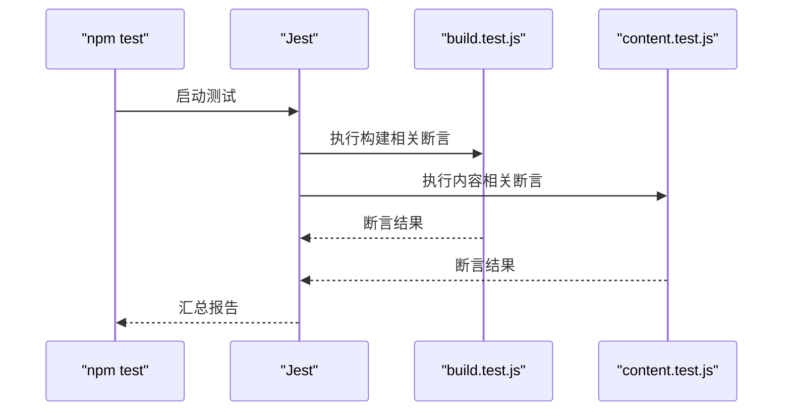
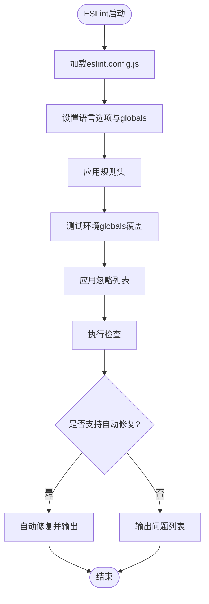
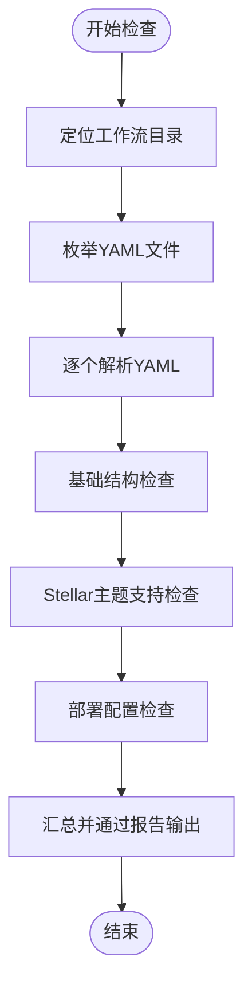
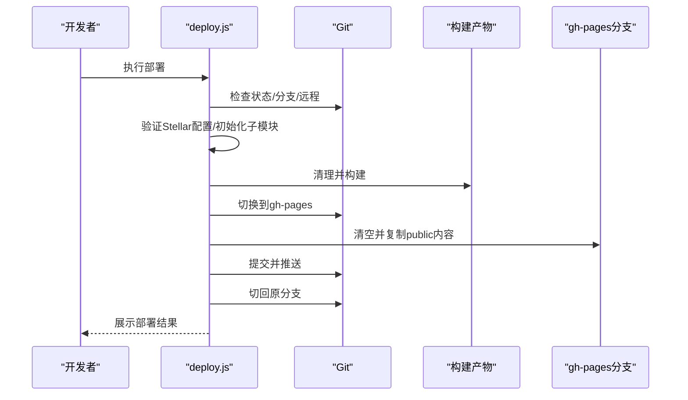
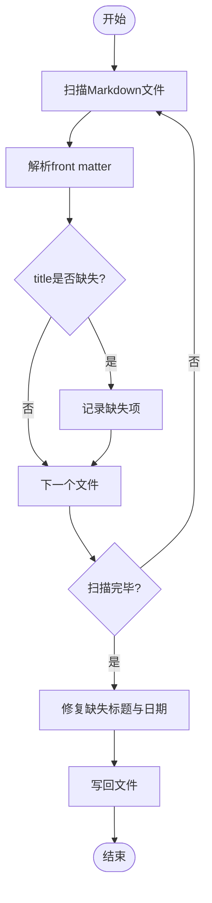
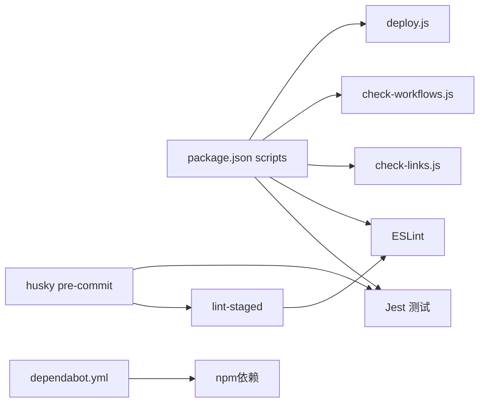

# 测试与质量检查工具

<cite>
**本文引用的文件**
- [tools/check-links.js](file://tools/check-links.js)
- [eslint.config.js](file://eslint.config.js)
- [test/build.test.js](file://test/build.test.js)
- [test/content.test.js](file://test/content.test.js)
- [package.json](file://package.json)
- [tools/deploy.js](file://tools/deploy.js)
- [tools/check-workflows.js](file://tools/check-workflows.js)
- [tools/find-missing-titles.js](file://tools/find-missing-titles.js)
- [tools/fix-missing-titles.js](file://tools/fix-missing-titles.js)
- [_config.yml](file://_config.yml)
- [_config.staging.yml](file://_config.staging.yml)
- [.husky/pre-commit](file://.husky/pre-commit)
- [.github/dependabot.yml](file://.github/dependabot.yml)
</cite>

## 目录
1. [简介](#简介)
2. [项目结构](#项目结构)
3. [核心组件](#核心组件)
4. [架构总览](#架构总览)
5. [组件详解](#组件详解)
6. [依赖关系分析](#依赖关系分析)
7. [性能考量](#性能考量)
8. [故障排查指南](#故障排查指南)
9. [结论](#结论)
10. [附录](#附录)

## 简介
本文件面向Hexo博客项目的测试与质量检查体系，围绕以下目标展开：
- 全面解析链接检查工具的实现与使用，覆盖内部链接验证、外部链接检测与链接格式检查。
- 说明测试框架配置与测试用例编写方法，涵盖单元测试、集成测试与端到端测试的实践。
- 解释ESLint配置文件的规则与作用，包括JavaScript代码规范、错误检测与自动修复。
- 提供代码质量保证的最佳实践，包括代码审查流程、测试覆盖率要求与持续集成配置。
- 提供实际测试示例、质量检查报告解读与问题修复指南。

## 项目结构
该项目采用Hexo静态站点生成器，结合自研工具链与测试框架，形成“构建-测试-部署”的闭环。关键位置如下：
- 工具层：tools/ 下包含链接检查、工作流检查、部署脚本等自动化工具。
- 测试层：test/ 下包含构建测试与内容测试用例。
- 质量配置：eslint.config.js 定义ESLint规则；package.json scripts集成测试与质量检查命令。
- 配置层：_config.yml 与 _config.staging.yml 定义站点与环境配置；.husky 预提交钩子；dependabot.yml 自动化依赖升级。



**图表来源**
- [tools/check-links.js](file://tools/check-links.js#L1-L133)
- [tools/check-workflows.js](file://tools/check-workflows.js#L1-L315)
- [tools/deploy.js](file://tools/deploy.js#L1-L472)
- [test/build.test.js](file://test/build.test.js#L1-L71)
- [test/content.test.js](file://test/content.test.js#L1-L109)
- [eslint.config.js](file://eslint.config.js#L1-L64)
- [package.json](file://package.json#L1-L94)
- [_config.yml](file://_config.yml#L1-L136)
- [_config.staging.yml](file://_config.staging.yml#L1-L33)
- [.husky/pre-commit](file://.husky/pre-commit#L1-L10)
- [.github/dependabot.yml](file://.github/dependabot.yml#L1-L8)

**章节来源**
- [package.json](file://package.json#L1-L94)
- [_config.yml](file://_config.yml#L1-L136)
- [_config.staging.yml](file://_config.staging.yml#L1-L33)

## 核心组件
- 链接检查工具：对Markdown中的外部链接进行HTTP/HTTPS探测，过滤锚点与相对路径，避免重复检查，输出问题清单。
- 测试框架：基于Jest，覆盖构建产物完整性、RSS/站点地图生成、内容front matter校验与内部链接有效性。
- ESLint规则：统一缩进、引号、分号风格，忽略未使用变量的下划线前缀命名，测试环境全局变量声明。
- 工作流检查：验证GitHub Actions工作流是否具备Stellar主题所需的关键步骤（子模块、主题验证、构建与部署）。
- 部署脚本：封装Stellar主题构建、分支准备、gh-pages部署与结果展示。
- 标题修复工具：批量发现并修复缺少标题的Markdown文件，自动补全标题与日期。

**章节来源**
- [tools/check-links.js](file://tools/check-links.js#L1-L133)
- [test/build.test.js](file://test/build.test.js#L1-L71)
- [test/content.test.js](file://test/content.test.js#L1-L109)
- [eslint.config.js](file://eslint.config.js#L1-L64)
- [tools/check-workflows.js](file://tools/check-workflows.js#L1-L315)
- [tools/deploy.js](file://tools/deploy.js#L1-L472)
- [tools/find-missing-titles.js](file://tools/find-missing-titles.js#L1-L81)
- [tools/fix-missing-titles.js](file://tools/fix-missing-titles.js#L1-L92)

## 架构总览
整体质量保障流程由“本地开发—预提交—CI/CD—部署”构成，关键节点如下：

```mermaid
sequenceDiagram
participant Dev as "开发者"
participant Husky as "husky 预提交"
participant Lint as "ESLint"
participant Jest as "Jest 测试"
participant Links as "链接检查"
participant Deploy as "部署脚本"
participant GH as "GitHub Pages"
Dev->>Husky : 提交代码
Husky->>Lint : 代码风格检查
Husky->>Jest : 运行测试用例
Husky->>Links : 检查外部链接
alt 通过
Husky-->>Dev : 通过
Dev->>Deploy : 执行部署
Deploy->>GH : 推送gh-pages
GH-->>Dev : 部署完成
else 失败
Husky-->>Dev : 中止提交
end
```

**图表来源**
- [.husky/pre-commit](file://.husky/pre-commit#L1-L10)
- [package.json](file://package.json#L32-L40)
- [tools/check-links.js](file://tools/check-links.js#L1-L133)
- [tools/deploy.js](file://tools/deploy.js#L1-L472)

## 组件详解

### 链接检查工具（check-links.js）
- 功能概述
  - 内部链接验证：通过正则匹配Markdown中的链接，跳过锚点与相对路径，仅对外部链接发起HTTP/HTTPS请求。
  - 外部链接检测：根据协议选择http或https客户端，设置超时与错误回调，避免阻塞。
  - 链接格式检查：识别Markdown链接格式，记录文件、文本与URL，输出问题清单。
  - 去重与容错：使用Set缓存已检查URL，捕获异常并记录警告，CI模式下不中断构建。
- 关键流程



**图表来源**
- [tools/check-links.js](file://tools/check-links.js#L14-L76)

- 使用方式
  - 本地运行：npm run check-links
  - 预提交集成：.husky/pre-commit调用validate脚本，间接触发check-links
- 输出与行为
  - 控制台打印检查进度与结果
  - 损坏链接列表按文件、文本、URL分类输出
  - CI模式不退出非零码，避免阻塞流水线

**章节来源**
- [tools/check-links.js](file://tools/check-links.js#L1-L133)
- [package.json](file://package.json#L37-L39)
- [.husky/pre-commit](file://.husky/pre-commit#L1-L10)

### 测试框架与用例（Jest）
- 测试类型与范围
  - 构建测试：验证public目录生成、首页HTML、必要资源目录、站点地图与RSS。
  - 内容测试：校验front matter字段、内容非空、内部相对链接有效性。
- 配置要点
  - 测试环境：Node
  - 测试匹配：test/**/*.test.js
  - 覆盖率收集：默认收集tools/**/*.js，排除check-links.js（因其为CLI工具且无导出逻辑）
- 运行方式
  - npm test：运行全部测试
  - npm run test:watch：监听模式
  - npm run test:coverage：生成覆盖率报告



**图表来源**
- [package.json](file://package.json#L78-L87)
- [test/build.test.js](file://test/build.test.js#L1-L71)
- [test/content.test.js](file://test/content.test.js#L1-L109)

**章节来源**
- [test/build.test.js](file://test/build.test.js#L1-L71)
- [test/content.test.js](file://test/content.test.js#L1-L109)
- [package.json](file://package.json#L78-L87)

### ESLint配置（eslint.config.js）
- 语言与全局
  - ECMAScript 2022，CommonJS模块类型
  - 声明Node内置与全局只读变量
- 规则策略
  - 禁止未使用变量（允许下划线前缀参数）
  - 禁止console（可按需放宽）
  - 缩进2空格、单引号、分号强制
- 测试环境全局
  - 为test/**/*.js声明describe/test/expect等全局变量
- 忽略范围
  - node_modules、public、.deploy_git、themes、source/_posts/assets、min.js、以及多类静态资源目录



**图表来源**
- [eslint.config.js](file://eslint.config.js#L1-L64)

**章节来源**
- [eslint.config.js](file://eslint.config.js#L1-L64)

### 工作流检查工具（check-workflows.js）
- 目标：验证GitHub Actions工作流对Stellar主题的支持程度
- 检查维度
  - 基础结构：name、on、jobs
  - Stellar支持：子模块支持、主题初始化、Stellar配置验证
  - 部署配置：GitHub Pages部署与构建步骤
- 报告与建议
  - 控制台输出通过/警告/错误统计
  - 可选生成JSON报告workflow-check-report.json
  - 提供优化建议与相关文档链接



**图表来源**
- [tools/check-workflows.js](file://tools/check-workflows.js#L23-L190)

**章节来源**
- [tools/check-workflows.js](file://tools/check-workflows.js#L1-L315)

### 部署脚本（deploy.js）
- 职责：将Stellar主题构建产物部署至gh-pages分支
- 关键步骤
  - Git状态检查与交互确认
  - Stellar主题验证与子模块初始化
  - 清理与构建，验证关键文件
  - 分支准备（如不存在则创建），复制public内容
  - 提交与推送，切回原分支并展示结果
- 交互与Dry-run
  - 支持--dry-run预览模式
  - 交互式确认未提交更改



**图表来源**
- [tools/deploy.js](file://tools/deploy.js#L383-L418)

**章节来源**
- [tools/deploy.js](file://tools/deploy.js#L1-L472)

### 标题修复工具（find-missing-titles.js / fix-missing-titles.js）
- 功能
  - find-missing-titles：遍历source/_posts，使用gray-matter解析front matter，统计缺少title的文件。
  - fix-missing-titles：基于文件名生成标题，必要时补全日期，写回文件。
- 使用场景
  - 内容迁移或批量新增文章时快速补齐标题与日期，提升SEO与可读性。



**图表来源**
- [tools/find-missing-titles.js](file://tools/find-missing-titles.js#L31-L75)
- [tools/fix-missing-titles.js](file://tools/fix-missing-titles.js#L29-L86)

**章节来源**
- [tools/find-missing-titles.js](file://tools/find-missing-titles.js#L1-L81)
- [tools/fix-missing-titles.js](file://tools/fix-missing-titles.js#L1-L92)

## 依赖关系分析
- 脚本与工具
  - package.json scripts将测试、链接检查、ESLint、工作流检查、部署等串联起来，形成统一入口。
- 预提交钩子
  - husky pre-commit执行lint-staged与测试，确保每次提交前的质量门槛。
- 依赖管理
  - dependabot.yml每日扫描npm依赖，限制同时打开的PR数量，降低维护成本。



**图表来源**
- [package.json](file://package.json#L5-L40)
- [.husky/pre-commit](file://.husky/pre-commit#L1-L10)
- [.github/dependabot.yml](file://.github/dependabot.yml#L1-L8)

**章节来源**
- [package.json](file://package.json#L5-L40)
- [.husky/pre-commit](file://.husky/pre-commit#L1-L10)
- [.github/dependabot.yml](file://.github/dependabot.yml#L1-L8)

## 性能考量
- 链接检查
  - 并发访问外部链接可能受网络与目标站点限流影响，建议在CI中适当增加超时或减少并发。
  - 通过Set去重避免重复请求同一URL，提高效率。
- 测试执行
  - Jest默认串行执行，可通过并行参数优化（需谨慎以避免资源竞争）。
  - 覆盖率收集范围明确，避免对check-links.js统计，减少无关开销。
- 部署脚本
  - 复制public目录时注意大文件与深层目录，必要时使用增量策略或缓存。

## 故障排查指南
- 链接检查失败
  - 现象：外部链接被标记为损坏或超时
  - 排查：确认URL格式、网络可达性、目标站点状态；检查代理与防火墙；必要时在本地浏览器验证。
  - 修复：修正Markdown链接或替换为可用镜像源。
- 测试失败
  - 构建测试：检查public目录生成、必要资源与sitemap/rss文件是否存在；核对_hexo配置。
  - 内容测试：front matter字段缺失或格式错误；内部相对链接指向不存在文件。
- ESLint报错
  - 规范不符：调整缩进、引号、分号；或在测试文件中使用允许的下划线前缀命名。
  - 忽略范围：确认文件未被eslint.config.js的ignores排除。
- 工作流检查告警
  - 子模块未启用：在actions/checkout步骤中开启submodules。
  - 缺少Stellar验证：添加npm run stellar:validate步骤。
  - 部署目录不正确：确保publish_dir指向./public。
- 部署失败
  - gh-pages分支不存在：首次部署会自动创建；若失败，检查权限与远程配置。
  - 未提交更改：按提示确认或暂存更改后重试。
- 标题缺失
  - 使用find-missing-titles.js定位，再用fix-missing-titles.js批量修复。

**章节来源**
- [tools/check-links.js](file://tools/check-links.js#L14-L46)
- [test/build.test.js](file://test/build.test.js#L19-L70)
- [test/content.test.js](file://test/content.test.js#L33-L108)
- [eslint.config.js](file://eslint.config.js#L25-L31)
- [tools/check-workflows.js](file://tools/check-workflows.js#L103-L190)
- [tools/deploy.js](file://tools/deploy.js#L169-L219)
- [tools/find-missing-titles.js](file://tools/find-missing-titles.js#L31-L75)
- [tools/fix-missing-titles.js](file://tools/fix-missing-titles.js#L29-L86)

## 结论
本项目通过“链接检查+测试+ESLint+工作流检查+部署脚本+标题修复”的组合拳，形成了完善的质量保障体系。建议在团队协作中坚持：
- 代码审查：关注链接有效性、front matter一致性与ESLint规则遵循。
- 测试覆盖率：逐步扩大测试覆盖面，特别是关键业务路径与边界条件。
- CI配置：启用工作流检查与依赖升级，保持依赖健康与流水线稳定。
- 文档与工具：完善工具使用说明与常见问题解答，降低上手成本。

## 附录
- 实际测试示例
  - 构建测试断言：public目录存在、首页HTML存在且包含<html>与</html>、必要资源目录存在、sitemap与rss生成。
  - 内容测试断言：front matter字段校验、内容非空警告、内部相对链接存在性。
- 质量检查报告解读
  - 工作流检查报告包含通过/警告/错误统计与建议，优先修复错误项。
  - workflow-check-report.json可用于归档与对比。
- 问题修复指南
  - 链接问题：修正URL或替换镜像；对不可达链接考虑内链替代。
  - front matter问题：补齐title/date/tags/categories；确保类型正确。
  - 标题缺失：使用标题修复工具自动生成并写回。