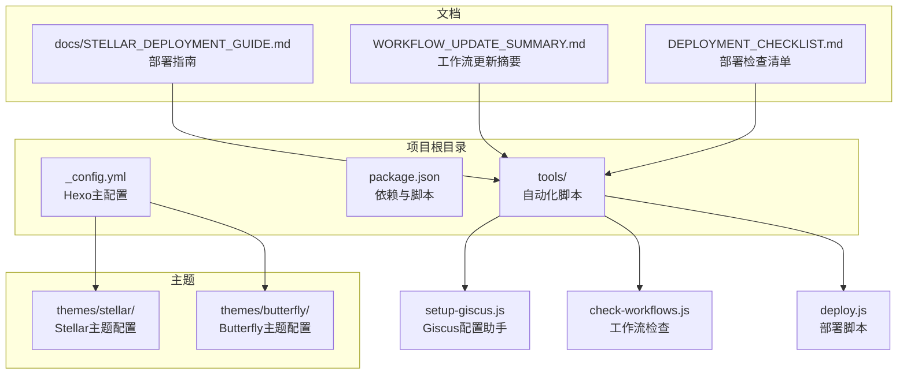
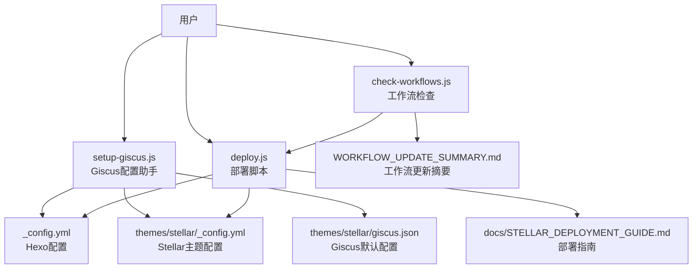
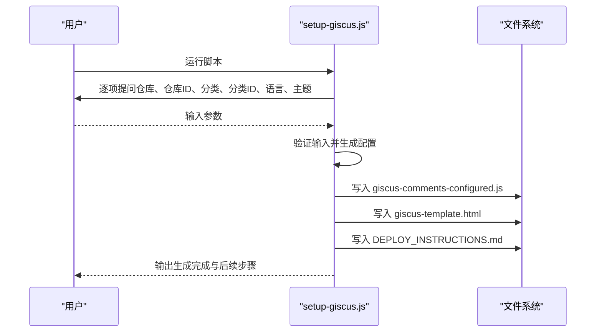
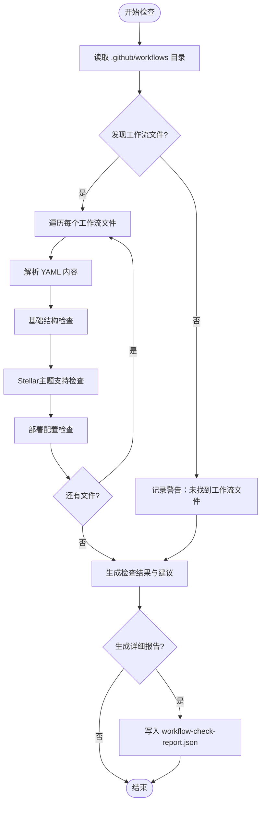
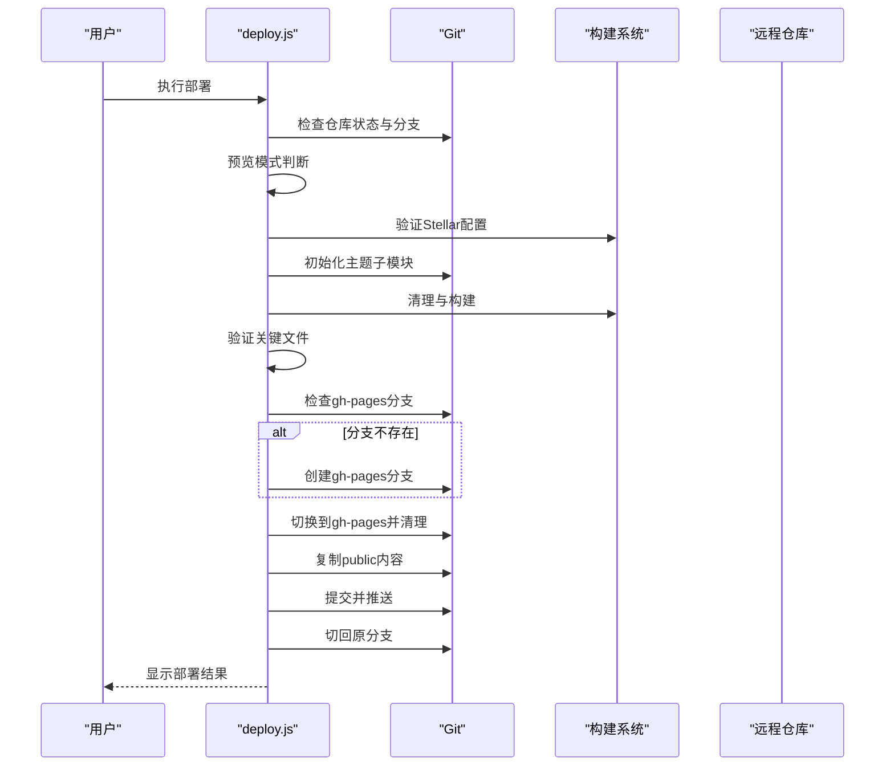
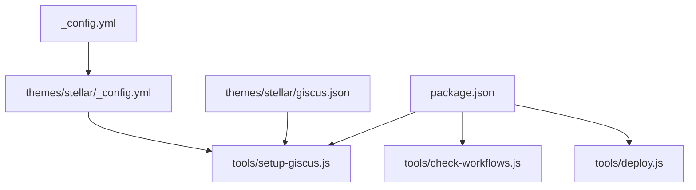

# 设置与配置工具

<cite>
**本文档引用的文件**
- [tools/setup-giscus.js](file://tools/setup-giscus.js)
- [WORKFLOW_UPDATE_SUMMARY.md](file://WORKFLOW_UPDATE_SUMMARY.md)
- [DEPLOYMENT_CHECKLIST.md](file://DEPLOYMENT_CHECKLIST.md)
- [themes/stellar/_config.yml](file://themes/stellar/_config.yml)
- [_config.yml](file://_config.yml)
- [themes/stellar/giscus.json](file://themes/stellar/giscus.json)
- [tools/check-workflows.js](file://tools/check-workflows.js)
- [tools/deploy.js](file://tools/deploy.js)
- [package.json](file://package.json)
- [docs/STELLAR_DEPLOYMENT_GUIDE.md](file://docs/STELLAR_DEPLOYMENT_GUIDE.md)
- [themes/butterfly/_config.yml](file://themes/butterfly/_config.yml)
</cite>

## 目录
1. [简介](#简介)
2. [项目结构](#项目结构)
3. [核心组件](#核心组件)
4. [架构概览](#架构概览)
5. [详细组件分析](#详细组件分析)
6. [依赖关系分析](#依赖关系分析)
7. [性能考虑](#性能考虑)
8. [故障排除指南](#故障排除指南)
9. [结论](#结论)
10. [附录](#附录)

## 简介
本文件为设置与配置工具的完整文档，重点涵盖以下方面：
- setup-giscus.js 的 Giscus 评论系统配置工具，包括 GitHub Discussions 集成、评论系统初始化和配置参数设置
- 部署检查清单 DEPLOYMENT_CHECKLIST.md 的内容与使用方法，包括部署前检查项目与验证步骤
- 工作流更新摘要 WORKFLOW_UPDATE_SUMMARY.md 的作用，包括 GitHub Actions 工作流变更记录与更新指南
- 项目初始化最佳实践，包括环境配置、第三方服务集成与配置文件管理
- 实际设置示例、配置验证方法与故障排除指南

## 项目结构
该项目基于 Hexo 静态站点生成器，采用主题化架构，主要包含以下关键目录与文件：
- tools：自动化工具脚本，如 Giscus 配置助手、工作流检查、部署脚本等
- themes：主题目录，当前使用 Stellar 主题，同时保留 Butterfly 主题作为对比
- docs：部署与工作流相关文档
- 根目录配置：_config.yml（Hexo 主配置）、package.json（项目依赖与脚本）

**图表来源**
- [tools/setup-giscus.js](file://tools/setup-giscus.js#L1-L265)
- [tools/check-workflows.js](file://tools/check-workflows.js#L1-L315)
- [tools/deploy.js](file://tools/deploy.js#L1-L472)
- [themes/stellar/_config.yml](file://themes/stellar/_config.yml#L1-L725)
- [themes/butterfly/_config.yml](file://themes/butterfly/_config.yml#L1-L987)
- [docs/STELLAR_DEPLOYMENT_GUIDE.md](file://docs/STELLAR_DEPLOYMENT_GUIDE.md#L1-L256)

**章节来源**
- [package.json](file://package.json#L1-L94)
- [_config.yml](file://_config.yml#L1-L136)

## 核心组件
本节聚焦三个关键设置与配置工具及其职责：
- Giscus 配置助手：交互式收集配置参数，生成 JavaScript 配置文件与 HTML 模板，简化 GitHub Discussions 集成
- 工作流检查工具：验证 GitHub Actions 工作流对 Stellar 主题的支持，提供报告与优化建议
- 部署脚本：自动化构建、验证与部署到 GitHub Pages，支持预览模式与错误恢复

**章节来源**
- [tools/setup-giscus.js](file://tools/setup-giscus.js#L1-L265)
- [tools/check-workflows.js](file://tools/check-workflows.js#L1-L315)
- [tools/deploy.js](file://tools/deploy.js#L1-L472)

## 架构概览
下图展示了设置与配置工具的整体架构与交互关系：

**图表来源**
- [tools/setup-giscus.js](file://tools/setup-giscus.js#L1-L265)
- [tools/check-workflows.js](file://tools/check-workflows.js#L1-L315)
- [tools/deploy.js](file://tools/deploy.js#L1-L472)
- [themes/stellar/_config.yml](file://themes/stellar/_config.yml#L220-L264)
- [themes/stellar/giscus.json](file://themes/stellar/giscus.json#L1-L4)
- [docs/STELLAR_DEPLOYMENT_GUIDE.md](file://docs/STELLAR_DEPLOYMENT_GUIDE.md#L1-L256)
- [WORKFLOW_UPDATE_SUMMARY.md](file://WORKFLOW_UPDATE_SUMMARY.md#L1-L178)

## 详细组件分析

### Giscus 配置助手（setup-giscus.js）
该工具通过交互式问答收集必要的配置参数，自动生成 JavaScript 配置文件与 HTML 模板，并提供部署说明。核心功能包括：
- 参数收集：仓库、仓库ID、讨论分类、分类ID、语言、主题等
- 配置生成：生成 giscus 配置对象与初始化函数
- 主题切换：监听系统主题变化并动态更新评论主题
- 懒加载：基于 IntersectionObserver 实现评论区域懒加载
- HTML 模板：生成可在文章模板中使用的 HTML 结构
- 部署说明：生成包含配置信息与部署步骤的说明文档

**图表来源**
- [tools/setup-giscus.js](file://tools/setup-giscus.js#L21-L265)

**章节来源**
- [tools/setup-giscus.js](file://tools/setup-giscus.js#L1-L265)

### 工作流检查工具（check-workflows.js）
该工具用于验证 GitHub Actions 工作流对 Stellar 主题的支持情况，提供结构化检查与优化建议：
- 基础结构检查：工作流名称、触发条件、作业定义
- Stellar 支持检查：Git 子模块支持、主题初始化、Stellar 配置验证
- 部署配置检查：GitHub Pages 部署、构建步骤
- 结果汇总：通过项、警告项、错误项统计
- 报告生成：生成 JSON 格式的详细报告

**图表来源**
- [tools/check-workflows.js](file://tools/check-workflows.js#L23-L315)

**章节来源**
- [tools/check-workflows.js](file://tools/check-workflows.js#L1-L315)

### 部署脚本（deploy.js）
该脚本提供完整的自动化部署流程，支持预览模式与错误恢复：
- Git 状态检查：验证仓库状态、当前分支、远程仓库
- 构建流程：Stellar 配置验证、主题子模块初始化、清理与构建
- 关键文件验证：检查首页、CSS、JS、搜索索引、站点地图等
- 分支管理：检测并创建 gh-pages 分支，清理与复制文件
- 部署发布：提交更改并推送到远程仓库
- 结果展示：显示部署信息与主题特性

**图表来源**
- [tools/deploy.js](file://tools/deploy.js#L383-L472)

**章节来源**
- [tools/deploy.js](file://tools/deploy.js#L1-L472)

## 依赖关系分析
项目中的配置与工具之间存在明确的依赖关系：
- Hexo 主配置（_config.yml）决定站点行为与部署目标
- Stellar 主题配置（themes/stellar/_config.yml）定义评论系统、搜索、插件等主题功能
- Giscus 配置（themes/stellar/giscus.json）提供评论系统的默认参数
- 工作流检查工具依赖 YAML 解析库与工作流文件结构
- 部署脚本依赖 Git 命令与构建脚本（package.json 中的脚本）

**图表来源**
- [_config.yml](file://_config.yml#L104-L136)
- [themes/stellar/_config.yml](file://themes/stellar/_config.yml#L220-L264)
- [themes/stellar/giscus.json](file://themes/stellar/giscus.json#L1-L4)
- [tools/setup-giscus.js](file://tools/setup-giscus.js#L1-L265)
- [tools/check-workflows.js](file://tools/check-workflows.js#L1-L315)
- [tools/deploy.js](file://tools/deploy.js#L1-L472)
- [package.json](file://package.json#L5-L41)

**章节来源**
- [package.json](file://package.json#L1-L94)
- [_config.yml](file://_config.yml#L1-L136)
- [themes/stellar/_config.yml](file://themes/stellar/_config.yml#L1-L725)

## 性能考虑
- 构建性能：Stellar 主题构建时间约为 2-3 分钟，生成约 228 个文件
- 缓存优化：使用 npm 依赖缓存，启用 Git 子模块自动初始化
- 部署优化：使用 force_orphan 清理历史，压缩静态资源，启用 CDN 加速
- 监控指标：构建时间、生成文件数、部署大小、页面加载时间

**章节来源**
- [WORKFLOW_UPDATE_SUMMARY.md](file://WORKFLOW_UPDATE_SUMMARY.md#L109-L121)
- [docs/STELLAR_DEPLOYMENT_GUIDE.md](file://docs/STELLAR_DEPLOYMENT_GUIDE.md#L200-L216)

## 故障排除指南
常见问题与解决方案：
- 主题文件缺失：执行 `git submodule update --init --recursive` 并检查主题状态
- 构建失败：运行 `npm run stellar:validate` 进行配置验证，清理后重新构建
- 部署权限问题：检查 GitHub Token 权限与 Actions 设置
- 页面显示异常：验证 `_config.yml` 中的 URL 配置与路径设置
- 工作流配置问题：使用 `npm run workflows:check` 与 `npm run workflows:report` 生成详细报告

**章节来源**
- [docs/STELLAR_DEPLOYMENT_GUIDE.md](file://docs/STELLAR_DEPLOYMENT_GUIDE.md#L127-L197)
- [tools/check-workflows.js](file://tools/check-workflows.js#L234-L248)

## 结论
本设置与配置工具文档系统性地介绍了 Giscus 配置助手、工作流检查工具与部署脚本的功能与使用方法。通过这些工具，开发者可以：
- 快速集成 GitHub Discussions 评论系统
- 自动化验证与部署流程
- 确保配置正确性与工作流稳定性
- 提升项目初始化效率与维护质量

建议在项目初始化阶段即启用这些工具，并结合文档中的最佳实践与故障排除指南，确保博客平台的稳定运行。

## 附录

### 部署检查清单（DEPLOYMENT_CHECKLIST.md）使用方法
- 部署前检查：确认主题设置、子模块、依赖包、GitHub Pages 启用状态
- 工作流检查：使用 `npm run workflows:check` 与 `npm run workflows:report`
- 配置验证：运行 `npm run stellar:validate` 与 `npm run stellar:test`
- 预览部署：使用 `npm run deploy:preview` 预览部署过程
- 本地测试：使用 `npm run server` 启动本地服务器

**章节来源**
- [docs/STELLAR_DEPLOYMENT_GUIDE.md](file://docs/STELLAR_DEPLOYMENT_GUIDE.md#L50-L178)

### 工作流更新摘要（WORKFLOW_UPDATE_SUMMARY.md）要点
- 工作流文件更新：ci.yml、deploy.yml、stellar-ci.yml
- 新增工具：工作流检查工具与相关 npm 脚本
- 文档更新：完善部署指南与新增工作流更新摘要
- 验证结果：所有工作流正确配置支持 Stellar 主题
- 技术细节：Git 子模块支持、Stellar 配置验证、多环境部署
- 部署能力：自动化构建、测试、部署与监控

**章节来源**
- [WORKFLOW_UPDATE_SUMMARY.md](file://WORKFLOW_UPDATE_SUMMARY.md#L1-L178)

### 项目初始化最佳实践
- 环境配置：安装 Node.js 18/20，配置 npm 缓存，启用 Git 子模块
- 第三方服务集成：配置 GitHub Discussions、GitHub Pages、CDN 加速
- 配置文件管理：合理划分 _config.yml 与 _config_stellar.yml，使用工具生成与验证
- 验证与测试：使用 `npm run stellar:test` 进行完整测试，检查构建输出
- 部署流程：优先使用 GitHub Actions 自动部署，必要时使用本地部署脚本

**章节来源**
- [docs/STELLAR_DEPLOYMENT_GUIDE.md](file://docs/STELLAR_DEPLOYMENT_GUIDE.md#L72-L109)
- [package.json](file://package.json#L5-L41)