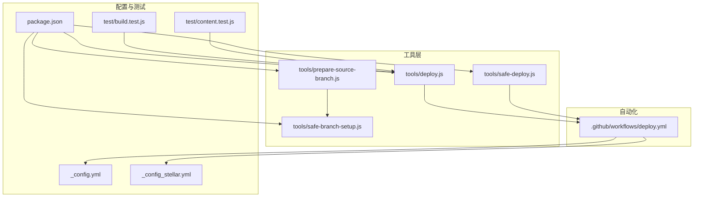
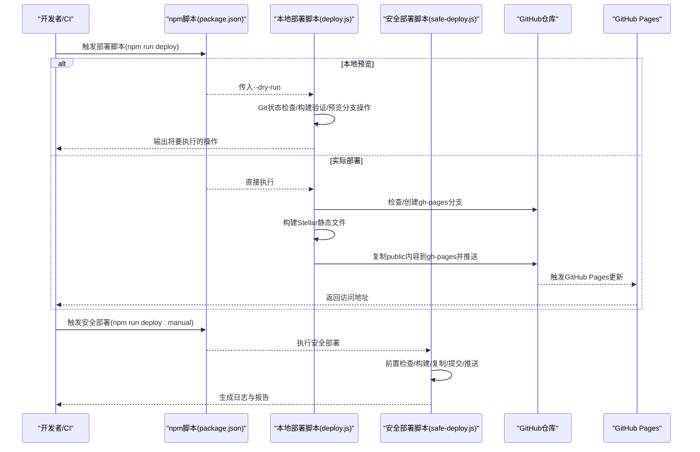
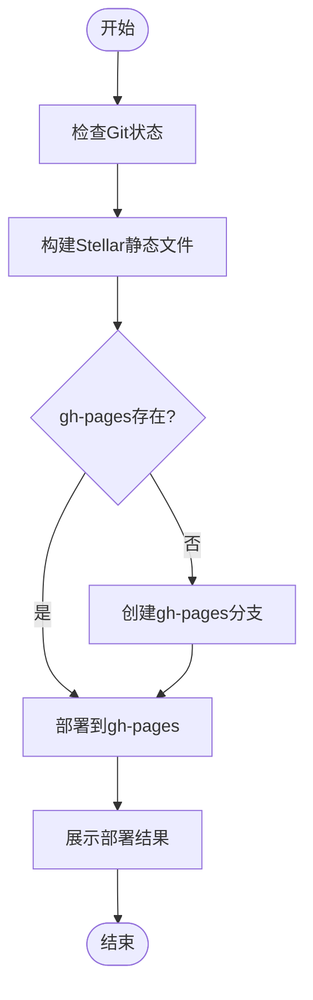
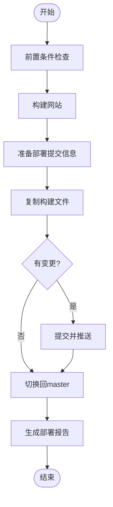
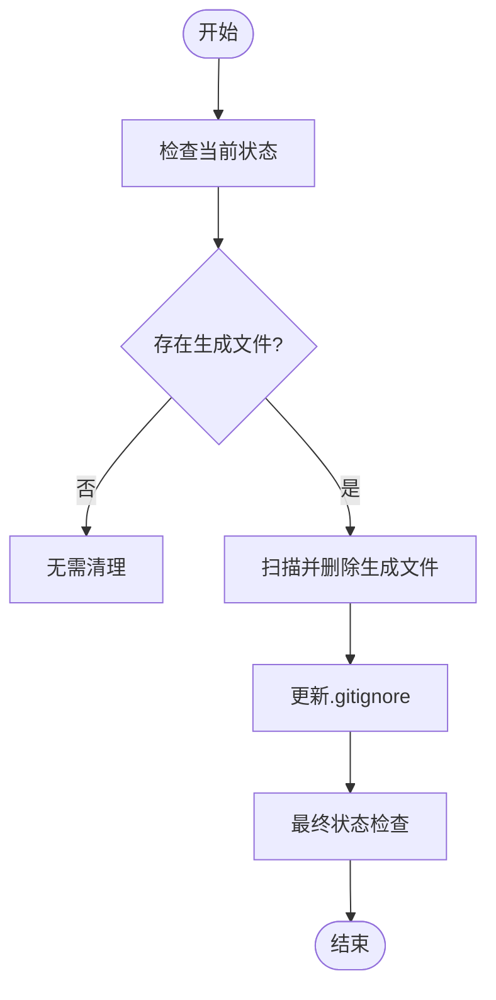
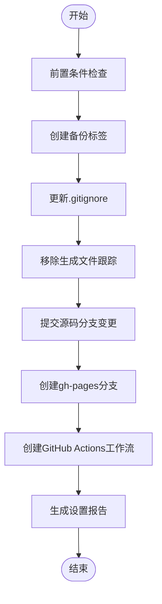
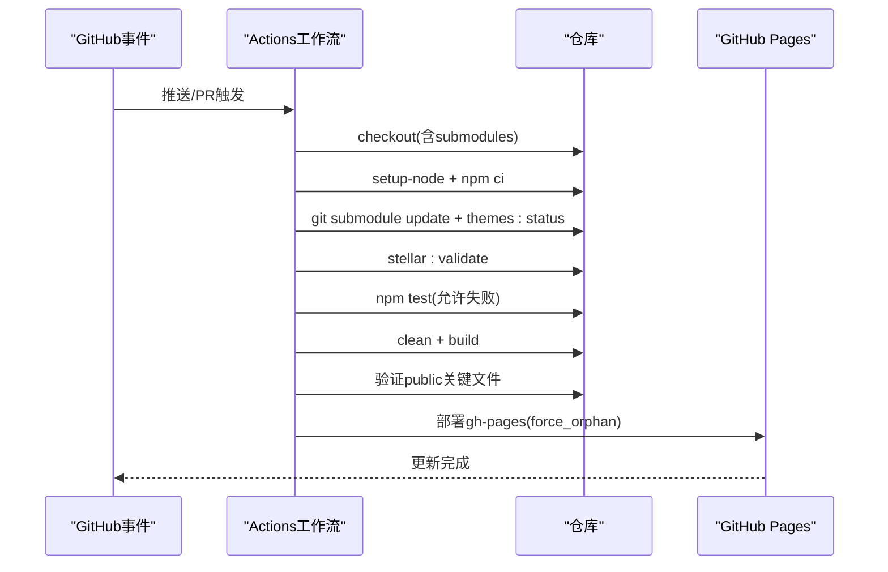
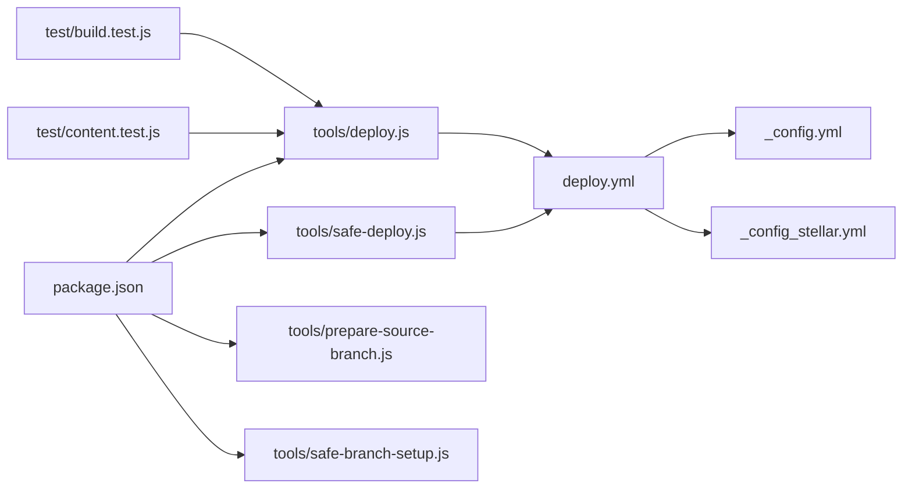

# 部署工具

<cite>
**本文引用的文件**
- [tools/deploy.js](file://tools/deploy.js)
- [tools/safe-deploy.js](file://tools/safe-deploy.js)
- [tools/prepare-source-branch.js](file://tools/prepare-source-branch.js)
- [tools/safe-branch-setup.js](file://tools/safe-branch-setup.js)
- [package.json](file://package.json)
- [_config.yml](file://_config.yml)
- [_config_stellar.yml](file://_config_stellar.yml)
- [.github/workflows/deploy.yml](file://.github/workflows/deploy.yml)
- [docs/STELLAR_DEPLOYMENT_GUIDE.md](file://docs/STELLAR_DEPLOYMENT_GUIDE.md)
- [test/build.test.js](file://test/build.test.js)
- [test/content.test.js](file://test/content.test.js)
</cite>

## 目录
1. [简介](#简介)
2. [项目结构](#项目结构)
3. [核心组件](#核心组件)
4. [架构总览](#架构总览)
5. [详细组件分析](#详细组件分析)
6. [依赖关系分析](#依赖关系分析)
7. [性能考量](#性能考量)
8. [故障排除指南](#故障排除指南)
9. [结论](#结论)
10. [附录](#附录)

## 简介
本文件系统化梳理并说明本项目的部署工具体系，涵盖以下目标：
- 自动化部署流程：Git仓库状态检查、静态文件构建、GitHub Pages部署、预览模式支持
- 安全部署机制：部署前安全检查、回滚策略、日志与报告
- 分支准备与安全设置：源码分支准备、gh-pages分支安全初始化
- 部署配置与环境变量：npm脚本、GitHub Actions工作流、主题配置
- 实际部署示例、常见问题排查与最佳实践

## 项目结构
本项目采用“主题与工具分离”的组织方式，部署相关的关键文件分布如下：
- tools：部署与分支管理脚本集合
- .github/workflows：GitHub Actions自动化部署工作流
- test：构建与内容质量测试
- docs：部署指南与最佳实践文档
- package.json：npm脚本入口与依赖声明
- 配置文件：_config.yml、_config_stellar.yml

**图表来源**
- [tools/deploy.js](file://tools/deploy.js#L1-L472)
- [tools/safe-deploy.js](file://tools/safe-deploy.js#L1-L352)
- [tools/prepare-source-branch.js](file://tools/prepare-source-branch.js#L1-L347)
- [tools/safe-branch-setup.js](file://tools/safe-branch-setup.js#L1-L414)
- [.github/workflows/deploy.yml](file://.github/workflows/deploy.yml#L1-L87)
- [package.json](file://package.json#L1-L94)
- [_config.yml](file://_config.yml#L1-L136)
- [_config_stellar.yml](file://_config_stellar.yml#L1-L699)
- [test/build.test.js](file://test/build.test.js#L1-L71)
- [test/content.test.js](file://test/content.test.js#L1-L109)

**章节来源**
- [package.json](file://package.json#L1-L94)
- [.github/workflows/deploy.yml](file://.github/workflows/deploy.yml#L1-L87)

## 核心组件
- 自动部署工具：负责Git状态检查、Stellar主题构建、gh-pages分支创建与部署、结果展示
- 安全部署工具：强调“保护源码、保留历史、支持回滚”，提供详尽日志、前置检查、部署提交与回退
- 源码分支准备工具：清理生成文件、更新.gitignore、确保源码分支纯净
- 安全分支设置工具：零删除原则、多备份、可逆操作、逐步执行，创建gh-pages并生成工作流
- npm脚本与工作流：统一入口、自动构建与部署、测试与验证

**章节来源**
- [tools/deploy.js](file://tools/deploy.js#L12-L472)
- [tools/safe-deploy.js](file://tools/safe-deploy.js#L18-L352)
- [tools/prepare-source-branch.js](file://tools/prepare-source-branch.js#L11-L347)
- [tools/safe-branch-setup.js](file://tools/safe-branch-setup.js#L18-L414)
- [package.json](file://package.json#L5-L41)
- [.github/workflows/deploy.yml](file://.github/workflows/deploy.yml#L1-L87)

## 架构总览
下图展示了从本地或CI触发到GitHub Pages部署的端到端流程，包括预览模式与安全部署两条路径。

**图表来源**
- [tools/deploy.js](file://tools/deploy.js#L383-L418)
- [tools/safe-deploy.js](file://tools/safe-deploy.js#L291-L340)
- [.github/workflows/deploy.yml](file://.github/workflows/deploy.yml#L14-L72)
- [package.json](file://package.json#L10-L13)

## 详细组件分析

### 自动部署工具（deploy.js）
职责与流程：
- Git状态检查：校验Git目录、当前分支、工作区干净度、远程仓库
- 构建静态文件：Stellar主题配置验证、子模块初始化、清理与构建、关键文件校验
- gh-pages分支管理：检测是否存在，不存在则创建孤立分支并推送
- 部署到gh-pages：切换分支、清空内容、复制public、提交与推送、切回原分支
- 结果展示：输出部署信息与访问地址

**图表来源**
- [tools/deploy.js](file://tools/deploy.js#L42-L418)

**章节来源**
- [tools/deploy.js](file://tools/deploy.js#L12-L472)

### 安全部署工具（safe-deploy.js）
职责与流程：
- 前置检查：当前分支限制（master或master-recovered）、工作区干净度、public目录有效性、gh-pages存在性
- 构建与验证：清理旧构建、执行构建、验证关键文件
- 部署提交：记录源码提交信息、在gh-pages写入部署信息文件、复制public内容
- 提交与推送：添加变更、检查差异、创建带源码信息的提交、推送远程
- 回退与报告：生成部署报告、提供回退命令、异常时尝试切回master

**图表来源**
- [tools/safe-deploy.js](file://tools/safe-deploy.js#L62-L340)

**章节来源**
- [tools/safe-deploy.js](file://tools/safe-deploy.js#L18-L352)

### 源码分支准备工具（prepare-source-branch.js）
职责与流程：
- 清理生成文件：遍历预定义规则，删除public、生成的HTML与静态资源、年份目录、主题生成目录
- 状态检查：列出存在的生成文件与源码文件，给出统计
- 更新.gitignore：追加必要的忽略规则
- 最终检查：再次统计，提示下一步操作

**图表来源**
- [tools/prepare-source-branch.js](file://tools/prepare-source-branch.js#L107-L298)

**章节来源**
- [tools/prepare-source-branch.js](file://tools/prepare-source-branch.js#L11-L347)

### 安全分支设置工具（safe-branch-setup.js）
职责与流程：
- 前置检查：工作区干净、当前分支建议、必要文件存在
- 多重备份：创建备份标签并推送到远程
- 更新.gitignore：补充忽略规则
- 移除生成文件跟踪：仅取消跟踪，保留本地文件
- 提交源码分支：提交上述变更
- 创建gh-pages：创建孤立分支、初始化README、推送并切回master
- 创建工作流：生成GitHub Actions工作流文件
- 生成报告：包含回退命令与后续步骤

**图表来源**
- [tools/safe-branch-setup.js](file://tools/safe-branch-setup.js#L62-L402)

**章节来源**
- [tools/safe-branch-setup.js](file://tools/safe-branch-setup.js#L18-L414)

### GitHub Actions工作流（.github/workflows/deploy.yml）
- 触发条件：push到main/master/develop或pull_request
- 步骤：检出代码（含子模块）、设置Node.js、安装依赖、初始化主题子模块、验证Stellar配置、运行测试（允许失败）、清理并构建、验证输出、部署到gh-pages（生产分支时）
- 通知：根据作业状态输出成功或失败提示

**图表来源**
- [.github/workflows/deploy.yml](file://.github/workflows/deploy.yml#L14-L72)

**章节来源**
- [.github/workflows/deploy.yml](file://.github/workflows/deploy.yml#L1-L87)

## 依赖关系分析
- npm脚本入口：通过package.json统一暴露部署、预览、测试、主题管理等命令
- 配置文件：_config.yml定义站点与部署基础配置；_config_stellar.yml定义Stellar主题特性与插件
- 工具与工作流：tools/*脚本与.github/workflows/deploy.yml共同构成本地与CI部署闭环
- 测试：test/*对构建产物与内容质量进行验证，保障部署稳定性

**图表来源**
- [package.json](file://package.json#L5-L41)
- [tools/deploy.js](file://tools/deploy.js#L1-L472)
- [tools/safe-deploy.js](file://tools/safe-deploy.js#L1-L352)
- [tools/prepare-source-branch.js](file://tools/prepare-source-branch.js#L1-L347)
- [tools/safe-branch-setup.js](file://tools/safe-branch-setup.js#L1-L414)
- [.github/workflows/deploy.yml](file://.github/workflows/deploy.yml#L1-L87)
- [_config.yml](file://_config.yml#L1-L136)
- [_config_stellar.yml](file://_config_stellar.yml#L1-L699)
- [test/build.test.js](file://test/build.test.js#L1-L71)
- [test/content.test.js](file://test/content.test.js#L1-L109)

**章节来源**
- [package.json](file://package.json#L1-L94)
- [_config.yml](file://_config.yml#L130-L136)
- [_config_stellar.yml](file://_config_stellar.yml#L175-L235)

## 性能考量
- CI阶段并行与缓存：使用npm缓存、子模块初始化与构建并行，缩短流水线时间
- 构建优化：增量构建、清理无效缓存、压缩静态资源
- 部署优化：force_orphan快速清理历史、最小化提交信息、CDN加速
- 监控指标：构建时间、生成文件数量、部署体积、页面加载速度

[本节为通用指导，无需特定文件引用]

## 故障排除指南
常见问题与定位思路：
- 主题文件缺失：确认Stellar主题子模块已初始化与更新
  - 参考：[tools/deploy.js](file://tools/deploy.js#L115-L122)
- 构建失败：运行配置验证与清理重建
  - 参考：[tools/deploy.js](file://tools/deploy.js#L106-L113)、[tools/safe-deploy.js](file://tools/safe-deploy.js#L118-L139)
- 部署权限问题：检查GitHub Actions令牌权限与Pages设置
  - 参考：[docs/STELLAR_DEPLOYMENT_GUIDE.md](file://docs/STELLAR_DEPLOYMENT_GUIDE.md#L148-L152)
- 页面显示异常：核对url与root配置、资源路径与相对链接
  - 参考：[_config.yml](file://_config.yml#L18-L25)、[_config_stellar.yml](file://_config_stellar.yml#L175-L189)
- 已知问题：Stellar主题json_ld helper错误可忽略
  - 参考：[docs/STELLAR_DEPLOYMENT_GUIDE.md](file://docs/STELLAR_DEPLOYMENT_GUIDE.md#L182-L185)

**章节来源**
- [tools/deploy.js](file://tools/deploy.js#L106-L122)
- [tools/safe-deploy.js](file://tools/safe-deploy.js#L118-L139)
- [docs/STELLAR_DEPLOYMENT_GUIDE.md](file://docs/STELLAR_DEPLOYMENT_GUIDE.md#L127-L197)
- [_config.yml](file://_config.yml#L18-L25)
- [_config_stellar.yml](file://_config_stellar.yml#L175-L189)

## 结论
本部署工具体系通过本地脚本与GitHub Actions协同，实现了从配置验证、构建测试到安全部署与回滚的完整闭环。工具遵循“零删除、可逆、可回滚”的安全原则，结合严格的前置检查与详尽日志，显著降低部署风险。配合完善的测试与文档，能够稳定支撑Stellar主题的持续交付。

[本节为总结，无需特定文件引用]

## 附录

### 部署配置与环境变量
- npm脚本入口
  - 部署：npm run deploy（执行tools/deploy.js）
  - 预览：npm run deploy:preview（--dry-run）
  - 安全部署：npm run deploy:manual（执行tools/safe-deploy.js）
  - 验证与构建：npm run deploy:check、npm run deploy:stellar
  - 主题管理：npm run themes:status、themes:init、themes:update
- GitHub Actions工作流
  - 触发：push到main/master/develop或PR
  - 关键步骤：子模块初始化、配置验证、测试、构建、部署到gh-pages
- 配置文件
  - 站点与部署：_config.yml
  - 主题特性：_config_stellar.yml（搜索、评论、插件等）

**章节来源**
- [package.json](file://package.json#L5-L41)
- [.github/workflows/deploy.yml](file://.github/workflows/deploy.yml#L3-L72)
- [_config.yml](file://_config.yml#L130-L136)
- [_config_stellar.yml](file://_config_stellar.yml#L175-L235)

### 实际部署示例
- 本地预览部署：npm run deploy:preview
- 执行实际部署：npm run deploy 或 node tools/deploy.js
- 安全部署（手动）：npm run deploy:manual
- CI自动部署：push到master/develop触发工作流

**章节来源**
- [tools/deploy.js](file://tools/deploy.js#L423-L449)
- [tools/safe-deploy.js](file://tools/safe-deploy.js#L291-L340)
- [.github/workflows/deploy.yml](file://.github/workflows/deploy.yml#L14-L72)

### 最佳实践建议
- 使用安全分支设置工具初始化源码与部署分支，确保零删除与可回滚
- 在CI中启用配置验证与测试，允许测试失败但继续部署（以避免偶发性问题阻塞发布）
- 使用force_orphan快速清理gh-pages历史，保持部署分支简洁
- 通过测试用例保证构建产物完整性（首页、样式、脚本、索引、站点地图、RSS）
- 定期更新主题子模块与依赖，关注已知问题并按文档指引处理

**章节来源**
- [tools/safe-branch-setup.js](file://tools/safe-branch-setup.js#L361-L402)
- [.github/workflows/deploy.yml](file://.github/workflows/deploy.yml#L38-L39)
- [test/build.test.js](file://test/build.test.js#L19-L70)
- [docs/STELLAR_DEPLOYMENT_GUIDE.md](file://docs/STELLAR_DEPLOYMENT_GUIDE.md#L200-L216)