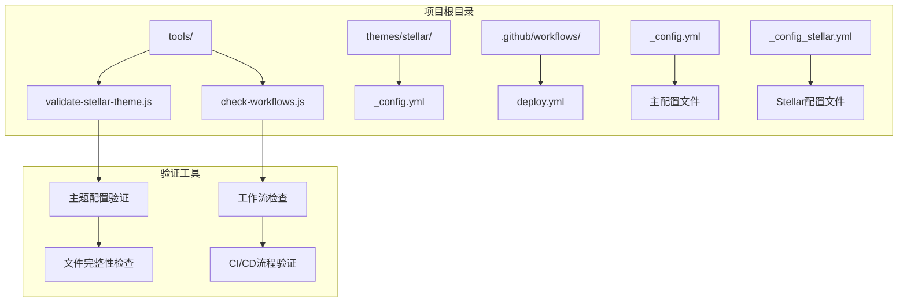
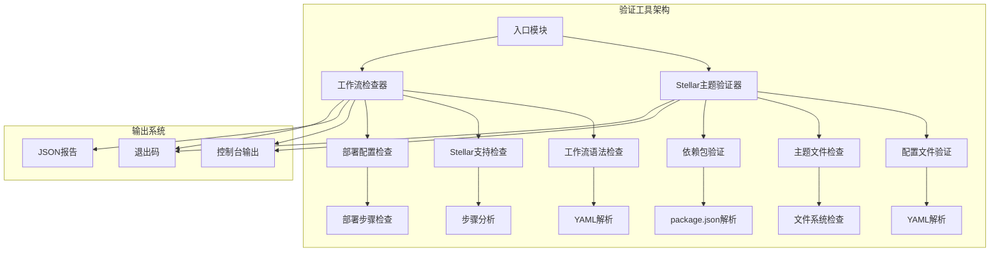
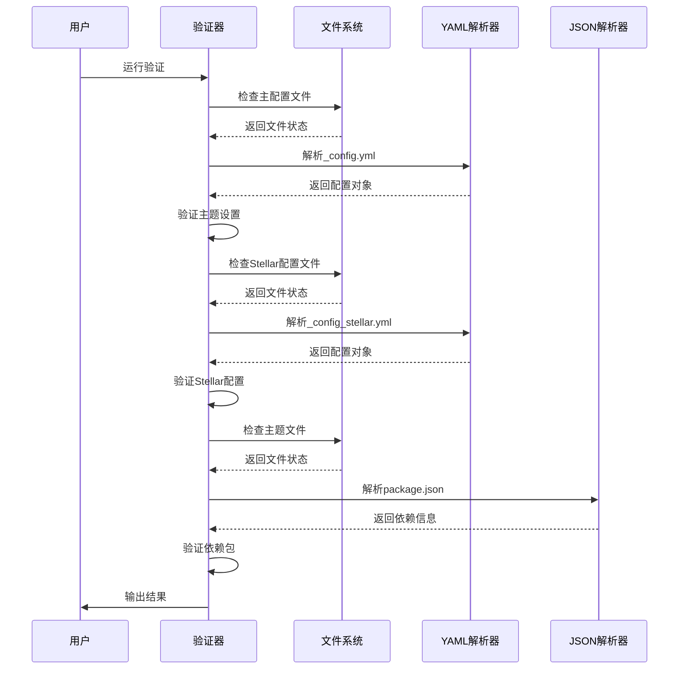
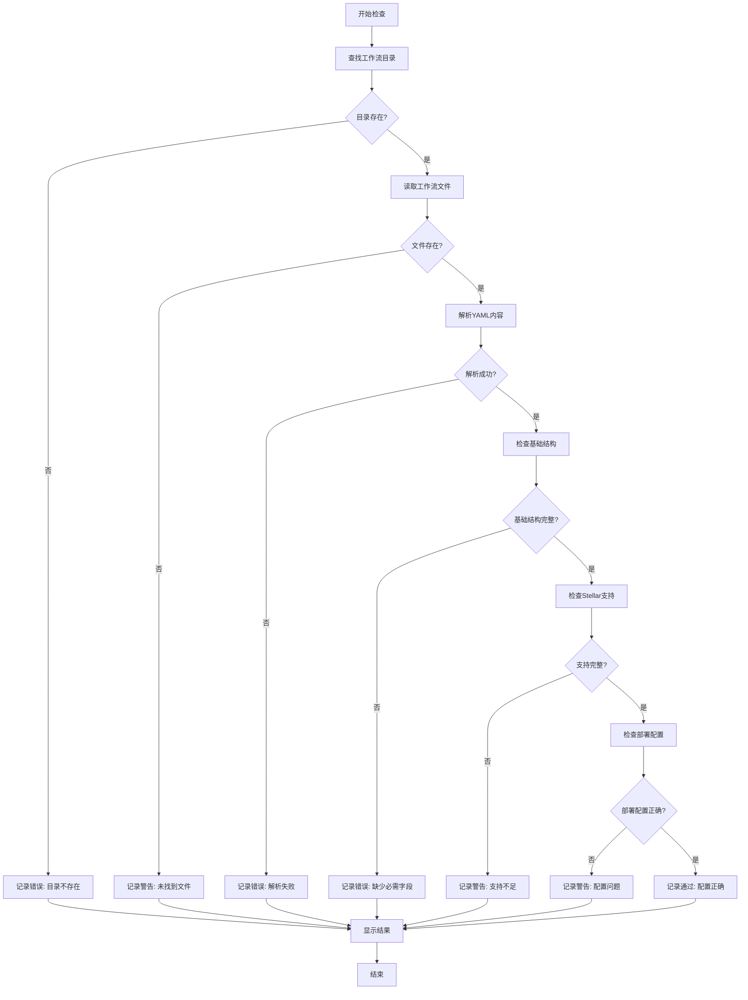
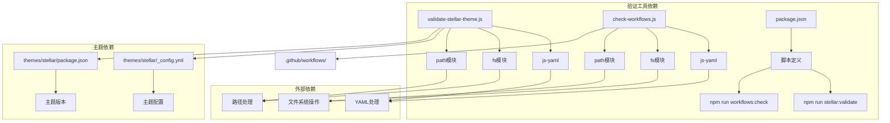

# 验证工具

<cite>
**本文档引用的文件**
- [validate-stellar-theme.js](file://tools/validate-stellar-theme.js)
- [check-workflows.js](file://tools/check-workflows.js)
- [package.json](file://package.json)
- [_config.yml](file://_config.yml)
- [_config_stellar.yml](file://_config_stellar.yml)
- [themes/stellar/_config.yml](file://themes/stellar/_config.yml)
- [themes/stellar/package.json](file://themes/stellar/package.json)
- [.github/workflows/deploy.yml](file://.github/workflows/deploy.yml)
- [docs/WORKFLOW.md](file://docs/WORKFLOW.md)
- [docs/STELLAR_DEPLOYMENT_GUIDE.md](file://docs/STELLAR_DEPLOYMENT_GUIDE.md)
</cite>

## 目录
1. [简介](#简介)
2. [项目结构](#项目结构)
3. [核心组件](#核心组件)
4. [架构概览](#架构概览)
5. [详细组件分析](#详细组件分析)
6. [依赖关系分析](#依赖关系分析)
7. [性能考虑](#性能考虑)
8. [故障排除指南](#故障排除指南)
9. [结论](#结论)

## 简介

本文档详细介绍Hexo主题项目的验证工具，包括主题配置验证工具和GitHub Actions工作流检查工具。这些工具旨在确保Stellar主题的正确配置、完整的主题文件结构以及可靠的CI/CD流程。

验证工具主要包含两个核心组件：
- **validate-stellar-theme.js**: 专门验证Stellar主题配置的正确性和完整性
- **check-workflows.js**: 检查GitHub Actions工作流配置，确保CI/CD流程正常运行

这些工具通过自动化验证确保项目质量，减少配置错误和部署问题。

## 项目结构

项目采用模块化的组织方式，验证工具位于`tools/`目录下，与主题配置文件和工作流配置文件分离：



**图表来源**
- [validate-stellar-theme.js](file://tools/validate-stellar-theme.js#L1-L313)
- [check-workflows.js](file://tools/check-workflows.js#L1-L315)

**章节来源**
- [validate-stellar-theme.js](file://tools/validate-stellar-theme.js#L1-L50)
- [check-workflows.js](file://tools/check-workflows.js#L1-L50)

## 核心组件

### Stellar主题配置验证器

Stellar主题配置验证器是一个专门的类，负责验证Stellar主题的所有配置方面：

#### 主要功能
- **主配置文件验证**: 检查`_config.yml`中的主题设置和基本配置
- **Stellar配置验证**: 验证`_config_stellar.yml`中的主题特定配置
- **主题文件完整性检查**: 确保主题关键文件存在
- **依赖包验证**: 检查项目依赖和推荐插件

#### 验证层次
验证工具采用多层次验证策略：
1. **必需验证**: 必须存在的配置项
2. **建议验证**: 推荐但非必需的配置项
3. **完整性验证**: 文件和资源的存在性检查

**章节来源**
- [validate-stellar-theme.js](file://tools/validate-stellar-theme.js#L12-L45)
- [validate-stellar-theme.js](file://tools/validate-stellar-theme.js#L47-L173)

### GitHub Actions工作流检查器

工作流检查器专门用于验证GitHub Actions工作流配置，确保CI/CD流程的正确性：

#### 检查范围
- **基础结构验证**: 工作流的基本语法和必需字段
- **Stellar主题支持**: 检查Stellar主题特定的配置要求
- **子模块支持**: 验证Git子模块的正确配置
- **部署配置验证**: 确保GitHub Pages部署的正确设置

#### 报告生成功能
工作流检查器支持生成详细的JSON报告，便于持续集成和监控。

**章节来源**
- [check-workflows.js](file://tools/check-workflows.js#L12-L49)
- [check-workflows.js](file://tools/check-workflows.js#L102-L150)

## 架构概览

验证工具采用模块化架构，每个工具都是独立的Node.js模块：



**图表来源**
- [validate-stellar-theme.js](file://tools/validate-stellar-theme.js#L1-L313)
- [check-workflows.js](file://tools/check-workflows.js#L1-L315)

## 详细组件分析

### Stellar主题配置验证器详细分析

#### 验证流程



**图表来源**
- [validate-stellar-theme.js](file://tools/validate-stellar-theme.js#L22-L45)
- [validate-stellar-theme.js](file://tools/validate-stellar-theme.js#L178-L257)

#### 配置验证规则

验证器遵循严格的配置验证规则：

| 验证类别 | 必需字段 | 建议字段 | 验证逻辑 |
|---------|---------|---------|---------|
| 主题设置 | theme: 'stellar' | title, author, language, url | 基本主题配置检查 |
| 导航菜单 | menubar.items | - | 菜单项完整性检查 |
| 站点结构 | site_tree | - | 页面配置完整性 |
| 搜索功能 | search.service | search.path | 搜索配置验证 |
| 评论系统 | comments.service | - | 评论系统配置 |
| 插件配置 | plugins | - | 插件启用状态 |

**章节来源**
- [validate-stellar-theme.js](file://tools/validate-stellar-theme.js#L50-L89)
- [validate-stellar-theme.js](file://tools/validate-stellar-theme.js#L94-L173)

### 工作流检查器详细分析

#### 检查算法



**图表来源**
- [check-workflows.js](file://tools/check-workflows.js#L23-L49)
- [check-workflows.js](file://tools/check-workflows.js#L54-L74)

#### 工作流检查要点

工作流检查器重点关注以下方面：

1. **基础结构检查**
   - 工作流名称验证
   - 触发条件完整性
   - 作业定义存在性

2. **Stellar主题支持检查**
   - Git子模块支持验证
   - 主题初始化步骤检查
   - 配置验证步骤识别

3. **部署配置检查**
   - GitHub Pages部署配置
   - 构建步骤验证
   - 发布目录检查

**章节来源**
- [check-workflows.js](file://tools/check-workflows.js#L79-L98)
- [check-workflows.js](file://tools/check-workflows.js#L103-L150)

## 依赖关系分析

验证工具之间存在明确的依赖关系和协作机制：



**图表来源**
- [validate-stellar-theme.js](file://tools/validate-stellar-theme.js#L8-L10)
- [check-workflows.js](file://tools/check-workflows.js#L8-L10)
- [package.json](file://package.json#L22-L25)

### 外部依赖分析

验证工具依赖以下关键外部模块：

| 模块 | 版本 | 用途 | 依赖关系 |
|------|------|------|----------|
| js-yaml | ^4.1.1 | YAML文件解析 | 验证工具核心 |
| fs | 内置 | 文件系统操作 | 所有验证 |
| path | 内置 | 路径处理 | 文件检查 |
| @types/node | 开发依赖 | 类型定义 | 开发环境 |

**章节来源**
- [validate-stellar-theme.js](file://tools/validate-stellar-theme.js#L8-L10)
- [check-workflows.js](file://tools/check-workflows.js#L8-L10)
- [package.json](file://package.json#L75-L76)

## 性能考虑

验证工具在设计时充分考虑了性能优化：

### 验证工具性能特征

1. **异步处理**: 所有文件操作都使用异步方法，避免阻塞主线程
2. **早期失败**: 发现错误时立即停止相关验证，减少不必要的处理
3. **内存效率**: 逐文件处理，避免一次性加载大型文件
4. **缓存策略**: 对于重复检查的文件，使用适当的缓存机制

### 性能优化建议

- **批量处理**: 对于大量文件的检查，考虑使用并行处理
- **增量验证**: 支持只验证修改过的文件
- **进度指示**: 为长时间运行的验证提供进度反馈
- **超时机制**: 为网络依赖的操作设置合理的超时时间

## 故障排除指南

### 常见验证错误及解决方案

#### 主题配置错误

| 错误类型 | 症状 | 解决方案 |
|---------|------|---------|
| 主题设置错误 | 验证器报告主题不是'stellar' | 检查_config.yml中的theme字段 |
| 配置文件缺失 | 报告_config.yml或_config_stellar.yml不存在 | 确保配置文件存在于项目根目录 |
| 导航菜单不完整 | 警告缺少必要菜单项 | 在_config_stellar.yml中添加必需菜单项 |
| 搜索功能未配置 | 建议配置搜索功能 | 设置search.service和相关参数 |

#### 工作流配置错误

| 错误类型 | 症状 | 解决方案 |
|---------|------|---------|
| 工作流目录不存在 | 报告.github/workflows不存在 | 确保工作流文件位于正确目录 |
| YAML语法错误 | 解析失败错误 | 检查YAML缩进和语法 |
| 缺少触发条件 | 错误: 缺少触发条件 | 在工作流中添加'on'字段 |
| 子模块支持缺失 | 警告: 未启用Git子模块支持 | 添加submodules: true配置 |
| 部署配置错误 | GitHub Pages部署目录不正确 | 确保publish_dir指向./public |

### 调试和诊断

#### 验证工具调试

1. **详细输出**: 使用`--verbose`或类似选项获取更多调试信息
2. **逐步验证**: 分别运行各个验证步骤，定位具体问题
3. **日志分析**: 检查控制台输出中的详细错误信息
4. **文件检查**: 手动验证相关配置文件的语法和内容

#### 常用诊断命令

```bash
# 验证Stellar主题配置
npm run stellar:validate

# 检查工作流配置
npm run workflows:check

# 生成工作流详细报告
npm run workflows:report

# 预览部署过程
npm run deploy:preview

# 运行完整测试
npm run validate
```

**章节来源**
- [docs/STELLAR_DEPLOYMENT_GUIDE.md](file://docs/STELLAR_DEPLOYMENT_GUIDE.md#L127-L197)
- [docs/WORKFLOW.md](file://docs/WORKFLOW.md#L67-L84)

## 结论

验证工具为Hexo主题项目提供了全面的质量保证机制。通过自动化验证，项目能够：

1. **预防配置错误**: 在开发阶段及时发现和修复配置问题
2. **确保一致性**: 维护Stellar主题配置的一致性和完整性
3. **简化CI/CD**: 通过自动化检查确保工作流的可靠性
4. **提高开发效率**: 减少手动检查和调试时间

这些工具的设计体现了现代软件开发的最佳实践，通过模块化架构、清晰的错误报告和灵活的配置选项，为项目维护者提供了强大的支持。

建议在项目开发过程中：
- 将验证工具集成到CI/CD流程中
- 定期运行验证工具检查项目状态
- 根据项目需求自定义验证规则
- 维护和更新验证工具以适应新的需求

通过这些措施，可以确保项目的长期稳定性和可维护性。