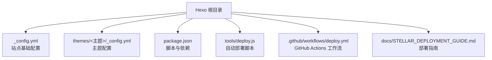
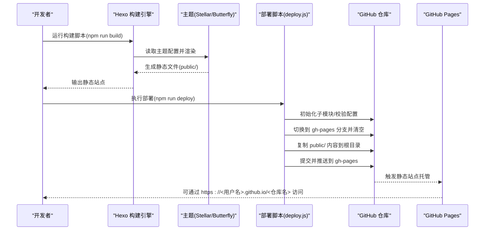
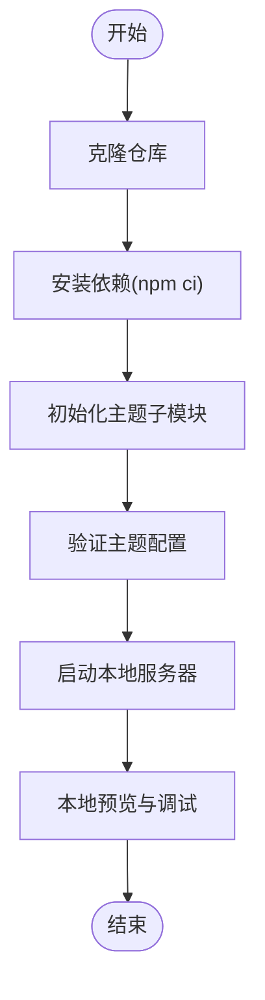
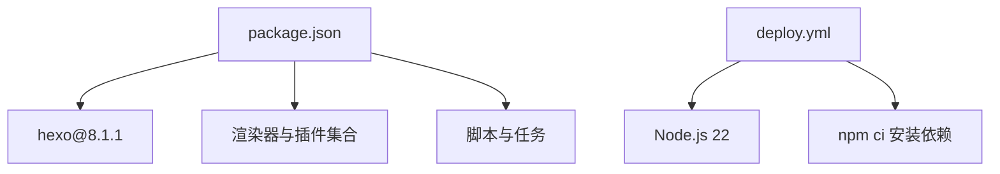

# 快速开始

<cite>
**本文引用的文件**
- [package.json](file://package.json)
- [_config.yml](file://_config.yml)
- [themes/butterfly/_config.yml](file://themes/butterfly/_config.yml)
- [themes/stellar/_config.yml](file://themes/stellar/_config.yml)
- [tools/deploy.js](file://tools/deploy.js)
- [.github/workflows/deploy.yml](file://.github/workflows/deploy.yml)
- [docs/STELLAR_DEPLOYMENT_GUIDE.md](file://docs/STELLAR_DEPLOYMENT_GUIDE.md)
- [themes/butterfly/README.md](file://themes/butterfly/README.md)
</cite>

## 目录
1. [简介](#简介)
2. [项目结构](#项目结构)
3. [核心组件](#核心组件)
4. [架构概览](#架构概览)
5. [详细组件分析](#详细组件分析)
6. [依赖分析](#依赖分析)
7. [性能考虑](#性能考虑)
8. [故障排除指南](#故障排除指南)
9. [结论](#结论)
10. [附录](#附录)

## 简介
本指南面向首次接触 H1S97X 博客项目的用户，目标是在约 30 分钟内完成从零到运行的全过程。你将获得完整的环境准备清单、本地开发环境搭建步骤、常用命令行操作说明、主题选择与初始化配置示例，以及常见问题的快速排查方法。

本项目基于 Hexo + 多主题架构，当前默认主题为 Stellar，同时提供 Butterfly 等主题作为可选方案。部署策略支持本地手动部署与 GitHub Actions 自动化部署两种方式，后者可一键将构建产物发布到 GitHub Pages。

## 项目结构
项目采用“Hexo 根配置 + 多主题子模块”的组织方式，核心文件与目录如下：
- 根配置：_config.yml（站点基础配置）
- 主题配置：themes/stellar/_config.yml（Stellar 主题配置）、themes/butterfly/_config.yml（Butterfly 主题配置）
- 构建与部署：package.json（脚本与依赖）、tools/deploy.js（自动部署脚本）、.github/workflows/deploy.yml（GitHub Actions 工作流）
- 文档与指南：docs/STELLAR_DEPLOYMENT_GUIDE.md（部署指南）

**图表来源**
- [package.json](file://package.json#L1-L94)
- [_config.yml](file://_config.yml#L1-L136)
- [themes/stellar/_config.yml](file://themes/stellar/_config.yml#L1-L725)
- [themes/butterfly/_config.yml](file://themes/butterfly/_config.yml#L1-L987)
- [tools/deploy.js](file://tools/deploy.js#L1-L472)
- [.github/workflows/deploy.yml](file://.github/workflows/deploy.yml#L1-L87)
- [docs/STELLAR_DEPLOYMENT_GUIDE.md](file://docs/STELLAR_DEPLOYMENT_GUIDE.md#L1-L256)

**章节来源**
- [package.json](file://package.json#L1-L94)
- [_config.yml](file://_config.yml#L1-L136)
- [themes/stellar/_config.yml](file://themes/stellar/_config.yml#L1-L725)
- [themes/butterfly/_config.yml](file://themes/butterfly/_config.yml#L1-L987)
- [tools/deploy.js](file://tools/deploy.js#L1-L472)
- [.github/workflows/deploy.yml](file://.github/workflows/deploy.yml#L1-L87)
- [docs/STELLAR_DEPLOYMENT_GUIDE.md](file://docs/STELLAR_DEPLOYMENT_GUIDE.md#L1-L256)

## 核心组件
- Hexo 核心与渲染器：负责将 Markdown 内容渲染为静态页面，支持多种渲染器与插件生态。
- 主题系统：Stellar 为主题默认方案，提供现代化 UI、本地搜索、Mermaid、KaTeX、评论系统等；Butterfly 为另一套主题，功能丰富，适合不同风格偏好。
- 自动化部署：tools/deploy.js 脚本与 GitHub Actions 工作流协同，实现一键构建与发布到 gh-pages 分支。
- 依赖与脚本：package.json 中定义了构建、测试、部署、主题管理等脚本，便于统一操作。

**章节来源**
- [package.json](file://package.json#L42-L67)
- [themes/stellar/_config.yml](file://themes/stellar/_config.yml#L1-L725)
- [themes/butterfly/_config.yml](file://themes/butterfly/_config.yml#L1-L987)
- [tools/deploy.js](file://tools/deploy.js#L12-L450)
- [.github/workflows/deploy.yml](file://.github/workflows/deploy.yml#L1-L87)

## 架构概览
下图展示了从本地开发到 GitHub Pages 发布的端到端流程，涵盖本地构建、自动部署与页面访问三个阶段。

**图表来源**
- [tools/deploy.js](file://tools/deploy.js#L383-L418)
- [.github/workflows/deploy.yml](file://.github/workflows/deploy.yml#L62-L72)
- [docs/STELLAR_DEPLOYMENT_GUIDE.md](file://docs/STELLAR_DEPLOYMENT_GUIDE.md#L50-L71)

**章节来源**
- [tools/deploy.js](file://tools/deploy.js#L383-L418)
- [.github/workflows/deploy.yml](file://.github/workflows/deploy.yml#L62-L72)
- [docs/STELLAR_DEPLOYMENT_GUIDE.md](file://docs/STELLAR_DEPLOYMENT_GUIDE.md#L50-L71)

## 详细组件分析

### 环境要求与前置条件
- Node.js 版本：推荐使用 Node.js 22（GitHub Actions 工作流中固定使用该版本）。本地开发建议与 CI 版本一致，避免依赖差异导致的构建问题。
- Git：用于代码管理、子模块初始化与 gh-pages 分支管理。
- GitHub 仓库：启用 GitHub Pages 功能，并确保 Actions 权限配置正确。
- 文本编辑器：建议使用支持 Markdown 的编辑器，便于撰写与预览文章。

**章节来源**
- [.github/workflows/deploy.yml](file://.github/workflows/deploy.yml#L21-L25)
- [docs/STELLAR_DEPLOYMENT_GUIDE.md](file://docs/STELLAR_DEPLOYMENT_GUIDE.md#L72-L87)

### 本地开发环境搭建步骤
1. 克隆仓库
   - 使用 Git 克隆仓库到本地，并确保包含子模块（工作流中已包含子模块初始化步骤）。
2. 安装依赖
   - 在项目根目录执行依赖安装，建议使用 npm ci 以保证依赖版本一致性。
3. 初始化主题子模块
   - 执行主题子模块初始化命令，确保主题文件可用。
4. 验证主题配置
   - 运行主题配置验证脚本，确保配置无误。
5. 启动本地服务器
   - 使用 Hexo 内置服务器进行本地预览与调试。

**图表来源**
- [.github/workflows/deploy.yml](file://.github/workflows/deploy.yml#L15-L33)
- [docs/STELLAR_DEPLOYMENT_GUIDE.md](file://docs/STELLAR_DEPLOYMENT_GUIDE.md#L159-L178)

**章节来源**
- [.github/workflows/deploy.yml](file://.github/workflows/deploy.yml#L15-L33)
- [docs/STELLAR_DEPLOYMENT_GUIDE.md](file://docs/STELLAR_DEPLOYMENT_GUIDE.md#L159-L178)

### 常用命令行操作
- 启动本地服务器
  - 使用 Hexo 内置服务器进行本地预览。
- 构建静态文件
  - 生成静态站点到 public/ 目录，供本地验证与部署使用。
- 部署到 GitHub Pages
  - 本地部署脚本或 GitHub Actions 工作流均可完成部署。
- 主题管理
  - 支持添加、检查、更新主题子模块，便于多主题切换与维护。

**章节来源**
- [package.json](file://package.json#L30-L31)
- [package.json](file://package.json#L6-L13)
- [package.json](file://package.json#L21-L22)
- [docs/STELLAR_DEPLOYMENT_GUIDE.md](file://docs/STELLAR_DEPLOYMENT_GUIDE.md#L50-L71)

### 基础配置示例
- 站点基础配置（_config.yml）
  - 设置站点标题、副标题、描述、语言、时区、URL、永久链接等。
  - 配置主题为默认主题（Stellar）。
  - 配置 RSS、Sitemap、搜索等扩展功能。
- 主题配置（themes/stellar/_config.yml）
  - 配置导航栏、侧边栏、文章布局、评论系统、搜索服务、插件（Mermaid、KaTeX、Fancybox 等）。
- 主题配置（themes/butterfly/_config.yml）
  - 提供丰富的 UI 与交互功能，如深色模式、代码高亮、评论系统、图片灯箱等。

**章节来源**
- [_config.yml](file://_config.yml#L6-L16)
- [_config.yml](file://_config.yml#L104-L136)
- [themes/stellar/_config.yml](file://themes/stellar/_config.yml#L35-L69)
- [themes/stellar/_config.yml](file://themes/stellar/_config.yml#L206-L218)
- [themes/butterfly/_config.yml](file://themes/butterfly/_config.yml#L5-L21)

### 主题选择与自定义
- 默认主题：Stellar（现代化、功能完备，适合技术博客与知识库场景）
- 可选主题：Butterfly（卡片式 UI、响应式设计、丰富的交互与插件）
- 切换主题：修改根配置中的 theme 字段，并确保对应主题子模块已初始化。

**章节来源**
- [_config.yml](file://_config.yml#L104-L104)
- [themes/butterfly/README.md](file://themes/butterfly/README.md#L49-L58)

## 依赖分析
- Hexo 版本：项目声明使用 Hexo 8.1.1，确保与主题及渲染器兼容。
- 依赖关系：package.json 中定义了构建、测试、部署、主题管理等脚本，以及 Hexo 核心与渲染器、插件、服务器等依赖。
- GitHub Actions：工作流中固定 Node.js 版本为 22，使用 npm ci 安装依赖，确保构建环境一致性。

**图表来源**
- [package.json](file://package.json#L42-L67)
- [.github/workflows/deploy.yml](file://.github/workflows/deploy.yml#L21-L28)

**章节来源**
- [package.json](file://package.json#L42-L67)
- [.github/workflows/deploy.yml](file://.github/workflows/deploy.yml#L21-L28)

## 性能考虑
- 构建优化：使用 npm 缓存、并行任务与增量构建，缩短构建时间。
- 部署优化：使用 force_orphan 清理历史、压缩静态资源、启用 CDN 加速。
- 监控指标：关注构建时间、生成文件数量、部署大小与页面加载速度，确保用户体验。

**章节来源**
- [docs/STELLAR_DEPLOYMENT_GUIDE.md](file://docs/STELLAR_DEPLOYMENT_GUIDE.md#L200-L216)

## 故障排除指南
- 主题文件缺失
  - 现象：构建时报错或页面空白
  - 处理：初始化主题子模块并检查状态
- 构建失败
  - 现象：构建中断或缺少关键文件
  - 处理：运行配置验证与清理重建
- 部署权限问题
  - 现象：Actions 推送失败
  - 处理：检查仓库 Actions 权限与 token 配置
- 页面显示异常
  - 现象：资源路径错误或样式丢失
  - 处理：核对站点 URL、主题路径与资源生成情况

**章节来源**
- [docs/STELLAR_DEPLOYMENT_GUIDE.md](file://docs/STELLAR_DEPLOYMENT_GUIDE.md#L127-L178)
- [tools/deploy.js](file://tools/deploy.js#L42-L93)

## 结论
通过本快速开始指南，你可以在约 30 分钟内完成环境准备、本地开发与部署发布全流程。项目提供了完善的自动化部署方案与多主题选择，既满足个人博客的快速上线需求，也为后续的功能扩展与维护奠定了良好基础。

## 附录
- 相关文档与支持渠道：部署指南、主题官方文档、GitHub Issues、社区与论坛等。

**章节来源**
- [docs/STELLAR_DEPLOYMENT_GUIDE.md](file://docs/STELLAR_DEPLOYMENT_GUIDE.md#L231-L250)