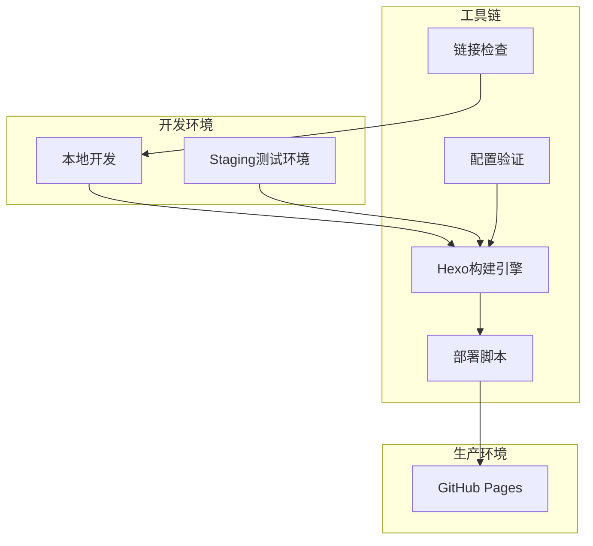
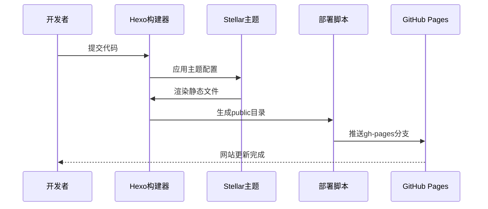
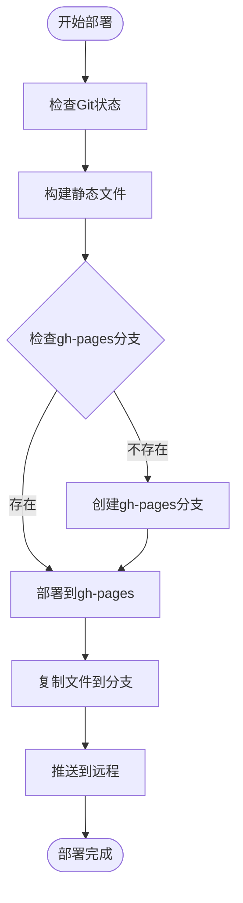
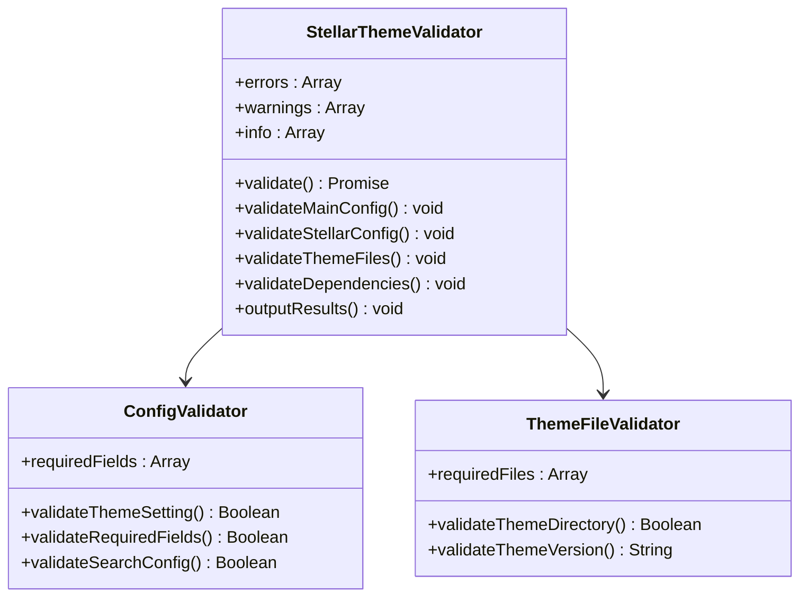
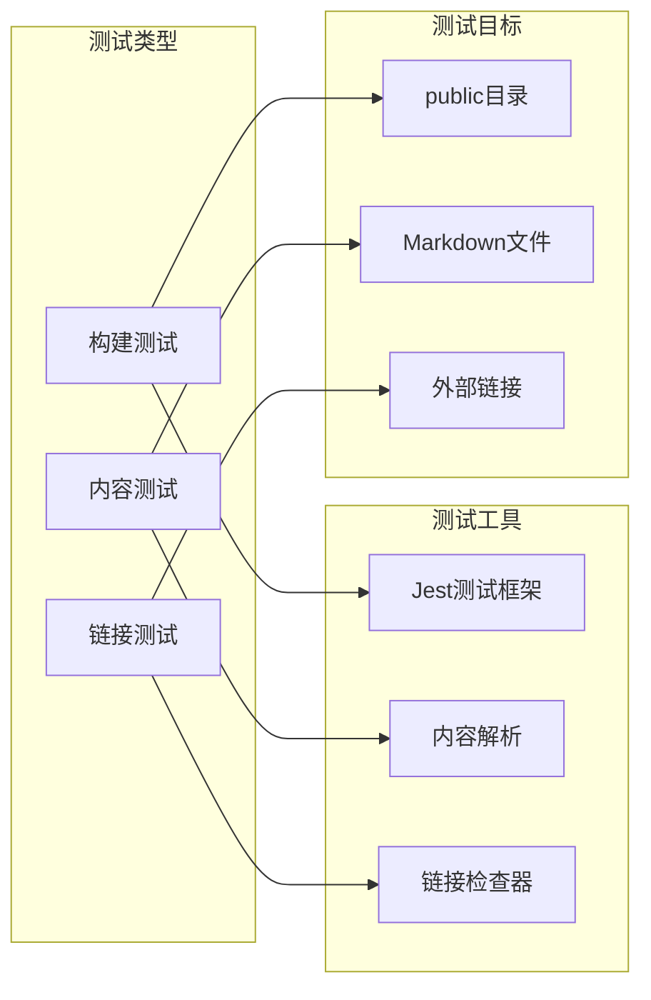
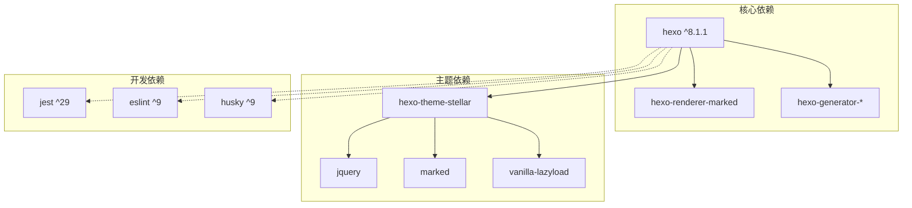
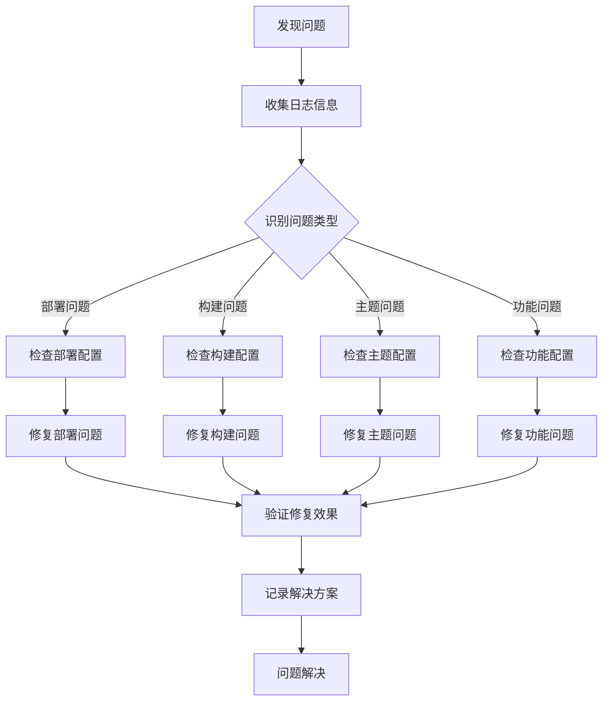

# 故障排除指南

<cite>
**本文档引用的文件**
- [package.json](file://package.json)
- [_config.yml](file://_config.yml)
- [_config_stellar.yml](file://_config_stellar.yml)
- [_config_staging.yml](file://_config_staging.yml)
- [tools/deploy.js](file://tools/deploy.js)
- [tools/validate-stellar-theme.js](file://tools/validate-stellar-theme.js)
- [tools/check-links.js](file://tools/check-links.js)
- [test/build.test.js](file://test/build.test.js)
- [test/content.test.js](file://test/content.test.js)
- [docs/STELLAR_DEPLOYMENT_GUIDE.md](file://docs/STELLAR_DEPLOYMENT_GUIDE.md)
- [docs/WORKFLOW.md](file://docs/WORKFLOW.md)
</cite>

## 目录
1. [简介](#简介)
2. [项目结构](#项目结构)
3. [核心组件](#核心组件)
4. [架构概览](#架构概览)
5. [详细组件分析](#详细组件分析)
6. [依赖关系分析](#依赖关系分析)
7. [性能考虑](#性能考虑)
8. [故障排除指南](#故障排除指南)
9. [结论](#结论)
10. [附录](#附录)

## 简介
本指南面向H1S97X博客的技术维护人员，提供系统化的故障排除方法。涵盖部署失败、构建错误、主题显示异常、功能失效等问题的诊断与解决流程，包括日志分析、配置检查、依赖验证、性能优化、调试工具使用、预防性维护等。

## 项目结构
H1S97X博客基于Hexo + Stellar主题，采用多环境部署策略（本地、Staging、生产），并通过GitHub Actions实现自动化CI/CD。



**图表来源**
- [package.json](file://package.json#L5-L41)
- [tools/deploy.js](file://tools/deploy.js#L12-L450)
- [_config_staging.yml](file://_config_staging.yml#L1-L33)

**章节来源**
- [package.json](file://package.json#L1-L94)
- [docs/WORKFLOW.md](file://docs/WORKFLOW.md#L1-L163)

## 核心组件
- **Hexo构建系统**：负责将Markdown内容转换为静态HTML页面
- **Stellar主题**：提供现代化的博客主题和丰富的功能插件
- **自动化部署**：通过Node.js脚本实现一键部署到GitHub Pages
- **配置验证**：确保主题配置的完整性和正确性
- **链接检查**：验证外部链接的有效性
- **测试框架**：Jest测试确保构建质量和内容完整性

**章节来源**
- [tools/validate-stellar-theme.js](file://tools/validate-stellar-theme.js#L12-L297)
- [tools/check-links.js](file://tools/check-links.js#L8-L126)
- [test/build.test.js](file://test/build.test.js#L5-L71)

## 架构概览
博客采用三层架构：内容层（Markdown）、渲染层（Hexo + Stellar）、部署层（GitHub Pages）。



**图表来源**
- [tools/deploy.js](file://tools/deploy.js#L383-L418)
- [docs/STELLAR_DEPLOYMENT_GUIDE.md](file://docs/STELLAR_DEPLOYMENT_GUIDE.md#L34-L43)

## 详细组件分析

### 部署系统分析
部署系统通过Node.js脚本实现完整的自动化流程，包括配置验证、构建、分支管理和部署。



**图表来源**
- [tools/deploy.js](file://tools/deploy.js#L383-L418)
- [tools/deploy.js](file://tools/deploy.js#L169-L219)

**章节来源**
- [tools/deploy.js](file://tools/deploy.js#L12-L472)

### 配置验证系统
配置验证工具确保Stellar主题的配置完整性和正确性，提供详细的错误和警告信息。



**图表来源**
- [tools/validate-stellar-theme.js](file://tools/validate-stellar-theme.js#L12-L297)

**章节来源**
- [tools/validate-stellar-theme.js](file://tools/validate-stellar-theme.js#L12-L313)

### 测试框架分析
测试框架包含构建测试、内容测试和链接检查，确保博客质量。



**图表来源**
- [test/build.test.js](file://test/build.test.js#L5-L71)
- [test/content.test.js](file://test/content.test.js#L5-L109)

**章节来源**
- [test/build.test.js](file://test/build.test.js#L1-L71)
- [test/content.test.js](file://test/content.test.js#L1-L109)

## 依赖关系分析
项目依赖关系主要围绕Hexo构建系统和Stellar主题展开。



**图表来源**
- [package.json](file://package.json#L45-L77)

**章节来源**
- [package.json](file://package.json#L45-L77)

## 性能考虑
针对H1S97X博客的性能优化建议：

### 构建性能优化
- **并行处理**：利用多核CPU并行执行构建任务
- **缓存策略**：启用npm缓存减少依赖安装时间
- **增量构建**：只构建变更的文件
- **资源压缩**：自动压缩CSS和JavaScript文件

### 运行时性能优化
- **懒加载**：图片和评论系统的懒加载
- **CDN加速**：使用CDN加速静态资源
- **缓存策略**：合理设置HTTP缓存头
- **资源优化**：压缩图片和视频文件

### 监控指标
- 构建时间：< 5分钟
- 生成文件数：~200+ HTML文件  
- 部署大小：< 50MB
- 页面加载：< 3秒

**章节来源**
- [docs/STELLAR_DEPLOYMENT_GUIDE.md](file://docs/STELLAR_DEPLOYMENT_GUIDE.md#L206-L215)

## 故障排除指南

### 部署失败排查

#### 1. 主题文件缺失
**症状**：构建时报错提示主题文件不存在
**排查步骤**：
1. 检查主题子模块状态：`npm run themes:status`
2. 初始化子模块：`git submodule update --init --recursive`
3. 验证主题文件完整性：`npm run themes:check`

**解决方案**：
```bash
# 检查主题状态
npm run themes:status

# 初始化主题子模块
git submodule update --init --recursive

# 验证主题文件
npm run themes:check
```

#### 2. 构建失败
**症状**：hexo generate命令执行失败
**排查步骤**：
1. 运行配置验证：`npm run stellar:validate`
2. 清理缓存后重新构建：`npm run clean && npm run build`
3. 检查关键文件生成：确认index.html、css/main.css、js/main.js存在

**解决方案**：
```bash
# 验证配置
npm run stellar:validate

# 清理并重建
npm run clean
npm run build

# 检查生成结果
ls -la public/
```

#### 3. 部署权限问题
**症状**：推送gh-pages分支失败
**排查步骤**：
1. 检查GitHub Token权限
2. 验证仓库Settings > Pages配置
3. 确认Actions权限设置

**解决方案**：
```bash
# 检查工作流配置
npm run workflows:check

# 生成详细报告
npm run workflows:report
```

### 构建错误排查

#### 1. 配置文件错误
**症状**：YAML解析错误或配置项缺失
**排查步骤**：
1. 检查_config.yml语法：`npm run stellar:validate`
2. 验证_stellar_config.yml完整性
3. 确认必需字段设置

**解决方案**：
```bash
# 运行配置验证
npm run stellar:validate

# 检查具体错误
cat workflow-check-report.json
```

#### 2. 依赖包问题
**症状**：npm install失败或依赖版本冲突
**排查步骤**：
1. 清理node_modules：`rm -rf node_modules`
2. 删除package-lock.json：`rm package-lock.json`
3. 重新安装：`npm ci`

**解决方案**：
```bash
# 清理依赖
rm -rf node_modules
rm package-lock.json

# 重新安装
npm ci

# 验证依赖
npm ls
```

### 主题显示异常排查

#### 1. 样式加载失败
**症状**：页面样式错乱或资源404
**排查步骤**：
1. 检查CSS文件生成：`ls -la public/css/`
2. 验证主题配置：`npm run stellar:validate`
3. 清理浏览器缓存

**解决方案**：
```bash
# 检查CSS文件
ls -la public/css/

# 重新构建
npm run clean && npm run build

# 清理浏览器缓存
# Ctrl+F5 强制刷新
```

#### 2. 导航菜单异常
**症状**：导航菜单不显示或链接错误
**排查步骤**：
1. 检查menubar配置：`_config_stellar.yml`
2. 验证菜单项完整性
3. 确认路径设置正确

**解决方案**：
```yaml
# 检查导航配置
menubar:
  columns: 4
  items:
    - id: post
      theme: '#1BCDFC'
      icon: solar:documents-bold-duotone
      title: 博客
      url: /
```

### 功能失效排查

#### 1. 搜索功能异常
**症状**：搜索框无响应或搜索结果为空
**排查步骤**：
1. 检查search配置：`_config_stellar.yml`
2. 验证search.json生成：`ls -la public/search.json`
3. 确认搜索引擎设置

**解决方案**：
```yaml
# 检查搜索配置
search:
  service: local_search
  local_search:
    field: all
    path: /search.json
    content: true
```

#### 2. 评论系统问题
**症状**：评论框不显示或无法提交
**排查步骤**：
1. 检查评论配置：`_config_stellar.yml`
2. 验证GitHub Discussions设置
3. 检查giscus.js加载

**解决方案**：
```yaml
# 检查评论配置
comments:
  service: giscus
  giscus:
    data-repo: h1s97x/H1S97X.github.io
    data-category: Announcements
```

### 调试工具使用

#### 1. 浏览器开发者工具
**使用场景**：页面渲染问题、JavaScript错误、网络请求问题
**调试步骤**：
1. 打开开发者工具（F12）
2. 切换到Console标签查看错误
3. 检查Network标签查看资源加载
4. 使用Elements标签检查DOM结构

#### 2. Node.js调试
**使用场景**：部署脚本问题、配置验证错误
**调试步骤**：
1. 运行脚本添加--dry-run预览
2. 检查详细日志输出
3. 使用Node.js内置调试器

#### 3. Hexo调试模式
**使用场景**：构建过程问题、主题渲染错误
**调试步骤**：
1. 启用调试模式：`hexo server --debug`
2. 查看详细构建日志
3. 检查主题渲染过程

### 预防性维护

#### 1. 定期检查清单
- **每周**：运行链接检查、检查外部链接有效性
- **每月**：更新依赖包、检查主题版本
- **每季度**：清理缓存文件、优化图片资源

#### 2. 备份策略
- **代码备份**：定期备份源代码和配置文件
- **数据备份**：备份评论数据和用户生成内容
- **环境备份**：保存完整的开发环境配置

#### 3. 更新管理
- **依赖更新**：定期检查npm依赖更新
- **主题更新**：关注Stellar主题更新日志
- **安全更新**：及时修复安全漏洞

### 实际故障案例

#### 案例1：Stellar主题配置错误
**问题描述**：构建时出现配置验证错误
**解决步骤**：
1. 运行配置验证：`npm run stellar:validate`
2. 检查错误输出中的具体配置项
3. 修正配置文件中的语法错误
4. 重新运行验证确认

**预防措施**：
- 使用YAML验证工具检查配置文件
- 建立配置变更审批流程

#### 案例2：GitHub Pages部署失败
**问题描述**：推送gh-pages分支时权限不足
**解决步骤**：
1. 检查GitHub Token权限设置
2. 验证仓库Settings > Pages配置
3. 确认Actions工作流权限
4. 重新触发部署流程

**预防措施**：
- 建立部署权限检查清单
- 定期测试部署流程

**章节来源**
- [docs/STELLAR_DEPLOYMENT_GUIDE.md](file://docs/STELLAR_DEPLOYMENT_GUIDE.md#L127-L250)

## 结论
通过建立完善的故障排除体系，包括系统化的诊断流程、详细的工具使用指南、预防性维护策略，可以有效提升H1S97X博客的稳定性和可靠性。建议团队定期回顾和更新故障排除流程，结合实际使用经验不断完善诊断方法和解决方案。

## 附录

### 常用命令速查
- **部署相关**：`npm run deploy`、`npm run deploy:preview`、`npm run deploy:check`
- **验证相关**：`npm run stellar:validate`、`npm run validate`、`npm run check-links`
- **测试相关**：`npm test`、`npm run test:watch`、`npm run test:coverage`
- **主题相关**：`npm run themes:status`、`npm run themes:check`、`npm run themes:update`

### 故障排除流程图

