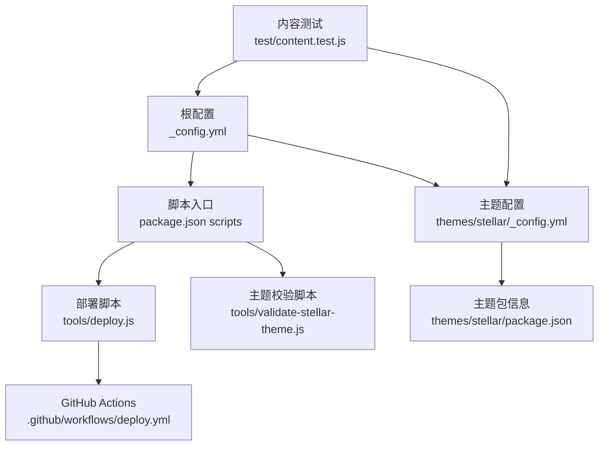
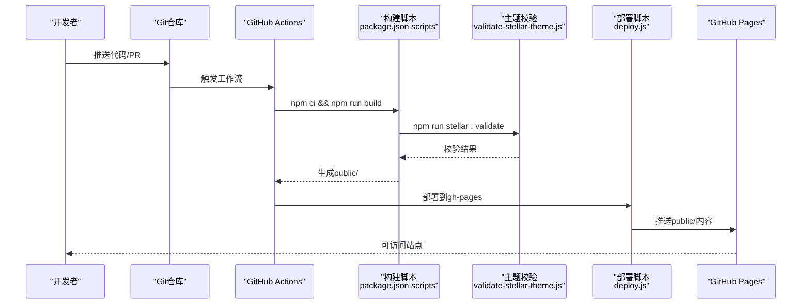
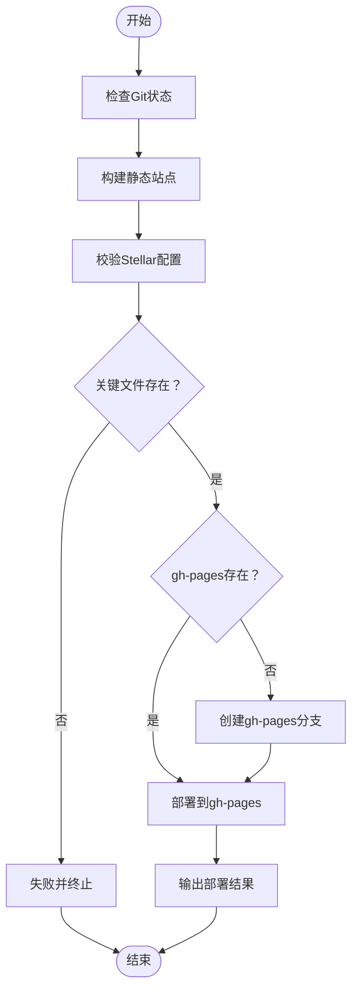
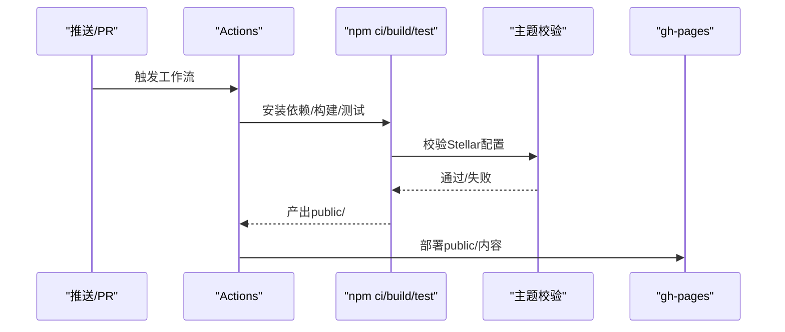
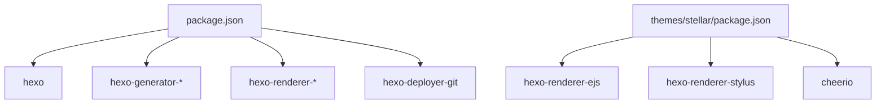

# 最佳实践

<cite>
**本文引用的文件**
- [_config.yml](file://_config.yml)
- [package.json](file://package.json)
- [themes/stellar/_config.yml](file://themes/stellar/_config.yml)
- [themes/butterfly/_config.yml](file://themes/butterfly/_config.yml)
- [themes/stellar/package.json](file://themes/stellar/package.json)
- [docs/WORKFLOW.md](file://docs/WORKFLOW.md)
- [docs/UPGRADE_GUIDE.md](file://docs/UPGRADE_GUIDE.md)
- [docs/BLOG_CLASSIFICATION_ANALYSIS.md](file://docs/BLOG_CLASSIFICATION_ANALYSIS.md)
- [.github/workflows/deploy.yml](file://.github/workflows/deploy.yml)
- [tools/deploy.js](file://tools/deploy.js)
- [tools/validate-stellar-theme.js](file://tools/validate-stellar-theme.js)
- [test/content.test.js](file://test/content.test.js)
</cite>

## 目录
1. [简介](#简介)
2. [项目结构](#项目结构)
3. [核心组件](#核心组件)
4. [架构总览](#架构总览)
5. [详细组件分析](#详细组件分析)
6. [依赖关系分析](#依赖关系分析)
7. [性能考虑](#性能考虑)
8. [故障排查指南](#故障排查指南)
9. [结论](#结论)
10. [附录](#附录)

## 简介
本指南面向H1S97X博客的开发与维护，基于仓库现有配置与脚本，总结可落地的最佳实践，覆盖代码组织、文档编写、版本控制与团队协作；同时给出内容创作规范、SEO优化、多媒体处理与用户体验设计建议；并提供性能优化策略、安全防护要点、主题与插件维护升级方法，以及可量化的实施案例与效果评估路径。

## 项目结构
该项目采用Hexo静态博客架构，结合Stellar主题与自动化部署流水线。核心结构要点：
- 配置层：根配置与主题配置分离，便于主题切换与主题内功能开关
- 主题层：Stellar为主题基座，提供现代化UI、搜索、评论、Mermaid/KaTeX等插件生态
- 工具层：Node脚本封装构建、校验、部署流程，配合GitHub Actions实现CI/CD
- 文档层：工作流、升级指南、分类分析等文档，支撑规范化协作
- 测试层：内容格式与链接校验，保障内容质量

**图表来源**
- [_config.yml](file://_config.yml#L1-L136)
- [themes/stellar/_config.yml](file://themes/stellar/_config.yml#L1-L725)
- [package.json](file://package.json#L1-L94)
- [tools/deploy.js](file://tools/deploy.js#L1-L472)
- [tools/validate-stellar-theme.js](file://tools/validate-stellar-theme.js#L1-L313)
- [.github/workflows/deploy.yml](file://.github/workflows/deploy.yml#L1-L87)
- [themes/stellar/package.json](file://themes/stellar/package.json#L1-L33)
- [test/content.test.js](file://test/content.test.js#L1-L109)

**章节来源**
- [_config.yml](file://_config.yml#L1-L136)
- [themes/stellar/_config.yml](file://themes/stellar/_config.yml#L1-L725)
- [package.json](file://package.json#L1-L94)

## 核心组件
- 配置与主题
  - 根配置[_config.yml]集中定义站点元信息、URL、分页、RSS、部署目标等
  - 主题配置[themes/stellar/_config.yml]定义导航、站点树、文章样式、搜索、评论、插件等
- 构建与校验
  - package.json scripts提供构建、清理、测试、校验、部署等标准化命令
  - tools/validate-stellar-theme.js对Stellar主题配置进行完整性与一致性校验
  - tools/deploy.js封装构建、分支准备、gh-pages部署与结果展示
- 自动化与测试
  - .github/workflows/deploy.yml在推送/PR时自动构建并部署到GitHub Pages
  - test/content.test.js对Markdown内容进行front matter与内部链接校验
- 文档与规范
  - docs/WORKFLOW.md定义分支策略、提交规范、PR审查清单与工具链
  - docs/UPGRADE_GUIDE.md提供主题升级与评论系统集成的实操指南
  - docs/BLOG_CLASSIFICATION_ANALYSIS.md提出分类与标签体系优化建议

**章节来源**
- [_config.yml](file://_config.yml#L1-L136)
- [themes/stellar/_config.yml](file://themes/stellar/_config.yml#L1-L725)
- [package.json](file://package.json#L1-L94)
- [tools/validate-stellar-theme.js](file://tools/validate-stellar-theme.js#L1-L313)
- [tools/deploy.js](file://tools/deploy.js#L1-L472)
- [.github/workflows/deploy.yml](file://.github/workflows/deploy.yml#L1-L87)
- [test/content.test.js](file://test/content.test.js#L1-L109)
- [docs/WORKFLOW.md](file://docs/WORKFLOW.md#L1-L163)
- [docs/UPGRADE_GUIDE.md](file://docs/UPGRADE_GUIDE.md#L1-L219)
- [docs/BLOG_CLASSIFICATION_ANALYSIS.md](file://docs/BLOG_CLASSIFICATION_ANALYSIS.md#L1-L175)

## 架构总览
下图展示了从内容提交到静态站点上线的端到端流程，强调“配置即约束、脚本即流程、动作即产物”的工程化闭环。

**图表来源**
- [.github/workflows/deploy.yml](file://.github/workflows/deploy.yml#L1-L87)
- [package.json](file://package.json#L1-L94)
- [tools/validate-stellar-theme.js](file://tools/validate-stellar-theme.js#L1-L313)
- [tools/deploy.js](file://tools/deploy.js#L1-L472)

## 详细组件分析

### 配置与主题最佳实践
- 分层配置
  - 根配置[_config.yml]仅保留站点级元信息、部署目标与通用生成器；主题细节下沉至主题配置[themes/stellar/_config.yml]
  - 优点：主题可独立演进，便于迁移与对比
- 主题配置要点
  - 导航与站点树：确保主页、博客列表、文章页、分类/标签/归档等页面均有明确布局与侧边栏配置
  - 搜索与评论：优先启用本地搜索与Giscus评论，兼顾性能与可用性
  - 插件生态：按需启用Mermaid/KaTeX/Fancybox等，避免过度依赖导致体积膨胀
- 版本与兼容
  - 主题版本在[themes/stellar/package.json]中声明，建议固定次要版本以保证稳定性

**章节来源**
- [_config.yml](file://_config.yml#L1-L136)
- [themes/stellar/_config.yml](file://themes/stellar/_config.yml#L1-L725)
- [themes/stellar/package.json](file://themes/stellar/package.json#L1-L33)

### 构建与校验流程
- 标准化命令
  - 清理、构建、校验、测试、部署均有明确脚本入口，降低心智负担
- 主题校验
  - validate-stellar-theme.js检查：主题设置、导航菜单、站点树、搜索与评论配置、插件启用状态、关键主题文件存在性、依赖完整性
- 部署脚本
  - deploy.js负责：Git状态检查、Stellar配置校验、子模块初始化、清理与构建、关键文件验证、gh-pages分支创建与更新、结果输出

**图表来源**
- [tools/deploy.js](file://tools/deploy.js#L1-L472)
- [tools/validate-stellar-theme.js](file://tools/validate-stellar-theme.js#L1-L313)

**章节来源**
- [package.json](file://package.json#L1-L94)
- [tools/validate-stellar-theme.js](file://tools/validate-stellar-theme.js#L1-L313)
- [tools/deploy.js](file://tools/deploy.js#L1-L472)

### 自动化与测试
- GitHub Actions
  - 支持在main/master/develop分支推送与PR触发，自动安装依赖、初始化子模块、校验Stellar配置、构建站点、部署到gh-pages
- 内容测试
  - test/content.test.js对Markdown文件进行front matter解析、空内容检测、内部相对链接可达性校验

**图表来源**
- [.github/workflows/deploy.yml](file://.github/workflows/deploy.yml#L1-L87)
- [test/content.test.js](file://test/content.test.js#L1-L109)

**章节来源**
- [.github/workflows/deploy.yml](file://.github/workflows/deploy.yml#L1-L87)
- [test/content.test.js](file://test/content.test.js#L1-L109)

### 内容创作与SEO优化
- 写作规范
  - 使用front matter统一声明title、date、tags、categories等元信息，确保生成器与主题渲染一致
  - 采用语义化标题层级，配合主题的TOC与侧边栏导航提升可读性
- SEO优化
  - RSS与站点地图：根配置启用feed与sitemap生成器，提升搜索引擎收录
  - Canonical与Open Graph：主题配置支持canonical与open_graph，避免重复收录与提升分享体验
- 多媒体处理
  - 图片懒加载与灯箱：启用lazyload与fancybox，兼顾性能与阅读体验
  - 数学公式与图表：KaTeX与Mermaid按需启用，注意与渲染器兼容性
- 用户体验
  - 深色模式与响应式：主题提供prefers-color-scheme与移动端适配，建议保持默认启用

**章节来源**
- [_config.yml](file://_config.yml#L115-L128)
- [themes/stellar/_config.yml](file://themes/stellar/_config.yml#L1-L725)

### 主题升级与维护
- 升级流程
  - 参考[docs/UPGRADE_GUIDE.md]，先备份，再引入新样式与脚本，更新模板，最后测试与部署
- 插件管理
  - 通过主题配置的plugins段落按需启用，避免不必要的外部CDN与脚本加载
- 安全更新
  - 定期运行npm audit与lint，保持依赖与主题版本稳定

**章节来源**
- [docs/UPGRADE_GUIDE.md](file://docs/UPGRADE_GUIDE.md#L1-L219)
- [themes/stellar/_config.yml](file://themes/stellar/_config.yml#L530-L632)

### 分类与标签体系优化
- 现状问题
  - 大量文章无分类/标签，标签散乱且重复度低，不利于内容发现
- 优化建议
  - 建立清晰的一级与二级分类体系，围绕“技术开发、系统运维、游戏世界、学术学习、工具软件、个人随笔、文学创作”划分
  - 设计高频技术标签、平台标签、技能标签与内容类型标签，形成可复用的标注体系
  - 分四阶段推进：制定规范、批量处理、人工优化、验证完善

**章节来源**
- [docs/BLOG_CLASSIFICATION_ANALYSIS.md](file://docs/BLOG_CLASSIFICATION_ANALYSIS.md#L1-L175)

## 依赖关系分析
- 主题依赖
  - Stellar主题依赖hexo-renderer-ejs、hexo-renderer-stylus、cheerio等，确保渲染与静态资源处理正常
- 项目依赖
  - package.json声明hexo、hexo-generator-*、hexo-renderer-*、hexo-deployer-git等，确保构建与部署链路稳定
- 插件生态
  - Mermaid、KaTeX、Fancybox等插件通过主题配置注入，按需启用

**图表来源**
- [package.json](file://package.json#L45-L67)
- [themes/stellar/package.json](file://themes/stellar/package.json#L1-L33)

**章节来源**
- [package.json](file://package.json#L1-L94)
- [themes/stellar/package.json](file://themes/stellar/package.json#L1-L33)

## 性能考虑
- 静态资源优化
  - 启用图片懒加载与CDN，减少首屏阻塞
  - 合理使用Mermaid/KaTeX，避免在首页大量渲染复杂图表
- 缓存策略
  - 利用GitHub Pages默认缓存与主题生成的静态资源指纹，减少重复下载
- 加载性能提升
  - 保持插件数量与体积可控，按需启用
  - 优化图片格式与尺寸，必要时使用WebP并提供fallback

[本节为通用指导，无需特定文件引用]

## 故障排查指南
- 构建失败
  - 检查主题配置校验是否通过：npm run stellar:validate
  - 确认子模块初始化：git submodule update --init --recursive
  - 核对public目录关键文件是否存在
- 部署异常
  - 使用--dry-run模式预演部署流程，定位分支与文件复制环节
  - 确认gh-pages分支存在且可推送
- 内容问题
  - 使用test/content.test.js检查front matter与内部链接
  - 对空内容与缺失内容发出告警，及时补充

**章节来源**
- [tools/validate-stellar-theme.js](file://tools/validate-stellar-theme.js#L1-L313)
- [tools/deploy.js](file://tools/deploy.js#L1-L472)
- [test/content.test.js](file://test/content.test.js#L1-L109)

## 结论
通过“配置即约束、脚本即流程、动作即产物”的工程化方法，H1S97X博客实现了可重复、可验证、可升级的静态站点交付体系。建议持续：
- 保持配置与脚本的最小可用集，逐步引入新能力
- 以文档驱动协作，用测试与校验保障质量
- 以用户为中心优化内容组织与呈现，提升可发现性与可读性
- 建立定期审计机制，确保依赖与主题版本稳定

[本节为总结性内容，无需特定文件引用]

## 附录
- 实施案例
  - 案例A：启用Giscus评论系统
    - 步骤：创建GitHub Discussions → 安装giscus应用 → 复制配置 → 在模板中添加容器与脚本 → 构建与部署
    - 效果：评论系统可用、性能更优、与主题深度集成
  - 案例B：批量优化分类与标签
    - 步骤：制定分类/标签规范 → 开发内容分析与批量更新工具 → 人工审核 → 统计验证
    - 效果：内容可发现性显著提升，维护成本下降
- 效果评估方法
  - 构建统计：生成HTML数量、public目录总大小
  - 质量指标：测试通过率、链接可用率、空内容告警数
  - 用户体验：TOC可用性、图片懒加载表现、移动端适配评分

**章节来源**
- [docs/UPGRADE_GUIDE.md](file://docs/UPGRADE_GUIDE.md#L1-L219)
- [docs/BLOG_CLASSIFICATION_ANALYSIS.md](file://docs/BLOG_CLASSIFICATION_ANALYSIS.md#L132-L175)
- [.github/workflows/deploy.yml](file://.github/workflows/deploy.yml#L48-L60)
- [test/content.test.js](file://test/content.test.js#L66-L87)