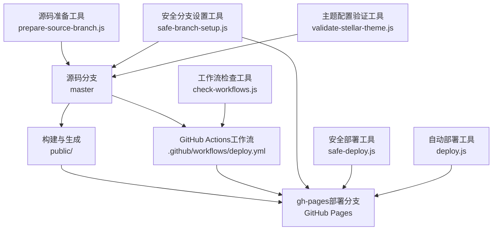
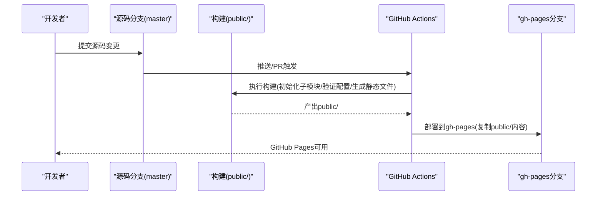
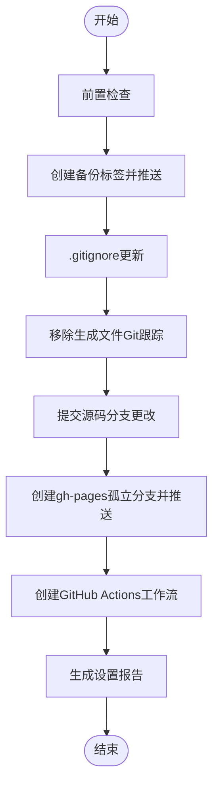
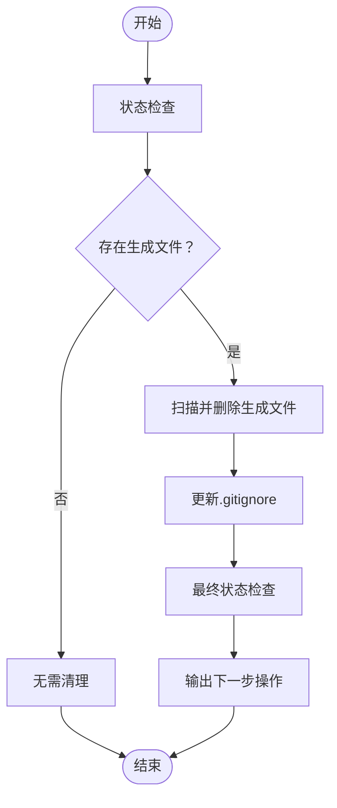
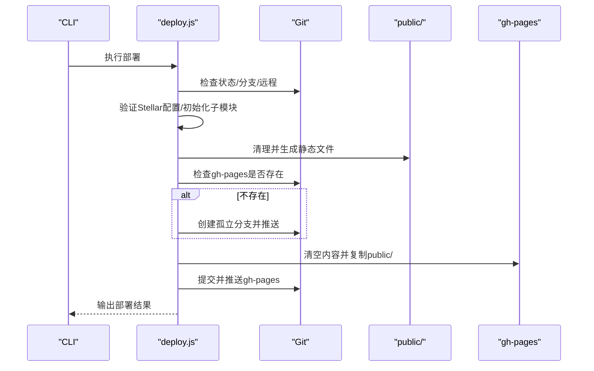
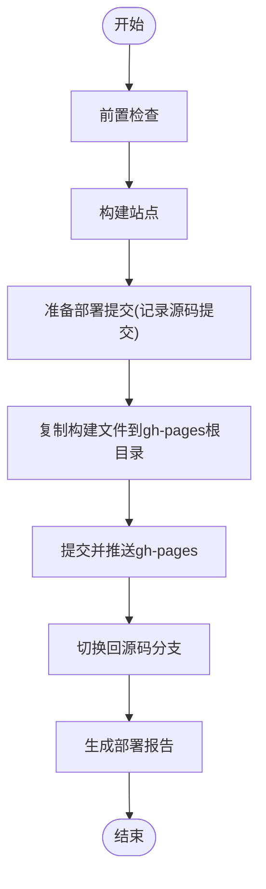
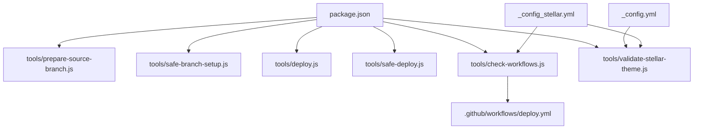
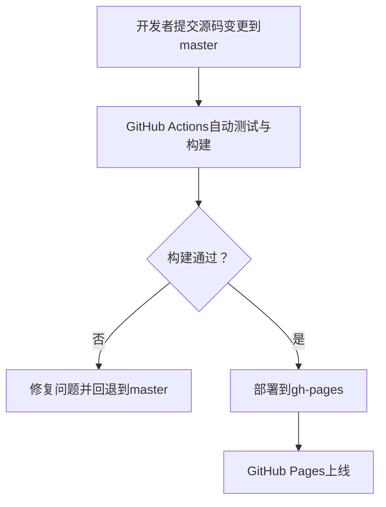

# 分支管理

<cite>
**本文引用的文件**
- [tools/safe-branch-setup.js](file://tools/safe-branch-setup.js)
- [tools/prepare-source-branch.js](file://tools/prepare-source-branch.js)
- [tools/deploy.js](file://tools/deploy.js)
- [tools/safe-deploy.js](file://tools/safe-deploy.js)
- [tools/check-workflows.js](file://tools/check-workflows.js)
- [tools/validate-stellar-theme.js](file://tools/validate-stellar-theme.js)
- [.github/workflows/deploy.yml](filefile://.github/workflows/deploy.yml)
- [package.json](file://package.json)
- [_config.yml](file://_config.yml)
- [_config_stellar.yml](file://_config_stellar.yml)
- [docs/BRANCH_SEPARATION_GUIDE.md](file://docs/BRANCH_SEPARATION_GUIDE.md)
</cite>

## 目录
1. [简介](#简介)
2. [项目结构](#项目结构)
3. [核心组件](#核心组件)
4. [架构总览](#架构总览)
5. [详细组件分析](#详细组件分析)
6. [依赖关系分析](#依赖关系分析)
7. [性能考量](#性能考量)
8. [故障排查指南](#故障排查指南)
9. [结论](#结论)
10. [附录](#附录)

## 简介
本文件面向H1S97X博客的分支管理策略，系统化阐述源码与部署分支分离的设计理念、实施流程与安全机制。重点覆盖：
- gh-pages部署分支的创建与维护
- 源码分支的准备与保护
- 安全配置工具对分支环境的保障（权限、合并策略、安全检查）
- 源码分支准备工具对生成文件的清理与隔离
- 分支命名规范、合并流程与冲突解决策略
- 开发/测试/生产环境的分支策略与自动化部署

## 项目结构
围绕分支管理的关键文件与目录如下：
- 工具层：tools/ 下的分支与部署相关脚本
- 配置层：_config.yml、_config_stellar.yml、package.json
- 工作流层：.github/workflows/deploy.yml
- 文档层：docs/BRANCH_SEPARATION_GUIDE.md

**图表来源**
- [tools/safe-branch-setup.js](file://tools/safe-branch-setup.js#L1-L414)
- [tools/prepare-source-branch.js](file://tools/prepare-source-branch.js#L1-L347)
- [tools/deploy.js](file://tools/deploy.js#L1-L472)
- [tools/safe-deploy.js](file://tools/safe-deploy.js#L1-L352)
- [tools/check-workflows.js](file://tools/check-workflows.js#L1-L315)
- [tools/validate-stellar-theme.js](file://tools/validate-stellar-theme.js#L1-L313)
- [.github/workflows/deploy.yml](file://.github/workflows/deploy.yml#L1-L87)

**章节来源**
- [package.json](file://package.json#L1-L94)
- [docs/BRANCH_SEPARATION_GUIDE.md](file://docs/BRANCH_SEPARATION_GUIDE.md#L1-L283)

## 核心组件
- 安全分支设置工具（safe-branch-setup.js）
  - 功能：创建备份标签、更新.gitignore、移除生成文件跟踪、创建孤立gh-pages分支、生成GitHub Actions工作流
  - 安全原则：零删除、可逆、多备份、分步执行、日志详尽
- 源码分支准备工具（prepare-source-branch.js）
  - 功能：扫描并删除生成文件、更新.gitignore、状态检查、生成下一步操作指引
- 自动部署工具（deploy.js）
  - 功能：构建站点、创建/校验gh-pages分支、复制public内容、提交并推送
- 安全部署工具（safe-deploy.js）
  - 功能：前置检查、构建、创建部署提交、复制构建产物、推送、回切源码分支
- 工作流检查工具（check-workflows.js）
  - 功能：校验工作流语法、子模块支持、Stellar主题验证、部署配置
- 主题配置验证工具（validate-stellar-theme.js）
  - 功能：校验主配置、Stellar配置、主题文件、依赖包
- GitHub Actions工作流（.github/workflows/deploy.yml）
  - 功能：在推送/PR触发时，构建Stellar主题并部署到gh-pages

**章节来源**
- [tools/safe-branch-setup.js](file://tools/safe-branch-setup.js#L1-L414)
- [tools/prepare-source-branch.js](file://tools/prepare-source-branch.js#L1-L347)
- [tools/deploy.js](file://tools/deploy.js#L1-L472)
- [tools/safe-deploy.js](file://tools/safe-deploy.js#L1-L352)
- [tools/check-workflows.js](file://tools/check-workflows.js#L1-L315)
- [tools/validate-stellar-theme.js](file://tools/validate-stellar-theme.js#L1-L313)
- [.github/workflows/deploy.yml](file://.github/workflows/deploy.yml#L1-L87)

## 架构总览
下图展示从源码到部署的端到端流程，强调“源码分支只含源码、部署分支只含生成文件”的分离原则。

**图表来源**
- [.github/workflows/deploy.yml](file://.github/workflows/deploy.yml#L1-L87)
- [tools/deploy.js](file://tools/deploy.js#L1-L472)
- [tools/safe-deploy.js](file://tools/safe-deploy.js#L1-L352)

## 详细组件分析

### 安全分支设置工具（safe-branch-setup.js）
- 安全原则与流程
  - 零删除：不使用删除命令，通过“移除跟踪”和“孤立分支”实现
  - 多备份：创建备份标签并推送至远程
  - 可逆：提供回滚命令
  - 分步：前置检查→备份→更新.gitignore→移除生成文件跟踪→提交→创建gh-pages→创建工作流→生成报告
- 关键步骤
  - 前置检查：工作区干净、当前分支、必要文件存在
  - 备份：创建备份标签并推送
  - .gitignore：追加忽略规则（public、dist、构建输出、临时文件等）
  - 移除跟踪：对生成文件执行“从跟踪中移除但保留本地”
  - 提交：提交源码分支配置
  - 创建gh-pages：创建孤立分支，清空跟踪，添加初始化说明，推送并回切
  - 创建工作流：生成GitHub Actions工作流文件
  - 报告：生成设置报告，包含后续步骤与回滚命令

**图表来源**
- [tools/safe-branch-setup.js](file://tools/safe-branch-setup.js#L62-L414)

**章节来源**
- [tools/safe-branch-setup.js](file://tools/safe-branch-setup.js#L1-L414)
- [docs/BRANCH_SEPARATION_GUIDE.md](file://docs/BRANCH_SEPARATION_GUIDE.md#L14-L40)

### 源码分支准备工具（prepare-source-branch.js）
- 目标：在master分支上清理生成文件，确保“源码分支只含源码”
- 关键能力
  - 生成文件识别与删除：public、db.json、sitemap、年份目录、静态资源目录等
  - 状态检查：列出仍存在的生成文件与源码文件
  - .gitignore更新：补充忽略规则
  - 指南输出：给出下一步操作（add/commit/push，创建gh-pages）

**图表来源**
- [tools/prepare-source-branch.js](file://tools/prepare-source-branch.js#L107-L304)

**章节来源**
- [tools/prepare-source-branch.js](file://tools/prepare-source-branch.js#L1-L347)
- [docs/BRANCH_SEPARATION_GUIDE.md](file://docs/BRANCH_SEPARATION_GUIDE.md#L59-L73)

### 自动部署工具（deploy.js）
- 目标：将public/内容安全部署到gh-pages分支
- 关键流程
  - Git状态检查：仓库、分支、未提交更改、远程
  - 构建：验证Stellar配置、初始化子模块、清理旧构建、生成静态文件
  - gh-pages检查/创建：若不存在则创建孤立分支并推送
  - 部署：清空gh-pages内容、复制public/、提交并推送
  - 结果：输出部署信息与注意事项

**图表来源**
- [tools/deploy.js](file://tools/deploy.js#L38-L418)

**章节来源**
- [tools/deploy.js](file://tools/deploy.js#L1-L472)

### 安全部署工具（safe-deploy.js）
- 目标：在master分支上安全构建并部署到gh-pages，保护源码、保留历史、支持回滚
- 关键流程
  - 前置检查：当前分支、工作区状态、public目录、gh-pages存在性
  - 构建：清理并构建
  - 准备部署提交：记录源码提交信息，生成部署信息文件
  - 复制构建文件：安全复制public/到gh-pages根目录
  - 提交与推送：添加、提交、推送
  - 回切源码分支：回到master
  - 报告：生成部署报告与故障排查建议

**图表来源**
- [tools/safe-deploy.js](file://tools/safe-deploy.js#L62-L340)

**章节来源**
- [tools/safe-deploy.js](file://tools/safe-deploy.js#L1-L352)

### 工作流检查工具（check-workflows.js）
- 目标：验证GitHub Actions工作流对Stellar主题的支持
- 关键检查
  - 基础结构：name/on/jobs
  - 子模块支持：actions/checkout启用submodules
  - 主题初始化：包含submodule update步骤
  - 配置验证：包含stellar:validate
  - 部署配置：使用peaceiris/actions-gh-pages且publish_dir为./public

**章节来源**
- [tools/check-workflows.js](file://tools/check-workflows.js#L1-L315)
- [.github/workflows/deploy.yml](file://.github/workflows/deploy.yml#L1-L87)

### 主题配置验证工具（validate-stellar-theme.js）
- 目标：验证主配置与Stellar主题配置的正确性
- 关键检查
  - 主配置：theme为stellar、基础字段、搜索配置
  - Stellar配置：导航菜单、站点结构、搜索、评论、插件启用情况
  - 主题文件：themes/stellar关键文件存在
  - 依赖包：Hexo版本、推荐插件依赖

**章节来源**
- [tools/validate-stellar-theme.js](file://tools/validate-stellar-theme.js#L1-L313)
- [_config.yml](file://_config.yml#L1-L136)
- [_config_stellar.yml](file://_config_stellar.yml#L1-L699)

## 依赖关系分析
- package.json
  - 定义构建脚本（build、build:test、build:staging）、部署脚本（deploy、deploy:manual、deploy:preview）、Stellar相关脚本（stellar:validate、stellar:test）
  - 作为工具链入口，驱动各工具执行
- _config.yml
  - 指定主题为stellar，部署类型与分支（用于传统部署方式）
- _config_stellar.yml
  - 定义Stellar主题的导航、站点结构、搜索、评论、插件等
- .github/workflows/deploy.yml
  - 定义在master/main/develop分支上的自动部署流程，包含子模块初始化、Stellar配置验证、构建与部署

**图表来源**
- [package.json](file://package.json#L1-L94)
- [_config.yml](file://_config.yml#L104-L136)
- [_config_stellar.yml](file://_config_stellar.yml#L1-L699)
- [tools/check-workflows.js](file://tools/check-workflows.js#L1-L315)
- [.github/workflows/deploy.yml](file://.github/workflows/deploy.yml#L1-L87)

**章节来源**
- [package.json](file://package.json#L1-L94)
- [_config.yml](file://_config.yml#L104-L136)
- [_config_stellar.yml](file://_config_stellar.yml#L1-L699)
- [.github/workflows/deploy.yml](file://.github/workflows/deploy.yml#L1-L87)

## 性能考量
- 构建阶段
  - 使用子模块初始化与Stellar配置验证，避免无效构建
  - 通过工作流检查工具提前发现配置问题，减少失败重试
- 部署阶段
  - 安全部署工具仅复制public/内容，避免不必要的文件操作
  - 自动部署工具在gh-pages分支清空后仅复制必要文件，降低推送体积
- 缓存与并行
  - GitHub Actions中启用npm缓存，缩短依赖安装时间
  - 构建与部署步骤按需并行，减少整体等待

[本节为通用指导，无需特定文件引用]

## 故障排查指南
- 网站显示404
  - 检查GitHub Pages设置中的分支与目录（gh-pages与根目录）
- 样式文件丢失
  - 检查_config.yml中的url与root配置
- GitHub Actions部署失败
  - 检查Actions权限、GITHUB_TOKEN、工作流语法与子模块初始化
- 本地部署工具失败
  - 检查Node.js版本、重新安装依赖、清理并重新构建

**章节来源**
- [docs/BRANCH_SEPARATION_GUIDE.md](file://docs/BRANCH_SEPARATION_GUIDE.md#L196-L242)

## 结论
通过“源码分支只含源码、部署分支只含生成文件”的分离策略，结合安全分支设置、源码准备、工作流验证与自动部署工具，H1S97X博客实现了：
- 高安全性（零删除、可逆、备份）
- 高可靠性（前置检查、详尽日志、报告）
- 高效率（自动化构建与部署、缓存与并行）
- 易维护（清晰的流程与文档）

[本节为总结，无需特定文件引用]

## 附录

### 分支管理最佳实践
- 分支命名规范
  - 源码分支：master（或main）
  - 部署分支：gh-pages
  - 功能分支：feature/xxx
  - 修复分支：fix/xxx
  - 发布分支：release/vX.Y.Z
- 合并流程
  - 从功能分支合并到master前，执行Stellar配置验证与测试
  - 使用squash合并保持提交历史整洁
- 冲突解决策略
  - 优先通过rebase保持线性历史
  - 生成文件冲突一律以源码为准，确保gh-pages只含生成文件

[本节为通用指导，无需特定文件引用]

### 分支管理流程图（开发/测试/生产）

[本图为概念流程，无需图表来源]