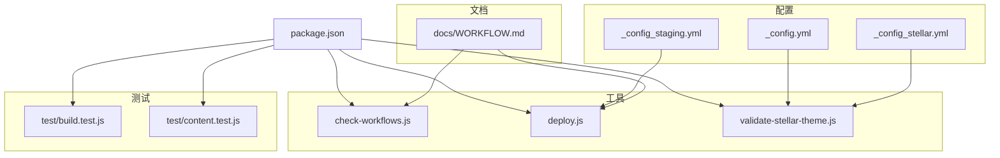
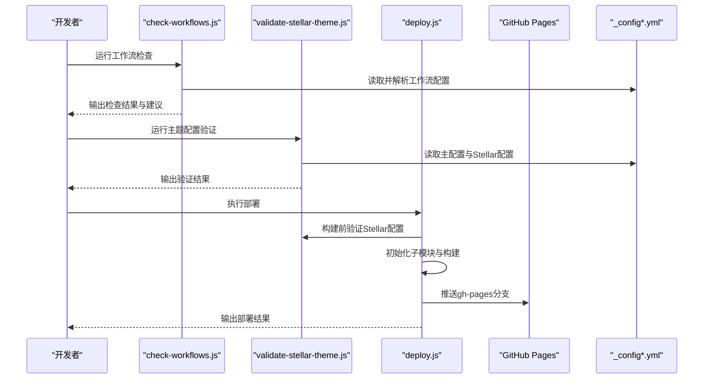
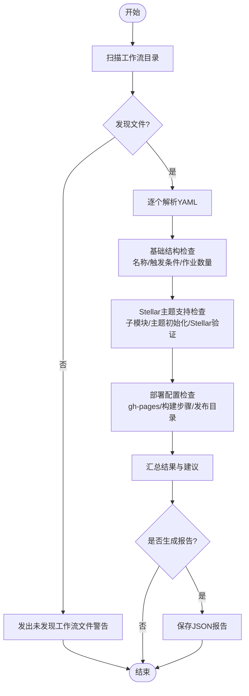
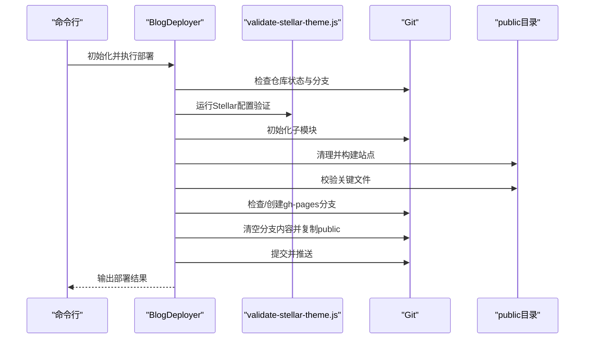
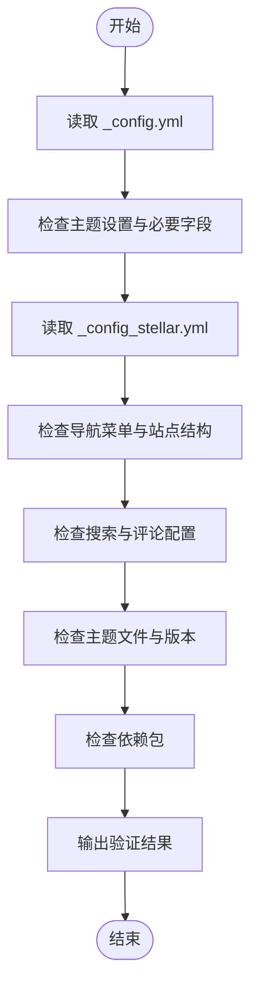
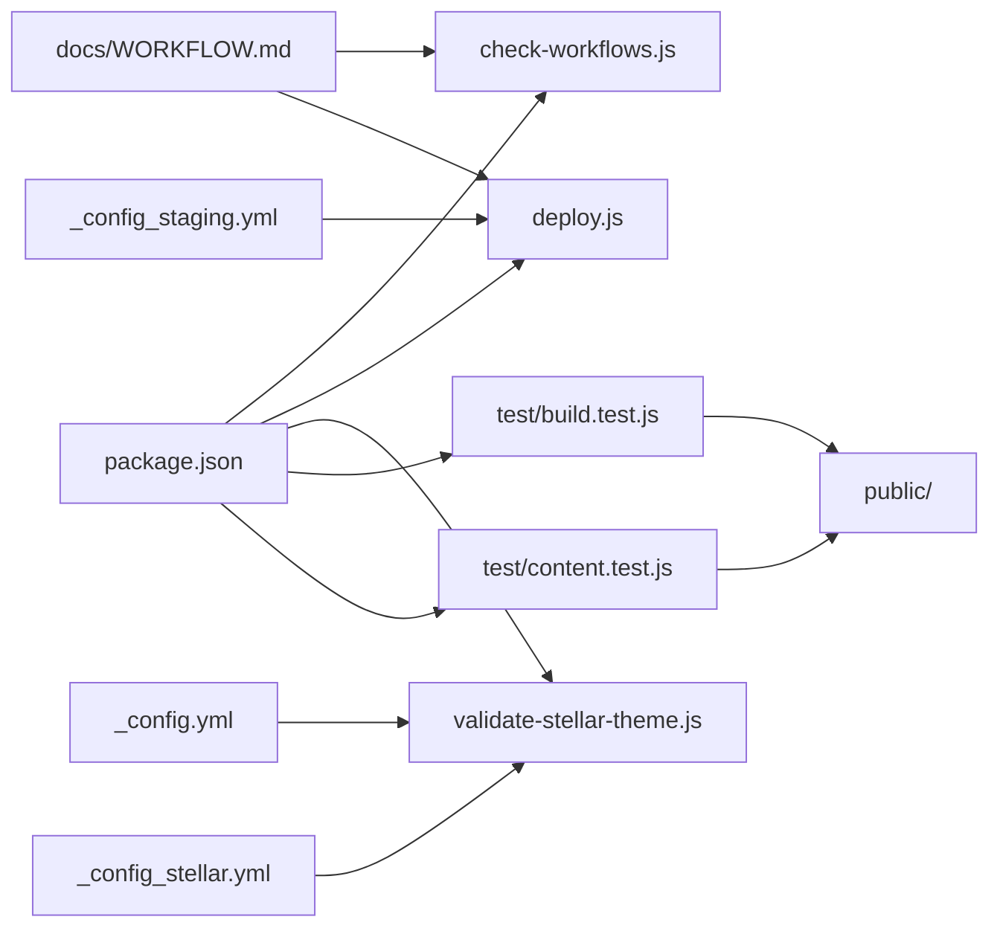

# 工作流管理

<cite>
**本文引用的文件**
- [tools/check-workflows.js](file://tools/check-workflows.js)
- [tools/deploy.js](file://tools/deploy.js)
- [tools/validate-stellar-theme.js](file://tools/validate-stellar-theme.js)
- [package.json](file://package.json)
- [_config.yml](file://_config.yml)
- [_config_stellar.yml](file://_config_stellar.yml)
- [_config.staging.yml](file://_config.staging.yml)
- [docs/WORKFLOW.md](file://docs/WORKFLOW.md)
- [test/build.test.js](file://test/build.test.js)
- [test/content.test.js](file://test/content.test.js)
</cite>

## 目录
1. [简介](#简介)
2. [项目结构](#项目结构)
3. [核心组件](#核心组件)
4. [架构总览](#架构总览)
5. [详细组件分析](#详细组件分析)
6. [依赖关系分析](#依赖关系分析)
7. [性能考量](#性能考量)
8. [故障排除指南](#故障排除指南)
9. [结论](#结论)
10. [附录](#附录)

## 简介
本文件面向H1S97X博客的CI/CD工作流管理，围绕check-workflows.js脚本对GitHub Actions工作流进行验证，解释工作流配置结构（触发事件、执行步骤、环境变量、部署策略），并提供最佳实践与故障排除建议。同时结合部署脚本与主题配置验证工具，形成从“配置校验—构建—部署”的闭环。

## 项目结构
本项目采用“主题驱动 + 工具链 + 配置文件”的组织方式：
- 工具层：tools目录包含工作流检查、部署、主题配置验证等脚本
- 配置层：_config.yml、_config_stellar.yml、_config.staging.yml分别定义站点、主题与环境配置
- 文档层：docs/WORKFLOW.md提供分支策略、开发与部署流程说明
- 测试层：test目录包含构建与内容的自动化测试

**图表来源**
- [tools/check-workflows.js](file://tools/check-workflows.js#L1-L315)
- [tools/deploy.js](file://tools/deploy.js#L1-L472)
- [tools/validate-stellar-theme.js](file://tools/validate-stellar-theme.js#L1-L313)
- [package.json](file://package.json#L1-L94)
- [_config.yml](file://_config.yml#L1-L136)
- [_config_stellar.yml](file://_config_stellar.yml#L1-L699)
- [_config.staging.yml](file://_config.staging.yml#L1-L33)
- [docs/WORKFLOW.md](file://docs/WORKFLOW.md#L1-L163)
- [test/build.test.js](file://test/build.test.js#L1-L71)
- [test/content.test.js](file://test/content.test.js#L1-L109)

**章节来源**
- [package.json](file://package.json#L1-L94)
- [docs/WORKFLOW.md](file://docs/WORKFLOW.md#L1-L163)

## 核心组件
- 工作流检查器（check-workflows.js）
  - 功能：扫描.github/workflows目录下的YAML工作流，验证基础结构、Stellar主题支持、子模块与部署配置，并生成报告
  - 关键检查点：工作流名称、触发条件、作业数量、actions/checkout子模块支持、主题初始化、Stellar配置验证、GitHub Pages部署与构建步骤
- 部署器（deploy.js）
  - 功能：构建Stellar主题站点，验证关键文件，创建/更新gh-pages分支并推送到GitHub Pages
  - 关键流程：Git状态检查、Stellar配置验证、子模块初始化、清理与构建、关键文件校验、分支切换与推送
- 主题配置验证器（validate-stellar-theme.js）
  - 功能：验证主配置与Stellar主题配置的正确性，检查主题文件存在性与依赖包
  - 关键检查点：主题设置、必要字段、导航菜单、站点结构、搜索与评论、插件启用状态、主题文件与版本、依赖包

**章节来源**
- [tools/check-workflows.js](file://tools/check-workflows.js#L12-L280)
- [tools/deploy.js](file://tools/deploy.js#L12-L450)
- [tools/validate-stellar-theme.js](file://tools/validate-stellar-theme.js#L12-L297)

## 架构总览
下图展示从工作流检查到部署的整体流程，以及与配置文件和测试的关系：

**图表来源**
- [tools/check-workflows.js](file://tools/check-workflows.js#L283-L313)
- [tools/validate-stellar-theme.js](file://tools/validate-stellar-theme.js#L22-L45)
- [tools/deploy.js](file://tools/deploy.js#L98-L164)
- [_config.yml](file://_config.yml#L104-L136)
- [_config_stellar.yml](file://_config_stellar.yml#L1-L699)

## 详细组件分析

### 工作流检查器（check-workflows.js）
- 职责与范围
  - 扫描工作流目录，解析YAML，逐项验证基础结构与Stellar主题支持
  - 识别子模块支持、主题初始化、Stellar配置验证、GitHub Pages部署与构建步骤
  - 生成控制台结果与JSON报告
- 关键算法与流程
  - 目录扫描与过滤：筛选.yml/.yaml文件
  - YAML解析与结构校验：名称、触发条件、作业定义
  - Steller支持检测：子模块、主题初始化、Stellar验证步骤
  - 部署配置检测：gh-pages动作、构建命令、发布目录
  - 结果汇总与建议：通过/警告/错误计数与优化建议

**图表来源**
- [tools/check-workflows.js](file://tools/check-workflows.js#L23-L190)
- [tools/check-workflows.js](file://tools/check-workflows.js#L195-L280)

**章节来源**
- [tools/check-workflows.js](file://tools/check-workflows.js#L23-L190)
- [tools/check-workflows.js](file://tools/check-workflows.js#L195-L280)

### 部署器（deploy.js）
- 职责与范围
  - 在本地构建Stellar主题站点，验证关键文件，创建/更新gh-pages分支并推送
  - 支持预览模式（dry-run）以模拟部署流程
- 关键流程
  - Git状态检查：仓库合法性、当前分支、未提交更改提示
  - 构建阶段：Stellar配置验证、子模块初始化、清理与构建、关键文件校验
  - 分支管理：检查/创建gh-pages、清空分支内容、复制public内容
  - 推送与收尾：提交、推送、切回原分支、输出部署信息

**图表来源**
- [tools/deploy.js](file://tools/deploy.js#L39-L418)
- [tools/validate-stellar-theme.js](file://tools/validate-stellar-theme.js#L22-L45)

**章节来源**
- [tools/deploy.js](file://tools/deploy.js#L39-L418)

### 主题配置验证器（validate-stellar-theme.js）
- 职责与范围
  - 验证主配置与Stellar主题配置的正确性，检查主题文件存在性与依赖包
- 关键流程
  - 主配置验证：主题设置、必要字段、搜索配置
  - Stellar配置验证：导航菜单、站点结构、搜索与评论、插件启用状态
  - 主题文件与版本：关键文件存在性、版本读取
  - 依赖包验证：Hexo版本、推荐依赖

**图表来源**
- [tools/validate-stellar-theme.js](file://tools/validate-stellar-theme.js#L50-L257)

**章节来源**
- [tools/validate-stellar-theme.js](file://tools/validate-stellar-theme.js#L50-L257)

## 依赖关系分析
- 脚本与配置
  - check-workflows.js依赖package.json中的脚本别名与工作流目录约定
  - deploy.js依赖_stellar.yml中的部署分支配置（staging分支）
  - validate-stellar-theme.js依赖_config.yml与_config_stellar.yml
- 测试与构建
  - test/build.test.js与test/content.test.js依赖构建产物public目录与生成的sitemap.xml、atom.xml等
- 文档与流程
  - docs/WORKFLOW.md定义分支策略与部署触发条件，指导CI/CD流程

**图表来源**
- [package.json](file://package.json#L5-L41)
- [_config.yml](file://_config.yml#L104-L136)
- [_config_stellar.yml](file://_config_stellar.yml#L1-L699)
- [_config.staging.yml](file://_config.staging.yml#L14-L17)
- [docs/WORKFLOW.md](file://docs/WORKFLOW.md#L86-L105)
- [test/build.test.js](file://test/build.test.js#L1-L71)
- [test/content.test.js](file://test/content.test.js#L1-L109)

**章节来源**
- [package.json](file://package.json#L5-L41)
- [_config.yml](file://_config.yml#L104-L136)
- [_config_stellar.yml](file://_config_stellar.yml#L1-L699)
- [_config.staging.yml](file://_config.staging.yml#L14-L17)
- [docs/WORKFLOW.md](file://docs/WORKFLOW.md#L86-L105)

## 性能考量
- 构建性能
  - 使用子模块递归初始化与清理后再构建，避免冗余文件影响构建速度
  - 建议在CI中缓存node_modules与主题资源，缩短构建时间
- 部署性能
  - 仅推送public目录变更，减少推送数据量
  - 预览模式（dry-run）用于快速验证部署流程，降低CI资源消耗
- 验证效率
  - 将Stellar配置验证前置到构建阶段，尽早暴露配置问题
  - 使用测试用例验证关键文件生成，确保部署产物质量

[本节为通用建议，无需特定文件引用]

## 故障排除指南
- 工作流检查常见问题
  - 未发现工作流文件：确认工作流目录存在且包含.yaml/.yml文件
  - 触发条件缺失：为工作流添加on字段（如push到master/develop）
  - 作业定义缺失：为工作流至少定义一个作业
  - 子模块支持未启用：在actions/checkout步骤中启用submodules
  - 缺少主题初始化：添加子模块更新或初始化步骤
  - 缺少Stellar配置验证：在构建前添加Stellar验证步骤
  - GitHub Pages部署目录不正确：确保publish_dir指向public
- 部署常见问题
  - 仓库非Git目录：确认当前工作目录为Git仓库
  - 未提交更改：在部署前提交或暂存更改；或使用预览模式
  - gh-pages分支不存在：首次部署会自动创建，若失败请手动创建并推送
  - 构建失败：检查Stellar配置验证与子模块初始化是否成功
  - 关键文件缺失：确认构建后public目录包含index.html、css、js、sitemap.xml等
- 配置验证常见问题
  - 主题设置错误：确保_config.yml中的theme为stellar
  - 导航菜单缺失：在_stellar.yml中配置menubar.items
  - 搜索/评论未配置：根据需要启用search与comments
  - 主题文件缺失：确认themes/stellar关键文件存在
  - 依赖包缺失：安装推荐依赖（如hexo-generator-searchdb、hexo-generator-sitemap）

**章节来源**
- [tools/check-workflows.js](file://tools/check-workflows.js#L26-L97)
- [tools/deploy.js](file://tools/deploy.js#L42-L93)
- [tools/deploy.js](file://tools/deploy.js#L106-L164)
- [tools/validate-stellar-theme.js](file://tools/validate-stellar-theme.js#L50-L257)

## 结论
通过check-workflows.js、deploy.js与validate-stellar-theme.js三者协同，H1S97X博客实现了对GitHub Actions工作流的全面校验、对Stellar主题的严格配置验证以及对站点构建与部署的自动化管理。配合docs/WORKFLOW.md的流程规范与test目录的自动化测试，整体CI/CD体系具备良好的可维护性与可扩展性。

[本节为总结性内容，无需特定文件引用]

## 附录

### 工作流配置最佳实践
- 触发条件
  - 为master与develop分别配置staging与production部署
  - 使用路径过滤与分支保护减少不必要的触发
- 执行步骤
  - 在构建前执行Stellar配置验证与子模块初始化
  - 使用稳定的actions版本（如actions/checkout@v4）
- 环境变量与密钥
  - 将部署密钥与仓库URL置于GitHub Secrets中
  - 为不同环境（staging/production）配置独立的发布分支
- 错误处理与回滚
  - 在部署失败时保留上次成功构建产物
  - 提供回滚到上一版本的快速通道

[本节为通用建议，无需特定文件引用]

### 配置示例与参考
- 部署分支配置（staging）
  - 参考_staging.yml中的deploy.branch设置为staging
- 构建与部署脚本
  - package.json中提供deploy、deploy:preview、deploy:stellar等脚本
- 测试与验证
  - test/build.test.js与test/content.test.js验证构建产物与内容格式

**章节来源**
- [_config.staging.yml](file://_config.staging.yml#L14-L17)
- [package.json](file://package.json#L10-L25)
- [test/build.test.js](file://test/build.test.js#L1-L71)
- [test/content.test.js](file://test/content.test.js#L1-L109)