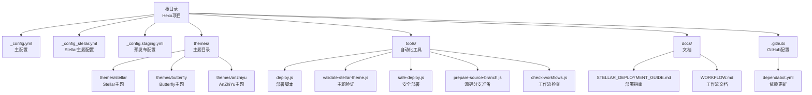
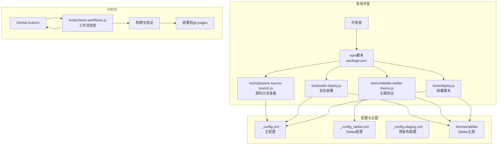
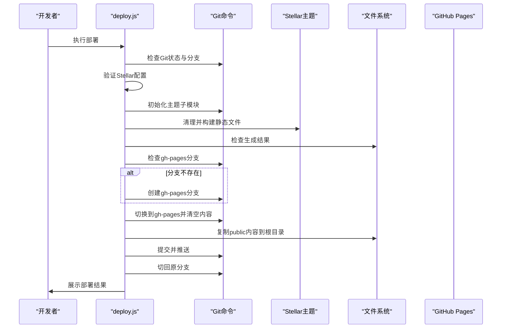
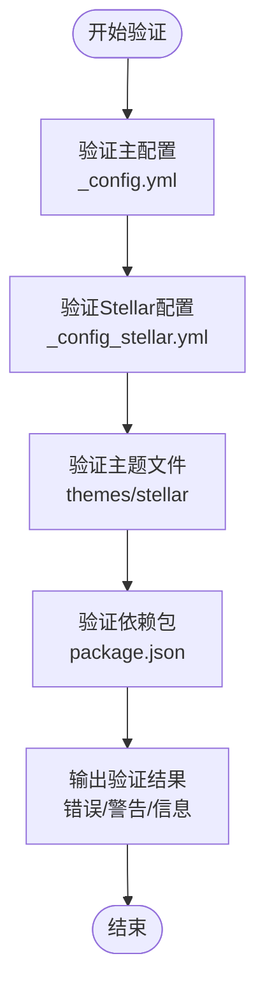
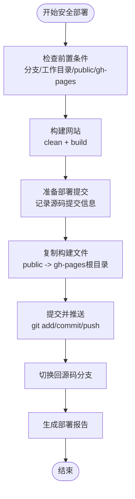
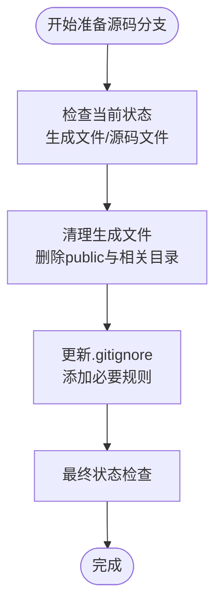
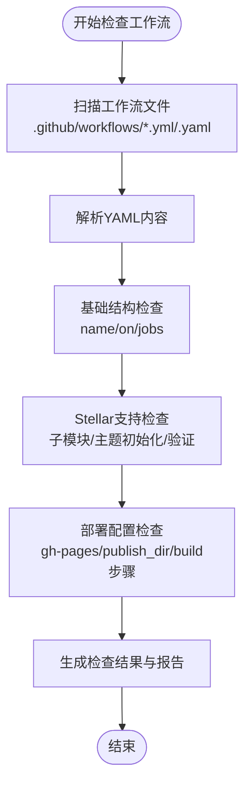
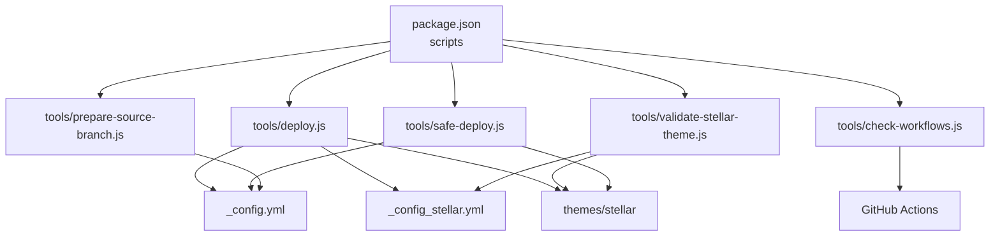
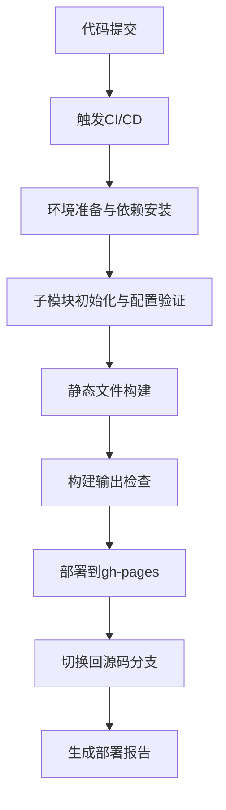

# 部署系统

<cite>
**本文引用的文件**
- [package.json](file://package.json)
- [_config.yml](file://_config.yml)
- [_config_stellar.yml](file://_config_stellar.yml)
- [_config.staging.yml](file://_config.staging.yml)
- [_config.anzhiyu.yml](file://_config.anzhiyu.yml)
- [tools/deploy.js](file://tools/deploy.js)
- [tools/validate-stellar-theme.js](file://tools/validate-stellar-theme.js)
- [tools/safe-deploy.js](file://tools/safe-deploy.js)
- [tools/prepare-source-branch.js](file://tools/prepare-source-branch.js)
- [tools/check-workflows.js](file://tools/check-workflows.js)
- [docs/STELLAR_DEPLOYMENT_GUIDE.md](file://docs/STELLAR_DEPLOYMENT_GUIDE.md)
- [docs/WORKFLOW.md](file://docs/WORKFLOW.md)
- [.github/dependabot.yml](file://.github/dependabot.yml)
</cite>

## 目录
1. [简介](#简介)
2. [项目结构](#项目结构)
3. [核心组件](#核心组件)
4. [架构概览](#架构概览)
5. [详细组件分析](#详细组件分析)
6. [依赖关系分析](#依赖关系分析)
7. [性能考虑](#性能考虑)
8. [故障排除指南](#故障排除指南)
9. [结论](#结论)
10. [附录](#附录)

## 简介
本文件为 H1S97X 博客的自动化部署系统提供全面技术文档。系统基于 Hexo + Stellar 主题，结合本地部署脚本、主题验证工具、CI/CD 工作流与分支管理策略，实现从 Git 状态检查、静态文件构建、GitHub Pages 部署到预览模式支持的完整自动化流程。文档重点涵盖：

- 部署脚本的工作原理与执行流程
- 主题验证工具的功能与验证维度
- CI/CD 工作流的配置与管理要点
- 分支管理策略与部署前安全检查
- 常见问题诊断与解决方案
- 部署流程图与配置示例

## 项目结构
该项目采用 Hexo 博客框架，结合多个主题（Stellar、Butterfly、AnZhiYu），并通过工具脚本实现自动化部署与验证。关键目录与文件如下：

- 根配置文件：_config.yml（主配置）、_config_stellar.yml（Stellar 主题配置）、_config.staging.yml（预发布配置）
- 主题目录：themes/stellar、themes/butterfly、themes/anzhiyu
- 工具脚本：tools/ 目录下的部署、验证、工作流检查等脚本
- 文档：docs/ 目录包含部署指南与工作流文档
- GitHub 配置：.github/ 目录包含 Dependabot 配置

**图表来源**
- [package.json](file://package.json#L1-L94)
- [_config.yml](file://_config.yml#L1-L136)
- [_config_stellar.yml](file://_config_stellar.yml#L1-L699)
- [_config.staging.yml](file://_config.staging.yml#L1-L33)
- [tools/deploy.js](file://tools/deploy.js#L1-L472)
- [tools/validate-stellar-theme.js](file://tools/validate-stellar-theme.js#L1-L313)
- [tools/safe-deploy.js](file://tools/safe-deploy.js#L1-L352)
- [tools/prepare-source-branch.js](file://tools/prepare-source-branch.js#L1-L347)
- [tools/check-workflows.js](file://tools/check-workflows.js#L1-L315)
- [docs/STELLAR_DEPLOYMENT_GUIDE.md](file://docs/STELLAR_DEPLOYMENT_GUIDE.md#L1-L256)
- [docs/WORKFLOW.md](file://docs/WORKFLOW.md#L1-L163)
- [.github/dependabot.yml](file://.github/dependabot.yml#L1-L8)

**章节来源**
- [package.json](file://package.json#L1-L94)
- [_config.yml](file://_config.yml#L1-L136)
- [_config_stellar.yml](file://_config_stellar.yml#L1-L699)
- [_config.staging.yml](file://_config.staging.yml#L1-L33)
- [tools/deploy.js](file://tools/deploy.js#L1-L472)
- [tools/validate-stellar-theme.js](file://tools/validate-stellar-theme.js#L1-L313)
- [tools/safe-deploy.js](file://tools/safe-deploy.js#L1-L352)
- [tools/prepare-source-branch.js](file://tools/prepare-source-branch.js#L1-L347)
- [tools/check-workflows.js](file://tools/check-workflows.js#L1-L315)
- [docs/STELLAR_DEPLOYMENT_GUIDE.md](file://docs/STELLAR_DEPLOYMENT_GUIDE.md#L1-L256)
- [docs/WORKFLOW.md](file://docs/WORKFLOW.md#L1-L163)
- [.github/dependabot.yml](file://.github/dependabot.yml#L1-L8)

## 核心组件
本系统的四个核心组件分别负责不同职责，协同完成自动化部署与验证：

- 部署脚本（tools/deploy.js）：执行 Git 状态检查、构建静态文件、创建/更新 gh-pages 分支并部署到 GitHub Pages，支持预览模式。
- 主题验证工具（tools/validate-stellar-theme.js）：验证主配置与 Stellar 主题配置的正确性与完整性，检查主题文件存在性与依赖包。
- 安全部署工具（tools/safe-deploy.js）：在受控环境下执行部署，遵循“保护源码、保留历史、支持回滚”的安全原则。
- 源码分支准备工具（tools/prepare-source-branch.js）：清理生成文件，准备纯净的源码分支，更新 .gitignore 规则。

此外，工作流检查工具（tools/check-workflows.js）用于验证 GitHub Actions 工作流对 Stellar 主题的支持程度；根配置文件（_config.yml、_config_stellar.yml、_config.staging.yml）定义站点与主题行为；部署指南与工作流文档提供操作指导与最佳实践。

**章节来源**
- [tools/deploy.js](file://tools/deploy.js#L1-L472)
- [tools/validate-stellar-theme.js](file://tools/validate-stellar-theme.js#L1-L313)
- [tools/safe-deploy.js](file://tools/safe-deploy.js#L1-L352)
- [tools/prepare-source-branch.js](file://tools/prepare-source-branch.js#L1-L347)
- [tools/check-workflows.js](file://tools/check-workflows.js#L1-L315)
- [_config.yml](file://_config.yml#L1-L136)
- [_config_stellar.yml](file://_config_stellar.yml#L1-L699)
- [_config.staging.yml](file://_config.staging.yml#L1-L33)
- [docs/STELLAR_DEPLOYMENT_GUIDE.md](file://docs/STELLAR_DEPLOYMENT_GUIDE.md#L1-L256)
- [docs/WORKFLOW.md](file://docs/WORKFLOW.md#L1-L163)

## 架构概览
系统采用“本地脚本 + CI/CD + 主题验证 + 分支管理”的整体架构。本地部署脚本与 CI/CD 工作流共同保证部署质量与一致性，主题验证工具贯穿构建前后的质量门禁，源码分支准备工具确保源码与生成文件分离，便于版本控制与审计。

**图表来源**
- [package.json](file://package.json#L5-L40)
- [tools/deploy.js](file://tools/deploy.js#L1-L472)
- [tools/validate-stellar-theme.js](file://tools/validate-stellar-theme.js#L1-L313)
- [tools/safe-deploy.js](file://tools/safe-deploy.js#L1-L352)
- [tools/prepare-source-branch.js](file://tools/prepare-source-branch.js#L1-L347)
- [tools/check-workflows.js](file://tools/check-workflows.js#L1-L315)
- [_config.yml](file://_config.yml#L1-L136)
- [_config_stellar.yml](file://_config_stellar.yml#L1-L699)
- [_config.staging.yml](file://_config.staging.yml#L1-L33)

**章节来源**
- [package.json](file://package.json#L5-L40)
- [tools/deploy.js](file://tools/deploy.js#L1-L472)
- [tools/validate-stellar-theme.js](file://tools/validate-stellar-theme.js#L1-L313)
- [tools/safe-deploy.js](file://tools/safe-deploy.js#L1-L352)
- [tools/prepare-source-branch.js](file://tools/prepare-source-branch.js#L1-L347)
- [tools/check-workflows.js](file://tools/check-workflows.js#L1-L315)
- [_config.yml](file://_config.yml#L1-L136)
- [_config_stellar.yml](file://_config_stellar.yml#L1-L699)
- [_config.staging.yml](file://_config.staging.yml#L1-L33)

## 详细组件分析

### 部署脚本（tools/deploy.js）
部署脚本负责完整的自动化部署流程，包括 Git 状态检查、Stellar 主题配置验证、主题子模块初始化、静态文件构建、gh-pages 分支创建与部署、结果展示与错误恢复。

**图表来源**
- [tools/deploy.js](file://tools/deploy.js#L383-L418)
- [tools/deploy.js](file://tools/deploy.js#L42-L93)
- [tools/deploy.js](file://tools/deploy.js#L98-L164)
- [tools/deploy.js](file://tools/deploy.js#L169-L219)
- [tools/deploy.js](file://tools/deploy.js#L224-L303)
- [tools/deploy.js](file://tools/deploy.js#L350-L378)

**章节来源**
- [tools/deploy.js](file://tools/deploy.js#L1-L472)

### 主题验证工具（tools/validate-stellar-theme.js）
主题验证工具对主配置与 Stellar 主题配置进行严格校验，包括主题设置、导航菜单、站点结构、搜索与评论配置、主题文件完整性与依赖包版本等。

**图表来源**
- [tools/validate-stellar-theme.js](file://tools/validate-stellar-theme.js#L22-L45)
- [tools/validate-stellar-theme.js](file://tools/validate-stellar-theme.js#L50-L89)
- [tools/validate-stellar-theme.js](file://tools/validate-stellar-theme.js#L94-L173)
- [tools/validate-stellar-theme.js](file://tools/validate-stellar-theme.js#L178-L214)
- [tools/validate-stellar-theme.js](file://tools/validate-stellar-theme.js#L219-L257)
- [tools/validate-stellar-theme.js](file://tools/validate-stellar-theme.js#L262-L296)

**章节来源**
- [tools/validate-stellar-theme.js](file://tools/validate-stellar-theme.js#L1-L313)

### 安全部署工具（tools/safe-deploy.js）
安全部署工具强调“保护源码、保留历史、支持回滚”，在执行部署前进行严格的前置条件检查，构建网站并生成部署信息文件，复制构建产物到 gh-pages 分支，提交并推送，最后切换回源码分支并生成部署报告。

**图表来源**
- [tools/safe-deploy.js](file://tools/safe-deploy.js#L291-L340)
- [tools/safe-deploy.js](file://tools/safe-deploy.js#L62-L116)
- [tools/safe-deploy.js](file://tools/safe-deploy.js#L118-L139)
- [tools/safe-deploy.js](file://tools/safe-deploy.js#L141-L171)
- [tools/safe-deploy.js](file://tools/safe-deploy.js#L173-L212)
- [tools/safe-deploy.js](file://tools/safe-deploy.js#L214-L249)
- [tools/safe-deploy.js](file://tools/safe-deploy.js#L251-L258)
- [tools/safe-deploy.js](file://tools/safe-deploy.js#L260-L289)

**章节来源**
- [tools/safe-deploy.js](file://tools/safe-deploy.js#L1-L352)

### 源码分支准备工具（tools/prepare-source-branch.js）
该工具用于准备纯净的源码分支，清理生成文件（public、生成的静态文件、年份目录等），检查源码文件存在性，更新 .gitignore 规则，并提供状态检查与帮助信息。

**图表来源**
- [tools/prepare-source-branch.js](file://tools/prepare-source-branch.js#L273-L304)
- [tools/prepare-source-branch.js](file://tools/prepare-source-branch.js#L107-L152)
- [tools/prepare-source-branch.js](file://tools/prepare-source-branch.js#L157-L193)
- [tools/prepare-source-branch.js](file://tools/prepare-source-branch.js#L198-L268)

**章节来源**
- [tools/prepare-source-branch.js](file://tools/prepare-source-branch.js#L1-L347)

### 工作流检查工具（tools/check-workflows.js）
工作流检查工具扫描 .github/workflows 目录下的 YAML 文件，验证工作流的基础结构、Stellar 主题支持（子模块、主题初始化、配置验证）、GitHub Pages 部署配置与构建步骤，并生成检查结果与优化建议。

**图表来源**
- [tools/check-workflows.js](file://tools/check-workflows.js#L23-L49)
- [tools/check-workflows.js](file://tools/check-workflows.js#L54-L74)
- [tools/check-workflows.js](file://tools/check-workflows.js#L79-L98)
- [tools/check-workflows.js](file://tools/check-workflows.js#L103-L150)
- [tools/check-workflows.js](file://tools/check-workflows.js#L155-L190)
- [tools/check-workflows.js](file://tools/check-workflows.js#L195-L248)

**章节来源**
- [tools/check-workflows.js](file://tools/check-workflows.js#L1-L315)

### 配置文件与主题设置
- 主配置（_config.yml）：定义站点标题、URL、主题、RSS、部署配置等。
- Stellar 主题配置（_config_stellar.yml）：定义导航菜单、站点结构树、文章布局、评论系统、插件与样式等。
- 预发布配置（_config.staging.yml）：为 staging 环境提供独立的 URL、分支与调试配置。
- 其他主题配置（_config.anzhiyu.yml）：为 AnZhiYu 主题提供额外配置。

这些配置文件与工具脚本配合，确保构建与部署的一致性与可维护性。

**章节来源**
- [_config.yml](file://_config.yml#L1-L136)
- [_config_stellar.yml](file://_config_stellar.yml#L1-L699)
- [_config.staging.yml](file://_config.staging.yml#L1-L33)
- [_config.anzhiyu.yml](file://_config.anzhiyu.yml#L1-L800)

## 依赖关系分析
系统通过 npm 脚本统一调度各工具，形成清晰的依赖关系与调用链：

**图表来源**
- [package.json](file://package.json#L5-L40)
- [tools/deploy.js](file://tools/deploy.js#L1-L472)
- [tools/validate-stellar-theme.js](file://tools/validate-stellar-theme.js#L1-L313)
- [tools/safe-deploy.js](file://tools/safe-deploy.js#L1-L352)
- [tools/prepare-source-branch.js](file://tools/prepare-source-branch.js#L1-L347)
- [tools/check-workflows.js](file://tools/check-workflows.js#L1-L315)
- [_config.yml](file://_config.yml#L1-L136)
- [_config_stellar.yml](file://_config_stellar.yml#L1-L699)

**章节来源**
- [package.json](file://package.json#L5-L40)
- [tools/deploy.js](file://tools/deploy.js#L1-L472)
- [tools/validate-stellar-theme.js](file://tools/validate-stellar-theme.js#L1-L313)
- [tools/safe-deploy.js](file://tools/safe-deploy.js#L1-L352)
- [tools/prepare-source-branch.js](file://tools/prepare-source-branch.js#L1-L347)
- [tools/check-workflows.js](file://tools/check-workflows.js#L1-L315)

## 性能考虑
- 构建性能：启用 npm 缓存、并行执行验证与测试任务、使用增量构建减少重复工作。
- 部署性能：使用 force_orphan 清理历史、压缩静态资源、启用 CDN 加速。
- 监控指标：构建时间 < 5 分钟、生成文件数 ~200+、部署大小 < 50MB、页面加载 < 3 秒。
- 依赖管理：通过 Dependabot 自动化依赖更新，限制 PR 数量，降低维护成本。

**章节来源**
- [docs/STELLAR_DEPLOYMENT_GUIDE.md](file://docs/STELLAR_DEPLOYMENT_GUIDE.md#L200-L216)
- [.github/dependabot.yml](file://.github/dependabot.yml#L1-L8)

## 故障排除指南
常见问题与解决方案：

- 主题文件缺失
  - 现象：构建失败或缺少主题文件
  - 解决：初始化子模块并检查主题状态
  - 参考命令：git submodule update --init --recursive；npm run themes:status

- 构建失败
  - 现象：生成失败或关键文件缺失
  - 解决：运行主题验证与清理重建
  - 参考命令：npm run stellar:validate；npm run clean；npm run build

- 部署权限问题
  - 现象：推送失败或权限不足
  - 解决：检查 GitHub Actions token 权限与仓库 Settings > Pages 配置

- 页面显示异常
  - 现象：样式丢失、链接错误
  - 解决：检查 _config.yml 中的 url 与 root 配置，确认资源文件生成

- 已知问题（Stellar 主题 json_ld helper 错误）
  - 现象：构建过程中出现特定错误
  - 影响：不影响最终网站生成
  - 解决：忽略该错误，网站仍可正常生成

- 工作流状态检查
  - 现象：工作流配置不正确
  - 解决：使用工作流检查工具生成报告并修复
  - 参考命令：npm run workflows:check；npm run workflows:report；cat workflow-check-report.json

**章节来源**
- [docs/STELLAR_DEPLOYMENT_GUIDE.md](file://docs/STELLAR_DEPLOYMENT_GUIDE.md#L127-L197)
- [tools/deploy.js](file://tools/deploy.js#L38-L93)
- [tools/validate-stellar-theme.js](file://tools/validate-stellar-theme.js#L1-L313)
- [tools/check-workflows.js](file://tools/check-workflows.js#L1-L315)

## 结论
本部署系统通过本地脚本与 CI/CD 工具的有机结合，实现了从 Git 状态检查、静态文件构建、主题验证到 GitHub Pages 部署的全流程自动化。配合严格的分支管理策略与安全部署原则，系统在保证部署效率的同时，兼顾了安全性与可维护性。建议在日常开发中持续使用主题验证与工作流检查工具，确保配置正确与流程稳定。

## 附录
- 部署流程图（概念性）

- 配置示例（节选）
  - 主配置（_config.yml）：设置 theme: stellar、url、language 等
  - Stellar 配置（_config_stellar.yml）：配置导航菜单、站点结构树、搜索与评论系统
  - 预发布配置（_config.staging.yml）：设置 staging 环境的 URL、分支与调试选项

**章节来源**
- [docs/STELLAR_DEPLOYMENT_GUIDE.md](file://docs/STELLAR_DEPLOYMENT_GUIDE.md#L90-L108)
- [_config.yml](file://_config.yml#L1-L136)
- [_config_stellar.yml](file://_config_stellar.yml#L1-L699)
- [_config.staging.yml](file://_config.staging.yml#L1-L33)