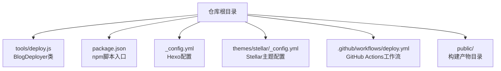
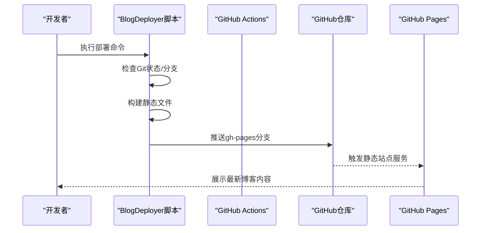
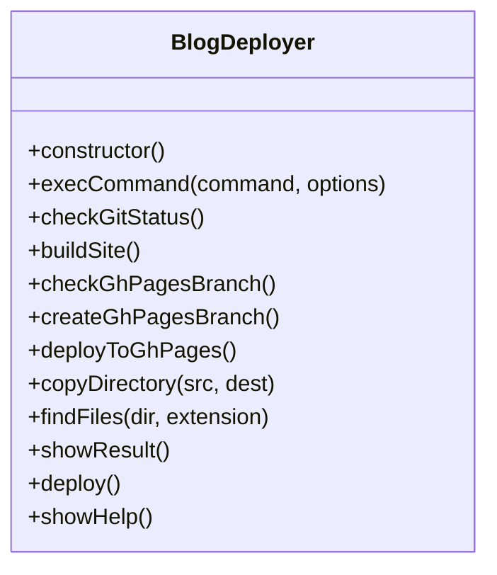
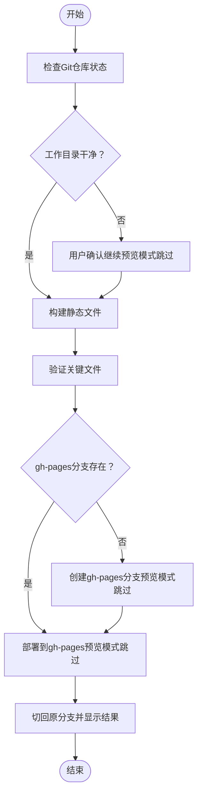
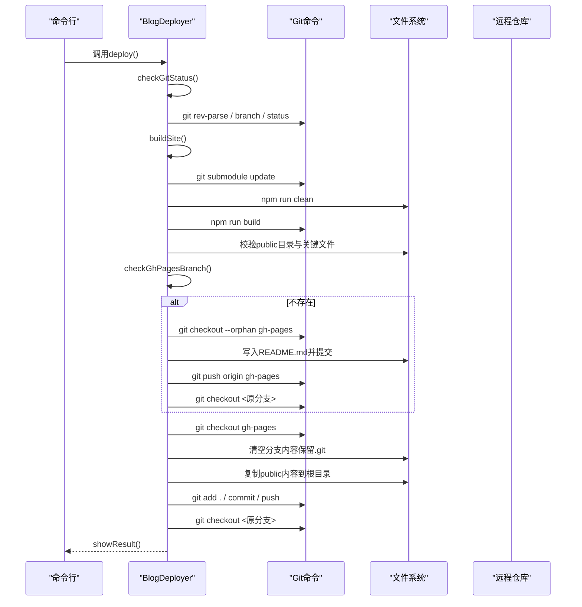
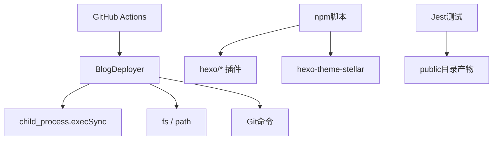

# 部署脚本

<cite>
**本文引用的文件**
- [tools/deploy.js](file://tools/deploy.js)
- [package.json](file://package.json)
- [_config.yml](file://_config.yml)
- [themes/stellar/_config.yml](file://themes/stellar/_config.yml)
- [.github/workflows/deploy.yml](file://.github/workflows/deploy.yml)
- [docs/STELLAR_DEPLOYMENT_GUIDE.md](file://docs/STELLAR_DEPLOYMENT_GUIDE.md)
- [tools/safe-deploy.js](file://tools/safe-deploy.js)
- [test/build.test.js](file://test/build.test.js)
</cite>

## 目录
1. [简介](#简介)
2. [项目结构](#项目结构)
3. [核心组件](#核心组件)
4. [架构概览](#架构概览)
5. [详细组件分析](#详细组件分析)
6. [依赖关系分析](#依赖关系分析)
7. [性能考量](#性能考量)
8. [故障排除指南](#故障排除指南)
9. [结论](#结论)
10. [附录](#附录)

## 简介
本文件面向H1S97X博客的部署脚本，聚焦于BlogDeployer类的实现与使用，涵盖Git状态检查、静态文件构建、分支管理与部署流程。文档同时解释预览模式（--dry-run）的工作机制与安全检查措施，并提供完整的使用示例、错误处理与故障排除指南。读者无需深厚的编程背景，也能理解并正确使用该部署脚本。

## 项目结构
该仓库采用Hexo + Stellar主题的静态博客架构，结合GitHub Actions实现自动化部署到GitHub Pages。部署脚本位于tools目录，核心逻辑封装在BlogDeployer类中；package.json提供npm脚本入口；主题配置位于themes/stellar/_config.yml；GitHub Actions工作流位于.github/workflows。

**图表来源**
- [tools/deploy.js](file://tools/deploy.js#L1-L472)
- [package.json](file://package.json#L1-L94)
- [_config.yml](file://_config.yml#L1-L136)
- [themes/stellar/_config.yml](file://themes/stellar/_config.yml#L1-L725)
- [.github/workflows/deploy.yml](file://.github/workflows/deploy.yml#L1-L87)

**章节来源**
- [tools/deploy.js](file://tools/deploy.js#L1-L472)
- [package.json](file://package.json#L1-L94)

## 核心组件
- BlogDeployer类：封装完整的部署流程，包含Git状态检查、静态文件构建、gh-pages分支管理与部署执行。
- npm脚本：通过package.json暴露便捷命令，如npm run deploy、npm run deploy:preview等。
- GitHub Actions工作流：在push到master/main分支时自动构建并部署到gh-pages。
- 测试与验证：test/build.test.js验证构建产物的关键文件；docs/STELLAR_DEPLOYMENT_GUIDE.md提供部署指南与故障排除。

**章节来源**
- [tools/deploy.js](file://tools/deploy.js#L12-L450)
- [package.json](file://package.json#L5-L40)
- [.github/workflows/deploy.yml](file://.github/workflows/deploy.yml#L1-L87)
- [test/build.test.js](file://test/build.test.js#L1-L71)

## 架构概览
部署架构分为三层：
- 本地脚本层：BlogDeployer负责执行部署流程，支持预览模式与交互确认。
- CI/CD层：GitHub Actions在云端自动执行构建与部署，确保一致性与可靠性。
- 静态托管层：GitHub Pages提供稳定的服务，公开public目录内容。

**图表来源**
- [tools/deploy.js](file://tools/deploy.js#L383-L418)
- [.github/workflows/deploy.yml](file://.github/workflows/deploy.yml#L62-L72)

## 详细组件分析

### BlogDeployer类与核心方法
- 构造函数：初始化根目录、public目录、当前分支与预览模式标志。
- execCommand：封装命令执行，支持预览模式下捕获输出而不打印到终端。
- checkGitStatus：校验Git仓库、当前分支、未提交更改、远程仓库配置。
- buildSite：验证Stellar主题配置、初始化子模块、清理旧构建、生成静态文件、验证关键文件与HTML数量。
- checkGhPagesBranch：检测gh-pages分支是否存在。
- createGhPagesBranch：创建孤立分支gh-pages，推送初始提交，再切回原分支。
- deployToGhPages：切换到gh-pages，清空分支内容（保留.git），复制public内容，提交并推送，最终切回原分支。
- copyDirectory/findFiles：递归复制目录与查找指定扩展名文件。
- showResult：展示部署信息与主题特性。
- deploy：串联上述步骤的完整部署流程。
- showHelp：输出使用说明与示例。

**图表来源**
- [tools/deploy.js](file://tools/deploy.js#L12-L450)

**章节来源**
- [tools/deploy.js](file://tools/deploy.js#L12-L450)

### 预览模式（--dry-run）工作机制与安全检查
- 预览模式：
  - 在execCommand中将stdio设置为pipe，避免真实命令输出干扰日志。
  - 在checkGitStatus中，若检测到未提交更改，会询问用户是否继续，预览模式下不会阻塞。
  - 在buildSite中跳过实际构建，仅输出将要执行的步骤。
  - 在createGhPagesBranch与deployToGhPages中跳过分支创建与文件复制，仅输出将要执行的操作。
- 安全检查：
  - Git仓库校验：确保当前目录为Git仓库。
  - 未提交更改：在非预览模式下会阻塞并要求确认。
  - 关键文件验证：构建完成后检查index.html、CSS/JS、search.json、sitemap.xml等。
  - 分支回切：无论成功与否，最终都会尝试切回原分支，防止工作区被意外改变。

**图表来源**
- [tools/deploy.js](file://tools/deploy.js#L42-L93)
- [tools/deploy.js](file://tools/deploy.js#L98-L164)
- [tools/deploy.js](file://tools/deploy.js#L169-L219)
- [tools/deploy.js](file://tools/deploy.js#L224-L303)
- [tools/deploy.js](file://tools/deploy.js#L383-L418)

**章节来源**
- [tools/deploy.js](file://tools/deploy.js#L17-L37)
- [tools/deploy.js](file://tools/deploy.js#L42-L93)
- [tools/deploy.js](file://tools/deploy.js#L98-L164)
- [tools/deploy.js](file://tools/deploy.js#L169-L219)
- [tools/deploy.js](file://tools/deploy.js#L224-L303)
- [tools/deploy.js](file://tools/deploy.js#L383-L418)

### 部署流程图（代码级）

**图表来源**
- [tools/deploy.js](file://tools/deploy.js#L383-L418)
- [tools/deploy.js](file://tools/deploy.js#L98-L164)
- [tools/deploy.js](file://tools/deploy.js#L169-L219)
- [tools/deploy.js](file://tools/deploy.js#L224-L303)

**章节来源**
- [tools/deploy.js](file://tools/deploy.js#L383-L418)

### 配置选项与环境
- Hexo配置：_config.yml定义站点信息、URL、主题、生成器与部署配置。
- Stellar主题配置：themes/stellar/_config.yml定义主题特性、插件、样式与服务集成。
- npm脚本：package.json提供一键命令，如deploy、deploy:preview、deploy:stellar等。
- GitHub Actions：.github/workflows/deploy.yml在push到master/main时自动部署。

**章节来源**
- [_config.yml](file://_config.yml#L1-L136)
- [themes/stellar/_config.yml](file://themes/stellar/_config.yml#L1-L725)
- [package.json](file://package.json#L5-L40)
- [.github/workflows/deploy.yml](file://.github/workflows/deploy.yml#L1-L87)

## 依赖关系分析
- BlogDeployer依赖：
  - child_process.execSync：执行系统命令。
  - fs/path：文件系统操作与路径处理。
  - Git命令：仓库状态、分支、提交与推送。
- npm脚本依赖：
  - hexo、hexo-generator-*、hexo-theme-stellar等：构建与主题渲染。
  - GitHub Actions：云端自动化部署。
- 测试依赖：
  - Jest：验证构建产物的存在性与关键文件完整性。

**图表来源**
- [tools/deploy.js](file://tools/deploy.js#L8-L10)
- [package.json](file://package.json#L45-L66)
- [.github/workflows/deploy.yml](file://.github/workflows/deploy.yml#L21-L47)
- [test/build.test.js](file://test/build.test.js#L1-L71)

**章节来源**
- [tools/deploy.js](file://tools/deploy.js#L8-L10)
- [package.json](file://package.json#L45-L66)
- [.github/workflows/deploy.yml](file://.github/workflows/deploy.yml#L21-L47)
- [test/build.test.js](file://test/build.test.js#L1-L71)

## 性能考量
- 预览模式减少IO与网络开销，便于快速验证流程。
- 子模块初始化与清理构建步骤有助于保持构建环境整洁。
- GitHub Actions使用npm缓存与并行任务，缩短构建时间。
- 建议在本地使用--dry-run先行验证，再在CI中执行实际部署，降低失败成本。

[本节为通用指导，无需特定文件引用]

## 故障排除指南
- 主题文件缺失：执行子模块初始化与状态检查。
- 构建失败：运行配置验证与清理重建。
- 部署权限问题：检查GitHub Actions token权限与Pages设置。
- 页面显示异常：核对url与路径配置，确认资源文件生成。
- 已知问题：Stellar主题json_ld helper错误可忽略，不影响功能。

**章节来源**
- [docs/STELLAR_DEPLOYMENT_GUIDE.md](file://docs/STELLAR_DEPLOYMENT_GUIDE.md#L127-L250)
- [tools/deploy.js](file://tools/deploy.js#L108-L113)
- [tools/deploy.js](file://tools/deploy.js#L133-L135)

## 结论
BlogDeployer类提供了从Git状态检查到静态文件构建、分支管理与部署的完整自动化流程，配合预览模式与安全检查，既保证了灵活性又降低了风险。结合GitHub Actions与测试体系，可实现稳定、可靠的博客发布体验。

[本节为总结性内容，无需特定文件引用]

## 附录

### 使用示例与命令
- 预览部署过程：npm run deploy:preview 或 node tools/deploy.js --dry-run
- 执行实际部署：npm run deploy 或 node tools/deploy.js
- 测试Stellar配置：npm run stellar:validate
- 本地服务器：npm run server
- 清理与重建：npm run clean && npm run build

**章节来源**
- [package.json](file://package.json#L5-L40)
- [tools/deploy.js](file://tools/deploy.js#L423-L449)

### 关键文件与验证清单
- 构建产物：index.html、css/main.css、js/main.js、search.json、sitemap.xml、atom.xml
- 测试验证：test/build.test.js确保关键资产与文件存在

**章节来源**
- [test/build.test.js](file://test/build.test.js#L19-L70)