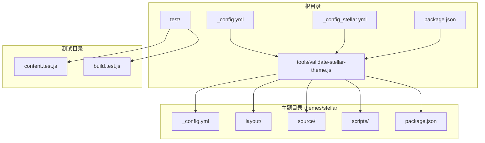
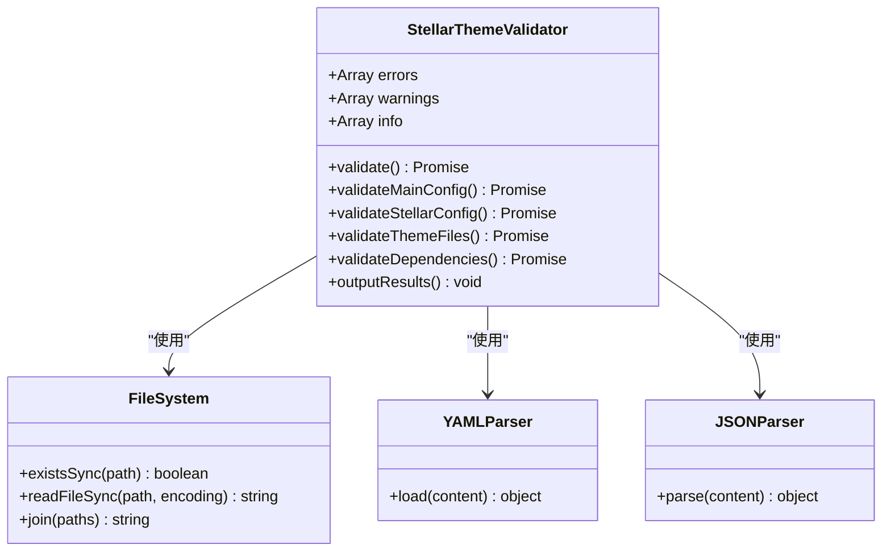
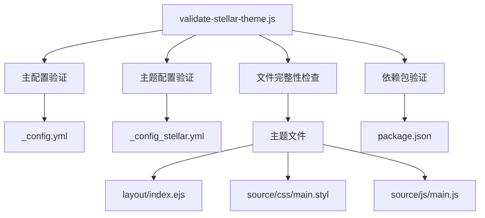
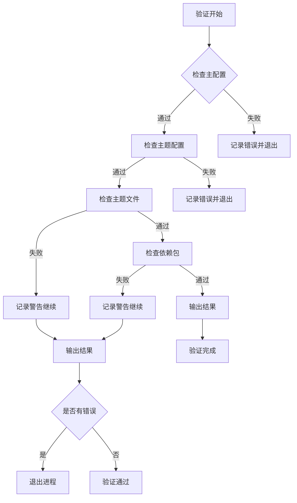

# 验证工具

<cite>
**本文引用的文件**
- [validate-stellar-theme.js](file://tools/validate-stellar-theme.js)
- [_config.yml](file://_config.yml)
- [_config_stellar.yml](file://_config_stellar.yml)
- [package.json](file://package.json)
- [themes/stellar/_config.yml](file://themes/stellar/_config.yml)
- [themes/stellar/package.json](file://themes/stellar/package.json)
- [themes/stellar/layout/index.ejs](file://themes/stellar/layout/index.ejs)
- [themes/stellar/source/css/main.styl](file://themes/stellar/source/css/main.styl)
- [themes/stellar/source/js/main.js](file://themes/stellar/source/js/main.js)
- [themes/stellar/scripts/events/index.js](file://themes/stellar/scripts/events/index.js)
- [test/content.test.js](file://test/content.test.js)
- [test/build.test.js](file://test/build.test.js)
</cite>

## 目录
1. [简介](#简介)
2. [项目结构](#项目结构)
3. [核心组件](#核心组件)
4. [架构概览](#架构概览)
5. [详细组件分析](#详细组件分析)
6. [依赖关系分析](#依赖关系分析)
7. [性能考虑](#性能考虑)
8. [故障排除指南](#故障排除指南)
9. [结论](#结论)
10. [附录](#附录)

## 简介
本文档详细介绍 H1S97X 博客的主题验证工具，重点分析 validate-stellar-theme.js 脚本的功能与实现原理。该工具专门用于验证 Stellar 主题配置的正确性、完整性以及功能可用性，确保博客在部署前具备完整且正确的主题配置。

## 项目结构
该项目基于 Hexo 静态博客框架，采用主题化的架构设计。主要结构包括：
- 根目录配置文件：_config.yml（Hexo 主配置）、_config_stellar.yml（Stellar 主题配置）
- 主题目录：themes/stellar（Stellar 主题）
- 验证工具：tools/validate-stellar-theme.js
- 测试套件：test/ 目录下的内容验证和构建测试



**图表来源**
- [validate-stellar-theme.js](file://tools/validate-stellar-theme.js#L1-L313)
- [themes/stellar/_config.yml](file://themes/stellar/_config.yml#L1-L725)

**章节来源**
- [validate-stellar-theme.js](file://tools/validate-stellar-theme.js#L1-L50)
- [themes/stellar/_config.yml](file://themes/stellar/_config.yml#L1-L50)

## 核心组件
validate-stellar-theme.js 是一个基于 Node.js 的命令行验证工具，采用面向对象的设计模式，通过类封装验证逻辑。该工具的核心功能包括：

### 主要功能模块
1. **配置文件验证**：检查主配置文件和主题配置文件的正确性
2. **主题文件完整性检查**：验证主题关键文件的存在性
3. **依赖包验证**：检查项目依赖和推荐依赖的状态
4. **结果输出**：提供详细的验证报告和建议

### 验证流程
工具按照严格的顺序执行验证任务：
- 主配置文件验证（_config.yml）
- Stellar 主题配置验证（_config_stellar.yml）
- 主题文件存在性验证
- 依赖包验证
- 结果汇总输出

**章节来源**
- [validate-stellar-theme.js](file://tools/validate-stellar-theme.js#L12-L45)
- [validate-stellar-theme.js](file://tools/validate-stellar-theme.js#L22-L45)

## 架构概览
验证工具采用模块化架构设计，每个验证功能都封装在独立的方法中，便于维护和扩展。



**图表来源**
- [validate-stellar-theme.js](file://tools/validate-stellar-theme.js#L12-L313)

## 详细组件分析

### 验证器类结构
StellarThemeValidator 类是整个验证工具的核心，负责协调各个验证模块的工作。

#### 核心属性
- **errors**：存储严重错误信息的数组
- **warnings**：存储建议和警告信息的数组  
- **info**：存储正常配置信息的数组

#### 主要方法
1. **validate()**：主验证入口，协调各模块验证
2. **validateMainConfig()**：验证主配置文件
3. **validateStellarConfig()**：验证 Stellar 主题配置
4. **validateThemeFiles()**：验证主题文件完整性
5. **validateDependencies()**：验证依赖包状态
6. **outputResults()**：输出最终验证结果

**章节来源**
- [validate-stellar-theme.js](file://tools/validate-stellar-theme.js#L12-L297)

### 主配置文件验证
validateMainConfig() 方法负责验证根目录的 _config.yml 文件，检查关键配置项的正确性。

#### 验证规则
1. **主题设置验证**：确保 theme 字段设置为 'stellar'
2. **基本字段检查**：验证 title、author、language、url 等必需字段
3. **搜索功能检查**：验证 search 配置的完整性
4. **错误处理**：捕获并报告解析异常

#### 配置项验证
- **主题设置**：必须为 'stellar'
- **站点信息**：title、author、language、url
- **搜索配置**：search.path 字段
- **RSS 配置**：feed 相关设置

**章节来源**
- [validate-stellar-theme.js](file://tools/validate-stellar-theme.js#L50-L89)
- [_config.yml](file://_config.yml#L1-L136)

### Stellar 主题配置验证
validateStellarConfig() 方法专门验证 themes/stellar/_config.yml 文件，这是 Stellar 主题的核心配置文件。

#### 验证内容
1. **基本信息验证**：stellar.version 字段
2. **导航菜单验证**：menubar.items 配置
3. **站点结构验证**：site_tree 配置
4. **搜索功能验证**：search.service 配置
5. **评论系统验证**：comments.service 配置
6. **插件配置验证**：plugins 启用状态

#### 导航菜单验证规则
工具会检查必需的菜单项是否存在：
- **post**：博客列表页面
- **categories**：分类页面  
- **tags**：标签页面
- **archives**：归档页面

#### 站点结构验证
验证重要的页面配置：
- **home**：主页配置
- **index_blog**：博客列表页配置
- **post**：文章内页配置

**章节来源**
- [validate-stellar-theme.js](file://tools/validate-stellar-theme.js#L94-L173)
- [themes/stellar/_config.yml](file://themes/stellar/_config.yml#L1-L725)

### 主题文件完整性检查
validateThemeFiles() 方法验证主题关键文件的存在性，确保主题能够正常工作。

#### 关键文件验证
1. **package.json**：主题版本信息
2. **layout/index.ejs**：主题主布局文件
3. **source/css/main.styl**：主题样式文件
4. **source/js/main.js**：主题 JavaScript 文件

#### 版本信息检查
工具会读取主题的 package.json 文件，提取并显示主题版本信息。

**章节来源**
- [validate-stellar-theme.js](file://tools/validate-stellar-theme.js#L178-L214)
- [themes/stellar/package.json](file://themes/stellar/package.json#L1-L33)

### 依赖包验证
validateDependencies() 方法检查项目的依赖包状态，包括必需依赖和推荐依赖。

#### 必需依赖检查
- **hexo**：Hexo 框架版本
- **hexo-generator-*：各种生成器插件

#### 推荐依赖检查
工具会检查以下推荐依赖：
- **hexo-generator-searchdb**：搜索功能
- **hexo-generator-feed**：RSS 订阅
- **hexo-generator-sitemap**：站点地图
- **hexo-filter-mermaid-diagrams**：Mermaid 图表

#### 依赖状态反馈
- **已安装**：显示 ✅ 标记
- **未安装**：显示 ℹ️ 标记（信息提示）
- **解析失败**：显示警告信息

**章节来源**
- [validate-stellar-theme.js](file://tools/validate-stellar-theme.js#L219-L257)
- [package.json](file://package.json#L45-L67)

### 结果输出机制
outputResults() 方法负责格式化和输出验证结果，提供清晰的反馈信息。

#### 输出格式
1. **错误信息**：❌ 标记，严重问题
2. **警告信息**：⚠️ 标记，建议改进
3. **配置信息**：ℹ️ 标记，正常配置

#### 结果总结
- **验证通过**：🎉 提示验证成功
- **存在错误**：💥 显示错误数量并退出进程
- **存在建议**：💡 显示建议数量

**章节来源**
- [validate-stellar-theme.js](file://tools/validate-stellar-theme.js#L262-L296)

## 依赖关系分析

### 外部依赖
验证工具依赖以下外部模块：
- **fs**：文件系统操作
- **path**：路径处理
- **js-yaml**：YAML 文件解析

### 内部依赖关系


**图表来源**
- [validate-stellar-theme.js](file://tools/validate-stellar-theme.js#L1-L313)

### 配置文件依赖
验证工具与多个配置文件存在依赖关系：

| 配置文件 | 用途 | 验证内容 |
|---------|------|----------|
| _config.yml | Hexo 主配置 | 主题设置、基本字段、搜索配置 |
| _config_stellar.yml | Stellar 主题配置 | 导航菜单、站点结构、插件配置 |
| themes/stellar/_config.yml | 主题详细配置 | 详细主题设置、评论系统、样式配置 |
| package.json | 项目依赖 | Hexo 版本、插件依赖 |

**章节来源**
- [validate-stellar-theme.js](file://tools/validate-stellar-theme.js#L1-L313)
- [_config.yml](file://_config.yml#L1-L136)
- [_config_stellar.yml](file://_config_stellar.yml#L1-L699)

## 性能考虑
验证工具在设计时考虑了以下性能因素：

### 并发处理
- 所有验证操作都是异步执行，避免阻塞主线程
- 文件系统操作使用同步方法，简化错误处理逻辑

### 内存使用
- 配置文件读取采用流式处理，避免大文件内存占用
- 验证结果存储在数组中，便于后续处理

### 错误处理
- 每个验证步骤都有独立的错误捕获机制
- 早期失败快速退出，避免不必要的计算

## 故障排除指南

### 常见验证错误及解决方案

#### 主配置文件错误
**错误类型**：主配置文件不存在或格式错误
**解决方案**：
1. 确认 _config.yml 文件存在
2. 检查 YAML 格式正确性
3. 验证必需字段完整性

#### 主题配置错误
**错误类型**：主题设置不正确
**解决方案**：
1. 检查 _config.yml 中 theme 字段
2. 确保设置为 'stellar'
3. 验证主题路径正确性

#### 文件缺失错误
**错误类型**：主题关键文件不存在
**解决方案**：
1. 检查 themes/stellar 目录结构
2. 确认关键文件存在
3. 验证文件权限设置

#### 依赖包错误
**错误类型**：必需依赖未安装
**解决方案**：
1. 运行 npm install 安装依赖
2. 检查 package.json 依赖声明
3. 验证 npm 包版本兼容性

### 验证失败诊断流程



**图表来源**
- [validate-stellar-theme.js](file://tools/validate-stellar-theme.js#L22-L45)

### 验证报告示例

#### 成功验证报告
```
🔍 开始验证Stellar主题配置...

📊 验证结果汇总:

✅ 主题设置正确: stellar
✅ title: H1S97X
✅ author: H1S97X
✅ language: zh-CN
✅ url: https://h1s97x.github.io
✅ 搜索功能已配置
✅ Stellar版本: 1.33.1
✅ 导航菜单已配置 (4 个项目)
✅ 必要菜单项 'post' 已配置
✅ 必要菜单项 'categories' 已配置
✅ 必要菜单项 'tags' 已配置
✅ 必要菜单项 'archives' 已配置
✅ 站点结构已配置
✅ home 页面配置已设置
✅ index_blog 页面配置已设置
✅ post 页面配置已设置
✅ 搜索服务: local_search
✅ 评论系统: giscus
✅ 已启用插件: preload, fancybox, swiper, mermaid, copycode
✅ Hexo版本: ^8.1.1
✅ 搜索功能依赖: hexo-generator-searchdb
✅ RSS订阅依赖: hexo-generator-feed
✅ 站点地图依赖: hexo-generator-sitemap
✅ Mermaid图表依赖: hexo-filter-mermaid-diagrams
✅ 主题文件存在: package.json
✅ 主题文件存在: layout/index.ejs
✅ 主题文件存在: source/css/main.styl
✅ 主题文件存在: source/js/main.js
✅ 主题版本: 1.33.1

🎉 Stellar主题配置验证通过!
```

#### 失败验证报告示例
```
🔍 开始验证Stellar主题配置...

📊 验证结果汇总:

❌ 错误:
   主题设置错误: 期望 'stellar', 实际 'landscape'

⚠️ 警告:
   建议配置搜索功能
   建议配置 post 页面
   建议配置 categories 页面
   建议配置 tags 页面
   建议配置 archives 页面
   可选依赖 hexo-generator-searchdb (搜索功能) 未安装
   可选依赖 hexo-generator-feed (RSS订阅) 未安装
   可选依赖 hexo-generator-sitemap (站点地图) 未安装
   可选依赖 hexo-filter-mermaid-diagrams (Mermaid图表) 未安装

💥 发现 1 个错误需要修复
```

**章节来源**
- [validate-stellar-theme.js](file://tools/validate-stellar-theme.js#L262-L296)

## 结论
validate-stellar-theme.js 是一个功能完善、结构清晰的主题验证工具。它通过系统化的验证流程，确保 Stellar 主题在部署前具备完整的配置和文件结构。工具的主要优势包括：

1. **全面性**：涵盖配置文件、主题文件、依赖包等多个方面的验证
2. **易用性**：提供清晰的错误信息和建议
3. **可扩展性**：模块化设计便于添加新的验证规则
4. **可靠性**：完善的错误处理和异常捕获机制

对于 H1S97X 博客项目，该工具能够有效预防配置错误，提高部署质量，减少运行时问题的发生。

## 附录

### 最佳实践建议

#### 配置文件管理
1. **定期备份**：定期备份 _config.yml 和 _config_stellar.yml 文件
2. **版本控制**：将配置文件纳入版本控制系统
3. **文档记录**：为重要配置添加注释说明

#### 验证流程集成
1. **CI/CD 集成**：在持续集成流程中自动运行验证
2. **预提交钩子**：使用 Husky 在提交前自动验证
3. **定期检查**：建立定期验证的维护流程

#### 主题更新策略
1. **版本跟踪**：记录主题版本变更历史
2. **兼容性测试**：更新主题后进行全面验证
3. **渐进式更新**：小步快跑地更新主题版本

### 验证规则清单

#### 配置文件验证规则
- **主配置文件**：必须存在，格式正确，必需字段完整
- **主题配置文件**：必须存在，格式正确，配置项有效
- **主题文件**：关键文件必须存在，版本信息有效

#### 功能完整性验证规则
- **导航功能**：必需菜单项完整
- **搜索功能**：搜索配置有效
- **评论功能**：评论系统配置正确
- **插件功能**：插件配置完整

#### 依赖关系验证规则
- **必需依赖**：Hexo 框架版本正确
- **推荐依赖**：根据功能需求选择性安装
- **版本兼容性**：确保依赖版本兼容