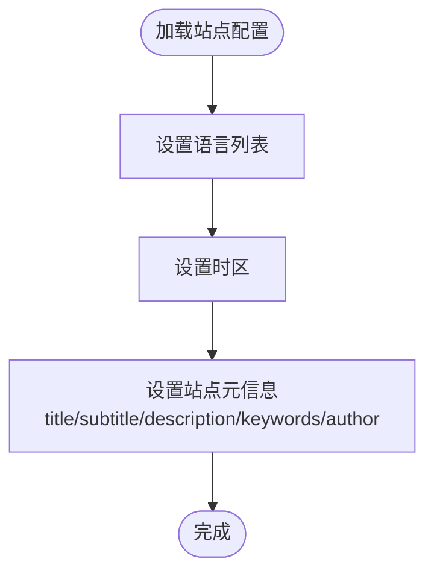

# Hexo核心配置

<cite>
**本文引用的文件**
- [_config.yml](file://_config.yml)
- [_config.staging.yml](file://_config.staging.yml)
- [_config.anzhiyu.yml](file://_config.anzhiyu.yml)
- [_config_stellar.yml](file://_config_stellar.yml)
- [themes/stellar/_config.yml](file://themes/stellar/_config.yml)
- [package.json](file://package.json)
- [tools/deploy.js](file://tools/deploy.js)
- [scaffolds/post.md](file://scaffolds/post.md)
- [scaffolds/page.md](file://scaffolds/page.md)
</cite>

## 目录
1. [简介](#简介)
2. [项目结构](#项目结构)
3. [核心配置概览](#核心配置概览)
4. [站点基本信息配置](#站点基本信息配置)
5. [URL与路径配置](#url与路径配置)
6. [目录结构配置](#目录结构配置)
7. [写作设置](#写作设置)
8. [分页配置](#分页配置)
9. [元数据与时间格式](#元数据与时间格式)
10. [RSS订阅设置](#rss订阅设置)
11. [部署配置](#部署配置)
12. [架构总览](#架构总览)
13. [详细组件分析](#详细组件分析)
14. [依赖关系分析](#依赖关系分析)
15. [性能考量](#性能考量)
16. [故障排除指南](#故障排除指南)
17. [结论](#结论)

## 简介
本文件面向H1S97X博客的Hexo核心配置，系统梳理站点基本信息、URL与路径、目录结构、写作设置、分页、元数据与时间格式、RSS订阅以及部署配置。文档结合仓库中的实际配置文件与脚本，提供每个配置项的用途、默认值、可选范围与实践建议，并附带最佳实践与常见问题解决方案，帮助读者快速理解并高效维护博客。

## 项目结构
本仓库采用典型的Hexo结构：
- 根配置文件：_config.yml（主配置）、_config.staging.yml（预发布配置）
- 主题配置：themes/stellar/_config.yml（Stellar主题配置）、_config_stellar.yml（Stellar主题的站点树、评论、搜索等）
- 辅助配置：_config.anzhiyu.yml（AnZhiYu主题配置，用于对比）
- 构建与部署：package.json（脚本与依赖）、tools/deploy.js（自动部署脚本）
- 写作模板：scaffolds/post.md、scaffolds/page.md

**图表来源**
- [_config.yml](file://_config.yml#L1-L136)
- [themes/stellar/_config.yml](file://themes/stellar/_config.yml#L1-L725)
- [_config_stellar.yml](file://_config_stellar.yml#L1-L699)
- [_config.anzhiyu.yml](file://_config.anzhiyu.yml#L1-L800)
- [package.json](file://package.json#L1-L94)
- [tools/deploy.js](file://tools/deploy.js#L1-L472)
- [scaffolds/post.md](file://scaffolds/post.md#L1-L77)
- [scaffolds/page.md](file://scaffolds/page.md#L1-L57)

**章节来源**
- [_config.yml](file://_config.yml#L1-L136)
- [themes/stellar/_config.yml](file://themes/stellar/_config.yml#L1-L725)
- [_config_stellar.yml](file://_config_stellar.yml#L1-L699)
- [_config.anzhiyu.yml](file://_config.anzhiyu.yml#L1-L800)
- [package.json](file://package.json#L1-L94)
- [tools/deploy.js](file://tools/deploy.js#L1-L472)
- [scaffolds/post.md](file://scaffolds/post.md#L1-L77)
- [scaffolds/page.md](file://scaffolds/page.md#L1-L57)

## 核心配置概览
- 站点基本信息：title、subtitle、description、keywords、author、language、timezone
- URL与路径：url、permalink、permalink_defaults、pretty_urls
- 目录结构：source_dir、public_dir、tag_dir、archive_dir、category_dir、code_dir、i18n_dir、skip_render
- 写作设置：new_post_name、default_layout、titlecase、external_link、filename_case、render_drafts、post_asset_folder、relative_link、future、highlight、prismjs
- 分页：index_generator（path、per_page、order_by）、per_page、pagination_dir
- 元数据与时间格式：meta_generator、date_format、time_format、updated_option
- RSS订阅：feed（enable、type、path、limit、hub、content、content_limit、content_limit_delim、order_by、icon、autodiscovery）
- 部署：deploy（type、repo、branch）

以上配置项均来自根配置文件与主题配置文件，部分主题配置项（如Stellar的主题树、评论、搜索）在本仓库中也有体现。

**章节来源**
- [_config.yml](file://_config.yml#L5-L136)
- [themes/stellar/_config.yml](file://themes/stellar/_config.yml#L72-L151)
- [_config_stellar.yml](file://_config_stellar.yml#L36-L121)

## 站点基本信息配置
- title：站点标题，用于页面标题与导航显示
- subtitle：副标题，可配合主题显示
- description：站点描述，用于SEO与摘要
- keywords：站点关键词，多个关键词以逗号分隔
- author：站点作者名
- language：支持的语言列表（如 zh-CN、en）
- timezone：时区，如 Asia/Shanghai

默认值与行为：
- language默认包含 zh-CN、en
- timezone默认 Asia/Shanghai

最佳实践：
- keywords建议不超过5个，避免过度堆砌
- language与timezone应与目标受众一致

**章节来源**
- [_config.yml](file://_config.yml#L6-L16)

## URL与路径配置
- url：站点根URL，用于生成绝对链接
- permalink：文章永久链接模板，如 :year/:month/:day/:title/
- permalink_defaults：永久链接默认参数
- pretty_urls：美化URL
  - trailing_index：移除末尾的 index.html
  - trailing_html：移除末尾的 .html

默认值与行为：
- url为 https://h1s97x.github.io
- permalink为 :year/:month/:day/:title/
- pretty_urls 默认开启，trailing_index、trailing_html均为 true

最佳实践：
- 若使用GitHub Pages，url应与 Pages 设置一致
- permalink建议包含日期，便于归档与SEO

**章节来源**
- [_config.yml](file://_config.yml#L20-L25)

## 目录结构配置
- source_dir：源文件目录，默认 source
- public_dir：生成的静态文件目录，默认 public
- tag_dir：标签页目录，默认 tags
- archive_dir：归档页目录，默认 archives
- category_dir：分类页目录，默认 categories
- code_dir：代码下载目录，默认 downloads/code
- i18n_dir：国际化目录占位符，默认 :lang
- skip_render：跳过渲染的文件或目录列表

默认值与行为：
- 默认值均来自Hexo默认配置
- skip_render留空表示不跳过任何文件

最佳实践：
- 保持默认值可简化迁移
- 如需自定义，确保与主题模板一致

**章节来源**
- [_config.yml](file://_config.yml#L28-L35)

## 写作设置
- new_post_name：新文章文件命名模板，默认 :title.md
- default_layout：默认布局，默认 post
- titlecase：标题转为首字母大写，默认 false
- external_link：外链处理
  - enable：是否在新标签打开，默认 true
  - field：应用范围，默认 site（整站）
  - exclude：排除的域名或路径
- filename_case：文件名大小写转换（0=不转换，1=小写，2=大写）
- render_drafts：是否渲染草稿，默认 false
- post_asset_folder：是否启用资源文件夹，默认 false
- relative_link：是否使用相对链接，默认 false
- future：是否显示未来日期文章，默认 true
- highlight：代码高亮
  - enable：启用高亮，默认 true
  - line_number：显示行号，默认 true
  - auto_detect：自动检测语言，默认 false
  - tab_replace：制表符替换，默认空字符串
  - wrap：是否包裹，默认 true
  - hljs：使用highlight.js，默认 false
- prismjs：PrismJS高亮
  - enable：启用PrismJS，默认 false
  - preprocess：预处理，默认 true
  - line_number：显示行号，默认 true
  - tab_replace：制表符替换，默认空字符串

默认值与行为：
- highlight与prismjs二选一启用
- highlight默认开启，prismjs默认关闭

最佳实践：
- 优先使用highlight（与Stellar主题兼容更好）
- 如需PrismJS，确保安装相应插件并启用

**章节来源**
- [_config.yml](file://_config.yml#L38-L62)

## 分页配置
- index_generator：首页分页
  - path：首页路径，默认空字符串
  - per_page：每页文章数，默认 10
  - order_by：排序，默认 -date（按时间倒序）
- per_page：通用分页每页数量，默认 10
- pagination_dir：分页目录，默认 page

默认值与行为：
- 首页与通用分页均默认每页10篇
- order_by默认按日期倒序

最佳实践：
- 若文章较多，可适当增大 per_page
- 保持 order_by 与主题分页组件一致

**章节来源**
- [_config.yml](file://_config.yml#L67-L71)
- [_config.yml](file://_config.yml#L92-L93)

## 元数据与时间格式
- meta_generator：是否生成HTML元信息，默认 true
- date_format：日期格式，默认 YYYY-MM-DD
- time_format：时间格式，默认 HH:mm:ss
- updated_option：更新时间策略，支持 'mtime'、'date'、'empty'，默认 'mtime'

默认值与行为：
- 默认使用Moment.js格式
- updated_option默认使用文件修改时间

最佳实践：
- 日期/时间格式可根据地区习惯调整
- updated_option可按需改为 'date' 或 'empty'

**章节来源**
- [_config.yml](file://_config.yml#L79-L88)

## RSS订阅设置
- feed：RSS/Atom订阅
  - enable：启用订阅，默认 true
  - type：订阅类型，默认 atom
  - path：订阅文件路径，默认 atom.xml
  - limit：最大文章数，默认 20
  - hub：Hub地址（可选）
  - content：是否包含全文，默认 true
  - content_limit：全文截取长度，默认 300
  - content_limit_delim：截取分隔符，默认空格
  - order_by：排序，默认 -date
  - icon：站点图标路径，默认 favicon.ico
  - autodiscovery：自动发现，默认 true

默认值与行为：
- 默认启用Atom订阅，包含全文，限制20篇

最佳实践：
- 如需RSS，可将type改为 rss，path改为 rss.xml
- content_limit可根据摘要长度调整

**章节来源**
- [_config.yml](file://_config.yml#L117-L128)

## 部署配置
- deploy：部署配置
  - type：部署类型，默认 git
  - repo：仓库地址，默认 git@github.com:h1s97x/H1S97X.github.io.git
  - branch：部署分支，默认 master

此外，仓库提供了自动部署脚本 tools/deploy.js，支持：
- 预览模式（--dry-run）
- 构建Stellar主题站点
- 自动创建/更新 gh-pages 分支
- 推送至远程仓库

默认值与行为：
- 默认使用git部署到master分支
- 自动部署脚本会生成public目录并推送到gh-pages

最佳实践：
- 使用自动部署脚本替代手动部署
- 预览模式先确认流程无误

**章节来源**
- [_config.yml](file://_config.yml#L132-L136)
- [tools/deploy.js](file://tools/deploy.js#L1-L472)

## 架构总览
下图展示了Hexo核心配置与主题配置、部署脚本之间的关系：

**图表来源**
- [_config.yml](file://_config.yml#L1-L136)
- [_config.staging.yml](file://_config.staging.yml#L1-L33)
- [themes/stellar/_config.yml](file://themes/stellar/_config.yml#L1-L725)
- [_config_stellar.yml](file://_config_stellar.yml#L1-L699)
- [_config.anzhiyu.yml](file://_config.anzhiyu.yml#L1-L800)
- [package.json](file://package.json#L1-L94)
- [tools/deploy.js](file://tools/deploy.js#L1-L472)
- [scaffolds/post.md](file://scaffolds/post.md#L1-L77)
- [scaffolds/page.md](file://scaffolds/page.md#L1-L57)

## 详细组件分析

### 站点基本信息组件
- 组件职责：定义站点标题、副标题、描述、关键词、作者、语言与时区
- 关键配置项：title、subtitle、description、keywords、author、language、timezone
- 默认值：language包含 zh-CN、en；timezone为 Asia/Shanghai
- 复杂度与性能：无显著性能影响，主要影响SEO与界面显示

**图表来源**
- [_config.yml](file://_config.yml#L6-L16)

**章节来源**
- [_config.yml](file://_config.yml#L6-L16)

### URL与路径组件
- 组件职责：生成永久链接、美化URL、控制静态资源路径
- 关键配置项：url、permalink、permalink_defaults、pretty_urls.trailing_index、pretty_urls.trailing_html
- 默认值：url为 https://h1s97x.github.io；permalink为 :year/:month/:day/:title/；pretty_urls开启
- 复杂度与性能：影响链接生成与SEO，建议保持默认以减少维护成本

**图表来源**
- [_config.yml](file://_config.yml#L20-L25)

**章节来源**
- [_config.yml](file://_config.yml#L20-L25)

### 目录结构组件
- 组件职责：定义源文件与静态输出目录、标签/归档/分类等页面目录
- 关键配置项：source_dir、public_dir、tag_dir、archive_dir、category_dir、code_dir、i18n_dir、skip_render
- 默认值：遵循Hexo默认约定
- 复杂度与性能：影响构建产物组织，建议保持默认

**图表来源**
- [_config.yml](file://_config.yml#L28-L35)

**章节来源**
- [_config.yml](file://_config.yml#L28-L35)

### 写作设置组件
- 组件职责：控制新文章命名、默认布局、外链处理、代码高亮等
- 关键配置项：new_post_name、default_layout、external_link、highlight、prismjs
- 默认值：highlight启用，prismjs关闭
- 复杂度与性能：highlight/PrismJS影响渲染性能，建议二选一

**图表来源**
- [_config.yml](file://_config.yml#L38-L62)

**章节来源**
- [_config.yml](file://_config.yml#L38-L62)

### 分页组件
- 组件职责：控制首页与通用分页数量与排序
- 关键配置项：index_generator（path、per_page、order_by）、per_page、pagination_dir
- 默认值：每页10篇，按日期倒序
- 复杂度与性能：per_page过大可能影响首页加载

**图表来源**
- [_config.yml](file://_config.yml#L67-L71)
- [_config.yml](file://_config.yml#L92-L93)

**章节来源**
- [_config.yml](file://_config.yml#L67-L71)
- [_config.yml](file://_config.yml#L92-L93)

### 元数据与时间格式组件
- 组件职责：控制HTML元信息生成与日期/时间显示格式
- 关键配置项：meta_generator、date_format、time_format、updated_option
- 默认值：生成元信息，日期格式 YYYY-MM-DD，时间格式 HH:mm:ss，更新策略 mtime
- 复杂度与性能：无明显性能影响

**图表来源**
- [_config.yml](file://_config.yml#L79-L88)

**章节来源**
- [_config.yml](file://_config.yml#L79-L88)

### RSS订阅组件
- 组件职责：生成RSS/Atom订阅文件
- 关键配置项：feed（enable、type、path、limit、content、order_by、icon、autodiscovery）
- 默认值：启用Atom，包含全文，限制20篇
- 复杂度与性能：订阅文件生成开销较小

**图表来源**
- [_config.yml](file://_config.yml#L117-L128)

**章节来源**
- [_config.yml](file://_config.yml#L117-L128)

### 部署组件
- 组件职责：配置部署目标与仓库分支
- 关键配置项：deploy（type、repo、branch）
- 默认值：git类型，仓库地址与master分支
- 复杂度与性能：部署脚本负责构建与推送

**图表来源**
- [_config.yml](file://_config.yml#L132-L136)

**章节来源**
- [_config.yml](file://_config.yml#L132-L136)

## 依赖关系分析
- Hexo核心配置与主题配置相互协作：_config.yml定义基础配置，themes/stellar/_config.yml与_config_stellar.yml定义主题特有配置（站点树、评论、搜索等）
- 构建与部署：package.json提供脚本，tools/deploy.js负责自动部署
- 写作模板：scaffolds/post.md与scaffolds/page.md为文章与页面提供Front-matter模板

**图表来源**
- [_config.yml](file://_config.yml#L1-L136)
- [themes/stellar/_config.yml](file://themes/stellar/_config.yml#L1-L725)
- [_config_stellar.yml](file://_config_stellar.yml#L1-L699)
- [package.json](file://package.json#L1-L94)
- [tools/deploy.js](file://tools/deploy.js#L1-L472)
- [scaffolds/post.md](file://scaffolds/post.md#L1-L77)
- [scaffolds/page.md](file://scaffolds/page.md#L1-L57)

**章节来源**
- [_config.yml](file://_config.yml#L1-L136)
- [themes/stellar/_config.yml](file://themes/stellar/_config.yml#L1-L725)
- [_config_stellar.yml](file://_config_stellar.yml#L1-L699)
- [package.json](file://package.json#L1-L94)
- [tools/deploy.js](file://tools/deploy.js#L1-L472)
- [scaffolds/post.md](file://scaffolds/post.md#L1-L77)
- [scaffolds/page.md](file://scaffolds/page.md#L1-L57)

## 性能考量
- 代码高亮：highlight与prismjs二选一，避免重复渲染
- 分页：合理设置 per_page，避免首页渲染过大
- RSS：content_limit 控制摘要长度，减少订阅文件体积
- pretty_urls：trailing_index/trailing_html影响链接美观与SEO，建议保持默认

[本节为通用指导，无需特定文件引用]

## 故障排除指南
- 部署失败：检查仓库地址与分支是否正确，确认SSH密钥可用
- 预览模式：使用 tools/deploy.js 的 --dry-run 参数预览部署流程
- 构建失败：确认Stellar主题子模块初始化与配置验证通过
- 链接异常：检查 url 与 permalink 设置，确保与GitHub Pages设置一致

**章节来源**
- [tools/deploy.js](file://tools/deploy.js#L1-L472)

## 结论
本仓库的Hexo核心配置围绕站点基本信息、URL与路径、目录结构、写作设置、分页、元数据与时间格式、RSS订阅以及部署展开。通过根配置文件与主题配置文件的协同，结合自动部署脚本，实现了稳定高效的博客构建与发布流程。建议在保持默认值的基础上，按需调整以适配主题与业务场景，并遵循最佳实践以提升SEO与用户体验。