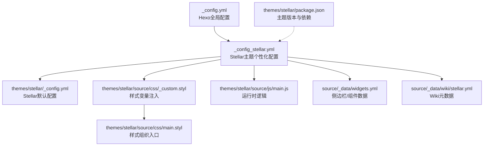
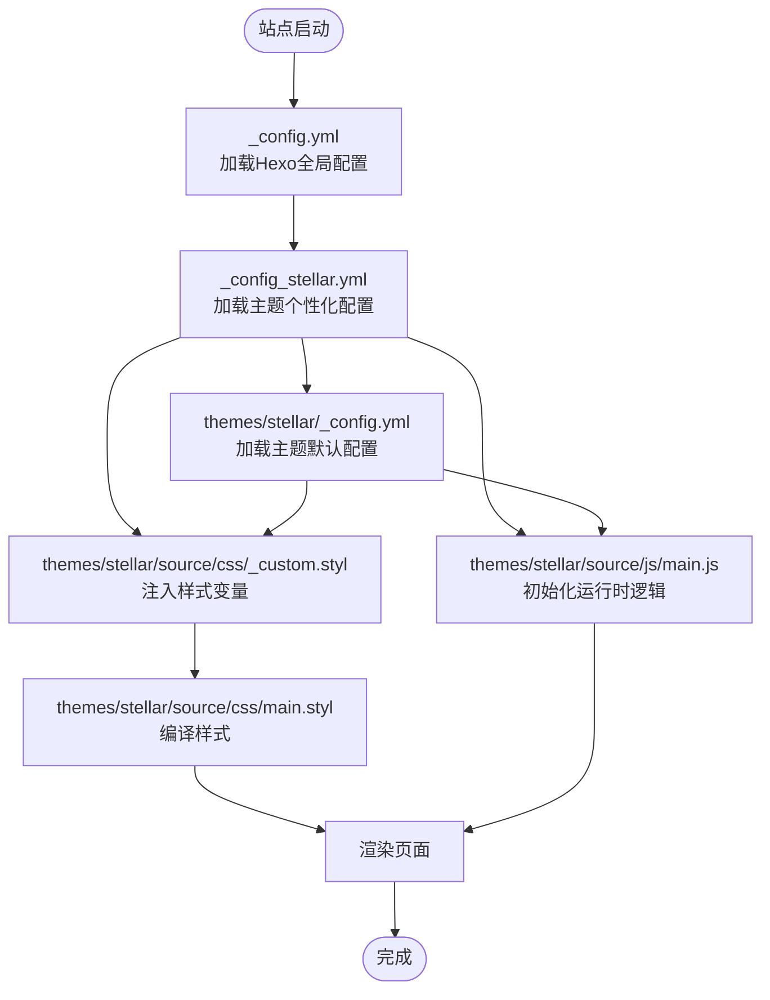
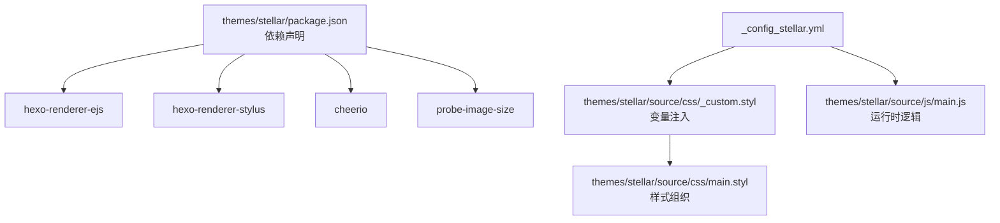

# 主题配置

<cite>
**本文引用的文件**
- [_config.yml](file://_config.yml)
- [_config_stellar.yml](file://_config_stellar.yml)
- [themes/stellar/_config.yml](file://themes/stellar/_config.yml)
- [themes/stellar/package.json](file://themes/stellar/package.json)
- [themes/stellar/source/css/main.styl](file://themes/stellar/source/css/main.styl)
- [themes/stellar/source/css/_custom.styl](file://themes/stellar/source/css/_custom.styl)
- [themes/stellar/source/js/main.js](file://themes/stellar/source/js/main.js)
- [source/_data/widgets.yml](file://source/_data/widgets.yml)
- [source/_data/wiki/stellar.yml](file://source/_data/wiki/stellar.yml)
- [STELLAR_THEME_SETUP.md](file://STELLAR_THEME_SETUP.md)
</cite>

## 目录
1. [简介](#简介)
2. [项目结构](#项目结构)
3. [核心组件](#核心组件)
4. [架构总览](#架构总览)
5. [详细组件分析](#详细组件分析)
6. [依赖分析](#依赖分析)
7. [性能考量](#性能考量)
8. [故障排查指南](#故障排查指南)
9. [结论](#结论)
10. [附录](#附录)

## 简介
本指南面向H1S97X博客的Stellar主题配置，围绕外观与布局、功能开关、第三方集成、SEO优化、响应式设计、图片处理、代码高亮等维度，系统梳理配置文件结构与优先级关系，提供可落地的配置示例与自定义样式指导，并总结最佳实践与性能优化建议。

## 项目结构
- 站点根配置：_config.yml（Hexo全局配置）
- 主题配置：_config_stellar.yml（Stellar主题个性化配置）
- 主题默认配置：themes/stellar/_config.yml（Stellar主题默认与可选功能）
- 主题包信息：themes/stellar/package.json（主题版本与依赖）
- 样式入口：themes/stellar/source/css/main.styl（样式组织入口）
- 自定义样式：themes/stellar/source/css/_custom.styl（基于配置的变量注入）
- 主题脚本：themes/stellar/source/js/main.js（运行时交互逻辑）
- 侧边栏与Wiki数据：source/_data/widgets.yml、source/_data/wiki/stellar.yml

**图表来源**
- [_config.yml](file://_config.yml#L1-L136)
- [_config_stellar.yml](file://_config_stellar.yml#L1-L699)
- [themes/stellar/_config.yml](file://themes/stellar/_config.yml#L1-L725)
- [themes/stellar/source/css/main.styl](file://themes/stellar/source/css/main.styl#L1-L19)
- [themes/stellar/source/css/_custom.styl](file://themes/stellar/source/css/_custom.styl#L1-L105)
- [themes/stellar/source/js/main.js](file://themes/stellar/source/js/main.js#L1-L200)
- [source/_data/widgets.yml](file://source/_data/widgets.yml#L1-L10)
- [source/_data/wiki/stellar.yml](file://source/_data/wiki/stellar.yml#L1-L10)
- [themes/stellar/package.json](file://themes/stellar/package.json#L1-L33)

**章节来源**
- [_config.yml](file://_config.yml#L1-L136)
- [_config_stellar.yml](file://_config_stellar.yml#L1-L699)
- [themes/stellar/_config.yml](file://themes/stellar/_config.yml#L1-L725)
- [themes/stellar/source/css/main.styl](file://themes/stellar/source/css/main.styl#L1-L19)
- [themes/stellar/source/css/_custom.styl](file://themes/stellar/source/css/_custom.styl#L1-L105)
- [themes/stellar/source/js/main.js](file://themes/stellar/source/js/main.js#L1-L200)
- [source/_data/widgets.yml](file://source/_data/widgets.yml#L1-L10)
- [source/_data/wiki/stellar.yml](file://source/_data/wiki/stellar.yml#L1-L10)
- [themes/stellar/package.json](file://themes/stellar/package.json#L1-L33)

## 核心组件
- 站点信息与URL：站点标题、副标题、作者、语言、URL、永久链接格式、RSS等
- 主题选择与版本：theme: stellar；主题版本见package.json
- 主题个性化配置：_config_stellar.yml（导航、侧栏、文章、搜索、评论、插件、样式等）
- 主题默认配置：themes/stellar/_config.yml（默认行为与可选功能）
- 样式系统：main.styl组织样式模块，_custom.styl注入配置变量
- 运行时脚本：main.js负责目录、标签页、滚动等交互
- 数据与组件：widgets.yml、wiki/stellar.yml提供侧边栏与Wiki元数据

**章节来源**
- [_config.yml](file://_config.yml#L1-L136)
- [_config_stellar.yml](file://_config_stellar.yml#L1-L699)
- [themes/stellar/_config.yml](file://themes/stellar/_config.yml#L1-L725)
- [themes/stellar/source/css/main.styl](file://themes/stellar/source/css/main.styl#L1-L19)
- [themes/stellar/source/css/_custom.styl](file://themes/stellar/source/css/_custom.styl#L1-L105)
- [themes/stellar/source/js/main.js](file://themes/stellar/source/js/main.js#L1-L200)
- [source/_data/widgets.yml](file://source/_data/widgets.yml#L1-L10)
- [source/_data/wiki/stellar.yml](file://source/_data/wiki/stellar.yml#L1-L10)
- [themes/stellar/package.json](file://themes/stellar/package.json#L1-L33)

## 架构总览
Stellar主题的配置遵循“站点配置 → 主题个性化 → 主题默认”的层级结构。站点配置决定整体输出与渲染，主题个性化覆盖站点配置中的主题相关项，主题默认配置提供可选功能与默认值。

**图表来源**
- [_config.yml](file://_config.yml#L1-L136)
- [_config_stellar.yml](file://_config_stellar.yml#L1-L699)
- [themes/stellar/_config.yml](file://themes/stellar/_config.yml#L1-L725)
- [themes/stellar/source/css/_custom.styl](file://themes/stellar/source/css/_custom.styl#L1-L105)
- [themes/stellar/source/css/main.styl](file://themes/stellar/source/css/main.styl#L1-L19)
- [themes/stellar/source/js/main.js](file://themes/stellar/source/js/main.js#L1-L200)

## 详细组件分析

### 外观与布局配置
- 主题色与强调色：style.color.theme、style.color.accent、style.color.link
- 字体与字号：style.font-family.*、style.font-size.*
- 圆角与阴影：style.border-radius.*、阴影变量
- 侧边栏背景：style.leftbar.background-*、style.site.background-image
- 导航与菜单：menubar.columns、menubar.items
- 页面树与侧栏：site_tree.home/index_blog/post/wiki等的leftbar/rightbar

建议：
- 使用百分比或相对单位控制代码字号，避免破坏整体比例
- 侧边栏背景建议配合模糊与透明度，兼顾美观与可读性
- 圆角与阴影应与整体设计风格一致，避免过度装饰

**章节来源**
- [_config_stellar.yml](file://_config_stellar.yml#L609-L672)
- [themes/stellar/_config.yml](file://themes/stellar/_config.yml#L41-L69)
- [themes/stellar/source/css/_custom.styl](file://themes/stellar/source/css/_custom.styl#L38-L64)

### 功能开关与插件
- 预加载：plugins.preload.enable/service
- 图片灯箱：plugins.fancybox.enable/selector
- 轮播：plugins.swiper.enable
- 平滑滚动：plugins.scrollreveal.enable
- AI摘要：plugins.tianli_gpt.*
- 数学公式：plugins.katex.enable/inject
- 数学Jax：plugins.mathjax.v3/enable/js
- Mermaid：plugins.mermaid.enable/style_optimization/theme/js
- 代码复制：plugins.copycode.enable/default_text/success_text/toast
- 赫蹏排版：plugins.heti.enable

建议：
- 仅启用必要插件，避免加载过多外部资源
- Mermaid与KaTeX建议按需开启，避免对非技术类内容造成干扰
- Fancyapps选择器需覆盖评论区图片场景，确保兼容性

**章节来源**
- [_config_stellar.yml](file://_config_stellar.yml#L504-L606)
- [themes/stellar/_config.yml](file://themes/stellar/_config.yml#L532-L632)

### 评论系统
- 服务选择：comments.service（giscus、utterances、beaudar、twikoo、waline、artalk）
- giscus：data-repo、data-repo-id、data-category、data-category-id、data-theme等
- twikoo：envId
- waline：serverURL、commentCount、pageview、emoji、imageUploader
- artalk：server、site、darkMode、fancybox、imageUploader

建议：
- 优先使用giscus，便于与GitHub Discussions联动
- 评论系统建议延迟加载（lazyload），提升首屏性能
- 图床配置建议与waline/artalk的imageUploader保持一致

**章节来源**
- [_config_stellar.yml](file://_config_stellar.yml#L191-L300)
- [themes/stellar/_config.yml](file://themes/stellar/_config.yml#L220-L330)

### 搜索与Algolia
- 服务选择：search.service（local_search、algolia_search）
- 本地搜索：search.local_search.field/path/content/skip_search
- Algolia：appId/apiKey/indexName/js

建议：
- 本地搜索适合小规模站点；大规模站点建议使用Algolia
- skip_search排除静态资源与无关页面，减少索引体积

**章节来源**
- [_config_stellar.yml](file://_config_stellar.yml#L175-L189)
- [themes/stellar/_config.yml](file://themes/stellar/_config.yml#L206-L218)

### 第三方集成
- Analytics：可在主题默认配置中扩展（如Google Analytics等），注意隐私合规
- 广告：可通过主题默认配置的插件机制接入（需自行实现）
- 社交媒体：footer.social、structured_data.links

建议：
- Analytics与广告需遵守GDPR/CCPA等法规
- 社交链接建议与sitemap同步维护

**章节来源**
- [themes/stellar/_config.yml](file://themes/stellar/_config.yml#L16-L31)
- [_config_stellar.yml](file://_config_stellar.yml#L302-L341)

### SEO优化设置
- canonical：originalHost/officialHosts/closeEnable/closeText
- open_graph：enable/twitter_id
- structured_data：links
- 站点地图：footer.sitemap
- RSS：feed配置（_config.yml）

建议：
- canonical用于防止重复收录，确保主站与官方主机列表准确
- open_graph与twitter_id提升社交分享质量
- sitemap与RSS完善搜索引擎抓取

**章节来源**
- [themes/stellar/_config.yml](file://themes/stellar/_config.yml#L16-L31)
- [_config.yml](file://_config.yml#L115-L128)
- [_config_stellar.yml](file://_config_stellar.yml#L317-L341)

### 响应式设计配置
- 样式变量：_custom.styl中针对不同分辨率的宽度与间距调整
- 交互：main.js中目录滚动、标签页切换、滚动到顶部等

建议：
- 针对2K/4K显示器适当增大主内容宽度
- 移动端侧边栏宽度与间距需保证可读性

**章节来源**
- [themes/stellar/source/css/_custom.styl](file://themes/stellar/source/css/_custom.styl#L66-L93)
- [themes/stellar/source/js/main.js](file://themes/stellar/source/js/main.js#L97-L173)

### 图片处理选项
- lazyload：dependencies.lazyload.transition/fix_ratio
- fancybox：plugins.fancybox.selector
- 默认占位与错误图：default.*、default.image_onerror

建议：
- 启用lazyload与合适的transition，平衡体验与性能
- fancybox选择器需覆盖评论区图片，避免遮挡或溢出

**章节来源**
- [themes/stellar/_config.yml](file://themes/stellar/_config.yml#L455-L462)
- [_config_stellar.yml](file://_config_stellar.yml#L514-L522)
- [themes/stellar/_config.yml](file://themes/stellar/_config.yml#L700-L711)

### 代码高亮配置
- highlight配置（_config.yml）：line_number、auto_detect、wrap等
- 代码块样式：style.codeblock.highlightjs_theme
- 复制按钮：plugins.copycode.*

建议：
- 代码高亮建议开启行号与自动检测，wrap提升可读性
- 复制按钮文案可本地化，提升交互友好度

**章节来源**
- [_config.yml](file://_config.yml#L50-L62)
- [_config_stellar.yml](file://_config_stellar.yml#L640-L642)
- [themes/stellar/_config.yml](file://themes/stellar/_config.yml#L619-L625)

### 标签插件与组件
- note/checkbox/quot/emoji/icon/button/image/copy/timeline/mark/hashtag/okr/gallery/chat等
- 可通过tag_plugins.*进行默认颜色、边框、尺寸、比例等定制

建议：
- emoji与icon颜色与主题色保持一致
- gallery布局与尺寸按内容类型选择（grid/flow、mix等）

**章节来源**
- [_config_stellar.yml](file://_config_stellar.yml#L351-L426)
- [themes/stellar/_config.yml](file://themes/stellar/_config.yml#L377-L453)

### 侧边栏与组件数据
- widgets.yml：welcome/recent_long等组件布局与内容
- wiki/stellar.yml：Wiki元数据（name/title/subtitle/icon/cover/description/repo/base_dir/homepage）

建议：
- welcome组件用于公告与引导，recent_long用于展示近期内容
- Wiki元数据与导航保持一致，利于SEO与用户体验

**章节来源**
- [source/_data/widgets.yml](file://source/_data/widgets.yml#L1-L10)
- [source/_data/wiki/stellar.yml](file://source/_data/wiki/stellar.yml#L1-L10)

### 配置文件结构与优先级
- 站点配置（_config.yml）：决定整体输出、渲染器、部署等
- 主题个性化（_config_stellar.yml）：覆盖主题相关项，如导航、侧栏、评论、插件、样式等
- 主题默认（themes/stellar/_config.yml）：提供默认行为与可选功能
- 样式变量注入（_custom.styl）：将配置映射为CSS变量，供main.styl组织样式
- 运行时脚本（main.js）：按需初始化交互功能

优先级建议：
- 个性化配置覆盖默认配置
- 站点配置影响主题渲染与输出格式
- 样式变量注入在编译期生效，运行时脚本在页面加载后生效

**章节来源**
- [_config.yml](file://_config.yml#L1-L136)
- [_config_stellar.yml](file://_config_stellar.yml#L1-L699)
- [themes/stellar/_config.yml](file://themes/stellar/_config.yml#L1-L725)
- [themes/stellar/source/css/_custom.styl](file://themes/stellar/source/css/_custom.styl#L1-L105)
- [themes/stellar/source/js/main.js](file://themes/stellar/source/js/main.js#L1-L200)

## 依赖分析
- 主题依赖：cheerio、hexo-renderer-ejs、hexo-renderer-stylus、probe-image-size
- 样式组织：main.styl按模块导入，_custom.styl注入变量
- 运行时：jQuery、marked、lazyload等在dependencies中声明

**图表来源**
- [themes/stellar/package.json](file://themes/stellar/package.json#L23-L28)
- [themes/stellar/source/css/main.styl](file://themes/stellar/source/css/main.styl#L1-L19)
- [themes/stellar/source/css/_custom.styl](file://themes/stellar/source/css/_custom.styl#L1-L105)
- [themes/stellar/source/js/main.js](file://themes/stellar/source/js/main.js#L1-L200)
- [_config_stellar.yml](file://_config_stellar.yml#L428-L436)

**章节来源**
- [themes/stellar/package.json](file://themes/stellar/package.json#L1-L33)
- [themes/stellar/source/css/main.styl](file://themes/stellar/source/css/main.styl#L1-L19)
- [themes/stellar/source/css/_custom.styl](file://themes/stellar/source/css/_custom.styl#L1-L105)
- [themes/stellar/source/js/main.js](file://themes/stellar/source/js/main.js#L1-L200)
- [_config_stellar.yml](file://_config_stellar.yml#L428-L436)

## 性能考量
- 资源加载：仅启用必要插件，延迟加载评论系统
- 图片优化：启用lazyload与合适的transition；合理设置fancybox选择器
- 样式体积：合并与压缩CSS；避免过度使用阴影与圆角导致重绘
- 构建时间：精简搜索索引（skip_search）；控制插件数量
- 首屏速度：preload与flying-pages提升感知速度

[本节为通用建议，无需特定文件引用]

## 故障排查指南
- 配置校验：使用工具脚本验证配置正确性与生成结果
- 构建测试：执行构建与测试流程，检查生成文件数量与耗时
- 常见问题：
  - 评论系统不显示：确认service与对应配置项（如giscus的repo/category等）
  - Mermaid/数学公式不渲染：确认插件启用与front-matter开关
  - 图片灯箱失效：检查fancybox选择器是否覆盖评论区图片
  - 样式异常：检查_custom.styl变量是否正确注入，main.styl是否编译通过

**章节来源**
- [STELLAR_THEME_SETUP.md](file://STELLAR_THEME_SETUP.md#L70-L81)
- [STELLAR_THEME_SETUP.md](file://STELLAR_THEME_SETUP.md#L83-L100)

## 结论
通过明确“站点配置 → 主题个性化 → 主题默认”的配置层级，结合样式变量注入与运行时脚本，Stellar主题能够在外观、功能、SEO与性能之间取得良好平衡。建议按需启用插件、优化图片与样式、完善评论与搜索配置，并持续关注构建与加载性能。

[本节为总结，无需特定文件引用]

## 附录
- 使用指南与后续优化建议参见Stellar主题设置文档
- 验证与测试命令：npm run stellar:validate、npm run stellar:test、npm run build、npm run deploy

**章节来源**
- [STELLAR_THEME_SETUP.md](file://STELLAR_THEME_SETUP.md#L140-L188)