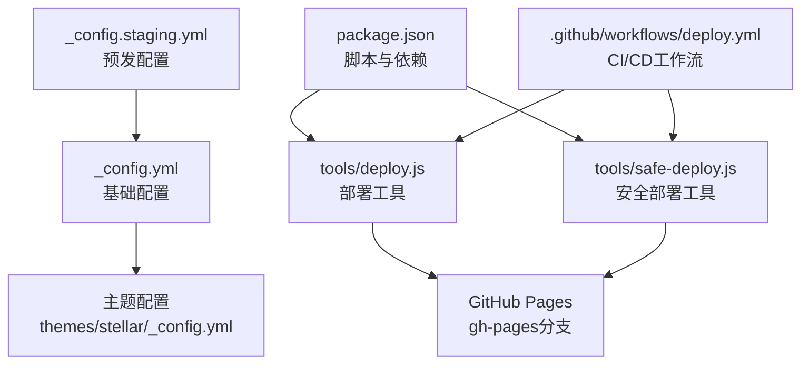
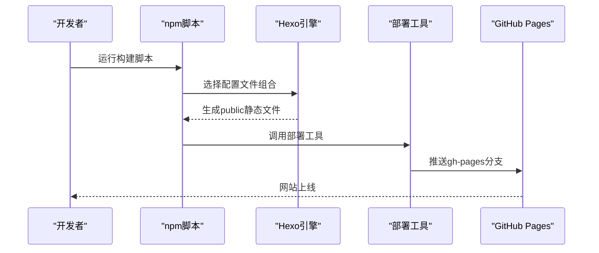
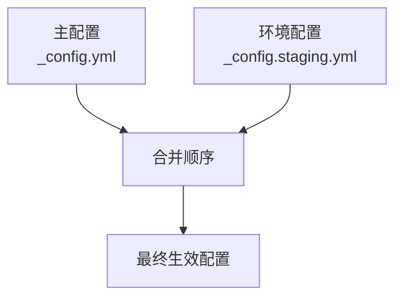
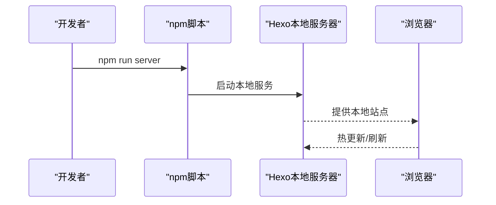
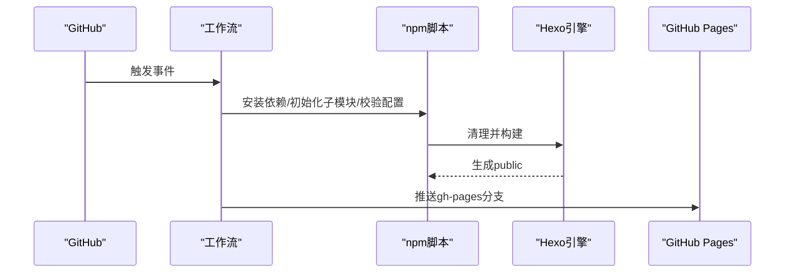
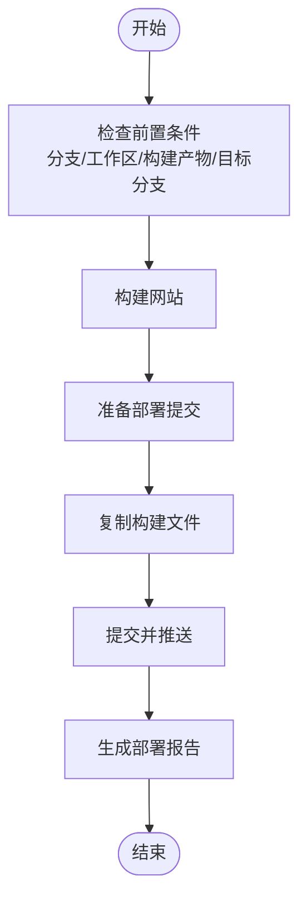
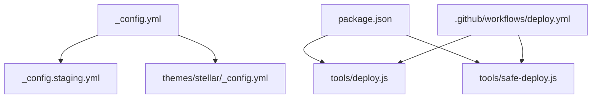

# 环境配置

<cite>
**本文引用的文件**
- [_config.yml](file://_config.yml)
- [_config.staging.yml](file://_config.staging.yml)
- [package.json](file://package.json)
- [tools/deploy.js](file://tools/deploy.js)
- [tools/safe-deploy.js](file://tools/safe-deploy.js)
- [themes/stellar/_config.yml](file://themes/stellar/_config.yml)
- [themes/butterfly/_config.yml](file://themes/butterfly/_config.yml)
- [.github/workflows/deploy.yml](file://.github/workflows/deploy.yml)
</cite>

## 目录
1. [简介](#简介)
2. [项目结构](#项目结构)
3. [核心组件](#核心组件)
4. [架构总览](#架构总览)
5. [详细组件分析](#详细组件分析)
6. [依赖关系分析](#依赖关系分析)
7. [性能考量](#性能考量)
8. [故障排查指南](#故障排查指南)
9. [结论](#结论)
10. [附录](#附录)

## 简介
本指南面向H1S97X博客的多环境配置管理，围绕开发环境、测试环境与生产环境的差异与策略展开，涵盖调试设置、性能监控、缓存策略、第三方服务配置等主题。文档同时解释配置文件的继承与覆盖机制，给出环境变量使用方法与配置模板，总结最佳实践（版本控制、敏感信息保护、配置热更新），并提供完整的环境配置示例与部署脚本。

## 项目结构
H1S97X博客基于Hexo静态站点生成器，结合Stellar主题与GitHub Pages进行部署。多环境配置主要通过主配置文件与环境专用配置文件组合实现，并辅以npm脚本与GitHub Actions工作流完成构建与部署。

**图表来源**
- [_config.yml](file://_config.yml#L1-L136)
- [_config.staging.yml](file://_config.staging.yml#L1-L33)
- [themes/stellar/_config.yml](file://themes/stellar/_config.yml#L1-L725)
- [package.json](file://package.json#L1-L94)
- [tools/deploy.js](file://tools/deploy.js#L1-L472)
- [tools/safe-deploy.js](file://tools/safe-deploy.js#L1-L352)
- [.github/workflows/deploy.yml](file://.github/workflows/deploy.yml#L1-L87)

**章节来源**
- [package.json](file://package.json#L1-L94)
- [_config.yml](file://_config.yml#L1-L136)
- [_config.staging.yml](file://_config.staging.yml#L1-L33)
- [themes/stellar/_config.yml](file://themes/stellar/_config.yml#L1-L725)

## 核心组件
- 基础配置文件：主配置文件集中定义站点基本信息、URL、目录、写作、分页、扩展、RSS与部署等通用设置。
- 环境专用配置：预发环境配置文件对主配置进行增量覆盖，用于差异化行为（如调试开关、部署分支、额外插件等）。
- 主题配置：Stellar主题配置集中管理SEO、评论系统、搜索、CDN、插件注入、样式与功能开关等。
- 构建与部署：通过npm脚本与部署工具实现一键构建与部署；GitHub Actions在CI中自动校验与部署。
- CI/CD工作流：在推送与拉取请求时自动执行构建、测试与部署到GitHub Pages。

**章节来源**
- [_config.yml](file://_config.yml#L1-L136)
- [_config.staging.yml](file://_config.staging.yml#L1-L33)
- [themes/stellar/_config.yml](file://themes/stellar/_config.yml#L1-L725)
- [package.json](file://package.json#L1-L94)
- [.github/workflows/deploy.yml](file://.github/workflows/deploy.yml#L1-L87)

## 架构总览
多环境配置通过“主配置 + 环境配置”的组合实现继承与覆盖，构建阶段通过npm脚本选择性合并配置文件，最终生成public静态资源并部署到GitHub Pages。

**图表来源**
- [package.json](file://package.json#L5-L41)
- [tools/deploy.js](file://tools/deploy.js#L98-L164)
- [.github/workflows/deploy.yml](file://.github/workflows/deploy.yml#L41-L72)

**章节来源**
- [package.json](file://package.json#L5-L41)
- [tools/deploy.js](file://tools/deploy.js#L98-L164)
- [.github/workflows/deploy.yml](file://.github/workflows/deploy.yml#L41-L72)

## 详细组件分析

### 配置文件继承与覆盖机制
- 主配置文件集中定义站点基础信息、URL、目录、写作、分页、扩展、RSS与部署等。
- 环境专用配置文件对主配置进行增量覆盖，如预发环境覆盖站点标题、URL、root、部署分支、调试开关与开发插件等。
- 构建脚本通过传入多个配置文件路径实现叠加，后者覆盖前者同名键值。

**图表来源**
- [_config.yml](file://_config.yml#L1-L136)
- [_config.staging.yml](file://_config.staging.yml#L1-L33)
- [package.json](file://package.json#L8-L31)

**章节来源**
- [_config.yml](file://_config.yml#L1-L136)
- [_config.staging.yml](file://_config.staging.yml#L1-L33)
- [package.json](file://package.json#L8-L31)

### 开发环境（本地开发）
- 本地启动：通过Hexo本地服务器启动，便于实时预览与调试。
- 开发插件：预发环境配置启用Live Reload相关插件，提升开发体验。
- 调试开关：预发环境开启调试开关，便于定位问题。

**图表来源**
- [package.json](file://package.json#L30-L31)
- [_config.staging.yml](file://_config.staging.yml#L23-L33)

**章节来源**
- [package.json](file://package.json#L30-L31)
- [_config.staging.yml](file://_config.staging.yml#L23-L33)

### 测试环境（CI/CD）
- 自动构建：工作流在推送与拉取请求时自动安装依赖、初始化主题子模块、校验主题配置、执行测试与构建。
- 输出验证：构建完成后验证关键文件存在性，统计HTML数量与目录大小。
- 条件部署：仅在主分支推送时部署到GitHub Pages。

**图表来源**
- [.github/workflows/deploy.yml](file://.github/workflows/deploy.yml#L14-L72)

**章节来源**
- [.github/workflows/deploy.yml](file://.github/workflows/deploy.yml#L14-L72)

### 生产环境（线上）
- 部署工具：提供自动化的构建、验证与部署流程，支持预览模式与日志记录，保障部署安全与可追溯。
- 安全部署：安全部署工具强调保护源码、保留历史与支持回滚，严格检查前置条件并生成部署报告。

**图表来源**
- [tools/deploy.js](file://tools/deploy.js#L62-L116)
- [tools/deploy.js](file://tools/deploy.js#L118-L164)
- [tools/safe-deploy.js](file://tools/safe-deploy.js#L62-L116)

**章节来源**
- [tools/deploy.js](file://tools/deploy.js#L62-L116)
- [tools/deploy.js](file://tools/deploy.js#L118-L164)
- [tools/safe-deploy.js](file://tools/safe-deploy.js#L62-L116)

### 环境特定配置项详解
- 调试设置
  - 预发环境开启调试开关，便于开发调试。
  - 本地服务器脚本提供热更新与开发插件支持。
- 性能监控
  - 构建阶段统计HTML文件数量与目录大小，便于评估性能与容量。
- 缓存策略
  - 主题配置中包含CDN提供商与版本号控制，可按需调整缓存策略。
- 第三方服务配置
  - 评论系统、搜索、分析与广告等服务在主题配置中集中管理，支持按需启用与禁用。

**章节来源**
- [_config.staging.yml](file://_config.staging.yml#L19-L33)
- [package.json](file://package.json#L30-L31)
- [.github/workflows/deploy.yml](file://.github/workflows/deploy.yml#L48-L51)
- [themes/stellar/_config.yml](file://themes/stellar/_config.yml#L1-L725)

### 配置模板与最佳实践
- 配置模板
  - 主配置文件模板：集中定义站点基础信息、URL、目录、写作、分页、扩展、RSS与部署等。
  - 环境配置文件模板：对主配置进行增量覆盖，如预发环境覆盖站点标题、URL、root、部署分支、调试开关与开发插件等。
  - 主题配置文件模板：集中管理SEO、评论系统、搜索、CDN、插件注入、样式与功能开关等。
- 最佳实践
  - 版本控制：将主配置与环境配置纳入版本控制，确保可追溯与可复现。
  - 敏感信息保护：将密钥与令牌置于环境变量或受控的机密中，不在配置文件中硬编码。
  - 配置热更新：通过CI/CD自动应用配置变更，避免手工干预带来的风险。

**章节来源**
- [_config.yml](file://_config.yml#L1-L136)
- [_config.staging.yml](file://_config.staging.yml#L1-L33)
- [themes/stellar/_config.yml](file://themes/stellar/_config.yml#L1-L725)
- [.github/workflows/deploy.yml](file://.github/workflows/deploy.yml#L1-L87)

## 依赖关系分析
- 配置依赖
  - 主配置文件为基线，环境配置文件对主配置进行增量覆盖。
  - 构建脚本通过传入多个配置文件路径实现叠加。
- 工具依赖
  - 部署工具与安全部署工具依赖Git与Node.js环境，负责构建、验证与推送。
- CI/CD依赖
  - 工作流依赖GitHub Actions与Node.js环境，负责自动构建与部署。

**图表来源**
- [_config.yml](file://_config.yml#L1-L136)
- [_config.staging.yml](file://_config.staging.yml#L1-L33)
- [themes/stellar/_config.yml](file://themes/stellar/_config.yml#L1-L725)
- [package.json](file://package.json#L1-L94)
- [tools/deploy.js](file://tools/deploy.js#L1-L472)
- [tools/safe-deploy.js](file://tools/safe-deploy.js#L1-L352)
- [.github/workflows/deploy.yml](file://.github/workflows/deploy.yml#L1-L87)

**章节来源**
- [package.json](file://package.json#L1-L94)
- [tools/deploy.js](file://tools/deploy.js#L1-L472)
- [tools/safe-deploy.js](file://tools/safe-deploy.js#L1-L352)
- [.github/workflows/deploy.yml](file://.github/workflows/deploy.yml#L1-L87)

## 性能考量
- 构建输出统计：工作流在构建后统计HTML文件数量与目录大小，便于评估性能与容量。
- CDN与版本控制：主题配置支持CDN提供商与版本号控制，有助于缓存与性能优化。
- 评论与搜索：评论系统与搜索服务的启用与否直接影响页面加载性能，应按需配置。

**章节来源**
- [.github/workflows/deploy.yml](file://.github/workflows/deploy.yml#L48-L51)
- [themes/stellar/_config.yml](file://themes/stellar/_config.yml#L1-L725)

## 故障排查指南
- 部署失败
  - 检查Git工作区状态与远程仓库配置，确认分支与提交信息。
  - 验证构建产物是否存在关键文件，如index.html、CSS与JS等。
- 预发模式
  - 使用预览模式查看将要执行的操作，避免误操作。
- 回滚机制
  - 安全部署工具支持回滚机制，保留部署历史，便于快速恢复。

**章节来源**
- [tools/deploy.js](file://tools/deploy.js#L42-L93)
- [tools/deploy.js](file://tools/deploy.js#L166-L220)
- [tools/safe-deploy.js](file://tools/safe-deploy.js#L62-L116)
- [tools/safe-deploy.js](file://tools/safe-deploy.js#L291-L340)

## 结论
通过“主配置 + 环境配置”的组合与CI/CD自动化流程，H1S97X博客实现了多环境的统一配置管理与高效部署。配合部署工具与安全部署工具，能够在保证安全性与可追溯性的前提下，快速迭代与上线。建议持续完善配置模板与最佳实践，强化敏感信息保护与热更新能力，进一步提升团队协作效率与系统稳定性。

## 附录
- 环境配置示例
  - 开发环境：本地服务器脚本与预发环境配置文件。
  - 测试环境：CI/CD工作流自动构建与部署。
  - 生产环境：部署工具与安全部署工具。
- 部署脚本
  - 自动部署脚本：负责构建、验证与推送。
  - 安全部署脚本：强调保护源码、保留历史与支持回滚。

**章节来源**
- [package.json](file://package.json#L5-L41)
- [_config.staging.yml](file://_config.staging.yml#L1-L33)
- [.github/workflows/deploy.yml](file://.github/workflows/deploy.yml#L1-L87)
- [tools/deploy.js](file://tools/deploy.js#L1-L472)
- [tools/safe-deploy.js](file://tools/safe-deploy.js#L1-L352)