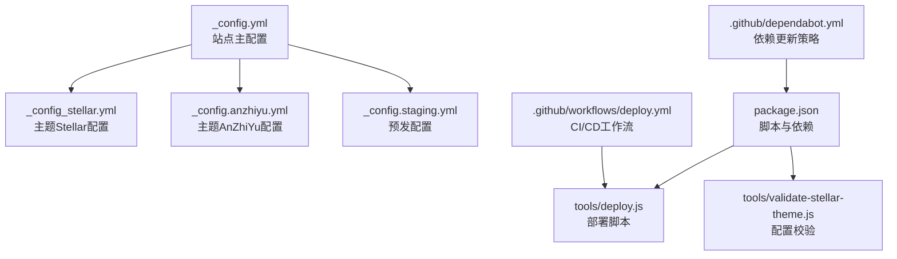
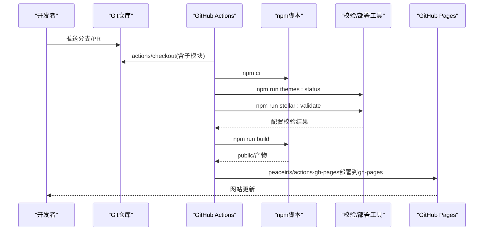
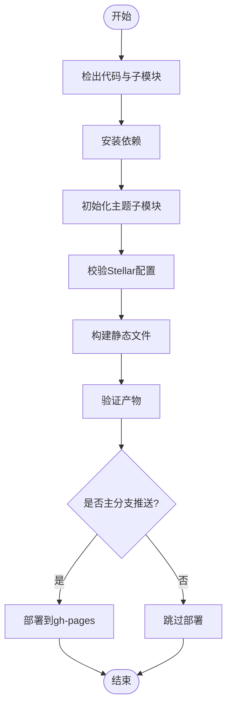
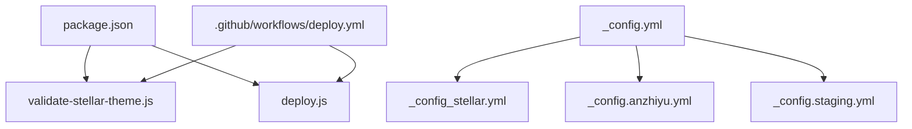

# 配置最佳实践

<cite>
**本文引用的文件**
- [_config.yml](file://_config.yml)
- [_config_stellar.yml](file://_config_stellar.yml)
- [_config.anzhiyu.yml](file://_config.anzhiyu.yml)
- [_config.staging.yml](file://_config.staging.yml)
- [package.json](file://package.json)
- [tools/deploy.js](file://tools/deploy.js)
- [tools/validate-stellar-theme.js](file://tools/validate-stellar-theme.js)
- [.github/workflows/deploy.yml](file://.github/workflows/deploy.yml)
- [.github/dependabot.yml](file://.github/dependabot.yml)
</cite>

## 目录
1. [简介](#简介)
2. [项目结构](#项目结构)
3. [核心组件](#核心组件)
4. [架构总览](#架构总览)
5. [详细组件分析](#详细组件分析)
6. [依赖关系分析](#依赖关系分析)
7. [性能考虑](#性能考虑)
8. [故障排除指南](#故障排除指南)
9. [结论](#结论)
10. [附录](#附录)

## 简介
本指南面向H1S97X博客的配置管理，围绕配置性能优化、安全配置、维护策略、故障排除以及配置自动化与CI/CD集成展开，结合仓库中的Hexo与Stellar主题配置、部署脚本与GitHub Actions工作流，提供可落地的最佳实践。

## 项目结构
- 配置层
  - 站点主配置：[_config.yml](file://_config.yml)
  - 主题Stellar配置：[_config_stellar.yml](file://_config_stellar.yml)
  - 主题AnZhiYu配置：[_config.anzhiyu.yml](file://_config.anzhiyu.yml)
  - 预发环境配置：[_config.staging.yml](file://_config.staging.yml)
  - 依赖与脚本：[package.json](file://package.json)
- 自动化与工具
  - 部署脚本：[tools/deploy.js](file://tools/deploy.js)
  - 配置校验脚本：[tools/validate-stellar-theme.js](file://tools/validate-stellar-theme.js)
  - CI/CD工作流：[.github/workflows/deploy.yml](file://.github/workflows/deploy.yml)
  - 依赖更新策略：[.github/dependabot.yml](file://.github/dependabot.yml)

**图表来源**
- [_config.yml](file://_config.yml#L1-L136)
- [_config_stellar.yml](file://_config_stellar.yml#L1-L699)
- [_config.anzhiyu.yml](file://_config.anzhiyu.yml#L1-L800)
- [_config.staging.yml](file://_config.staging.yml#L1-L33)
- [package.json](file://package.json#L1-L94)
- [tools/deploy.js](file://tools/deploy.js#L1-L472)
- [tools/validate-stellar-theme.js](file://tools/validate-stellar-theme.js#L1-L313)
- [.github/workflows/deploy.yml](file://.github/workflows/deploy.yml#L1-L87)
- [.github/dependabot.yml](file://.github/dependabot.yml#L1-L8)

**章节来源**
- [_config.yml](file://_config.yml#L1-L136)
- [_config_stellar.yml](file://_config_stellar.yml#L1-L699)
- [_config.anzhiyu.yml](file://_config.anzhiyu.yml#L1-L800)
- [_config.staging.yml](file://_config.staging.yml#L1-L33)
- [package.json](file://package.json#L1-L94)

## 核心组件
- 站点主配置（Hexo）
  - 站点信息、URL、目录、写作与分页、RSS与搜索、部署等
  - 关键点：URL与HTTPS、RSS开关、搜索字段、部署仓库与分支
- 主题Stellar配置
  - 导航、站点树、文章与笔记布局、评论系统、插件、样式与依赖等
  - 关键点：评论服务、搜索服务、插件启用、依赖CDN与本地资源
- 预发环境配置
  - 独立URL、root、分支、调试与Browsersync
- 依赖与脚本
  - npm脚本：构建、清理、部署、校验、测试、主题管理
  - 依赖：Hexo、Stellar主题、搜索、RSS、站点地图、渲染器等
- 自动化与CI/CD
  - GitHub Actions：检出、安装依赖、初始化子模块、校验、构建、部署到gh-pages
  - Dependabot：每日拉取npm依赖更新

**章节来源**
- [_config.yml](file://_config.yml#L18-L136)
- [_config_stellar.yml](file://_config_stellar.yml#L1-L699)
- [_config.staging.yml](file://_config.staging.yml#L1-L33)
- [package.json](file://package.json#L5-L41)

## 架构总览
下图展示从配置到构建、校验、部署的端到端流程，以及与CI/CD的衔接。

**图表来源**
- [.github/workflows/deploy.yml](file://.github/workflows/deploy.yml#L1-L87)
- [tools/validate-stellar-theme.js](file://tools/validate-stellar-theme.js#L22-L45)
- [tools/deploy.js](file://tools/deploy.js#L383-L418)
- [package.json](file://package.json#L5-L41)

## 详细组件分析

### 配置性能优化
- 加载速度优化
  - CDN资源：Stellar配置中大量外部CDN（如jsDelivr、Algolia等），建议固定版本号与镜像源，减少上游波动
  - 懒加载与按需加载：Stellar支持懒加载与“按需加载”，合理启用可降低首屏负担
  - 预加载策略：启用飞行页（flying_pages）等预加载服务，提升页面跳转体验
- 缓存策略
  - 静态资源缓存：通过CDN与浏览器缓存策略配合，结合文件指纹（由Hexo生成），提升命中率
  - 服务端缓存：GitHub Pages为静态托管，建议在CDN层配置缓存头
- 资源压缩
  - 使用Stellar内置样式与脚本压缩；对图片与媒体资源进行压缩与WebP转换
  - 合理拆分与合并：按页面维度拆分JS/CSS，避免单文件过大
- 分析与监控
  - 预留分析埋点配置（如Google Analytics等），便于性能指标收集

**章节来源**
- [_config_stellar.yml](file://_config_stellar.yml#L506-L592)
- [_config_stellar.yml](file://_config_stellar.yml#L429-L495)
- [_config.yml](file://_config.yml#L104-L136)

### 安全配置要点
- HTTPS与强制HTTPS
  - 确保站点URL为HTTPS，避免混合内容
  - 在CDN与反向代理层统一重定向至HTTPS
- 防CSRF与XSS
  - 评论系统：Stellar使用giscus，建议启用跨站引用策略与安全头；避免在评论区允许任意HTML
  - 输入过滤：Markdown渲染器与主题插件应避免直接输出未经转义的内容
- 敏感信息保护
  - 避免在配置中硬编码密钥；使用环境变量或GitHub Secrets注入
  - 部署脚本与工作流中避免打印敏感信息
- 内容安全策略（CSP）
  - 在CDN或服务端设置CSP，限制脚本来源与内联脚本

**章节来源**
- [_config.yml](file://_config.yml#L20-L20)
- [_config_stellar.yml](file://_config_stellar.yml#L218-L235)

### 配置维护策略
- 配置版本管理
  - 使用Git管理配置文件，区分主配置与主题配置；为重大变更打标签
- 变更追踪
  - 在提交信息中明确说明配置变更（如“feat: 启用Mermaid插件”）
- 回滚机制
  - 通过Git标签与分支回退；部署脚本支持预览模式（dry-run）进行回滚演练
- 主题与依赖管理
  - 使用子模块管理主题；定期更新子模块并运行校验脚本
  - 依赖更新通过Dependabot拉取PR，人工审阅后再合并

**章节来源**
- [tools/deploy.js](file://tools/deploy.js#L17-L18)
- [tools/deploy.js](file://tools/deploy.js#L383-L418)
- [tools/validate-stellar-theme.js](file://tools/validate-stellar-theme.js#L22-L45)
- [.github/dependabot.yml](file://.github/dependabot.yml#L1-L8)

### 配置自动化与CI/CD集成
- 工作流职责
  - 检出代码与子模块、安装依赖、初始化主题、校验配置、构建、验证产物、部署到gh-pages
- 部署脚本职责
  - 校验Git状态、构建站点、创建/更新gh-pages分支、复制public内容、推送并切回原分支
- 本地与CI一致性
  - 通过npm脚本统一入口，保证本地与CI行为一致

**图表来源**
- [.github/workflows/deploy.yml](file://.github/workflows/deploy.yml#L14-L73)
- [tools/deploy.js](file://tools/deploy.js#L383-L418)

**章节来源**
- [.github/workflows/deploy.yml](file://.github/workflows/deploy.yml#L1-L87)
- [tools/deploy.js](file://tools/deploy.js#L1-L472)

## 依赖关系分析
- 配置与主题
  - 站点主配置决定主题与插件启用；Stellar配置细化主题功能与资源
- 脚本与工具
  - package.json脚本串联校验、构建、部署；validate脚本与deploy脚本相互补充
- CI/CD与本地
  - 工作流与本地脚本保持一致的执行顺序与参数

**图表来源**
- [package.json](file://package.json#L5-L41)
- [tools/validate-stellar-theme.js](file://tools/validate-stellar-theme.js#L1-L313)
- [tools/deploy.js](file://tools/deploy.js#L1-L472)
- [.github/workflows/deploy.yml](file://.github/workflows/deploy.yml#L1-L87)
- [_config.yml](file://_config.yml#L1-L136)
- [_config_stellar.yml](file://_config_stellar.yml#L1-L699)
- [_config.anzhiyu.yml](file://_config.anzhiyu.yml#L1-L800)
- [_config.staging.yml](file://_config.staging.yml#L1-L33)

**章节来源**
- [package.json](file://package.json#L1-L94)
- [tools/validate-stellar-theme.js](file://tools/validate-stellar-theme.js#L1-L313)
- [tools/deploy.js](file://tools/deploy.js#L1-L472)
- [.github/workflows/deploy.yml](file://.github/workflows/deploy.yml#L1-L87)

## 性能考虑
- 构建阶段
  - 启用Stellar的按需加载与懒加载，减少首屏资源
  - 控制搜索索引范围与内容长度，平衡搜索质量与体积
- 运行阶段
  - 使用CDN与缓存策略；对图片与媒体进行压缩与格式优化
  - 合理拆分CSS/JS，避免单文件过大导致阻塞
- 监控与度量
  - 通过分析埋点与CDN日志，持续评估加载时延与命中率

[本节为通用指导，无需列出章节来源]

## 故障排除指南
- 常见配置错误
  - 主题未设置为stellar或Stellar配置文件缺失
  - URL未设置为HTTPS或路径不正确
  - 搜索/评论服务未启用或配置不完整
- 调试方法
  - 使用预览模式（dry-run）观察部署流程
  - 运行校验脚本，关注错误与警告输出
  - 在预发环境（staging）验证配置与功能
- 性能问题诊断
  - 检查构建产物数量与体积，定位大文件
  - 分析CDN缓存命中与回源比例
  - 通过浏览器开发者工具分析关键渲染路径

**章节来源**
- [tools/validate-stellar-theme.js](file://tools/validate-stellar-theme.js#L22-L45)
- [tools/deploy.js](file://tools/deploy.js#L17-L18)
- [tools/deploy.js](file://tools/deploy.js#L383-L418)
- [_config_stellar.yml](file://_config_stellar.yml#L175-L189)
- [_config_stellar.yml](file://_config_stellar.yml#L218-L235)

## 结论
通过规范化的配置管理、完善的自动化与CI/CD流程、以及持续的安全与性能优化策略，H1S97X博客能够在保证稳定性的同时，持续提升用户体验与维护效率。建议在团队内固化配置变更流程，定期进行配置健康检查与依赖更新。

[本节为总结，无需列出章节来源]

## 附录
- 配置清单与建议
  - 站点URL与HTTPS、RSS开关、搜索字段、部署仓库与分支
  - Stellar评论与搜索服务、插件启用、CDN版本固定
  - 预发环境独立分支与调试开关
- 脚本与工作流清单
  - npm脚本：build、deploy、stellar:validate、themes:status等
  - GitHub Actions：检出、安装、初始化、校验、构建、部署

**章节来源**
- [_config.yml](file://_config.yml#L18-L136)
- [_config_stellar.yml](file://_config_stellar.yml#L175-L189)
- [_config_stellar.yml](file://_config_stellar.yml#L218-L235)
- [_config.staging.yml](file://_config.staging.yml#L1-L33)
- [package.json](file://package.json#L5-L41)
- [.github/workflows/deploy.yml](file://.github/workflows/deploy.yml#L1-L87)