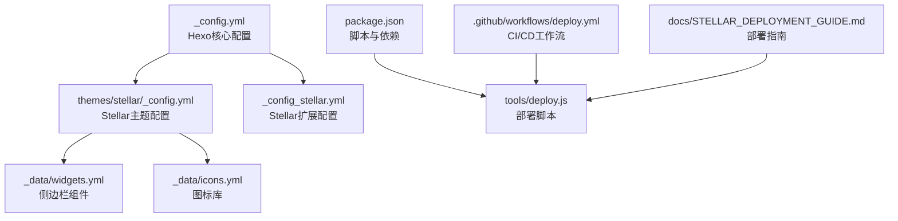
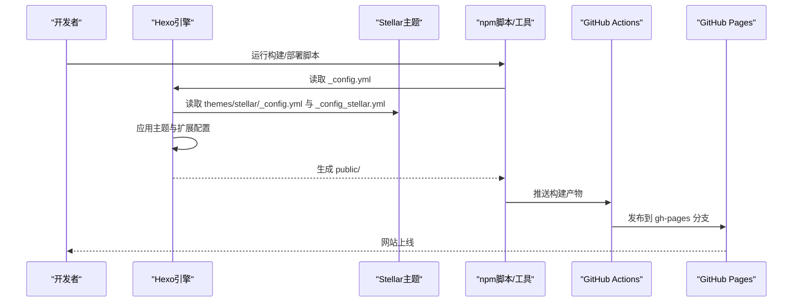
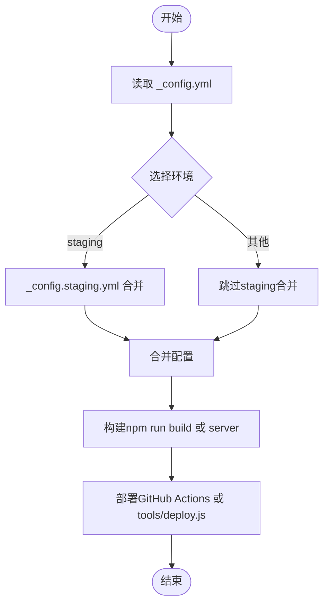
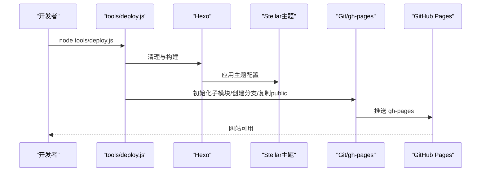
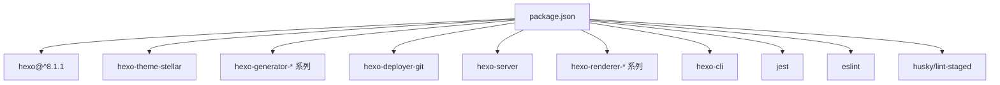

# 配置管理

<cite>
**本文引用的文件**
- [_config.yml](file://_config.yml)
- [_config.staging.yml](file://_config.staging.yml)
- [_config_stellar.yml](file://_config_stellar.yml)
- [themes/stellar/_config.yml](file://themes/stellar/_config.yml)
- [themes/stellar/_data/widgets.yml](file://themes/stellar/_data/widgets.yml)
- [themes/stellar/_data/icons.yml](file://themes/stellar/_data/icons.yml)
- [package.json](file://package.json)
- [tools/deploy.js](file://tools/deploy.js)
- [.github/workflows/deploy.yml](file://.github/workflows/deploy.yml)
- [docs/STELLAR_DEPLOYMENT_GUIDE.md](file://docs/STELLAR_DEPLOYMENT_GUIDE.md)
</cite>

## 目录
1. [简介](#简介)
2. [项目结构](#项目结构)
3. [核心组件](#核心组件)
4. [架构总览](#架构总览)
5. [详细组件分析](#详细组件分析)
6. [依赖分析](#依赖分析)
7. [性能考量](#性能考量)
8. [故障排查指南](#故障排查指南)
9. [结论](#结论)
10. [附录](#附录)

## 简介
本指南面向H1S97X博客的配置管理，围绕Hexo核心配置与Stellar主题配置展开，涵盖站点信息、URL设置、分页、插件与第三方集成、SEO优化、多环境配置策略（开发/测试/生产）、配置优先级与继承关系、覆盖与扩展方法、最佳实践（性能、安全、维护）以及常见问题与解决方案。文档同时结合仓库中的脚本与工作流，给出可操作的部署与验证流程。

## 项目结构
本仓库采用“Hexo + 主题子模块”的组织方式，核心配置位于根目录的配置文件中，Stellar主题配置位于themes/stellar目录下，部署与验证通过npm脚本与GitHub Actions工作流完成。

**图表来源**
- [_config.yml](file://_config.yml#L1-L136)
- [themes/stellar/_config.yml](file://themes/stellar/_config.yml#L1-L725)
- [_config_stellar.yml](file://_config_stellar.yml#L1-L699)
- [themes/stellar/_data/widgets.yml](file://themes/stellar/_data/widgets.yml#L1-L85)
- [themes/stellar/_data/icons.yml](file://themes/stellar/_data/icons.yml#L1-L59)
- [package.json](file://package.json#L1-L94)
- [tools/deploy.js](file://tools/deploy.js#L1-L472)
- [.github/workflows/deploy.yml](file://.github/workflows/deploy.yml#L1-L87)
- [docs/STELLAR_DEPLOYMENT_GUIDE.md](file://docs/STELLAR_DEPLOYMENT_GUIDE.md#L1-L256)

**章节来源**
- [themes/stellar/_config.yml](file://themes/stellar/_config.yml#L1-L725)
- [_config.yml](file://_config.yml#L1-L136)
- [_config_stellar.yml](file://_config_stellar.yml#L1-L699)
- [themes/stellar/_data/widgets.yml](file://themes/stellar/_data/widgets.yml#L1-L85)
- [themes/stellar/_data/icons.yml](file://themes/stellar/_data/icons.yml#L1-L59)
- [package.json](file://package.json#L1-L94)
- [tools/deploy.js](file://tools/deploy.js#L1-L472)
- [.github/workflows/deploy.yml](file://.github/workflows/deploy.yml#L1-L87)
- [docs/STELLAR_DEPLOYMENT_GUIDE.md](file://docs/STELLAR_DEPLOYMENT_GUIDE.md#L1-L256)

## 核心组件
- Hexo核心配置（站点信息、URL、目录、写作、首页与分页、元数据、日期时间、扩展、RSS、部署）
- Stellar主题配置（站点树、笔记本、文章、搜索、评论、页脚、标签插件、依赖与内置服务、插件、样式、默认资源、API主机、系统）
- 多环境配置（开发/测试/生产）
- 部署与验证（npm脚本、部署脚本、GitHub Actions）

**章节来源**
- [_config.yml](file://_config.yml#L5-L136)
- [themes/stellar/_config.yml](file://themes/stellar/_config.yml#L1-L725)
- [_config_stellar.yml](file://_config_stellar.yml#L1-L699)
- [_config.staging.yml](file://_config.staging.yml#L1-L33)
- [package.json](file://package.json#L5-L41)
- [tools/deploy.js](file://tools/deploy.js#L12-L472)
- [.github/workflows/deploy.yml](file://.github/workflows/deploy.yml#L1-L87)

## 架构总览
下图展示配置在构建与部署阶段的流向与作用范围：

**图表来源**
- [_config.yml](file://_config.yml#L104-L136)
- [themes/stellar/_config.yml](file://themes/stellar/_config.yml#L1-L725)
- [_config_stellar.yml](file://_config_stellar.yml#L1-L699)
- [package.json](file://package.json#L5-L41)
- [tools/deploy.js](file://tools/deploy.js#L98-L164)
- [.github/workflows/deploy.yml](file://.github/workflows/deploy.yml#L41-L72)

## 详细组件分析

### Hexo核心配置（站点与URL）
- 站点信息：title、subtitle、description、keywords、author、language、timezone
- URL与永久链接：url、permalink、pretty_urls（trailing_index、trailing_html）
- 目录与渲染：source_dir、public_dir、tag_dir、archive_dir、category_dir、code_dir、i18n_dir、skip_render
- 写作与高亮：new_post_name、default_layout、titlecase、external_link（enable、field、exclude）、filename_case、render_drafts、post_asset_folder、relative_link、future、highlight（line_number、auto_detect、wrap、hljs）、prismjs
- 首页与分页：index_generator（path、per_page、order_by）、per_page、pagination_dir
- 元数据与日期：meta_generator、date_format、time_format、updated_option
- 包含/排除：include、exclude、ignore
- 主题与扩展：theme、aplayer（meting、asset_inject）、search（path、field、format、limit）
- RSS：feed（enable、type、path、limit、content、content_limit、order_by、icon、autodiscovery）
- 部署：deploy（type、repo、branch）

**章节来源**
- [_config.yml](file://_config.yml#L5-L136)

### Stellar主题配置（外观、功能、第三方、SEO）
- 站点信息与导航：logo（avatar、title、subtitle）、menubar（columns、items）
- 站点树：site_tree（home、index_blog、index_topic、index_wiki、post、topic、wiki、notebooks、notes、note、author、error_page、page）
- 笔记本：notebook（auto_excerpt、tagcons、per_page、order_by、license、share）
- 文章：article（type、indent、cover_ratio、banner_ratio、auto_banner、auto_excerpt、category_color、license、share、related_posts）
- 搜索：search（service、local_search、algolia_search）
- 评论：comments（service、comment_title、lazyload、custom_css、beaudar、utterances、giscus、twikoo、waline、artalk）
- 页脚：footer（social、sitemap、content）
- 标签插件：tag_plugins（note、checkbox、quot、emoji、icon、button、image、copy、timeline、mark、hashtag、okr、gallery、chat）
- 依赖与内置服务：dependencies、data_services（mdrender、siteinfo、ghinfo、rating、vote、sites、friends、friends_and_posts、timeline、fcircle、weibo、memos、voice、video、download-file、twikoo_latest_comment、waline_latest_comment、artalk_latest_comment、giscus_latest_comment、contributors）
- 插件：preload、fancybox、swiper、scrollreveal、tianli_gpt、katex、mathjax、mermaid、copycode、heti
- 样式：style（prefers_theme、smooth_scroll、font-size、font-family、text-align、prefix、border-radius、color、animated_avatar、codeblock、loading、gradient、leftbar、paginator、error_page、site、header_prefix）
- 默认资源：default（avatar、link、cover、image、project、banner、loading、image_onerror）
- API主机：api_host（ghapi、ghraw、gist、ghcard）
- 系统：system（override_pretty_urls）

此外，Stellar主题还提供：
- canonical（SEO规范链接）
- open_graph、structured_data
- 侧边栏组件widgets.yml与图标库icons.yml

**章节来源**
- [themes/stellar/_config.yml](file://themes/stellar/_config.yml#L1-L725)
- [themes/stellar/_data/widgets.yml](file://themes/stellar/_data/widgets.yml#L1-L85)
- [themes/stellar/_data/icons.yml](file://themes/stellar/_data/icons.yml#L1-L59)

### 多环境配置管理（开发/测试/生产）
- 开发环境（staging）：通过_config.staging.yml扩展基础配置，覆盖title、subtitle、description、url、root、deploy（branch）、debug、plugins（hexo-browsersync）、browsersync配置
- 测试/生产：通过GitHub Actions工作流在push到main/master/develop时自动部署；也可通过npm脚本构建与部署

**图表来源**
- [_config.staging.yml](file://_config.staging.yml#L1-L33)
- [package.json](file://package.json#L8-L31)
- [tools/deploy.js](file://tools/deploy.js#L98-L164)
- [.github/workflows/deploy.yml](file://.github/workflows/deploy.yml#L41-L72)

**章节来源**
- [_config.staging.yml](file://_config.staging.yml#L1-L33)
- [package.json](file://package.json#L8-L31)
- [tools/deploy.js](file://tools/deploy.js#L98-L164)
- [.github/workflows/deploy.yml](file://.github/workflows/deploy.yml#L1-L87)

### 配置优先级与继承关系
- 配置合并顺序：_config.yml（基础） → _config.staging.yml（环境扩展） → themes/stellar/_config.yml（主题默认） → _config_stellar.yml（主题扩展）
- 优先级原则：后加载的配置覆盖先前的同名键值；主题扩展配置对主题默认配置进行覆盖
- 环境覆盖：_config.staging.yml覆盖_base_配置中的同名键，如url、root、deploy.branch等
- 插件与服务：Stellar主题的plugins与data_services在主题配置中声明，按需加载

**章节来源**
- [_config.yml](file://_config.yml#L104-L136)
- [_config_staging.yml](file://_config_staging.yml#L1-L33)
- [themes/stellar/_config.yml](file://themes/stellar/_config.yml#L530-L632)
- [_config_stellar.yml](file://_config_stellar.yml#L504-L699)

### 配置覆盖与扩展
- 覆盖方式：在环境配置文件（如_config.staging.yml）中添加或修改键值；在主题扩展配置（_config_stellar.yml）中覆盖主题默认配置
- 扩展方式：在主题配置中启用/禁用插件、设置样式参数、配置第三方服务（评论、搜索、数学公式、Mermaid等）
- 侧边栏与图标：通过widgets.yml与icons.yml扩展组件与图标资源

**章节来源**
- [_config_staging.yml](file://_config_staging.yml#L1-L33)
- [_config_stellar.yml](file://_config_stellar.yml#L1-L699)
- [themes/stellar/_data/widgets.yml](file://themes/stellar/_data/widgets.yml#L1-L85)
- [themes/stellar/_data/icons.yml](file://themes/stellar/_data/icons.yml#L1-L59)

### SEO与第三方集成
- canonical与open_graph：通过主题配置启用规范链接与OG元数据
- structured_data：可配置社交链接
- 评论系统：giscus、beaudar、utterances、twikoo、waline、artalk
- 搜索：本地搜索、Algolia Docsearch
- 数学公式：KaTeX、MathJax
- 图表：Mermaid
- 图片灯箱：Fancybox
- 无障碍与可访问性：通过主题样式与插件优化

**章节来源**
- [themes/stellar/_config.yml](file://themes/stellar/_config.yml#L18-L31)
- [themes/stellar/_config.yml](file://themes/stellar/_config.yml#L220-L330)
- [themes/stellar/_config.yml](file://themes/stellar/_config.yml#L585-L632)
- [_config_stellar.yml](file://_config_stellar.yml#L175-L283)

### 部署与验证流程
- 本地部署：tools/deploy.js负责构建、校验、复制public内容到gh-pages分支并推送
- CI/CD：GitHub Actions工作流在push到main/master/develop时自动构建与部署
- 验证：npm run stellar:validate、npm run test、构建产物校验（index.html、CSS/JS、search.json、sitemap.xml、RSS）

**图表来源**
- [tools/deploy.js](file://tools/deploy.js#L12-L472)
- [.github/workflows/deploy.yml](file://.github/workflows/deploy.yml#L35-L72)
- [docs/STELLAR_DEPLOYMENT_GUIDE.md](file://docs/STELLAR_DEPLOYMENT_GUIDE.md#L110-L126)

**章节来源**
- [tools/deploy.js](file://tools/deploy.js#L12-L472)
- [.github/workflows/deploy.yml](file://.github/workflows/deploy.yml#L1-L87)
- [docs/STELLAR_DEPLOYMENT_GUIDE.md](file://docs/STELLAR_DEPLOYMENT_GUIDE.md#L1-L256)

## 依赖分析
- Hexo版本与主题：package.json声明hexo版本与主题依赖
- 生成器与插件：包括feed、sitemap、搜索、服务器等
- 开发工具：ESLint、Jest、husky、lint-staged
- 部署脚本：依赖子模块与构建产物

**图表来源**
- [package.json](file://package.json#L42-L77)

**章节来源**
- [package.json](file://package.json#L42-L77)

## 性能考量
- 构建优化：启用npm缓存、并行任务、增量构建
- 资源优化：压缩静态资源、CDN加速
- 页面加载：合理配置插件启用、懒加载、平滑滚动
- 监控指标：构建时间、生成文件数、部署大小、页面加载时间

**章节来源**
- [docs/STELLAR_DEPLOYMENT_GUIDE.md](file://docs/STELLAR_DEPLOYMENT_GUIDE.md#L200-L216)

## 故障排查指南
- 主题文件缺失：初始化子模块
- 构建失败：运行验证与清理重建
- 部署权限：检查GitHub token权限与Actions权限
- 页面显示异常：核对url与路径设置
- 已知问题：Stellar主题json_ld helper错误可忽略

**章节来源**
- [docs/STELLAR_DEPLOYMENT_GUIDE.md](file://docs/STELLAR_DEPLOYMENT_GUIDE.md#L127-L197)
- [tools/deploy.js](file://tools/deploy.js#L42-L93)

## 结论
通过明确的配置层次（基础配置、环境配置、主题配置与扩展配置）与严格的CI/CD流程，H1S97X博客实现了可维护、可扩展、可验证的配置管理体系。结合Stellar主题的强大功能与第三方集成，能够在保证性能与安全的前提下，快速迭代与稳定发布。

## 附录
- 配置示例路径
  - 站点信息与URL：[_config.yml](file://_config.yml#L5-L26)
  - 分页与RSS：[_config.yml](file://_config.yml#L67-L128)
  - 主题基础配置：[themes/stellar/_config.yml](file://themes/stellar/_config.yml#L1-L725)
  - 主题扩展配置：[_config_stellar.yml](file://_config_stellar.yml#L1-L699)
  - 环境配置（staging）：[_config.staging.yml](file://_config.staging.yml#L1-L33)
  - 侧边栏组件：[themes/stellar/_data/widgets.yml](file://themes/stellar/_data/widgets.yml#L1-L85)
  - 图标库：[themes/stellar/_data/icons.yml](file://themes/stellar/_data/icons.yml#L1-L59)
  - 部署脚本：[tools/deploy.js](file://tools/deploy.js#L1-L472)
  - 工作流：[.github/workflows/deploy.yml](file://.github/workflows/deploy.yml#L1-L87)
  - 部署指南：[docs/STELLAR_DEPLOYMENT_GUIDE.md](file://docs/STELLAR_DEPLOYMENT_GUIDE.md#L1-L256)