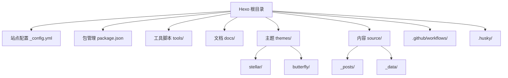
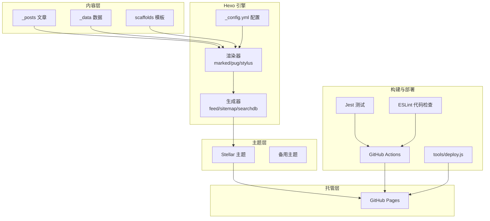
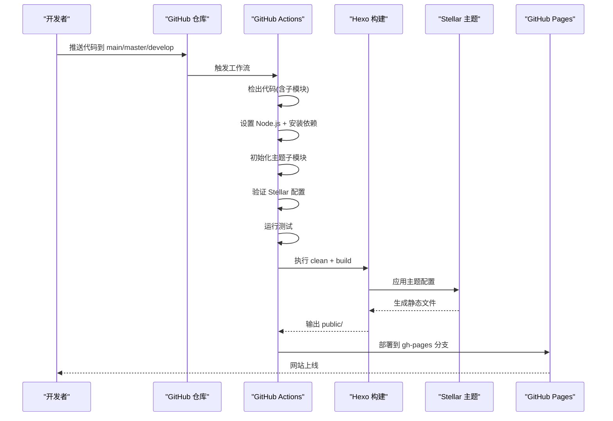
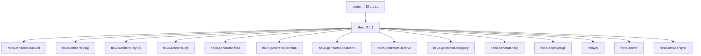

# 项目概述

<cite>
**本文引用的文件**
- [站点配置 _config.yml](file://_config.yml)
- [包管理配置 package.json](file://package.json)
- [Stellar 主题配置 _config.yml](file://themes/stellar/_config.yml)
- [Stellar 主题包配置 package.json](file://themes/stellar/package.json)
- [部署脚本 tools/deploy.js](file://tools/deploy.js)
- [Stellar 部署指南 docs/STELLAR_DEPLOYMENT_GUIDE.md](file://docs/STELLAR_DEPLOYMENT_GUIDE.md)
- [工作流程文档 docs/WORKFLOW.md](file://docs/WORKFLOW.md)
- [GitHub Actions 工作流 .github/workflows/deploy.yml](file://.github/workflows/deploy.yml)
- [Butterfly 主题配置 _config.yml](file://themes/butterfly/_config.yml)
- [Butterfly 主题 README.md](file://themes/butterfly/README.md)
</cite>

## 目录
1. [引言](#引言)
2. [项目结构](#项目结构)
3. [核心组件](#核心组件)
4. [架构总览](#架构总览)
5. [详细组件分析](#详细组件分析)
6. [依赖关系分析](#依赖关系分析)
7. [性能考虑](#性能考虑)
8. [故障排除指南](#故障排除指南)
9. [结论](#结论)
10. [附录](#附录)

## 引言
本项目是一个基于 Hexo 静态博客框架的个人博客，采用 Stellar 主题，结合完善的自动化部署流水线与多环境工作流，实现从开发、测试到生产的全链路自动化。项目目标是提供一个现代化、可扩展、易维护的静态博客平台，支持响应式设计、多格式内容渲染、本地搜索、评论系统、数学公式与图表可视化等高级特性。

## 项目结构
项目采用典型的 Hexo 博客结构，配合主题子模块与工具链脚本，形成清晰的层次化组织：

- 根目录配置与脚本
  - 站点配置：_config.yml
  - 包管理：package.json
  - 工具脚本：tools/*.js
  - 文档：docs/*.md
- 主题模块
  - themes/stellar：Stellar 主题（主题配置与资源）
  - themes/butterfly：备用主题（配置与文档）
- 内容与数据
  - source/_posts：文章内容
  - source/_data：主题数据与小部件配置
  - scaffolds：内容模板
- 自动化与CI/CD
  - .github/workflows：GitHub Actions 工作流
  - .husky：Git hooks（commit-msg、pre-commit）

**图表来源**
- [_config.yml](file://_config.yml#L1-L136)
- [package.json](file://package.json#L1-L94)
- [themes/stellar/_config.yml](file://themes/stellar/_config.yml#L1-L725)
- [.github/workflows/deploy.yml](file://.github/workflows/deploy.yml#L1-L87)

**章节来源**
- [站点配置 _config.yml](file://_config.yml#L1-L136)
- [包管理配置 package.json](file://package.json#L1-L94)
- [工作流程文档 docs/WORKFLOW.md](file://docs/WORKFLOW.md#L1-L163)

## 核心组件
- Hexo 静态生成引擎
  - 版本：8.1.1
  - 渲染器：marked、pug、stylus
  - 生成器：feed、sitemap、searchdb、archive、category、tag
- 主题系统
  - 主题：stellar（1.33.1）
  - 备用主题：butterfly
- 自动化部署
  - GitHub Actions 工作流
  - 自定义部署脚本（tools/deploy.js）
- 开发工具链
  - 测试：Jest
  - 代码检查：ESLint
  - Git hooks：Husky + lint-staged

**章节来源**
- [站点配置 _config.yml](file://_config.yml#L42-L66)
- [包管理配置 package.json](file://package.json#L45-L67)
- [Stellar 主题配置 _config.yml](file://themes/stellar/_config.yml#L1-L725)
- [GitHub Actions 工作流 .github/workflows/deploy.yml](file://.github/workflows/deploy.yml#L1-L87)
- [部署脚本 tools/deploy.js](file://tools/deploy.js#L1-L472)

## 架构总览
项目采用“内容 + 主题 + 静态生成 + 自动部署”的分层架构。内容通过 Hexo 渲染为主题生成静态文件，再由 GitHub Actions 或本地脚本部署到 GitHub Pages。

**图表来源**
- [_config.yml](file://_config.yml#L101-L136)
- [package.json](file://package.json#L45-L67)
- [Stellar 主题配置 _config.yml](file://themes/stellar/_config.yml#L523-L530)
- [.github/workflows/deploy.yml](file://.github/workflows/deploy.yml#L1-L87)
- [部署脚本 tools/deploy.js](file://tools/deploy.js#L1-L472)

## 详细组件分析

### Hexo 配置与生成器
- 站点信息与国际化
  - 标题、副标题、描述、关键词、作者、语言（zh-CN、en）、时区
- URL 与目录
  - 站点 URL、永久链接、静态目录、归档/分类/标签目录
- 写作与高亮
  - 新文章命名、默认布局、外链打开方式、代码高亮（line_number、wrap）
- 分页与首页
  - 首页每页数量、排序规则
- 扩展与部署
  - 主题：stellar
  - 搜索：search.xml、field=post、format=html、limit=10000
  - RSS：atom.xml、limit=20、hub、autodiscovery
  - 部署：git、repo、branch=master

**章节来源**
- [站点配置 _config.yml](file://_config.yml#L5-L136)

### Stellar 主题配置
- 基础信息与 SEO
  - 版本、主页、仓库、主 CSS/JS 路径
  - Canonical、Open Graph、结构化数据
- 侧边栏与导航
  - Logo（头像、标题、副标题）
  - 菜单栏（columns、items）
- 页面结构树
  - 主页、博客列表、Wiki 列表、文章内页、笔记本/笔记、作者页、错误页、自定义页面
- 笔记本与文章
  - 笔记本 per_page、order_by、license、share
  - 文章类型、缩进、封面/横幅比例、自动横幅、摘要长度、许可协议、分享
- 搜索与评论
  - 本地搜索（field=all、path=/search.json、content=true）
  - 评论系统：giscus、twikoo、waline、artalk、utterances、beaudar
- 样式与主题色
  - prefers_theme、字体、字号、圆角、颜色主题、代码块主题
- 插件与服务
  - 预加载、fancybox、swiper、scrollreveal、katex、mermaid、copycode、heti
  - 内置服务：mdrender、siteinfo、ghinfo、rating、vote、sites、friends、timeline、fcircle、weibo、memos、contributors

**章节来源**
- [Stellar 主题配置 _config.yml](file://themes/stellar/_config.yml#L1-L725)

### 自动化部署流水线
- GitHub Actions 工作流
  - 触发：push 到 main/master/develop；pull_request；workflow_dispatch
  - 步骤：检出代码（含子模块）、设置 Node.js、安装依赖、初始化主题子模块、验证配置、运行测试、构建、校验输出、部署到 gh-pages
- 本地部署脚本
  - 验证 Git 状态、检查未提交更改、构建站点（clean + build）、验证关键文件（index.html、css/main.css、js/main.js、search.json、sitemap.xml）、创建/切换 gh-pages 分支、复制 public 内容、提交推送、返回原分支
  - 支持 dry-run 预览模式

**图表来源**
- [.github/workflows/deploy.yml](file://.github/workflows/deploy.yml#L1-L87)
- [部署脚本 tools/deploy.js](file://tools/deploy.js#L383-L418)

**章节来源**
- [GitHub Actions 工作流 .github/workflows/deploy.yml](file://.github/workflows/deploy.yml#L1-L87)
- [Stellar 部署指南 docs/STELLAR_DEPLOYMENT_GUIDE.md](file://docs/STELLAR_DEPLOYMENT_GUIDE.md#L1-L256)
- [部署脚本 tools/deploy.js](file://tools/deploy.js#L1-L472)

### 开发工具链与质量保障
- 测试
  - Jest：单元测试、内容测试、构建测试、链接检查、安全扫描
  - 测试脚本：test、test:watch、test:coverage、check-links、validate
- 代码质量
  - ESLint：代码风格与潜在问题检查
  - Husky + lint-staged：Git hooks 自动化检查
- 文档与规范
  - 工作流程文档：分支策略、开发流程、测试策略、部署流程、代码规范、审查清单
  - 部署指南：多环境支持、配置要求、故障排除、性能优化、安全配置

**章节来源**
- [包管理配置 package.json](file://package.json#L68-L94)
- [工作流程文档 docs/WORKFLOW.md](file://docs/WORKFLOW.md#L67-L163)
- [Stellar 部署指南 docs/STELLAR_DEPLOYMENT_GUIDE.md](file://docs/STELLAR_DEPLOYMENT_GUIDE.md#L110-L256)

## 依赖关系分析
- Hexo 与主题
  - Hexo 版本：8.1.1
  - 主题：stellar 1.33.1（通过子模块管理）
- 渲染器与生成器
  - 渲染器：marked、pug、stylus、ejs
  - 生成器：feed、sitemap、searchdb、archive、category、tag、index
- 评论与搜索
  - 本地搜索：hexo-generator-searchdb
  - 评论：giscus（通过主题配置）
- 部署与工具
  - 部署：hexo-deployer-git
  - 工具：dplayer、hexo-browsersync、hexo-server

**图表来源**
- [包管理配置 package.json](file://package.json#L45-L67)
- [Stellar 主题包配置 package.json](file://themes/stellar/package.json#L1-L33)

**章节来源**
- [包管理配置 package.json](file://package.json#L45-L67)
- [Stellar 主题包配置 package.json](file://themes/stellar/package.json#L1-L33)

## 性能考虑
- 构建优化
  - 启用 npm 缓存（actions/setup-node@v4）
  - 增量构建与并行任务
  - 子模块初始化与依赖安装分离
- 部署优化
  - force_orphan 清理历史
  - 压缩静态资源（建议在主题或 CDN 层处理）
  - 启用 CDN 加速（主题配置中的 CDN 资源）
- 监控指标
  - 构建时间：< 5 分钟
  - 生成文件数：~200+ HTML
  - 部署大小：< 50MB
  - 页面加载：< 3 秒

**章节来源**
- [Stellar 部署指南 docs/STELLAR_DEPLOYMENT_GUIDE.md](file://docs/STELLAR_DEPLOYMENT_GUIDE.md#L200-L216)

## 故障排除指南
- 主题文件缺失
  - 解决：初始化子模块（git submodule update --init --recursive）
  - 检查：npm run themes:status
- 构建失败
  - 解决：运行配置验证（npm run stellar:validate）、清理重建（npm run clean && npm run build）
- 部署权限问题
  - 检查：GitHub token 权限、仓库 Settings > Pages 权限
- 页面显示异常
  - 检查：_config.yml 中 url 配置、_config_stellar.yml 路径设置、资源文件生成
- 已知问题
  - Stellar 主题 json_ld helper 错误：可忽略，不影响网站生成
  - 工作流状态检查：npm run workflows:check / report

**章节来源**
- [Stellar 部署指南 docs/STELLAR_DEPLOYMENT_GUIDE.md](file://docs/STELLAR_DEPLOYMENT_GUIDE.md#L127-L197)
- [工作流程文档 docs/WORKFLOW.md](file://docs/WORKFLOW.md#L129-L145)

## 结论
本项目通过 Hexo + Stellar 主题 + GitHub Actions 的组合，构建了一个现代化、可扩展、自动化程度高的个人博客平台。Stellar 主题提供了丰富的功能与良好的可定制性，配合完善的 CI/CD 流水线与开发工具链，能够满足从内容创作到上线发布的全流程需求。对于初学者，项目提供了清晰的文档与脚本；对于有经验的开发者，项目展示了工程化的最佳实践与可扩展的架构设计。

## 附录
- 相关文档
  - [Stellar 主题官方文档](https://xaoxuu.com/wiki/stellar/)
  - [GitHub Pages 文档](https://docs.github.com/pages)
  - [GitHub Actions 文档](https://docs.github.com/actions)
  - [Hexo 官方文档](https://hexo.io/docs/)
- 支持渠道
  - GitHub Issues
  - Stellar 主题社区
  - Hexo 官方论坛
  - 技术文档 Wiki