## 参考资料

### 参考书

| 图书名称:     | Python密码学编程                  |      |
| ------------- | ------------------------------------------------------------ | ---- |
| 封面图片:     |  |      |
| 出版印刷时间: | 2021-6                                                   |      |
| 出版社:       | 清华大学出版社                                               |      |
| 图书作者:     |  [美] 塞思·詹姆斯·尼尔森(Seth James Nielson) / 克里斯托弗·K.蒙森(Christopher K. Monson) 著                                      |      |
| 译者         | 梁原                                               |      |
| ISBN:         | 9787302576563                                                |      |

### 友链

[cryptography](https://cryptography.io/en/latest/)
[pycryptodome](https://www.pycryptodome.org/)

## 课程概述

大三上学这门课，说实在有点迟，这门课讲的内容还是比较基础，所有密码学算法都是调库（现代密码的实现都很复杂，为了确保安全、可用要经过多项测试，所以当然是不推荐自己实现个简单的去用，我想表达的意思就是这门课没有接触到更底层的实现，所以难度不高），实验内容也无非就是画蛇添足，基本上是从书里给的练习题里选的。期末考试内容也是非常简单，代码都是考示例代码，死记硬背也罢，能理解然后写出来就行。

## Chapter 0 密码学

[密码学概述 - 知乎 (zhihu.com)](https://zhuanlan.zhihu.com/p/344101417)

密码，最初的目的是用于对信息加密，计算机领域的密码技术种类繁多。但随着密码学的运用，密码还被用于身份认证、防止否认等功能上。密码是通信双方按约定的法则进行信息特殊变换的一种重要保密手段。依照这些法则，变明文为密文，称为加密变换；变密文为明文，称为脱密变换。密码在早期仅对文字或数码进行加、脱密变换，随着通信技术的发展，对语音、图像、数据等都可实施加、脱密变换。

密码学是一门古老而深奥的学科，只在很小的范围内使用，如军事、外交、情报等部门。计算机密码学是研究计算机信息加密、解密及其变换 的科学，是数学和计算机的交叉学科 ，也是一门新兴的学科。密码学是网络空间安全主要研究方向之一，也是许多安全机制的基础。

密码学有两个分支：1）**密码编码学**：主要研究对信息进行变换，以保护信息在信道的过程中不被敌手窃取、解读和利用的方法。2）**密码分析学：**主要研究如何分析和破译密码，也称为 密码攻击。

密码学与数学关系密切。数论中许多基本内容，如同余理论、中国剩余定理（CRT ）、高次剩余理论等，在新型密码体制、密钥分配与管理、数字签名、身份认证等方面有直接的应用。近代数学在现代密码研究中的应用包括群论，有限域上椭圆曲线理论，多项式理论与迹函数理论陷门单向函数等。


术语：

1）消息（Message）：消息是指用语言、文字、数字、符号、图像、声音或其组合等方式记载或传递的有意义的内容。在密码学里，消息也称为信息 。

2）明文（Plaintext）：未经过任何伪装或隐藏技术处理的消息称为明文。

3）加密（Encryption）：利用某些方法或技术对明文进行伪装或隐藏的过程称为加密。

4）密文（Cipher Text）：被加密的消息称为密文。

5）解密（Decryption）：将密文恢复成原明文的过程或操作称为解密，解密也可称为脱密。

6）加密算法（Encryption Algorithm）：将明文消息加密成密文所采用的一组规则或数学函数。

7）解密算法（Decryption Algorithm ）：将密文消息解密成明文所采用的一组规则或数学函数。

8）密钥（Key）：进行加密或解密操作所需要的秘密参数或关键信息 。在密码系统中，密钥分为私钥与公钥两种。私钥指必须保密的密钥，公钥指可以向外界公开的密钥。

9）密码系统 （Cryptosystem ）：一个密码体制或密码系统是指由明文空间、密文空间、密钥空间、加密算法以及解密算法 组成的一个多元素集合体。

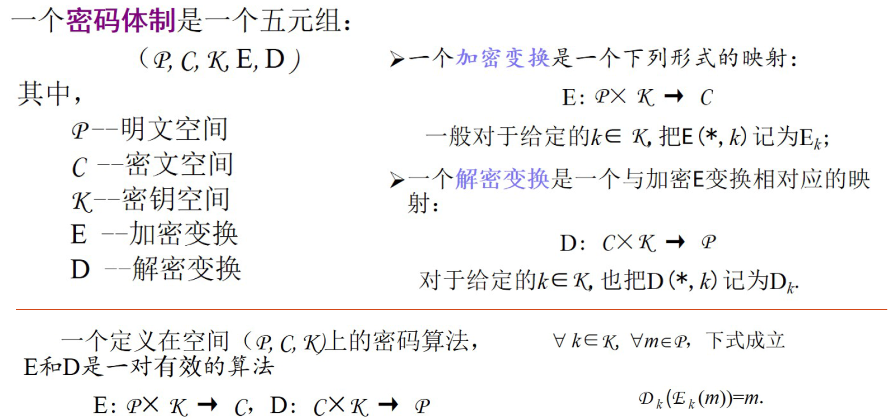


### 密码的分类

最基本的密码分类是信息加解密分为**对称加密**（Sysmmetric Cryptography）和**非对称加密**（Public-Key Cryptography，Asymmetric Cryptography），这两者的区别是是否使用了相同的密钥。除了信息的加解密，还有用于确认数据完整性（Integrity）的单向散列（One-Way Hash Function）技术，又称密码检验（Cryptographic Checksum）、指纹 （Fingerprint）、消息摘要 （Message Digest）。

信息的加解密与信息的单向散列的区别是，对称与非对称加密是可以通过密钥解出明文，而单向散列是不可逆的。信息的加解密，密文必定是不定长的，而单向散列可以是定长的。结合密码学的加解密技术和单向散列技术，又有了用于防止篡改的消息认证码技术，防止伪装的数字签名技术以及认证证书。

网络安全的核心概念是CIA三元组，分别是Confidentiality（机密性）、Integrity（完整性）、Availability（可用性）。机密性是指保证信息不能被非授权访问，即使非授权用户得到信息也无法知晓信息内容，因而不能使用。完整性是指维护信息的一致性，即信息在生成、传输、存储和使用过程中不应发生人为或非人为的非授权篡改。可用性是指保障信息资源随时可提供服务的能力特性，即授权用户根据需要可以随时访问所需信息。

网络中有很多旨在窃取密码的攻击方式，他们破坏了上述的网络安全特性。


### 密码学的特性及功能

特性：

机密性(Confidentiality)：非授权者无法获取明文内容，只有授权方才能阅读受保护的信息。

完整性(Integrity)：接收者能够验证消息是否在传输过程中被增加、删除、修改。

真实性(Authenticity)：接收者能够确认消息来源的真实性。

不可抵赖性(Nonrepudiation)：发送者无法否认其签发的消息。

功能：

数据加密：机密性（对称密钥）

消息鉴别：完整性和真实性（杂凑函数 HMAC）

身份鉴别：真实性（公钥密码）

数字签名：不可抵赖性（公钥密码）

### 本章考点

1.密码学的特性和功能

2023真题：

第一题：密码学有哪些特性，分别用什么机制实现？

## Chapter 1 古典密码学编程

### 古典密码的概念
古典密码是密码学中的其中一个类型，其大部分加密方式都是利用【替换式密码】或【移项式密码】，有时则是两者的混合。

在历史中经常使用，19世纪末随着工业革命，科技水平不断提高，电报的发明、机械制造工艺等的产生使得手工密码已不再受欢迎，近代密码随之替代了古典密码，现代已经很少使用。

一般而言，经典密码是基于一个拼音字母（像是 A-Z）、动手操作或是简单的设备。它们可能是一种简单的密码法，以致于不可信赖的地步，特别是有新技术被发展出来后。

### 分类

古典密码主要通过字符间的置换和代（替）换实现。

- ◎代换密码(substitution)

	代换是古典密码中用到的最基本的处理技巧之一。所谓代换，就是将明文中的一个字母由其它字母、数字或符号替代的一种方法。
	
	
	
- ◎置换密码(permutation)

	是古典密码中用到的另一个最基本的处理技巧。将明文字符按照某种规律重新排列而形成密文的过程。


#### 代换密码

➢凯撒密码

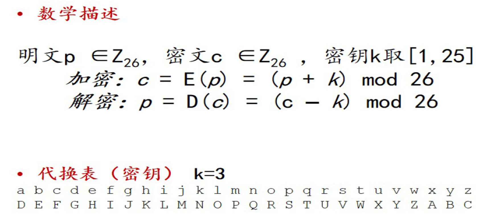

➢仿射密码

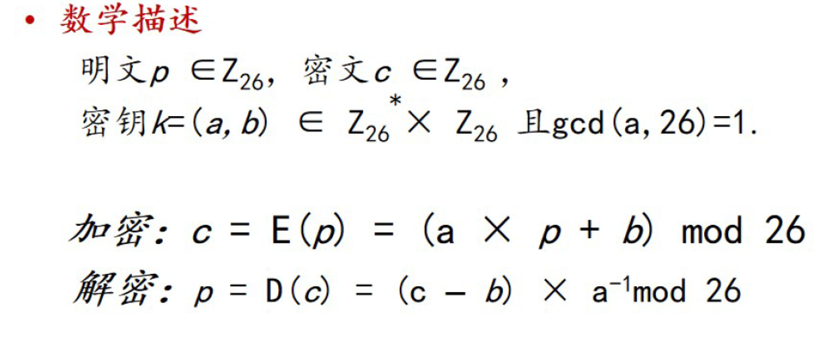

➢单表代换

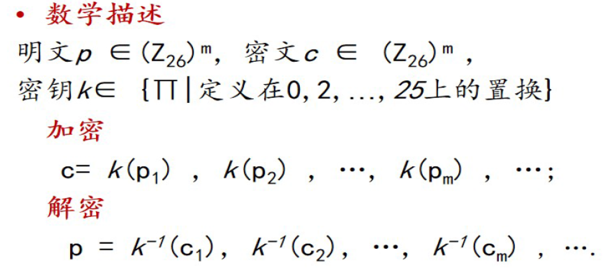

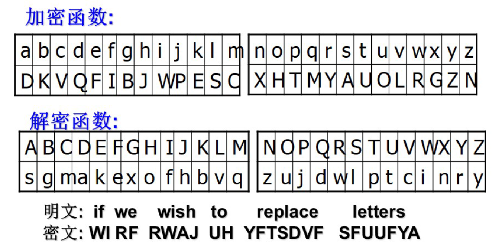

➢多表代换

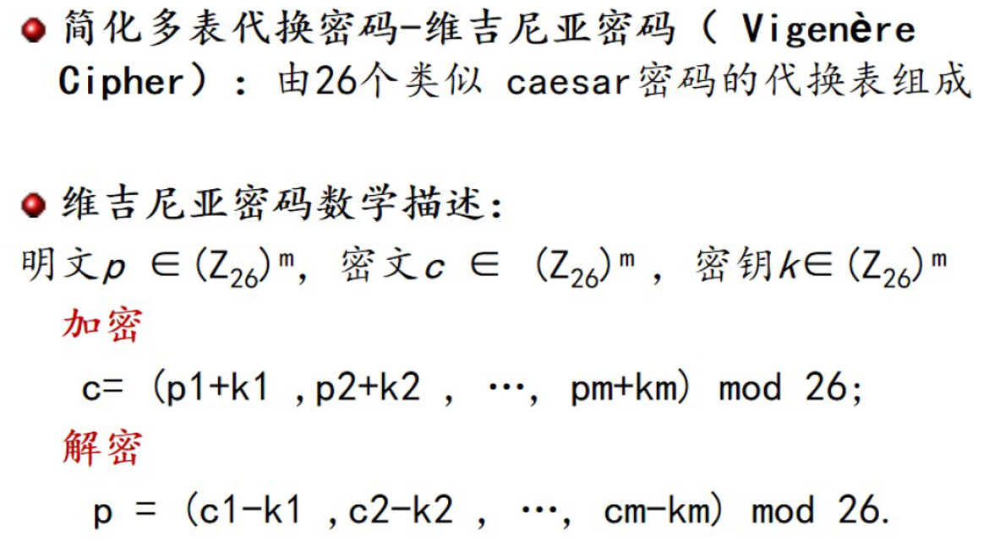

#### 置换密码（又称为换位密码）

特点:保持明文中所有的字符不变，只是利用置换打乱明文字符的位置和次序

置换定义：有限集X上的运算σ：X→X，σ是一个双射函数，那么称σ为一个置换。
即任意x∈X,存在唯一的x’∈X，使得σ(x)=x’
解密的时候会用到逆置换σ’,
即任意x’∈X,存在唯一的x∈X，使得σ’(x’)=x且·满足σσ’=I

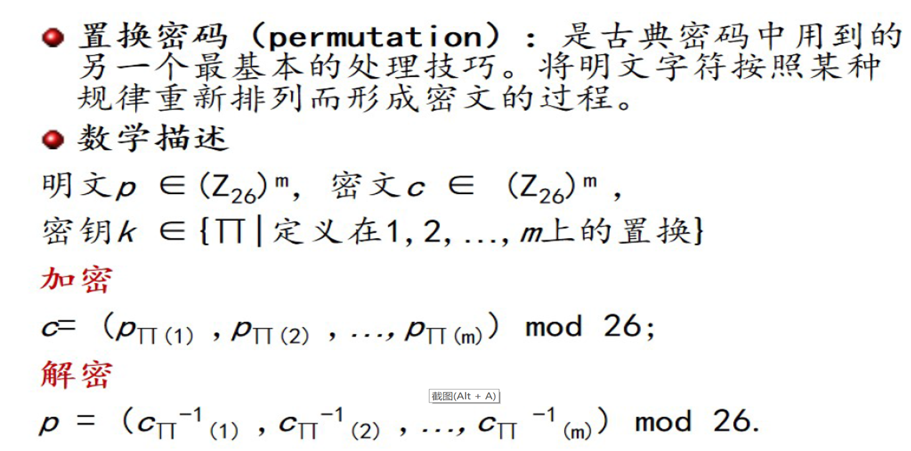


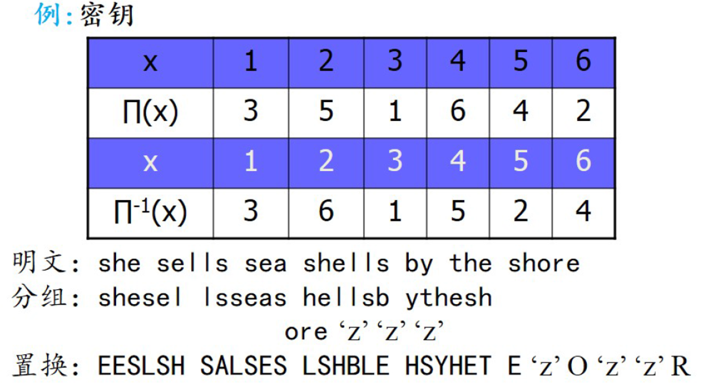

### 古典密码的唯密文攻击（Ciphtext Only Attack，COA）
定义：唯密文攻击(COA)是指仅仅知道密文的情况下进行分析，求解明文或密钥的密码分析方法。

假定密码分析者拥有密码算法及明文统计特性，并截获了一个或者多个用同一密钥加密的密文，通过对这些密文进行分析求出明文或密钥。COA已知条件最少，经不起唯密文攻击的密码是被认为不安全的。

简单理解：只知道密文，推出明文或密钥，一般用穷举攻击。

方法：
频率分析解密法。

这难不倒解密者，以英文字母为例，为了确定每个英文字母的出现频率，分析一篇或者数篇普通的英文文章，英文字母出现频率最高的是e，接下来是t，然后是a……，然后检查要破解的密文，也将每个字母出现的频率整理出来，假设密文中出现频率最高的字母是j，那么就可能是e的替身，如果密码文中出现频率次高的但是P，那么可能是t的替身，以此类推便就能解开加密信息的内容。这就是频率分析法。

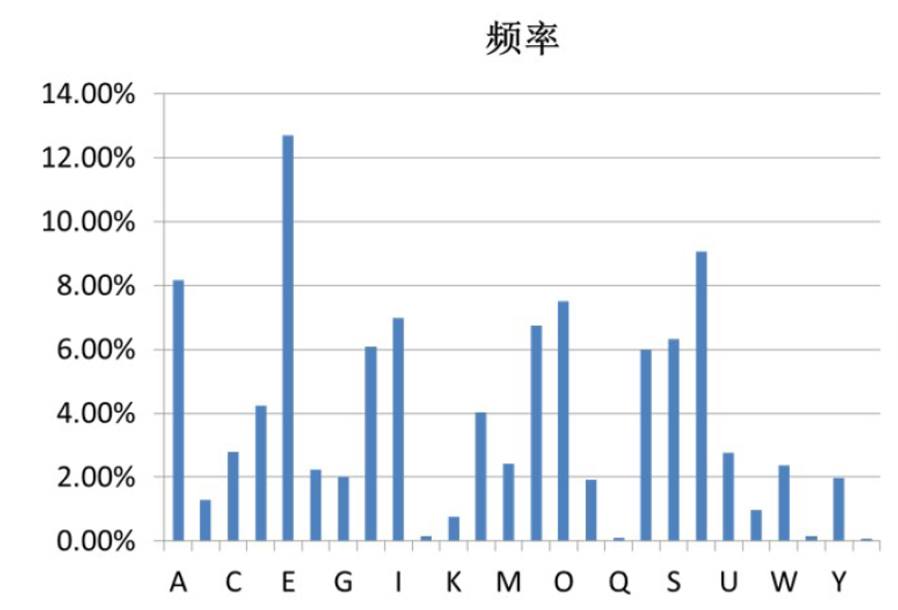

- 将明文字母的出现频率与密文字母的频率相比较的过程
- 通过分析每个符号出现的频率而轻易地破译代换式密码
- 在每种语言中，冗长的文章中的字母表现出一种可对之进行分辨的频率。
- e是英语中最常用的字母，其出现频率为八分之一

### 本章考点

1.古典密码的分类

2.Caesar密码/仿射密码 Python程序实现。

2023真题：

第二题：古典密码有哪些类型？请用Python实现Caesar密码的加密过程。

## Chapter 2 哈希

[《一切皆是映射：代码的本质》哈希算法 （Hash） - 简书 (jianshu.com)](https://www.jianshu.com/p/fa57d21b9ad7)

### TOC

1.Hash基础知识：

- 哈希函数的定义

- 哈希函数的性质

- 常用的哈希算法：MD家族、SHA系列

- 哈希函数的构造原理：消息填充机制、压缩函数

  

2.Hash编程实现：

- 使用python的内置库hashlib模块
- hashlib的md5(), sha256()……生成实现对应哈希算法的对象，
- 调用哈希算法对象的update，digest，hexdigest
- 口令加盐：scrypt，bcrypt……
- 哈希在区块链中的应用，工作量证明的示例


### 哈希函数

哈希函数（Hash）：将一种任意长度的输入变换为固定长度输出的不可逆的密码体制。

别名：哈希函数、散列函数、杂凑函数；输出：消息摘要、指纹；

性质：

- 可用于“任意”长度的消息
- 产生定长的输出
- 对“任意”给定的消息𝑥 ，计算H(𝑥)比较容易
- 单向性：又称为抗原像性，对任意给定的散列值h，找到满足H(𝑥)=h的消息𝑥在计算上是不可行的。
- 抗弱碰撞性：又称为抗第二原像性，对任何给定的消息𝑥 ，找到满足y≠𝑥，且H(𝑥)=H(𝑦) 的消息y在计算上是不可行的。
- 抗强碰撞性：找到任何满足H(𝑥)=H(𝑦)的偶对(𝑥,𝑦)在计算上是不可行的。

用途：用于保证消息完整—消息完整性(加密不意味着消息不能被篡改)，口令加密、区块链、数字签名

#### FAQ

Q1:弱抗碰撞性和强抗碰撞性的区别是什么?

A1:弱抗碰撞性是任意给定分组x, 寻求不等于x的x’, 使得H(x)= H(x’)在计算上不可行;强抗碰撞性是寻求任何的(x,x’)对，使得H(x)=H(x’)在计算上不可行; 前者的x是给定的，而后者是不给定的，因而强抗碰撞性的要求要比弱抗碰撞性的要求的要高。

Q2:Hash 函数中的压缩函数的作用是什么?

A2:压缩函数将一个较长的，固定长度的输入处理后，返回一个较短的，固定长度的输出。Hash函数是一种基于压缩函数的不断重复压缩输入的分组和前次压缩处理的结果，知道整个消息都被压缩完毕的过程，最后的输出作为整个消息的hash值。在这个过程中，任意长度的消息被破碎成一定长度的分组，分组的长度取决于压缩函数。并且出于安全的角度，对未填充满的分组作相应的数据填充

#### 生日悖论

[生日悖论与哈希函数_密码学中的生日悖论-CSDN博客](https://blog.csdn.net/sinat_31854967/article/details/102947156)

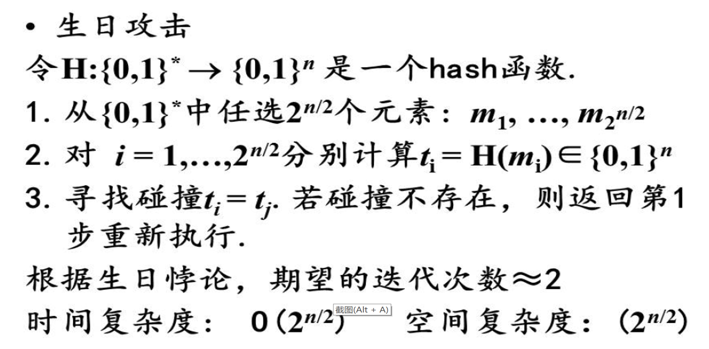

##### 哈希算法族

MD家族

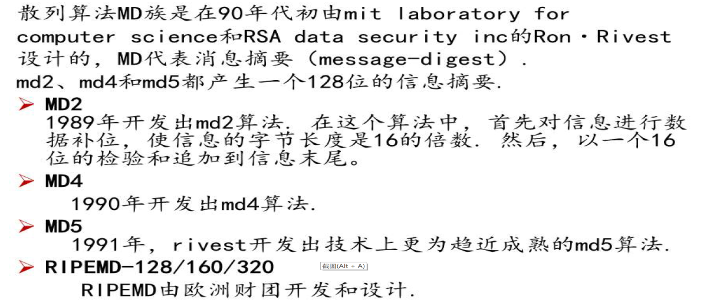

SHA系列

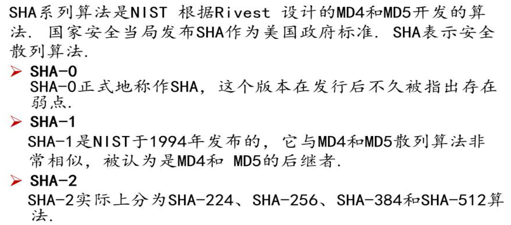

### 使用hashlib自由哈希

[hashlib --- 安全哈希与消息摘要 — Python 3.7.13 文档](https://docs.python.org/zh-cn/3.7/library/hashlib.html)

hashlib模块是python内置的hash算法模块，提供了常见的哈希算法，如MD5、SHA1、SHA256等。

使用hashlib模块可以方便地计算字符串或文件的哈希值，常用于密码加密、数据完整性校验等场景。


```
# hashlib
import hashlib
md5hasher= hashlib.md5()   # 构造一个hashlib的对象
md5hasher.update(b"message")  # update文档内容，生成新摘要
md5hasher.hexdigest() # 获取摘要哈希值（16进制）
```


```
import hashlib

# 创建一个md5对象
m = hashlib.md5()
# 创建一个sha1对象
s = hashlib.sha1()
# 创建一个sha256对象
s256 = hashlib.sha256()
```

**代码解释**：

字符串前加 b

例：b"message"

作用：b" "前缀表示：强制字符串的字面值是bytes 类型。

用处：

Python区分Unicode字符串和原始字节字符串，对于几乎所有的密码使用场合，都必须使用字节。

附：

[Python3 数据类型转换 | 菜鸟教程 (runoob.com)](https://www.runoob.com/python3/python3-type-conversion.html)

[python中 r'', b'', u'', f'' 的含义_python f-CSDN博客](https://blog.csdn.net/qq_35290785/article/details/90634344)

在 Python3 中，bytes 和 str 的互相转换方式是

str.encode('utf-8')
bytes.decode('utf-8')

### 哈希-雪崩效应

[展示散列函数的雪崩效应: Wolfram 语言 12 的新功能](https://www.wolfram.com/language/12/cryptography/demonstrate-the-avalanche-effect-of-a-hash-function.html.zh)

散列函数在现代密码学中有重要作用。好的散列函数的一个重要且理想的特征是输入和输出没有相关性，或称为“雪崩效应”，这意味着输入的微小变化会导致输出发生显著变化，使其统计上看起来与随机变化没有差别。


雪崩效应有助于防止碰撞：输入的小的更改会导致摘要中不可预测的大更改。

```
>>> hexstring = hashlib.md5(b'bob').hexdigest()

>>> hexstring

'9f9d51bc70ef21ca5c14f307980a29d8'

>>> binstring = bin(int(hexstring, 16))

>>> print("{}\n{}".format(binstring[2:66], binstring[66:]))

1001111110011101010100011011110001110000111011110010000111001010

0101110000010100111100110000011110011000000010100010100111011000

bob: 9f9d51bc70ef21ca5c14f307980a29d8

cob: 386685f06beecb9f35db2e22da429ec9
```

展示哈希雪崩效应：

[哈希函数的雪崩效应-CSDN博客](https://blog.csdn.net/qq_63016521/article/details/133610815)

### 哈希函数构造

l哈希函数的构造原理：消息填充机制、压缩函数

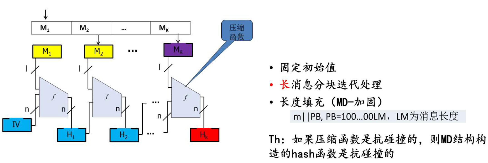

##### 压缩函数

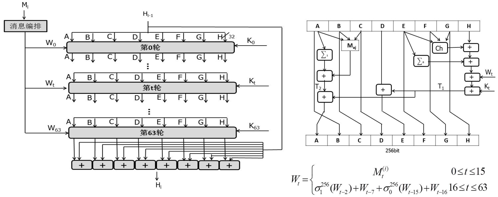

##### SHA- -256消息填充

首先将比特“1”添加到消息的末尾，再添加k 个零，这里k是方程`l+1+k=448 mod 512`的最小的非负解。然后再添加一个64比特长的块，其值等于消息M的长度/的二进制表示。使得填充后的消息的长度为512比特的倍数。

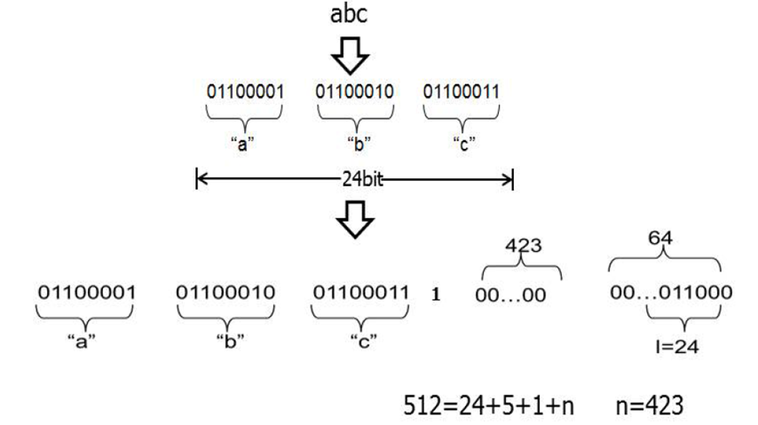


### 密钥派生

常用的密钥派生函数（KDF）:

**PBKDF2**: (Password-based Key Derivation Function 2)：
     used for deriving a cryptographic key from a password.

**Scrypt**: a KDF designed for password storage by Colin Percival to be resistant against hardware-assisted attackers by having a tunable memory cost.     由 Colin Percival 设计的用于密码存储的 KDF，通过具有可调的内存成本来抵御硬件辅助的攻击者。

**Bcrypt**:Bcrypt 也是一个 KDF ，问世时间早于 Scrypt ，对于 ASIC 、GPU 攻击的抗性相对弱一些。其虽然也可以配置迭代数，但由于对内存的压力较小，因此比较容易构建相应的硬件加速密码破解器。

**HKDF** (HMAC-based Extract-and-Expand Key Derivation Function)

#### 口令加盐

### 区块链-工作量证明

[xiaobing94/pysimpleblockchain: 区块链的简单实现 (github.com)](https://github.com/xiaobing94/pysimpleblockchain)

[动手学区块链学习笔记（二）：区块链以及工作量证明算法-CSDN博客](https://blog.csdn.net/submarineas/article/details/128647550)

难题： 找到一个特殊的SHA-256哈希值，小于某个阈值的值  （2016个区块调整一次，约14天）

### 延申阅读——彩虹表

什么是彩虹表？
    一言以蔽之，彩虹表是一种破解用户密码的辅助工具。彩虹表以时空折中理论为基础，但并不是简单地“以空间换时间”，而是一种“双向交易”，在二者之间达到平衡。1980年，公钥密码学的提出者之一Hellman针对DES算法（一种对称加密算法）提出了一种时空折中算法，即彩虹表的前身：预先计算的散列链集。2003年瑞典的Philippe Oechslin在其论文Making a Faster Cryptanalytic Time-Memory Trade-Off（参考博客2）中对Hellman的算法进行了改进，并命名为彩虹表。当时是针对Windows Xp开机认证的LM散列算法。当然，目前除了破解开机密码，彩虹表目前还能用于SHA、MD4、MD5等散列算法的破译，速度快、破解率高，正如Philippe在论文中提到的：“1.4G的彩虹表可以在13.6s内破解99.9%的数字字母混合型的Windows密码“。实际上，Philippe所做的改进本质上是减少了散列链集中可能存在的重复链，从而使空间的有效利用率更高。
    以MD5作为明文的散列算法H，加密后的密文为q，明文为p。彩虹表的作用就是在已知散列算法H和散列后的密文q的情况下，快速地得到明文p。
    针对LM、NTLM和SHA1等算法对应的彩虹表。整个破解过程为：根据密文q所使用的散列算法H，生成或者下载针对该算法的彩虹表，然后再基于彩虹表对密文进行破解，最终得到明文p。
不可逆的散列算法（HASH）
    本质上，MD5是将明文对应的二进制值与四个特定的32位的二进制值进行多轮的与、或、非、异或等运算，最终将明文对应的二进制转换成新的二进制。由于运算过程中存在进位丢失，导致人们无法根据MD5的计算过程和最终结果逆向计算出对应的明文。

[深入浅出彩虹表原理](https://cloud.tencent.com/developer/article/1903492)


### 本章考点

1.哈希函数的性质

2.hashlib的使用

2023真题：

第三题，


## Chapter 3 对称加密

### TOC

1.对称加密基础知识：

- 保密通信模型
- 对称加密基本知识：什么是对称加密体制，分类：分组和流密码
- 分组密码定义和设计思想
- 常用分组密码算法：DES、AES、SM4
- 分组密码工作模式：ECB、CBC、CRT

2.对称加密编程实现：

- cryptography.hazmat.primitives.ciphers模块中的Cipher类生成密码对象，algorithms指定加密算法，modes指定加密模式；
- 利用padding对长度不是16字节的整数倍的明文进行数据填充，同时解密后进行填充数据删除

### 保密通信模型


### 对称加密算法

**对称加密：加密和解密使用相同的密钥的密码体制**

1.分组密码：将明文消息编码表示后的二进制序列，划分成固定大小的块，每块分别在密钥的控制下变换成等长的二进制序列。

- AES
- DES
- IDEA
- RC6
- SM1、SM4、SM7、ZUC对称密码，SM1、SM7算法不公开，调用该算法时，需要通过加密芯片的接口进行调用；

2.流密码：将明文消息按比特进行加密


### 分组密码

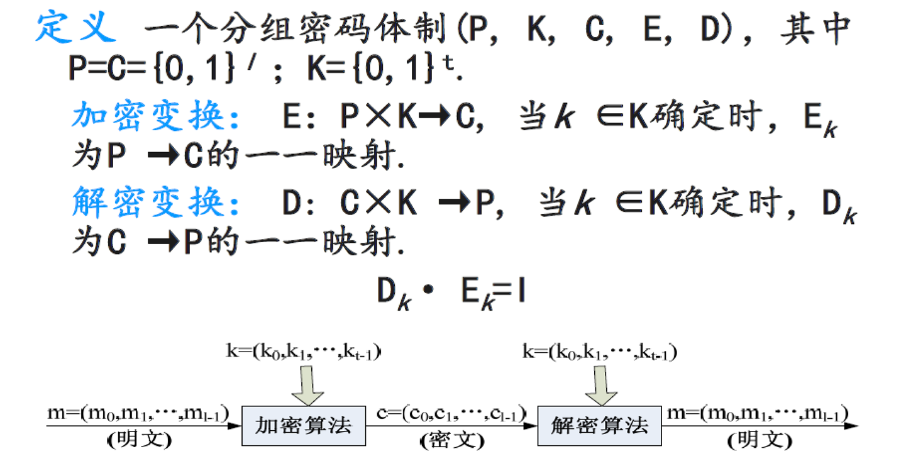

将明文消息编码表示后的二进制序列，划分成固定大小的块，每块分别在密钥的控制下变换成等长的二进制序列。

1.分组足够长: 防止明文攻击
2.密钥长度要足够长：防止密钥穷举攻击。密钥不能过长
3.由密钥确定的置换算法要足够复杂，足以抗击各种已知的攻击，除了穷举，没有更好的攻击方法
4.加密和解密运算简单，易于软件和硬件的快速实现
5.一般无数据扩展，即：明文和密文的长度相同

 

#### 分组密码的工作模式

1.扩散：使每1比特明文的变化尽可能多地影响到输出密文序列的比特，以便隐藏明文的统计特性。另一层意思使每1位密钥也尽可能影响到较多的输出密文比特。扩散的目的使希望密文中的任一比特都要尽可能与明文和密钥的每一比特相关联。
P1：00000000  c1：xxxxxx01
P2:   00000001  c2:   xxxxxx11
P1：00000000  c1：01011010
P2:   00000001  c2:   11101011
2.混乱: 在加密变换过程中明文、密钥以及密文之间的关系尽可能地复杂，以防止破译这采用统计分析法进行破译攻击
3.乘积密码体制：S^n称为迭代密码体制，其中S的明文空间和密文空间相等k=(k1,k2)  Ek(x)=Ek2(Ek1(x))  Dk(x)=Dk1(Dk2(y))。若S^2=S，则称S是等幂的密码体制， 置换密码、仿射密码、Vigenere密码及Hill密码都是等幂的密码体制，如果S是一个幂等体制，没有必要使用迭代体制，因为S^2需要更多的密钥，但安全强度与S一样。S不是幂等密码体制，迭代密码体制S^n的安全强度会比S高，通过对一个密码体制进行迭代来提高其安全强度的思想被广泛应用于对称密码体制的设计中。通常称为密码体制的迭代结构。具体地，就是在密钥的控制下扩散和混乱两种基本密码操作的多次迭代，每次迭代中的各种基本操作总体，称之为轮函数。

### 流密码

将明文看作字符串或比特串，并逐字符或者逐位进行加密
为了防止密钥穷举，使用和明文信息一样长的密钥（无限）流 进行加密这种密码体制称为流密码（或序列密码）


### 本章考点

1.

2023真题：

第四题，

## Chapter 4 公钥加密

## Chapter 5 消息和实体认证

## Chapter 6 非对称和对称结合

## Chapter 7 认证加密和Kerberos

## Chapter 8 TLS通信

## Java密码学编程


## 隐私计算


[隐私计算 - 知乎 (zhihu.com)](https://www.zhihu.com/column/c_1433891764852158464)

#### 数据隐私问题处罚案例

据外媒消息,2023年5月24日——爱尔兰数据保护委员会（DPC）对社交媒体巨头Meta（前身为Facebook）开出了创纪录的12亿欧元（10亿英镑）罚款，原因是Meta在欧洲和美国之间的数据传输中存在处理不当的行为。这笔罚款是根据欧盟通用数据保护条例（GDPR）隐私法而开出的最大一笔罚单，为欧洲数据保护领域树立了重要的先例。

根据上面的案例可以观察到当下社会对隐私的重视程度，以及对大公司泄露数据的不信任，因此也就引出下面的内容。

### 联邦学习

[隐私计算（联邦学习、差分隐私） - 知乎 (zhihu.com)](https://zhuanlan.zhihu.com/p/416264898)

[什么是联邦学习](https://zhuanlan.zhihu.com/p/100688371)

联邦机器学习(Federated machine learning/Federated Learning)，又名联邦学习，联合学习，联盟学习。联邦机器学习是一个机器学习框架，能有效帮助多个机构在满足用户隐私保护、数据安全和政府法规的要求下进行数据使用和机器学习建模。联邦学习作为分布式的机器学习范式,可以有效解决数据孤岛问题,让参与方在不共享数据的基础上联合建模,能从技术上打破数据孤岛,实现AI协作。

谷歌在2016年提出了针对手机终端的联邦学习,微众银行AI团队则从金融行业实践出发,关注跨机构跨组织的大数据合作场景，首次提出“联邦迁移学习”的解决方案，将迁移学习和联邦学习结合起来。据杨强教授在“联邦学习研讨会”上介绍,联邦迁移学习让联邦学习更加通用化,可以在不同数据结构、不同机构间发挥作用，没有领域和算法限制,同时具有模型质量无损、保护隐私、确保数据安全的优势。

联邦学习定义了机器学习框架，在此框架下通过设计虚拟模型解决不同数据拥有方在不交换数据的情况下进行协作的问题。虚拟模型是各方将数据聚合在一起的最优模型，各自区域依据模型为本地目标服务。联邦学习要求此建模结果应当无限接近传统模式，即将多个数据拥有方的数据汇聚到一处进行建模的结果。在联邦机制下，各参与者的身份和地位相同，可建立共享数据策略。由于数据不发生转移，因此不会泄露用户隐私或影响数据规范。为了保护数据隐私、满足合法合规的要求。

联邦学习有三大构成要素：数据源、联邦学习系统、用户。三者间关系如图所示，在联邦学习系统下，各个数据源方进行数据预处理，共同建立及其学习模型，并将输出结果反馈给用户。


> 我的想法
> 每个设备作为一个终端，每个终端都有自己的数据，这些数据都是不同的，但是都有一个共同的目标，就是训练一个模型，这个模型可以用来预测，可以用来分类，可以用来识别等等。但是这些数据都是不同的，所以不能直接合并，但是可以通过联邦学习的方式，将这些数据进行训练，最后得到一个模型，这个模型可以用来预测，可以用来分类，可以用来识别等等。
> 具体的方式就是算法，譬如说最初的算法就是不断的将各个终端的数据data进行加权平均，然后不断重复训练一个模型，最后将这个模型发送给每个终端使用。

### MPC （安全多方计算）

[安全多方计算框架最全合集（持续更新）_多方安全计算框架-CSDN博客](https://blog.csdn.net/apr15/article/details/133965768)

[隐私计算技术之安全多方计算(MPC) - 知乎 (zhihu.com)](https://zhuanlan.zhihu.com/p/384759946)

安全多方计算是指在无可信第三方的情况下，多个参与方协同计算一个约定的函数，并且保证每一方仅获取自己的计算结果，无法通过计算过程中的交互数据推测出其他任意一方的输入和输出数据（除非函数本身可以由自己的输入推测出其他参与方的输入和输出）。

安全多方计算可抽象概括为数学模型，其公式如下：


安全多方计算于1986 年由姚期智院士通过姚氏百万富翁问题提出：两个百万富翁街头邂逅，他们都想炫一下富，比一比谁更有钱，但是出于隐私，都不想让对方知道自己到底拥有多少财富，如何在不借助第三方的情况下，让他们知道谁更有钱。姚氏“百万富翁问题”后经发展，成为现代密码学中非常活跃的研究领域，即安全多方计算。


[安全多方计算之百万富翁问题-CSDN博客](https://blog.csdn.net/qq_43751200/article/details/126293436#:~:text=百万富翁问题是姚期智先生在1982年提出的第一个安全双方计算问题,问题可以描述为 ：两个百万富翁街头邂逅，他们都想炫一下富，比比谁更有钱，但是出于隐私，都不想让对方知道自己到底拥有多少财富，如何在不借助第三方的情况下，让他们知道他们之间谁更有钱。)

#### **百万富翁问题是姚期智先生在1982年提出的第一个安全双方计算问题**

**问题可以描述为**：两个百万富翁街头邂逅，他们都想炫一下富，比比谁更有钱，但是出于隐私，都不想让对方知道自己到底拥有多少财富，如何在不借助第三方的情况下，让他们知道他们之间谁更有钱。


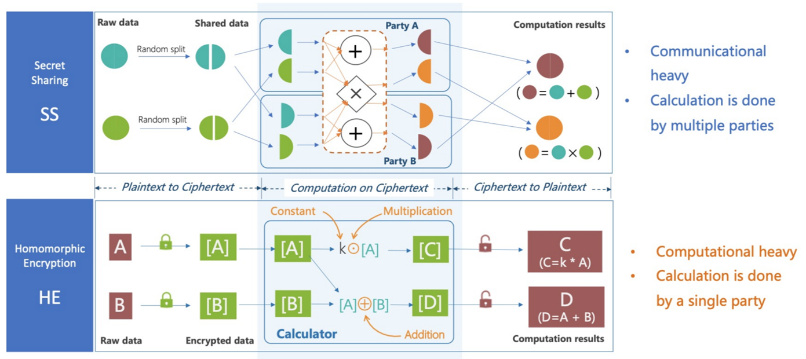

### 同态加密

[应用密码学 | Paillier同态加密算法简介 - 知乎 (zhihu.com)](https://zhuanlan.zhihu.com/p/557034854)

同态加密（HE，Homomorphic Encryption）是指对密文计算后的结果再解密和直接对明文计算的结果一致，同态加密按照其满足的运算类型可分为加法同态（Paillier同态加密），乘法同态（RSA同态加密），以及加法乘法都满足的全同态加密（Gentry同态加密）。

### 秘密分享Seret Sharing

[安全多方计算 | 基于Shamir秘密共享的MPC协议 - 知乎 (zhihu.com)](https://zhuanlan.zhihu.com/p/578967596)

[趣说密码学（五）秘密共享方案——shamir,中国剩余定理,Brickell和Blakley - 知乎 (zhihu.com)](https://zhuanlan.zhihu.com/p/95362628)

秘密分享的一种经典方案，1979年Shamir提出了阈值秘密分享方案，该方案支持n个参与方中的任意t个可以联合解开秘密数据，具体方案如下：


假如你和你的朋友们正在一起面临某种生存困境，比如在野外迷路了，或是被困在沙漠中，或是核冬天，或是丧尸来袭，你们难以获取食物，只好将剩下的食物的收集到一起放进保险箱。但是有个问题——你们并不相信其他人，其他人很可能趁大家不注意将食物偷走。这时候，保险箱的钥匙应该怎么保管？

**第一种情况：交给一个人保管**

原来住你隔壁的老王接下这个任务。他看起来似乎值得信任。


**第二天新闻头条：**已确认某探险队成员全部遇难！原因据查是保管食物的队员老王扔下大家不管，带着所有食物跑路了！

**第二种情况：交给一些人保管，全部到齐才能打开保险箱**

只交给一个人保管钥匙非常不安全。不如交给一些人不同的钥匙，必须要所有的人到齐才能打开。于是你把钥匙分成三份，隔壁老王，对面楼小南和你分别拿到了一份钥匙。这下，隔壁老王不能再自己一个人打开保险箱了。你感到很满意。


**第二天新闻头条：**已确认某探险队成员全部遇难！现场遇难的探险队员全围着一个锁上的食物箱子，原因据查是保管钥匙的队员之一隔壁老王误将钥匙扔掉，致使全体队员无法打开食物保险箱！

**第三种情况：交给一些人保管，其中一部分到齐才能打开保险箱**

好吧，隔壁老王一直盯着食物想要占为己有。这不行。而且如果要保管钥匙的全部成员到齐才能打开，那么其中某人拿不出钥匙将是非常绝望的情形。

于是你想出了一种新的方法，把钥匙分成不同五份，路人甲，街口二愣子，对面楼小南，娄县令以及你分别拿了一份。但现在只需要三个人拿着他们的钥匙就能打开食物保险箱。就算其中一个人将钥匙弄丢，例如二愣子把钥匙吃了，剩下三个人也能打开保险箱。但少于三个人就不能打开保险箱。但具体改怎么做呢？你的思维开始跳脱起来。

### 零知识证明

[什么是零知识证明_零知识证明简介_零知识证明的优势以及应用场景-腾讯云开发者社区 (tencent.com)](https://cloud.tencent.com/developer/techpedia/1801)

零知识证明过程有两个参与方，一方叫证明者，一方叫验证者。证明者掌握着某个秘密，他想让验证者相信他掌握着秘密，但是又不想泄漏这个秘密给验证者。双方按照一个协议，通过一系列交互，最终验证者会得出一个明确的结论，证明者是或不掌握这个秘密。

**①阿里巴巴与四十大盗**

有一天，阿里巴巴被强盗抓住了，强盗向他索要开启山洞大门的咒语。

但此时阿里巴巴面临一个两难的问题，如果把密码告诉强盗，自己就没有利用价值了，最后肯定会被杀。

如果不告诉强盗咒语，强盗以为自己不知道咒语，自己还是会被杀。

怎么能做到让他们相信自己确实知道咒语，但是还不能让他们知道咒语是什么。

这确实是一个很难的问题，但是阿里巴巴想出了一个好办法。

他对强盗头领提议说，你们离我30米远，然后用弓箭指着我，当你举起双手后，我就念咒语开启山洞大门；当你把双手放下后，我就念咒语关上山洞大门，如果我要是逃跑，你们就用弓箭射死我。

对于强盗头领来说，这显然是个好主意，于是照办。

强盗头领先是举起双手，看到阿里巴巴动了动嘴皮子，门就开了，然后放下双手，阿里巴巴又动了动嘴皮子，门就关了。

显然，强盗相信了阿里巴巴。

这样，阿里巴巴在没有告诉强盗头领开门咒语的情况下，又向强盗证明了，自己是知道开门咒语的。


## 期末复习

重点：

1.分组密码工作模式

2.字符、字节流转化

3.kdf密钥派生（哈希、加盐）

4.密码学的机密性、验证性的理解和代码实现

题型：问答题

代码核心内容：加解密流程（描述清楚、注释）


考试一共八道题：


