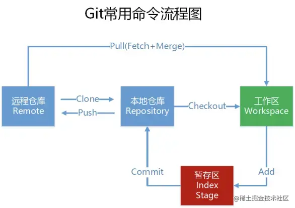
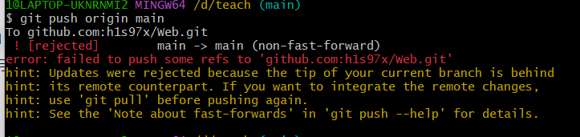
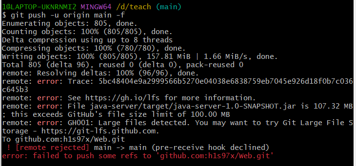

## 版本控制系统VCS (Version Control System)

一个可以管理和追踪软件代码或其他类似内容的不同版本的工具。
出于相同的目的：开发以及维护开发出来的代码、方便读取代码的历史版本、记录所有的修改、方便团队协作开发。

## Git

[Git简介 - 廖雪峰的官方网站 (liaoxuefeng.com)](https://www.liaoxuefeng.com/wiki/896043488029600/896067008724000)

### Git安装

官方下载地址：

[Git - 安装 Git (git-scm.com)](https://git-scm.com/book/zh/v2/起步-安装-Git)

因为Git有很多新的配置项，而且之前也不懂，没有概念，之后可以考虑把这一块补充上，下面是一些参考链接，翻译可以用有道截图翻译（非常推荐）。

[2022新版Git教程 从入门到实战（一）安装Git（一）-阿里云开发者社区 (aliyun.com)](https://developer.aliyun.com/article/1060387)


配置项：

[Git安装教程_git默认编辑器选什么好-CSDN博客](https://blog.csdn.net/boyi6573/article/details/126897945)

[在git上和github上修改默认分支 - 掘金 (juejin.cn)](https://juejin.cn/post/7200627917307428923)

### 常用Git命令

[Git 常用基本命令使用详细大全](https://blog.csdn.net/qtiao/article/details/97783243?ydreferer=aHR0cHM6Ly9jbi5iaW5nLmNvbS8%3D)
[Git教程 - 廖雪峰](https://www.liaoxuefeng.com/wiki/896043488029600)

```
git remote prune origin      删除本地有但在远程库已经不存在的分支 <br>
git clone -b   分支名 地址 <br>
git remote add origin git@github.com:XXXXX/demo.git   新增远程仓库<br>
git remote set-url origin git@github.com:XXXXX/demo.git  修改远程仓库<br>
git remote set-url --add origin git@github.com:XXXXX/demo.git  添加多个远程仓库<br>
git stash    不提交工作区内容 <br>
git stash pop 恢复工作区<br>
git fetch   拉取远程分支<br>
git reset --hard <commit ID号> 回滚<br>

git push -f origin master 推送到远程分支 <br>
git diff    查看工作区和暂存区的区别 <br>
git diff –cached    查看暂存区和版本库之间的区别 <br>
git diff HEAD   查看工作区和版本库之间的区别 <br>
git status   查看当前的工作状态<br>

git push --set-upstream origin online_help_20191024   推远程分支<br>
git push origin --delete dev20181018    删除远程分支<br>
git branch -d dev20181018   删除本地分支<br>
git cherry-pick 285c9477a759abdee94099e25e75e39e8c77d46b 合并指定版本
```
```
git init
初始化一个git仓库

git add .
添加所有修改到暂存区

git clone
将项目克隆到本地

git pull
将项目更新到本地

git add
将项目添加到本地仓库

git commit
将项目提交到本地仓库

git push
将项目推送到远程仓库

git branch
查看分支

git checkout
切换分支

git merge
合并分支

git remote
查看远程仓库

git status
查看项目状态

git log
查看提交日志

git reset
回退版本

git reflog
查看命令历史

git diff
查看修改内容

git rm
删除文件

git mv
移动文件

git tag
打标签

git stash
暂存工作区

git stash pop
恢复暂存区

git stash list
查看暂存区
```


##### 命令流程图



### Bug&Solution

####ssh -T git@github.com

[测试 SSH 连接](https://docs.github.com/zh/authentication/connecting-to-github-with-ssh/testing-your-ssh-connection)
[git push origin master报错的解决方法 & 常见git命令（待更新）](https://blog.csdn.net/qq_33934427/article/details/109004052)
[git 提交出现 Updates were rejected 解决方案](https://www.cnblogs.com/liliuyu/articles/14015522.html)
[Remote "origin" does not support the LFS locking API](https://github.com/git-lfs/git-lfs/issues/3400)

#### git项目push错分支的解决方法

好的解决方案：
[main与master分支合并](https://blog.csdn.net/gongdamrgao/article/details/115032436)
未成功的方案：
[GIT提交错分支，push错分支怎么办](https://blog.csdn.net/weixin_41529708/article/details/106691359?spm=1001.2101.3001.6661.1&utm_medium=distribute.pc_relevant_t0.none-task-blog-2%7Edefault%7ECTRLIST%7ERate-1-106691359-blog-109001509.235%5Ev38%5Epc_relevant_sort_base2&depth_1-utm_source=distribute.pc_relevant_t0.none-task-blog-2%7Edefault%7ECTRLIST%7ERate-1-106691359-blog-109001509.235%5Ev38%5Epc_relevant_sort_base2&utm_relevant_index=1)

#### 解决git reset --soft HEAD^撤销commit时报错

[fatal: ambiguous argument 'HEAD^': unknown revision or path not in the working tree.](https://blog.csdn.net/weixin_51063895/article/details/129646819?ydreferer=aHR0cHM6Ly9jbi5iaW5nLmNvbS8%3D)

#### git push报错

Updates were rejected because the tip of your current branch is behind (更新被拒绝，因为当前分支的落后与远程分支)


```
git push -u origin main -f 
强制提交
```

[git push报错:Updates were rejected](https://zhuanlan.zhihu.com/p/422024766)

进行git push操作时报错：fatal: The current branch master has no upstream branch.
原因：没有将本地的分支与远程仓库的分支进行关联

```
git push -u origin main
```

[git push报错:The current branch master has no upstream branch](https://developer.aliyun.com/article/764975)

#### 项目分支提交错误

已经push如何取消：
git reset --hard HEAD^
git push origin HEAD --force

[](https://blog.csdn.net/gongdamrgao/article/details/115032436)

#### 文件超100M无法上传



```
git lfs install

git lfs track "*.psd"
.psd是需要上传的文件后缀名，可以是其他格式

git add .gitattributes

git add [file.psd]
[]内是文件名，可以是其他文件名

git commit -m "add psd file"

git push origin main

```

[error: GH001: Large files detected](https://blog.csdn.net/qq_39564555/article/details/100051051)
[Remote "origin" does not support the LFS locking API](https://github.com/git-lfs/git-lfs/issues/3400)

#### git提交或克隆报错fatal: unable to access git仓库: Failed to connec

```bash
git config --global --unset http.proxy

```

[Failed to connec -CSDN](https://blog.csdn.net/good_good_xiu/article/details/118567249)
[Failed to connec -Stackoverflow](https://stackoverflow.com/questions/27087483/how-to-resolve-git-pull-fatal-unable-to-access-https-github-com-empty#:~:text=Go%20to%20Win%20-%3E%20Control%20Panel%20-%3E%20Credential,again%2C%20put%20the%20right%20ones%20and%20that%27s%20it.)

#### “warning: LF will be replaced by CRLF”警告

[关于git提示“warning: LF will be replaced by CRLF”终极解答](https://blog.csdn.net/lgq2016/article/details/104745963)

#### 删除本地git仓库

```
rm -fr .git
```

标志 -f 用于在没有提示的情况下强行删除不存在的文件和参数（小心使用）。
标志 -r 用于递归删除每个目录及其内容。

#### 删除与远程仓库的连接

```
git remote remove origin
```

#### git add . 无响应

昨天登录平台把项目的vue文件下载下来后，放到当前的teach文件夹里，结果之后发现之前提交成功后的github仓库居然是空的，因此重新提交，但在git add的时候却出现无响应问题，最后发现原因可能是有两个example文件夹，里面有很多文件，导致git add . 无响应，将这两个文件夹删除后，重新提交就成功了。

还有就是文件太多导致锁住，删除.lock文件即可

```
rm -f ./.git/index.lock
```

[git add . 无响应](https://blog.csdn.net/zhang_pengfei/article/details/50460261?spm=1001.2101.3001.6650.1&utm_medium=distribute.pc_relevant.none-task-blog-2%7Edefault%7ECTRLIST%7ERate-1-50460261-blog-128531463.235%5Ev38%5Epc_relevant_sort_base2&depth_1-utm_source=distribute.pc_relevant.none-task-blog-2%7Edefault%7ECTRLIST%7ERate-1-50460261-blog-128531463.235%5Ev38%5Epc_relevant_sort_base2&utm_relevant_index=2)

#### git push 无响应

[Connection closed by remote host](https://blog.csdn.net/qq_43431735/article/details/106031021)

#### You‘ve successfully authenticated, but GitHub does not provide shell access.

在要推送的项目的本地文件夹下，右键 - Git Bash Here，执行命令：

```
 git remote set-url origin git@github.com:名字/仓库名.git
```

#### Git 克隆并覆盖本地仓库

项目其他人下载到本地时，发现本地已经有了一个同名的文件夹，但是里面的内容不一样，这时候就需要覆盖本地仓库了

```
git clone <远程仓库地址> <本地仓库名>
git clone git@github.com:h1s97x/Web.git

git fetch --all　
用于获取远程仓库的最新代码
git reset --hard origin/master
用于将本地仓库重置为与远程仓库的master分支完全一致。请确保在运行此命令之前，所有本地修改都已保存，并且不再需要。
```

[Git 克隆并覆盖本地仓库](https://geek-docs.com/git/git-questions/237_git_git_clone_and_overwrite_local_repository.html)

#### 与远程主机关闭 github.com 的连接

Connection to github.com closed by remote host.
[与远程主机关闭 github.com 的连接](https://unix.stackexchange.com/questions/717583/connection-to-github-com-closed-by-remote-host)