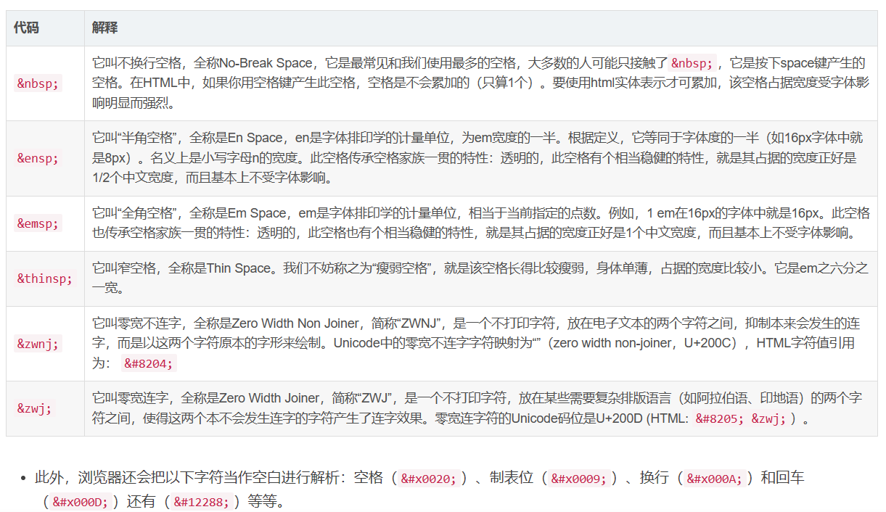
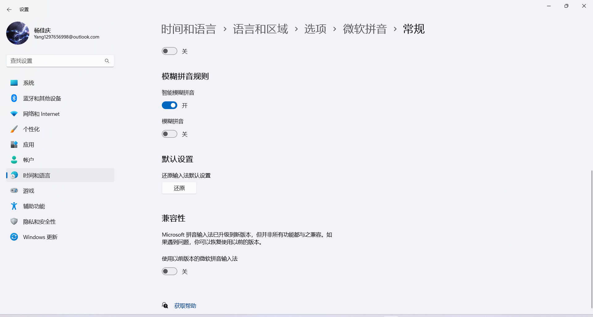

### Cannot push on github suddently
``` hexo d 提交失败 error
Writing objects: 100% (178/178), 3.08 MiB | 576.00 KiB/s, done.
Total 178 (delta 49), reused 0 (delta 0), pack-reused 0
remote: Resolving deltas: 100% (49/49), done.
remote: error: GH006: Protected branch update failed for refs/heads/master.
remote: error: Cannot force-push to this branch
To github.com:h1s97x/H1S97X.github.io.git
 ! [remote rejected] HEAD -> master (protected branch hook declined)
error: failed to push some refs to 'github.com:h1s97x/H1S97X.github.io.git'
FATAL Something's wrong. Maybe you can find the solution here: https://hexo.io/docs/troubleshooting.html
Error: Spawn failed
    at ChildProcess.<anonymous> (D:\hexo\node_modules\hexo-util\lib\spawn.js:51:21)
    at ChildProcess.emit (node:events:513:28)
    at cp.emit (D:\hexo\node_modules\cross-spawn\lib\enoent.js:34:29)
    at ChildProcess._handle.onexit (node:internal/child_process:291:12)
```
> solution
修改github项目仓库分支的rule
Because I'm admin/owner I was able to go and do the following and that helped me to resolve the problem. 
Steps : --> Settings -->Branches --> Branch protection rules select your branch(such as master)
then edit it -> push Allow force pushes - Everyone
Permit force pushes for all users with push access.


[stackoverflow——Cannot push on github suddently](https://stackoverflow.com/questions/52589285/cannot-push-on-github-suddently)


### 组策略编辑器
打开记事本输入下面的代码
```
@echo off

pushd "%~dp0"

dir /b %systemroot%\Windows\servicing\Packages\Microsoft-Windows-GroupPolicy-ClientExtensions-Package~3*.mum >gp.txt

dir /b %systemroot%\servicing\Packages\Microsoft-Windows-GroupPolicy-ClientTools-Package~3*.mum >>gp.txt

for /f %%i in ('findstr /i . gp.txt 2^>nul') do dism /online /norestart /add-package:"%systemroot%\servicing\Packages\%%i"

pause
```
选择另存为->文件名为gpedit.bat,保存类型为所有文件，编码格式换成ANSI
完成后找到保存的bat文件，以管理员身份打开
成功
按WIN R键打开运行输入gpedit.msc，按回车或是确定按键就可以打开组策略
[找不到gpedit.msc文件怎么办？组策略编辑器添加方法](https://zhuanlan.zhihu.com/p/381084692)


### 如何在Github上只下载一个文件或文件夹

[如何在Github上只下载一个文件或文件夹](https://zhuanlan.zhihu.com/p/578116206)

### Excel有几行固定不动，不会跟着窗口滑动如何处理
[excel表格怎么固定上面几行](https://zhidao.baidu.com/question/591423170.html#:~:text=%E5%9C%A8A6%E5%8D%95%E5%85%83%E6%A0%BC%E4%B8%AD%E7%82%B9%E7%AA%97%E5%8F%A3%E2%80%94%E2%80%94%E5%86%BB%E7%BB%93%E7%AA%97%E6%A0%BC%EF%BC%8C%E5%B0%B1%E4%BC%9A%E5%B0%86%E5%89%8D5%E8%A1%8C%E5%86%BB%E7%BB%93%E5%9B%BA%E5%AE%9A%E3%80%82,%E5%A6%82%E6%9E%9C%E8%BF%98%E6%83%B3%E6%8A%8A%E7%AC%AC%E4%B8%80%E5%88%97%E4%B9%9F%E5%86%BB%E7%BB%93%EF%BC%8C%E5%B0%B1%E5%9C%A8B6%E4%B8%AD%E7%82%B9%E5%86%BB%E7%BB%93%E7%AA%97%E6%A0%BC%E3%80%82)

### CMD对文件操作，文件名中带空格怎么办

把文件名用"" 引号引起来就可以了，例如"c:\Program Files"。

空格的不同编码：
`%20` 与 `&nbsp;`
`%20` : URI编码
`&nbsp;` `&#160;` : HTML编码 标准 ISO 字符集 非间断空格（non-breaking space）

[JavaScript：html中各种空格代码的区别](https://blog.csdn.net/sageyin/article/details/116003284)
[网址URL中特殊字符转义编码](https://zhuanlan.zhihu.com/p/137481275)
### VScode中markdown文件中的图片无法显示
[VSCode中Markdown 无法显示图片](https://blog.csdn.net/givbw/article/details/124028553)
[markdown语法链接到任何本地文件](https://qastack.cn/programming/32563078/how-link-to-any-local-file-with-markdown-syntax)
（1）在VScode编辑页面，按快捷键Ctrl+Shift+P，搜索markdown更改预览安全设置，选择允许不安全内容，即可显示预览网页图片。

（2）本地图片显示预览，要注意.md文件的路径和图片存放的路径，使用图片的相对路径即可显示预览。（注意路径不能有引号" "）

其他的解决方案：https://www.cnblogs.com/wanshizidiao/p/11273297.html#:~:text=%E5%A6%82%E4%BD%95%E8%A7%A3%E5%86%B3markdown%E7%AC%94%E8%AE%B0%E7%A7%BB%E5%8A%A8%E5%90%8E%EF%BC%8C%E5%9B%BE%E7%89%87%E5%A4%B1%E6%95%88%E7%9A%84%E9%97%AE%E9%A2%98%E3%80%82%201%201.%E4%BD%BF%E7%94%A8%E7%9B%B8%E5%AF%B9%E8%B7%AF%E5%BE%84%20-%E5%9D%911%202%202.%E5%B0%86%E5%9B%BE%E7%89%87%E8%BD%AC%E5%AD%98%E8%87%B3%E7%99%BE%E5%BA%A6%E7%BD%91%E7%9B%98%20-%E5%9D%912,3%203.%E5%B0%86.md%E6%96%87%E4%BB%B6%E4%B8%AD%E6%8F%92%E5%85%A5%E7%9A%84%E5%9B%BE%E7%89%87%E4%B8%8A%E4%BC%A0%E8%87%B3%E7%A0%81%E4%BA%91%2Fgithub%20-%20%E7%A0%81%E4%BA%91%E7%9A%84%E5%9D%91%20%28%E5%BE%85%E5%A1%AB%29%204%204.%E5%B0%86.md%E6%96%87%E4%BB%B6%E4%B8%AD%E6%8F%92%E5%85%A5%E7%9A%84%E5%9B%BE%E7%89%87%E4%BF%9D%E5%AD%98%E8%87%B3%E5%9B%BE%E5%BA%8A

### 微软自带中文输入法打字时有时出现类似于自动回车的问题
[打字时有时出现类似于自动回车的问题](https://answers.microsoft.com/zh-hans/windows/forum/all/%E6%89%93%E5%AD%97%E6%97%B6%E6%9C%89%E6%97%B6/c26741da-7b36-4960-869e-b0d799493510)
[电脑打字自动回车怎么解决？](https://www.zhihu.com/question/491610548)
solution: 关闭兼容性后目前没有出现这个问题，使用一段时间后再更新进展。

系统设置 -> 时间和语言 -> 语言和区域 -> 微软拼音输入法 -> 常规 -> 兼容性 -> 关闭兼容性


### 启动项目时报错端口被占用
[windows查看端口占用](https://wenku.csdn.net/answer/mxyv6ro7uu#:~:text=Windows%E6%80%8E%E4%B9%88%E7%9C%8B%E7%AB%AF%E5%8F%A3%E5%8D%A0%E7%94%A8%E6%83%85%E5%86%B5%201%20%E6%89%93%E5%BC%80%E5%91%BD%E4%BB%A4%E6%8F%90%E7%A4%BA%E7%AC%A6%EF%BC%88%E6%88%96%20PowerShell%EF%BC%89%EF%BC%9A%E5%9C%A8%E5%BC%80%E5%A7%8B%E8%8F%9C%E5%8D%95%E4%B8%AD%E6%90%9C%E7%B4%A2%E2%80%9Ccmd%E2%80%9D%E6%88%96%E2%80%9CPowerShell%E2%80%9D%EF%BC%8C%E7%84%B6%E5%90%8E%E7%82%B9%E5%87%BB%E6%89%93%E5%BC%80%E3%80%82%202%20%E5%9C%A8%E5%91%BD%E4%BB%A4%E6%8F%90%E7%A4%BA%E7%AC%A6%E4%B8%AD%E8%BE%93%E5%85%A5%E4%BB%A5%E4%B8%8B%E5%91%BD%E4%BB%A4%EF%BC%9A%20netstat%20-ano,findstr%20%5BPID%5D%20%E5%B0%86%20%5BPID%5D%20%E6%9B%BF%E6%8D%A2%E4%B8%BA%E4%BD%A0%E6%83%B3%E8%A6%81%E6%9F%A5%E7%9C%8B%E7%9A%84%E8%BF%9B%E7%A8%8B%20ID%20%E5%8D%B3%E5%8F%AF%E3%80%82%20%E7%84%B6%E5%90%8E%E5%8F%AF%E4%BB%A5%E5%9C%A8%E8%BE%93%E5%87%BA%E7%BB%93%E6%9E%9C%E4%B8%AD%E6%9F%A5%E6%89%BE%E8%AF%A5%E8%BF%9B%E7%A8%8B%E5%8D%A0%E7%94%A8%E7%9A%84%E7%AB%AF%E5%8F%A3%E5%8F%B7%E3%80%82)

``` cmd
netstat -ano | findstr <端口号>
查看对应端口的占用进程情况,包括PID
  协议  本地地址          外部地址        状态           PID
  TCP    0.0.0.0:端口号             0.0.0.0:0              LISTENING       4

tasklist -ano | findstr <进程号>
查看对应进程的详细信息
```
资源监视器 -> 网络 -> 监听的端口

### 双击安装exe文件无响应
solution：1.关闭杀毒软件和安全套件（比如卡巴斯基），再次尝试安装。
2.清除注册表中的残留信息，再次尝试安装。

**360浏览器无法安装，双击.exe安装包文件无反应**

删除本地保存配置文件后，在安全模式下删除360相关的注册表文件即可

已解决

``` 另一种解决方案（未尝试）
先检查是否WindowsIntaller服务被禁用，导致安装程序无法运行。
如果没有没禁用，点击其他任意 .exe扩展名的程序看是否可以运行。

如果也无法运行，
进入 C:\Windows\System32
找到 cmd.exe这个程序，扩展名.exe 改为 .com
然后右键点击，以管理员身份运行。
弹出窗口中输入以下命令,回车键执行。

assoc .exe=exefile
复制代码


执行命令后再尝试看是否能打开了

```

[win10下解决谷歌浏览器点击安装包无反应](https://blog.csdn.net/qk215796129/article/details/81909532)

### 网易云音乐歌单外链无法生成
[网易云音乐歌单生成外链播放器](https://www.cnblogs.com/yuan2333/p/7244380.html#:~:text=%EF%BC%88%E4%B8%80%EF%BC%89%E8%87%AA%E5%B7%B1%E5%88%9B%E5%BB%BA%E7%9A%84%E6%AD%8C%E5%8D%95%E6%B2%A1%E6%9C%89%E7%94%9F%E6%88%90%E5%A4%96%E9%93%BE%E9%80%89%E9%A1%B9%E7%9A%84%E8%A7%A3%E5%86%B3%E6%96%B9%E6%B3%95%201%201.%E5%88%86%E4%BA%AB%E6%AD%8C%E5%8D%95%202%202.%E6%89%93%E5%BC%80%E5%88%86%E4%BA%AB%E7%95%8C%E9%9D%A2%E7%9A%84%E6%AD%8C%E5%8D%95%E9%93%BE%E6%8E%A5%203%203.%E6%89%93%E5%BC%80%E6%AD%8C%E5%8D%95%E5%8D%B3%E5%8F%AF%E7%9C%8B%E5%88%B0%E7%94%9F%E6%88%90%E5%A4%96%E9%93%BE%E7%9A%84%E7%82%B9%E5%87%BB%E9%93%BE%E6%8E%A5%20%EF%BC%88%E4%BA%8C%EF%BC%89%E7%BD%91%E6%98%93%E4%BA%91%E9%9F%B3%E4%B9%90%E6%AD%8C%E5%8D%95%E5%9B%A0%E4%B8%BA%E7%89%88%E6%9D%83%E5%8E%9F%E5%9B%A0%E6%97%A0%E6%B3%95%E7%94%9F%E6%88%90%E5%A4%96%E9%93%BE%E7%9A%84%E8%A7%A3%E5%86%B3%E6%96%B9%E6%B3%95,%2B%E5%8A%A0%E5%85%B3%E6%B3%A8%201%200%20%E5%8D%87%E7%BA%A7%E6%88%90%E4%B8%BA%E4%BC%9A%E5%91%98%20%C2%AB%20%E4%B8%8A%E4%B8%80%E7%AF%87%EF%BC%9A%20Webstorm%E5%B8%B8%E7%94%A8%E5%BF%AB%E6%8D%B7%E9%94%AE%E5%A4%87%E5%BF%98%20)
依稀记得之前好像可以生成外链，但是现在居然连超链直接去除了，只能通过分享歌单的方式了。
因为有些歌的版权问题，所以外链有时候是无法生成的，因此就需要偷鸡。
自己创建的歌单没有生成外链选项的解决方法：
1.分享歌单
2.打开分享界面的歌单链接
3.打开歌单即可看到生成外链的点击链接
因为版权原因无法生成外链的解决方法：
1. 打开歌单页面，在“生成外链播放器”上右击，点击审查元素（检查）ctrl+shift+i；
2. 接着找到生成外链播放器这段文字直接双击复制前面的/outchain/0/3210514338/
3. 然后修改歌单链接示例：http://music.163.com/#/outchain/0/3210514338/

另一种解决方法：
[APlayer & MetingJS 音乐播放器使用指南](https://www.ottoli.cn/wordpress/anm)
[Aplayer搭配Metingjs音乐插件](https://blog.csdn.net/Edviv/article/details/106867810)

### Windows在管理员用户登录情况下仍然提示需要管理员权限

[windows10下载软件下到一半显示需要授权怎么解决_无法下载需要授权-CSDN博客](https://blog.csdn.net/weixin_60526471/article/details/126105622)

solution:
同时按【WIN键+R键】，打开cmd命令窗口，输入gpedit.msc，打开组策略编辑器，
在本地组策略编辑器调整设置：找到计算机配置 → windows管理 → 安全设置 → 本地策略 → 安全选项 → 用户控制：以管理员批准模式运行所有管理员 → 双击进入，设置为已禁用状态即可

### 电脑有时重启后连接网络但是无法使用
solution：目前遇到的情况大多是因为关机前未关闭VPN，导致重启后无法连接网络，重启VPN，再关掉即可。没有关闭代理就关机，重启电脑后无法直接联网，需要开启代理才可正常联网解决。

### 新异常bolt.Close(): funlock error: The segment is already unlocked
使用VPN在GitHub上下载Cloudflare的源码时出现的问题，关闭代理后突然下不动，然后出现无法下载-需要权限，然后在未下载完成文件的情况下删除，未关闭代理重启后，就出现了这个问题。代理无法使用，报错bolt.Close()。
关代理，删文件重启后恢复正常。
leah.ns.cloudflare.com