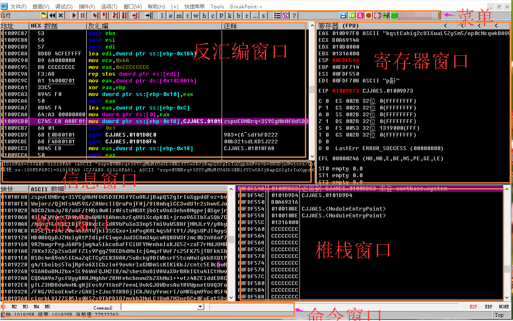
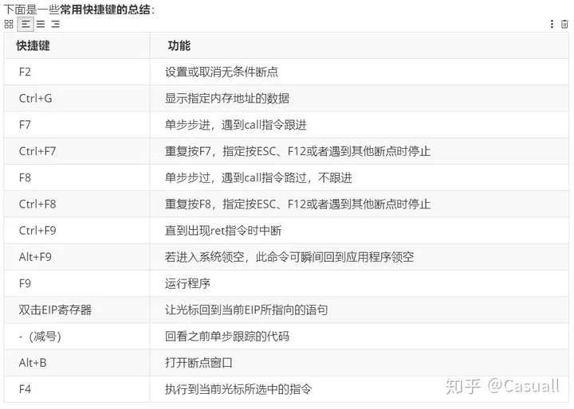
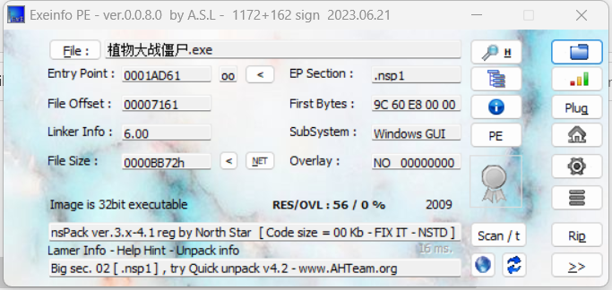
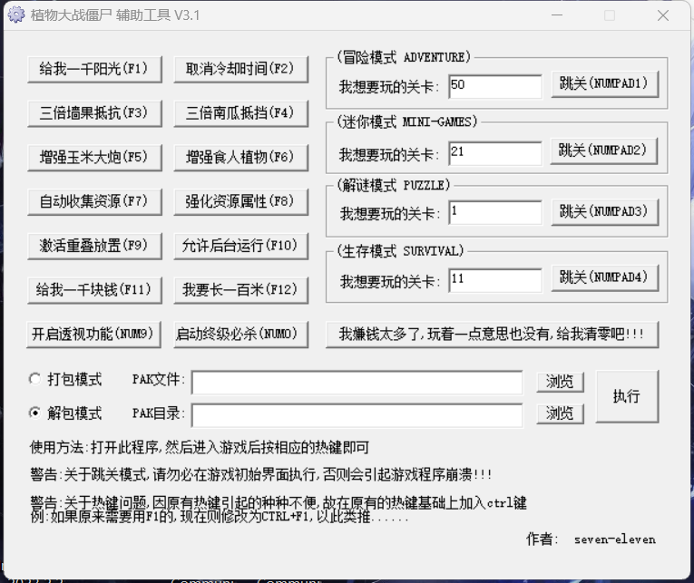

## PVZ辅助

[PlantsVsZombies-Cheat: 植物大战僵尸逆向分析与辅助开发系列教程(github.com)](https://github.com/follow-the-vine-to-get-to-the-melon/PlantsVsZombies-Cheat/tree/main)


### 工具使用

#### OnlyDbg使用

[06.常用断点之硬件断点原理解析_哔哩哔哩_bilibili](https://www.bilibili.com/video/BV1cE411f7sE/?p=6&spm_id_from=pageDriver&vd_source=206a091077ff783d662b49e64cc9589d)

[OllyDBG完美教程(超强入门级) - xueyoo - 博客园 (cnblogs.com)](https://www.cnblogs.com/xueyoo/articles/4938538.html)

**OllyDBG界面认识**


- 反汇编窗口：显示被调试程序的反汇编代码。用鼠标左键点击注释标签可以切换注释显示的方式。如果需要修改代码，直接在这里在修改，比如“使用NOP填充”。

- 寄存器窗口：显示当前所选线程的CPU寄存器内容。点击标签寄存器(FPU)可以切换显示寄存器的方式。

- 信息窗口：显示反汇编窗口中当前选中的第一条命令的参数及一些跳转目标地址、字串等（一般动态加密解密字串等会在此出现）。

- 数据窗口：显示内存或文件的内容。直接点击ASCII数据可以切换编码显示方式。

- 堆栈窗口：显示当前线程的堆栈数据。比如程序初始化的一些常量、变量之类的数据。

- 菜单窗口：一些常用调试命令以及操作。一般把鼠标移到菜单窗口的某按钮后，界面最左下角会出现一些命令提示，比如单步步入（F7），单步步过F8，运行程序（F9）等。

- 命令行窗口：用来下断点等相关命令。

**调试方法**



F2：设置断点。只要在光标定位的位置（上图中灰色条）按F2键即可，再按一次F2键则会删除断点。（相当于 SoftICE 中的 F9）
F8：单步跳过。每按一次这个键执行一条反汇编窗口中的一条指令，遇到 CALL 等子程序不进入其代码。（相当于 SoftICE 中的 F10）
F7：单步步入。功能同单步步过(F8)类似，区别是遇到 CALL 等子程序时会进入其中，进入后首先会停留在子程序的第一条指令上。（相当于 SoftICE 中的 F8）
F4：运行到选定位置。作用就是直接运行到光标所在位置处暂停。（相当于 SoftICE 中的 F7）
F9：运行。按下这个键如果没有设置相应断点的话，被调试的程序将直接开始运行。（相当于 SoftICE 中的 F5）
CTR + F9：执行到返回。此命令在执行到一个 ret (返回指令)指令时暂停，常用于从系统领空返回到我们调试的程序领空。（相当于 SoftICE 中的 F12）
ALT + F9：执行到用户代码。可用于从系统领空快速返回到我们调试的程序领空。（相当于 SoftICE 中的 F11） 

**常用断点**

[Windows 下的常用调试API断点 - lyshark - 博客园 (cnblogs.com)](https://www.cnblogs.com/LyShark/p/13071792.html)

[OD调试程序常用断点大全_od 创建进程 断点-CSDN博客](https://blog.csdn.net/qq1084283172/article/details/47733849)

[[系统安全\] 二十四.逆向分析之OD调试INT3断点、反调试、硬件断点与内存断点-腾讯云开发者社区-腾讯云 (tencent.com)](https://cloud.tencent.com/developer/article/1910265)

**汇编指令**
```
cmp a,b 比较a与b

mov a,b 把b的值送给a

ret 返回主程序

nop 无作用,英文“no operation”的简写，意思是“do nothing”(机器码90)
(解释:ultraedit打开编辑exe文件时你看到90,等同于汇编语句nop)

call 调用子程序

je 或jz 若相等则跳(机器码74 或0F84)

jne或jnz 若不相等则跳(机器码75或0F85)

jmp 无条件跳(机器码EB)

jb 若小于则跳

ja 无符-若大于则跳

jg 有符-若大于则跳

jge 若大于等于则跳

jl 若小于则跳

jle 若小于等于则跳

pop 出栈

push 压栈
```
1.E语言在OD里面的入口特征（OEP）
E语言的入口其实和VC++基本差不多，所以 在OD里面Ctrl+B 输入 FF 25
​2.E语言的按钮事件
FF 55 FC 5F 5E，这个就是E语言的按钮在OD中的特征码，搜索它就直接可以找到按钮事件在OD的Call的位置
3.E语言常用断点
- MessageBoxA  消息框断点
- ShellExecuteA/W   WinExec    弹网页
- CreateProcessA/W  创建进程
- ExitProcess       退出进程
#### 脱壳

[练习笔记之手撕常见压缩壳 - 『脱壳破解区』 - 吾爱破解 - LCG - LSG |安卓破解|病毒分析|www.52pojie.cn](https://www.52pojie.cn/thread-1646466-1-1.html)

[关于压缩壳脱壳步骤详解！看这一篇足够。 - 『脱壳破解区』 - 吾爱破解 - LCG - LSG |安卓破解|病毒分析|www.52pojie.cn](https://www.52pojie.cn/thread-1641368-1-1.html)

[ESP定律脱壳——NsPack3.x脱壳 - 红刃 - 博客园 (cnblogs.com)](https://www.cnblogs.com/hongren/p/12633232.html)
[手脱NsPack 壳，新手看看](https://www.52pojie.cn/thread-941671-1-1.html)
什么是壳：
壳是一种概念上的东西，人们为了保护软件不会被轻易的修改或者反编译，希望软件能够获得一种保护，能如同乌龟壳保护乌龟一般，能有一个东西保护自己，于是壳就出现了。
关于壳的作用：
壳的初始作用是保护软件，但后来发展的方向不一就出现了各种各样的壳，大致有压缩壳、加密壳、VM 壳的分类。压缩壳故名思意，主要作用是用于压缩方面，可以有效的减小软件的大小；加密壳，其主要作用是保护软件；VM 壳是一种很特殊的壳，它利用了虚拟机技术，可以很有效的保护指定地址代码，但很大的牺牲了效率，所以一般只在关键代码处使用。

**ESP定律法 （80%的压缩壳可脱）**
ESP 定律法是脱壳的利器，是应用频率最高的脱壳方法之一。ESP 定律的原理在于程序中堆栈平衡的合理利用。由于在程序自解密或者自解压过程中，不少壳会先将当前寄存器内容压栈，如使用 pushad，在解压结束后，会将之前的寄存器值出栈，如使用 popad。因此在寄存器出栈时，往往程序代码被自动恢复，此时硬件断点触发。然后在程序当前位置，只需要少许单步跟踪，就很容易到达正确的 OEP 位置。

具体操作步骤：pushad开头，F8一次以后，8个寄存器只有ESP是红色时候，就可以使用该定律。
右键ESP 选择数据窗口跟随，数据窗口下硬件访问断点，F9运行，此时已经接近OEP。


### 逆向分析

可以看到这个辅助的功能有很多，接下来就跟我一起解密这些按钮在点击后发生了什么。

> 之前分析的时候一直没开游戏只对辅助od，结果破壳破了好久也没成功，但就算破壳也无法直接获取到源码，只能看汇编，破解还是要在游戏中去进行，辅助修改游戏的内存，只要对写内存操作打断点就可以观察具体的修改。踩了这样一个坑，希望引以为戒。



#### 阳光修改

1.首先我们找出阳光的动态地址，找到之后我们双击这个地址，将其加入到地址列表中，阳光的查找技巧相信你已经能够掌握了，这里就不再罗嗦了。

[](https://github.com/follow-the-vine-to-get-to-the-melon/PlantsVsZombies-Cheat/blob/main/image/1379525-20190718105016029-754750877.png)

2.接着我们选择最下方的地址列表，然后按下`F6键`，也就是下一个硬件写入断点，然后回到游戏等待阳光出现并点击阳光，此时CE会出现以下代码，我们只需要记下`00430A11`这个内存地址，然后直接关闭CE吧，短期内用不到了。

[](https://github.com/follow-the-vine-to-get-to-the-melon/PlantsVsZombies-Cheat/blob/main/image/1379525-20190718105234187-230098721.png)

3.打开OD，然后我们直接附加植物大战僵尸的游戏进程，点击`文件`然后点击`附加`选择植物大战僵尸进程就好。

[](https://github.com/follow-the-vine-to-get-to-the-melon/PlantsVsZombies-Cheat/blob/main/image/1379525-20190718110121994-224028383.png)

4.附加完成后，我们的游戏会被OD暂停运行，此时我们直接按下`F12`让游戏正常的运行，默认情况下会停在系统领空，我们直接按下`Ctrl + G`输入`00401000`来到程序领空。

[](https://github.com/follow-the-vine-to-get-to-the-melon/PlantsVsZombies-Cheat/blob/main/image/1379525-20190718110558599-2081305956.png)

5.接着我们按下`Ctrl + G`输入`00430A11`跳转到刚才找到的代码位置，过去以后直接`F2`下一个断点

[](https://github.com/follow-the-vine-to-get-to-the-melon/PlantsVsZombies-Cheat/blob/main/image/1379525-20190718110754502-1706128416.png)

6.紧接着我们回到游戏，然后等待阳光的出现，当阳光出现后我们点击阳光，OD会自动断在00430A11的位置，其中ecx就是要增加的阳光数。

[](https://github.com/follow-the-vine-to-get-to-the-melon/PlantsVsZombies-Cheat/blob/main/image/1379525-20190718111426062-1841073246.png)

上图并没有CALL调用，应该是在外部，我们直接回朔到上一层`Ctrl+F9`执行到返回，`F8`直接出CALL.

7.我们在JNZ和CALL的两处位置下断点，然后运行程序，当我们点击阳光时会断在JNZ的位置，如果把JNZ用NOP填充的话，会发现当我们再次点击阳光的时候阳光会迅速的被回收没有了动画。

也就是说，JNZ如果成立的话则会有回收阳光的动画，当不成立的时候则会执行`call 004309d0`显然这就是回收阳光的关键CALL，但我们可猜测，再回收阳光的时候一定会判断是否回收，所以回收的判断应该在上一层。

[](https://github.com/follow-the-vine-to-get-to-the-melon/PlantsVsZombies-Cheat/blob/main/image/1379525-20190718111754966-828351196.png)

8.首先我们回到游戏，等待出现阳光然后点击阳光，OD会断下，断下后我们取消这两处的断点，然后跟着OD单步`F8`向下走，直接出这个CALL，出CALL后会看到如下代码，我们直接下三个断点。

[](https://github.com/follow-the-vine-to-get-to-the-melon/PlantsVsZombies-Cheat/blob/main/image/1379525-20190718112814057-159772692.png)

9.下好断点，回到游戏等待阳光下落我们回收，此时OD会断下，我们运行OD发现会一直被断在`0043158F`只要阳光没有收回就会一直断下，此处的跳转并没有实现，因为我们没有去点击阳光，这里可以得出如果点击了阳光JNZ则会跳转成立，否则不成立等待用户点击回收阳光。

[](https://github.com/follow-the-vine-to-get-to-the-melon/PlantsVsZombies-Cheat/blob/main/image/1379525-20190718113135132-2026175107.png)

10.我们取消所有的断点，然后尝试把JNZ跳转改成JMP无条件跳转，让其只要一出现阳光就自动的触发回收的CALL试试。

[](https://github.com/follow-the-vine-to-get-to-the-melon/PlantsVsZombies-Cheat/blob/main/image/1379525-20190718113425831-2135275106.png)

改完以后我们回到游戏，会发现只要阳光出现了会被立即回收。

[](https://github.com/follow-the-vine-to-get-to-the-melon/PlantsVsZombies-Cheat/blob/main/image/1379525-20190718130615227-2143845712.png)

