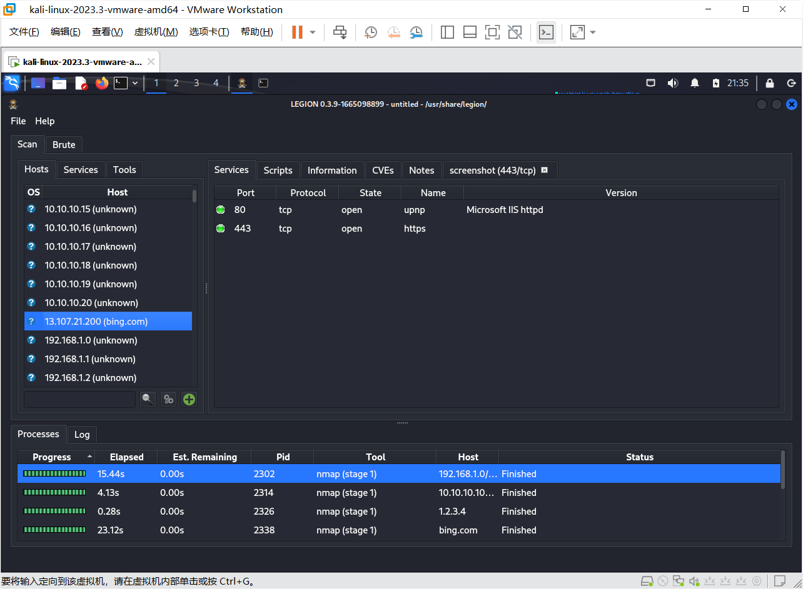

### 网络扫描

```
telnet 127.0.0.1 7
连接本机7号端口
netstat -na | more
查看本机提供的服务


ls /bin /usr/bin |wc
linux 命令查看
```

telnet service:

控制面板——程序——启动或关闭windows功能——勾上telnet client

简单TCP/IP service：

控制面板——程序——启动或关闭windows功能——勾上 simple TCP/IP service

 (1)Echo
   RFC862 端口 7
   回显在该服务器端口上接收到的任何消息中的数据。
   作为网络调试和监视工具可能非常有用。
 (2)Discard
   RFC863 端口 9
   放弃该端口上接收到的所有消息，而不响应或确认。
   在网络设置和配置过程中，可以用作空端口来接收和路由 TCP/IP 测试消息，或者在某些情况下，程序可将其用作为消息放弃函数。
 (3)Character Generator
   RFC864 端口 19
   所发送数据包含一组 95 个可打印的 ASCII 字符。
   作为测试或解决行打印机问题的调试工具非常有用。
 (4)Quote of the Day
   RFC865 端口 17  
   在消息中以一行或多行文本的形式返回报价。
   报价从以下文件中随机提取：%SYSTEMROOT%\System32\Drivers\Etc\Quotes。
   示例报价文件会与简单的 TCP/IP 服务一起安装。如果该文件丢失，则报价服务会失败。
 (5)Daytime
   RFC867 端口 13
   返回包含星期几、月、天、年、当前时间（以 hh:mm:ss 格式表示）和时区信息的消息。
   某些程序可能会将该服务的输出用于调试或监视系统时钟时间中或不同主机上的变化。

**ntop**服务


nmap script 漏洞 heartbleed 

TCP keep-alive 删除死连接

[心脏出血（Heartbleed）漏洞浅析、复现-腾讯云开发者社区-腾讯云 (tencent.com)](https://cloud.tencent.com/developer/article/2104021) 


```
telnet 211.87.227.229 4433    
git服务器
127.28.11.31
靶机服务器
```


## FAKE-WIFI实验

无线网卡还在路上~

2023.10.23 更新
1.1. 建立wifi热点
使用一个usb无线网卡，可以建立一个WIFI热点。

安装驱动：https://wkqd.lanzouu.com/s/wkqd

> 目前状况：第一步就卡住了，网卡不支持承载网络。
>
> 看了几个贴子，给出的方法包括但不限于：1.更新驱动。2.开启“移动热点”功能，新的网卡驱动不再支持使用托管网络，而这也是许多教程要求使用旧版本驱动的原因。3.[在 Windows 中设置无线网络 - Microsoft 支持](https://support.microsoft.com/zh-cn/windows/在-windows-中设置无线网络-97914e31-3aa4-406d-cef6-f1629e2c3721#:~:text=在Windows 10 中 ，选择 "开始"，然后选择"设置> Internet %26">"状态>"网络和共享中心"。,在Windows 11 中，选择"开始"，键入"控制面板"，然后选择"控制面板">"网络和 Internet>"网络和共享中心"。 选择“设置新的连接或网络”。 选择“设置新网络”，然后选择“下一步”。 该向导将指导你创建网络名称和安全密钥。)
>
> 未能解决问题，可能是网卡本身就不支持，白折腾半天，问商家也不回消息，踩坑(T_T)

Windows/CMD中，配合两行命令(管理员权限)：
netsh wlan set hostednetwork mode=allow
netsh wlan set hostednetwork mode=allow ssid=fake1 key=12345678
netsh wlan start hostednetwork
如此设置后，手机即可通过该热点“fake1”上网了。
其他有用的命令：
netsh wlan stop hostednetwork  # 停止
NETSH WLAN show drivers  #显示参数等


1.2. 加入dns欺骗

## 课程项目1：网络攻防安全扫描集成平台

### 1.   介绍

进行网络安全扫描，和对文件系统进行杀毒扫描一样，杀毒扫描需要病毒特征库，网络安全扫描需要漏洞攻击库，而且这些库都在各自更新，除了可以自由使用的版本，有的还有昂贵的商业版本。因此，仅用一款扫描工具是不够的，要尽量多找不同的工具、使用不同来源的漏洞攻击库。因此，需要建立一个综合各种扫描工具、支持多种漏洞攻击库的集成系统，服务于生产，也可以服务教学需求。

### 2.   扫描工具

根据不同的目的、功能、用途，网络安全方面的扫描器可以分为很多种。

下面是几款漏洞扫描软件的介绍、试用以及实测结果，包括nmap、nessus、Metasploit、OpenVAS、W3AF等。

#### I. <a href="https://nmap.org/">Nmap.org</a>

[nmap扫描与tcpdump抓包工具_nmap是抓包工具的吗-CSDN博客](https://blog.csdn.net/m0_46588765/article/details/107417808)

[Nmap端口扫描+Nmap脚本扫描漏洞（学习笔记）_nmap漏洞扫描分析脚本文件-CSDN博客](https://blog.csdn.net/weixin_43510203/article/details/107596158)

[tcpdump抓包与nmap扫描 - 不会跳舞的胖子 - 博客园 (cnblogs.com)](https://www.cnblogs.com/rtnb/p/15595210.html)

[网络攻防技术——端口扫描_2)对本机(关闭防火墙)的开放端口和非开放端口完成半连接、ack、fin、null、xmas、_啦啦啦啦啦啦啦噜噜的博客-CSDN博客](https://blog.csdn.net/day0713/article/details/123171655)

[网络攻防之网络扫描_unicornscan_程序猿cxy的博客-CSDN博客](https://blog.csdn.net/qq_51459513/article/details/117263932)

[nmap详细参数 -CSDN博客](https://blog.csdn.net/smli_ng/article/details/105964486)

Nmap是开放开源的，比较小巧，用法简单而直接，尤其适合对大IP范围内的主机进行初步扫描以确定重点攻击目标，因此是入侵者最常用的前期预扫描工具。http://nmap.org/ 

端口扫描是[Nmap](https://so.csdn.net/so/search?q=Nmap&spm=1001.2101.3001.7020)最基本最核心的功能，用于确定目标主机的TCP/UDP端口的开放情况。 默认情况下，Nmap会扫描**1000**个最有可能开放的TCP端口。

利用nmap能测试和发现：

- 目标主机（IP）是否开机，安装了什么操作系统，有哪些端口开着，是什么服务，哪种服务程序，什么版本；
- 能规避防火墙的防护规则，能根据脚本自动、批量的扫描有哪些漏洞；

Nmap具体功能：端口扫描，协议扫描，漏洞扫描，绕过防护，漏洞利用等。

##### nmap测试

nmap的基本用法:

```
nmap 【扫描类型】 【选项】 【扫描目标…】
```

常用的扫描类型：

- -sS ：TCP，SYN扫描(半开) 半开扫描意思就是，客户端向服务器请求连接，当服务器给与回应时，客户端又不响应服务器。这就是典型的DDOS攻击
- -sT ： TCP连接扫描(全开) 全开扫描表示执行完三次握手
- -sU ： UDP扫描
- -sP： ICMP扫描
- -A ：目标系统全面分析

```linux
# 默认TCP扫描
$ nmap 10.27.214.21
Starting Nmap 7.94 ( https://nmap.org ) at 2023-10-18 11:52 EDT
Nmap scan report for 10.27.214.21
Host is up (0.0096s latency).
Not shown: 993 filtered tcp ports (no-response)
PORT     STATE SERVICE
25/tcp   open  smtp
110/tcp  open  pop3
135/tcp  open  msrpc
139/tcp  open  netbios-ssn
445/tcp  open  microsoft-ds
912/tcp  open  apex-mesh
3306/tcp open  mysql
```

```
#扫描本机开了什么端口，默认TCP扫描
$ nmap 127.0.0.1   
Starting Nmap 7.94 ( https://nmap.org ) at 2023-10-18 12:03 EDT
Nmap scan report for localhost (127.0.0.1)
Host is up (0.000025s latency).
All 1000 scanned ports on localhost (127.0.0.1) are in ignored states.
Not shown: 1000 closed tcp ports (reset)                     
```

- [ ] 为什么扫描结果不一致？

- [ ] ipconfig的结果

- [ ] eth0

```
**抓取指定协议的数据包**
#另外打开一个虚拟机ping host50主机
$ ping -c 1 192.168.4.50
PING 192.168.4.50 (192.168.4.50) 56(84) bytes of data.
 
--- 192.168.4.50 ping statistics ---
1 packets transmitted, 0 received, 100% packet loss, time 0ms

#这时host 50主机就可以抓到相应的ping包
#抓取经过eth0上的数据包
$ tcpdump  -i eth0 icmp
tcpdump: verbose output suppressed, use -v[v]... for full protocol decode
listening on eth0, link-type EN10MB (Ethernet), snapshot length 262144 bytes
12:13:19.839665 IP 192.168.122.129 > 192.168.4.50: ICMP echo request, id 53883, seq 1, length 64

#node2为源地址，host50为目标地址
IP [host50] > [node2]: ICMP echo [request], id [7227], seq [1], length [64]
```


Nmap端口扫描
端口状态：

1、Open：端口开启，有程序监听此端口

2、Closed：端口关闭，数据能到达主机，但是没有程序监听此端口

3、Filtered：数据未能到达主机

4、Unfiltered：数据能到达主机，但是Nmap无法判断端口开启还是关闭

5、Open | filtered：端口没返回值，主要出现在UDP，IP，FIN，NULL和Xmas扫描

6、Closed | filtered：只出现在IP ID idle 扫描

单个扫描：nmap xxx.xxx.xxx.xxx

多个扫描：nmap 192.168.1.1 192.168.1.2

网段扫描：nmap 192.168.2.1-192.168.2.100

导入扫描：nmap -iL [LIST.TXT]


**nmap的扫描脚本**

nmap提供了大量不同种类的脚本，方便不同的用途。按照不同的主题分类主要有：

  auth: 负责处理鉴权证书（绕开鉴权）的脚本   
  broadcast: 在局域网内探查更多服务开启状况，如dhcp/dns/sqlserver等服务  
  brute: 提供暴力破解方式，针对常见的应用如http/snmp等     
  default:  使用-sC或-A选项扫描时候默认的脚本，提供基本脚本扫描能力  
  discovery: 对网络进行更多的信息，如SMB枚举、SNMP查询等   
  dos: 用于进行拒绝服务攻击  
  exploit: 利用已知的漏洞入侵系统  
  external: 利用第三方的数据库或资源，例如进行whois解析    
  fuzzer: 模糊测试的脚本，发送异常的包到目标机，探测出潜在漏洞   
  intrusive: 入侵性的脚本，此类脚本可能引发对方的IDS/IPS的记录或屏蔽   
  malware: 探测目标机是否感染了病毒、开启了后门等信息   
  safe: 此类与intrusive相反，属于安全性脚本   
  version: 负责增强服务与版本扫描（Version Detection）功能的脚本   
  vuln: 负责检查目标机是否有常见的漏洞（Vulnerability），如是否有MS08_067  
```
#默认脚本扫描，主要搜索各种应用服务的信息，收集后，可再针对具体服务进行攻击
nmap --script=default 192.168.88.131

#检查是否存在常见漏洞
nmap --script=vuln 192.168.1.104

#提供暴力破解的方式，可对数据库、smb、snmp等进行简单密码的暴力猜解
nmap --script=brute 192.168.88.131

#利用FTP指定脚本对目标特定FTP协议进行密码爆破
nmap --script=ftp-brute.nse 192.168.88.131

#利用第三方的数据库或资源，例如进行whoise解析
nmap --script=external 192.168.88.131

```

##### nmap脚本

```
$ cat ping.sh 
#!/bin/bash
yum -y install nmap > /dev/null
read -p "输入整个网段例如104.233.105.0/24：" ip
nmap -n -sP $ip  > /root/ping.test  	# -n表示不做主机名解析
num=$(cat /root/ping.test | tail -1 | awk '{print $3}')
setup=$(cat /root/ping.test | tail -1 | awk '{print $6}')
echo "扫描到$num个IP"
echo "有$setup个可以通信"
rm -rf /root/ping.test
```

##### 其他指令

**ipconfig** 

> ipconfig /all：显示本机TCP/IP配置的详细信息；
> ipconfig /release：DHCP客户端手工释放IP地址；
> ipconfig /renew：DHCP客户端手工向服务器刷新请求；
> ipconfig /flushdns：清除本地DNS缓存内容；
> ipconfig /displaydns：显示本地DNS内容；
> ipconfig /registerdns：DNS客户端手工向服务器进行注册；
> ipconfig /showclassid：显示网络适配器的DHCP类别信息；
> ipconfig /setclassid：设置网络适配器的DHCP类别。
> ipconfig /renew “Local Area Connection”：更新“本地连接”适配器的由 DHCP 分配 IP 地址的配置
> ipconfig /showclassid Local*：显示名称以 Local 开头的所有适配器的 DHCP 类别 ID
> ipconfig /setclassid “Local Area Connection” TEST：将“本地连接”适配器的 DHCP 类别 ID 设置为 TEST

```bash
#显示所有当前的 TCP/IP 网络配置值，并刷新动态主机配置协议 (DHCP) 和域名系统 (DNS) 设置。 在没有参数的情况下使用时，ipconfig 会显示 Internet 协议版本 4 (IPv4) 和 IPv6 地址、子网掩码以及所有适配器的默认网关。
> ipconfig 
无线局域网适配器 WLAN:

   连接特定的 DNS 后缀 . . . . . . . :
   本地链接 IPv6 地址. . . . . . . . : fe80::8aa0:535b:4042:fe90%8
   IPv4 地址 . . . . . . . . . . . . : 10.27.214.21
   子网掩码  . . . . . . . . . . . . : 255.255.192.0
   默认网关. . . . . . . . . . . . . : 10.27.255.254
```


**tcpdump**

**语法：**

```text
tcpdump [ -AdDefIJKlLnNOpqRStuUvxX ] [ -B buffer_size ] [ -c count ]
               [ -C file_size ] [ -G rotate_seconds ] [ -F file ]
               [ -i interface ] [ -j tstamp_type ] [ -m module ] [ -M secret ]
               [ -Q|-P in|out|inout ]
               [ -r file ] [ -s snaplen ] [ -T type ] [ -w file ]
               [ -W filecount ]
               [ -E spi@ipaddr algo:secret,...  ]
               [ -y datalinktype ] [ -z postrotate-command ] [ -Z user ]
               [ expression ]
```

**参数说明：**

-c 在收到指定的数量的分组后，tcpdump就会停止
-i 指定监听的网络接口
-r 从指定的文件中读取包(这些包一般通过-w选项产生)。
-w 直接将分组写入文件中，而不是不分析并打印出来。

**过滤条件：**
类型：host、net、port、portange
方向：src、dst
协议：tcp、dup、ip、wlan、arp…
多条件组合：and、or、not…

**示例：**

```text
# 无参数：抓取所有网络包，并在`terminal`中显示抓取的结果，将包以十六进制的形式显示。
tcpdump
```

```text
# 抓取所有的经过`eth0`网卡的网络包
tcpdump -i eth0 
```

```
# 想要截获所有192.168.1.100的主机收到的和发出的所有的数据包：
tcpdump host 192.168.1.100
```

```
# 抓取经过 eth0 网卡的源 ip 是 192.168.1.100 数据包，src参数表示源。
tcpdump -i eth0 -vnn src host 192.168.1.100

# 抓取经过 eth0 网卡目的 ip 是 192.168.1.100 数据包，dst参数表示目的。
tcpdump -i eth0 -vnn dst host 192.168.1.100
```

#### II. vuls

[vuls - github](https://github.com/future-architect/vuls)

#### III．legion
**介绍**
[legoin 官网](https://GoVanguard.com/legion)
[GitHub项目地址](https://github.com/GoVanguard/legion)
Legion是SECFORCE的Sparta的分支，是一个开源，易于使用，超扩展和半自动化的网络渗透测试框架，针对发现，侦察和利用漏洞的信息系统。 Legion由GoVanguard开发和维护。

##### legoin 测试
**安装与使用**
kali取消了自带的Sparta而是改为legion，kali下的安装会方便的多；除此之外也可以尝试docker安装。kali终端直接输入legion即可启动。

填写的目标可为ip、可为网段、也可为域。
```
192.168.1.0/24
10.10.10.10-20
1.2.3.4
bing.com
```


### 3.Docker打包

Docker 是一个开源的应用容器引擎，基于 [Go 语言](https://www.runoob.com/go/go-tutorial.html) 并遵从 Apache2.0 协议开源。

Docker 可以让开发者打包他们的应用以及依赖包到一个轻量级、可移植的容器中，然后发布到任何流行的 Linux 机器上，也可以实现虚拟化。

容器是完全使用沙箱机制，相互之间不会有任何接口（类似 iPhone 的 app）,更重要的是容器性能开销极低。
